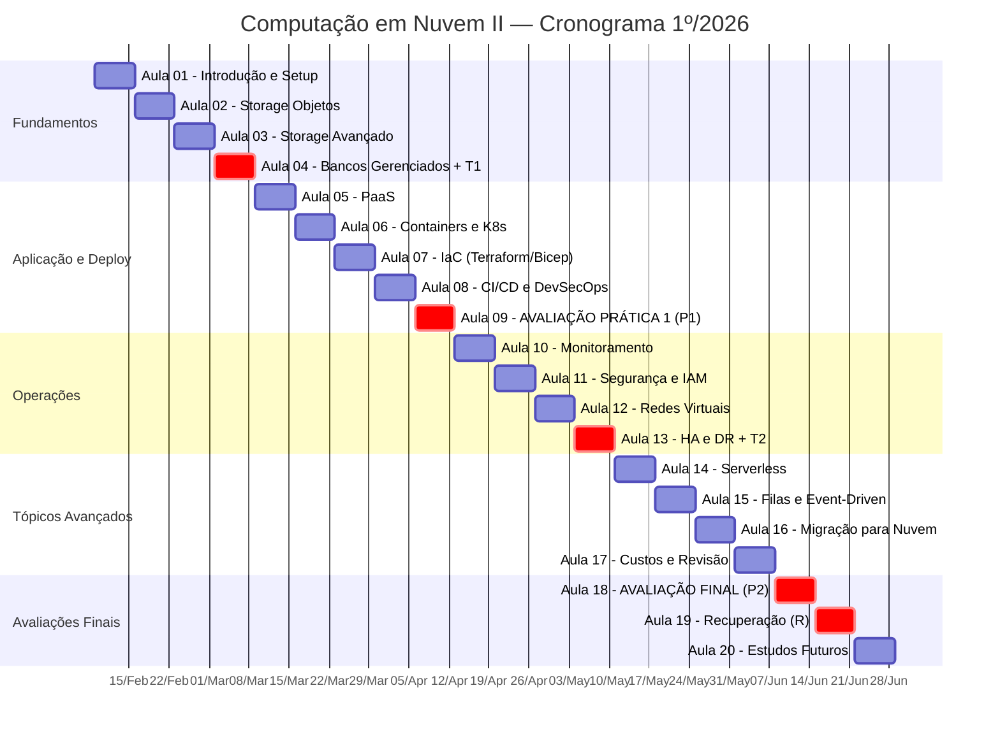

# ☁️ Computação em Nuvem II — ISW035

> **Curso:** Tecnologia em Desenvolvimento de Software Multiplataforma  
> **Instituição:** FATEC Jahu — Centro Paula Souza / Governo do Estado de São Paulo  
> **Professor:** Ronan Adriel Zenatti  
> **Semestre:** 1º/2026  
> **Carga Horária:** 80h semestrais (4h semanais — 100% prática)

---

## 📋 Sobre a Disciplina

Computação em Nuvem II é a continuação natural de Cloud I e aprofunda os conhecimentos em infraestrutura, operações e desenvolvimento de software na nuvem. O diferencial desta disciplina é a abordagem **multi-cloud**: todos os tópicos são trabalhados simultaneamente em **Microsoft Azure** e **Google Cloud Platform (GCP)**, permitindo que você compreenda que os conceitos fundamentais são universais — o que muda entre provedores são nomes de serviços, interfaces e detalhes de configuração.

Ao final do semestre, você será capaz de projetar, implantar e operar arquiteturas de sistemas confiáveis, seguros, eficientes e econômicos na nuvem, com visão crítica para escolher o provedor e os serviços mais adequados a cada cenário.

---

## 🎯 Objetivos

- Identificar e criar ambientes de Computação em Nuvem utilizando princípios de alta disponibilidade
- Migrar estruturas baseadas em Data Center local para soluções em nuvem
- Projetar e operar arquiteturas de sistemas confiáveis, seguros, eficientes e econômicos na nuvem
- Desenvolver fluência prática em Azure e Google Cloud, compreendendo a equivalência conceitual entre plataformas

---

## 📐 Metodologia

A disciplina é **100% prática**. Cada aula combina exposição contextualizada com implementação hands-on. Os materiais de estudo (disponíveis na pasta `aulas/`) funcionam como guias completos de referência, integrando sempre as duas plataformas com tabelas comparativas, diagramas Mermaid, exemplos de CLI e código.

Você trabalhará com contas estudantis gratuitas em ambas as plataformas:

| Plataforma | Programa | Créditos Estimados |
|---|---|---|
| Microsoft Azure | [Azure for Students](https://azure.microsoft.com/pt-br/free/students/) | US$ 100 (sem cartão de crédito) |
| Google Cloud | [Google Cloud for Education](https://cloud.google.com/edu) | Créditos via coupons do curso |

---

## 🧰 Pré-requisitos e Ferramentas

### Conhecimentos Prévios (Cloud I)

- Modelos de serviço: IaaS, PaaS, SaaS
- Virtualização e conceito de máquinas virtuais
- Redes básicas (IP, sub-redes, DNS)
- Linha de comando Linux (terminal básico)
- Git e GitHub (clone, commit, push, pull)

### Ferramentas Necessárias

| Ferramenta | Uso | Instalação |
|---|---|---|
| **Git** | Versionamento do repositório de atividades | [git-scm.com](https://git-scm.com/) |
| **VS Code** | Editor principal para código e Markdown | [code.visualstudio.com](https://code.visualstudio.com/) |
| **Azure CLI** | Gerenciamento de recursos Azure via terminal | [docs.microsoft.com/cli/azure/install-azure-cli](https://docs.microsoft.com/cli/azure/install-azure-cli) |
| **Google Cloud CLI (gcloud)** | Gerenciamento de recursos GCP via terminal | [cloud.google.com/sdk/docs/install](https://cloud.google.com/sdk/docs/install) |
| **Docker Desktop** | Containerização local (a partir da Aula 06) | [docker.com/products/docker-desktop](https://www.docker.com/products/docker-desktop/) |
| **Terraform** | Infraestrutura como Código (a partir da Aula 07) | [terraform.io/downloads](https://www.terraform.io/downloads) |
| **Python 3.10+** | SDKs de integração e automação | [python.org](https://www.python.org/) |
| **Azure Storage Explorer** | Gerenciamento visual de storage (opcional) | [azure.microsoft.com/features/storage-explorer](https://azure.microsoft.com/features/storage-explorer/) |

### Configuração Inicial do Repositório

```bash
# Clone o repositório da disciplina
git clone https://github.com/seu-usuario/cnuvem2-2026.git
cd cnuvem2-2026

# Autentique-se nas plataformas
az login
gcloud auth login

# Defina o projeto GCP padrão
gcloud config set project SEU-PROJECT-ID

# Verifique as instalações
az --version
gcloud --version
docker --version
terraform --version
python --version
```

---

## 🗺️ Mapa de Equivalência de Serviços

Esta tabela acompanha você ao longo de todo o semestre. Cada serviço será aprofundado na aula correspondente.

| Conceito | Microsoft Azure | Google Cloud | Aula |
|---|---|---|---|
| Armazenamento de objetos | Azure Blob Storage | Cloud Storage | 02 |
| File storage gerenciado | Azure Files | Filestore | 03 |
| Backup gerenciado | Azure Backup | Backup and DR Service | 03 |
| Banco relacional gerenciado | Azure SQL Database | Cloud SQL | 04 |
| Banco NoSQL gerenciado | Cosmos DB | Firestore / Bigtable | 04 |
| PaaS para aplicações web | App Service | App Engine | 05 |
| Container registry | Azure Container Registry | Artifact Registry | 06 |
| Container serverless | Container Apps | Cloud Run | 06 |
| Orquestração Kubernetes | AKS | GKE | 06 |
| Infraestrutura como Código | Bicep / Terraform | Terraform / Deployment Manager | 07 |
| CI/CD nativo | Azure DevOps Pipelines | Cloud Build | 08 |
| Monitoramento | Azure Monitor / App Insights | Cloud Monitoring / Cloud Logging | 10 |
| Gerenciamento de identidade | Entra ID (Azure AD) | Cloud IAM | 11 |
| Gerenciamento de segredos | Key Vault | Secret Manager | 11 |
| Rede virtual | VNet | VPC | 12 |
| Alta disponibilidade | Availability Zones / GRS | Regions / Dual-region | 13 |
| Functions serverless | Azure Functions | Cloud Functions | 14 |
| Filas de mensagens | Service Bus | Pub/Sub | 15 |
| Ferramentas de migração | Azure Migrate | Migrate for Compute Engine | 16 |
| Gestão de custos | Cost Management | Cloud Billing | 17 |

---

## 📚 Sumário das Aulas

Todos os materiais de estudo estão na pasta `aulas/`. Cada arquivo é um guia completo e autocontido, integrando Azure e GCP com exemplos práticos, diagramas e código.

| # | Título | Arquivo | Tema Central |
|---|---|---|---|
| 01 | Introdução e Configuração do Ambiente | [`aulas/Aula_01-Introducao_e_Configuracao_do_Ambiente.md`](aulas/Aula_01-Introducao_e_Configuracao_do_Ambiente.md) | Panorama de cloud computing, criação de contas Azure e GCP, repositório Git, mapa de equivalência de serviços, revisão IaaS/PaaS/SaaS |
| 02 | Armazenamento de Dados — Objetos | [`aulas/Aula_02-Armazenamento_de_Dados_Objetos.md`](aulas/Aula_02-Armazenamento_de_Dados_Objetos.md) | Storage Account e Cloud Storage Bucket, classes de armazenamento (Hot/Cool/Archive vs Standard/Nearline/Coldline), redundância (LRS/ZRS/GRS vs Regional/Dual/Multi), lifecycle management, Autoclass |
| 03 | Armazenamento de Dados — Avançado | [`aulas/Aula_03-Armazenamento_de_Dados_Avancado.md`](aulas/Aula_03-Armazenamento_de_Dados_Avancado.md) | Azure Files e Filestore, backups e snapshots, soft delete, versionamento, replicação avançada, integração programática via SDKs Python |
| 04 | Bancos de Dados Gerenciados | [`aulas/Aula_04-Bancos_de_Dados_Gerenciados.md`](aulas/Aula_04-Bancos_de_Dados_Gerenciados.md) | DBaaS vs instalações tradicionais, Azure SQL Database e Cloud SQL, Cosmos DB e Firestore, firewalls e connection strings seguras |
| 05 | Plataformas de Aplicação — PaaS | [`aulas/Aula_05-Plataformas_de_Aplicacao_PaaS.md`](aulas/Aula_05-Plataformas_de_Aplicacao_PaaS.md) | Modelo PaaS, deploy em App Service e App Engine, variáveis de ambiente, deployment slots |
| 06 | Containerização e Orquestração na Nuvem | [`aulas/Aula_06-Containerizacao_e_Orquestracao_na_Nuvem.md`](aulas/Aula_06-Containerizacao_e_Orquestracao_na_Nuvem.md) | Registros de imagens cloud, Container Apps/Cloud Run vs AKS/GKE, migração de manifestos YAML |
| 07 | Infraestrutura como Código — IaC | [`aulas/Aula_07-Infraestrutura_como_Codigo_IaC.md`](aulas/Aula_07-Infraestrutura_como_Codigo_IaC.md) | IaC e seus benefícios, Terraform vs Bicep vs Pulumi, ciclo init → plan → apply → destroy |
| 08 | CI/CD na Nuvem — Do GitHub Actions aos Serviços Nativos | [`aulas/Aula_08-CICD_na_Nuvem.md`](aulas/Aula_08-CICD_na_Nuvem.md) | GitHub Actions vs Azure DevOps vs Cloud Build, DevSecOps, scanning de dependências e containers |
| 09 | Avaliação Prática 1 | [`aulas/Aula_09-Avaliacao_Pratica_1.md`](aulas/Aula_09-Avaliacao_Pratica_1.md) | Solução completa: storage + banco + containerização + deploy + CI/CD com security scanning |
| 10 | Monitoramento — Nativo vs Open Source | [`aulas/Aula_10-Monitoramento_Nativo_vs_Open_Source.md`](aulas/Aula_10-Monitoramento_Nativo_vs_Open_Source.md) | Azure Monitor, Application Insights, Cloud Monitoring, Cloud Logging, comparativo de custo e vendor lock-in |
| 11 | Segurança, Identidade e DevSecOps | [`aulas/Aula_11-Seguranca_Identidade_e_DevSecOps.md`](aulas/Aula_11-Seguranca_Identidade_e_DevSecOps.md) | IAM com menor privilégio, Key Vault e Secret Manager, integração DevSecOps |
| 12 | Redes Virtuais e Conectividade | [`aulas/Aula_12-Redes_Virtuais_e_Conectividade.md`](aulas/Aula_12-Redes_Virtuais_e_Conectividade.md) | VNets e VPCs, regras de firewall, endpoints privados |
| 13 | Alta Disponibilidade e DR | [`aulas/Aula_13-Alta_Disponibilidade_e_DR.md`](aulas/Aula_13-Alta_Disponibilidade_e_DR.md) | SLA, RTO, RPO, replicação multi-região, planejamento de disaster recovery |
| 14 | Computação Serverless | [`aulas/Aula_14-Computacao_Serverless.md`](aulas/Aula_14-Computacao_Serverless.md) | Paradigma serverless, Azure Functions e Cloud Functions, triggers HTTP/storage/timer |
| 15 | Filas de Mensagens e Event-Driven | [`aulas/Aula_15-Filas_de_Mensagens_e_Event_Driven.md`](aulas/Aula_15-Filas_de_Mensagens_e_Event_Driven.md) | Arquitetura assíncrona, Service Bus e Pub/Sub, dead-letter queues |
| 16 | Migração para a Nuvem | [`aulas/Aula_16-Migracao_para_a_Nuvem.md`](aulas/Aula_16-Migracao_para_a_Nuvem.md) | Os 6 Rs (Rehost, Replatform, Repurchase, Refactor, Retain, Retire), ferramentas de assessment |
| 17 | Otimização de Custos e Revisão | [`aulas/Aula_17-Otimizacao_de_Custos_e_Revisao.md`](aulas/Aula_17-Otimizacao_de_Custos_e_Revisao.md) | Azure Cost Management e Cloud Billing, right-sizing, reserved/spot instances |
| 18 | Avaliação Prática Final | [`aulas/Aula_18-Avaliacao_Pratica_Final.md`](aulas/Aula_18-Avaliacao_Pratica_Final.md) | Apresentação do projeto interdisciplinar (20 min + 10 min perguntas) |
| 19 | Recuperação | [`aulas/Aula_19-Recuperacao.md`](aulas/Aula_19-Recuperacao.md) | Avaliação de recuperação para alunos que não atingiram média |
| 20 | Estudos Futuros e Aprofundamento | [`aulas/Aula_20-Estudos_Futuros_e_Aprofundamento.md`](aulas/Aula_20-Estudos_Futuros_e_Aprofundamento.md) | Caminhos de carreira, certificações, tendências de mercado |

---

## 📊 Critérios de Avaliação

A nota final é calculada pela fórmula:

```
Nota Final = (T1 + P1 + T2 + P2) × 1 + R
```

### Composição das Notas

| Código | Avaliação | Tipo | Peso | Quando | Descrição |
|---|---|---|---|---|---|
| **T1** | Bancos de Dados Gerenciados | Teórico-prática | Individual | Aula 04 | Diferenciar DBaaS de instalações tradicionais; provisionar bancos relacionais e NoSQL; implementar conexões seguras |
| **P1** | Avaliação Prática 1 | Prática | Individual | Aula 09 | Demonstrar domínio das aulas 1–8 implementando solução completa: storage + banco + containerização + deploy + CI/CD com security scanning |
| **T2** | Alta Disponibilidade e DR | Teórico-prática + Trabalho Prático 2 | Grupo | Aula 13 | Compreender SLA, RTO, RPO; implementar replicação multi-região; planejar disaster recovery. **Trabalho Prático 2 (2,0 pts):** monitoramento + segurança + resiliência implementados no projeto interdisciplinar |
| **P2** | Avaliação Prática Final | Apresentação | Grupo | Aula 18 | Apresentação do projeto interdisciplinar (20 min + 10 min perguntas): repositório/docs + infraestrutura + demonstração + defesa técnica |
| **R** | Recuperação | Prática | Individual | Aula 19 | Para alunos que não atingiram média ou desejam melhorar nota |

### Trabalhos Práticos

**Trabalho Prático 1 (2,0 pts — Individual, Aula 04):**
Implementar a camada de dados do projeto interdisciplinar: storage + banco + integração + documentação.

**Trabalho Prático 2 (2,0 pts — Grupo, Aula 13):**
Monitoramento + segurança + resiliência implementados no projeto interdisciplinar.

### Estrutura da Avaliação de Recuperação (3,0 pontos)

| Critério | Pontuação |
|---|---|
| Infraestrutura básica: storage + banco + conexão segura | 1,0 pt |
| Deploy e CI/CD: containerização + deploy + pipeline | 1,0 pt |
| Operações: monitoramento + feature avançada (serverless/fila/IaC) | 1,0 pt |

---

## 🗓️ Cronograma Visual



---

## 📁 Estrutura do Repositório

```
cnuvem2-2026/
├── README.md                      ← Você está aqui
├── aulas/
│   ├── Aula_01-Introducao_e_Configuracao_do_Ambiente.md
│   ├── Aula_02-Armazenamento_de_Dados_Objetos.md
│   ├── Aula_03-Armazenamento_de_Dados_Avancado.md
│   ├── Aula_04-Bancos_de_Dados_Gerenciados.md
│   ├── Aula_05-Plataformas_de_Aplicacao_PaaS.md
│   ├── Aula_06-Containerizacao_e_Orquestracao_na_Nuvem.md
│   ├── Aula_07-Infraestrutura_como_Codigo_IaC.md
│   ├── Aula_08-CICD_na_Nuvem.md
│   ├── Aula_09-Avaliacao_Pratica_1.md
│   ├── Aula_10-Monitoramento_Nativo_vs_Open_Source.md
│   ├── Aula_11-Seguranca_Identidade_e_DevSecOps.md
│   ├── Aula_12-Redes_Virtuais_e_Conectividade.md
│   ├── Aula_13-Alta_Disponibilidade_e_DR.md
│   ├── Aula_14-Computacao_Serverless.md
│   ├── Aula_15-Filas_de_Mensagens_e_Event_Driven.md
│   ├── Aula_16-Migracao_para_a_Nuvem.md
│   ├── Aula_17-Otimizacao_de_Custos_e_Revisao.md
│   ├── Aula_18-Avaliacao_Pratica_Final.md
│   ├── Aula_19-Recuperacao.md
│   └── Aula_20-Estudos_Futuros_e_Aprofundamento.md
├── projetos/
│   ├── trabalho-pratico-1/         ← T1: Camada de dados (individual)
│   ├── trabalho-pratico-2/         ← T2: Monitoramento + segurança (grupo)
│   └── projeto-interdisciplinar/   ← P2: Projeto final (grupo)
├── labs/
│   ├── lab-02-storage-objetos/     ← Exercícios práticos por aula
│   ├── lab-03-storage-avancado/
│   ├── lab-04-bancos-gerenciados/
│   └── ...
├── scripts/
│   ├── azure/                      ← Scripts de automação Azure CLI
│   ├── gcp/                        ← Scripts de automação gcloud CLI
│   └── python/                     ← SDKs e utilitários Python
└── docs/
    ├── guia-azure-students.md      ← Como configurar conta Azure for Students
    ├── guia-gcp-education.md       ← Como configurar conta GCP Education
    └── glossario-multi-cloud.md    ← Glossário de termos Azure ↔ GCP
```

---

## 📖 Bibliografia

### Básica

| Referência | Foco |
|---|---|
| LECHETA, R.R. **AWS para desenvolvedores.** Novatec, 2014 | Conceitos gerais de cloud aplicáveis a qualquer provedor |
| MOLINARI, L. **Cloud Computing: A inteligência na nuvem.** Érica/Saraiva, 2017 | Fundamentos teóricos de computação em nuvem |
| VELTE, A. **Cloud Computing: Uma Abordagem Prática.** Alta Books, 2015 | Visão prática de arquitetura e implantação |

### Complementar

| Referência | Foco |
|---|---|
| ARUNDEL, J.; DOMINGUS, J. **DevOps Nativo de Nuvem com Kubernetes.** Novatec, 2019 | Kubernetes e DevOps em ambientes cloud-native |
| KAVIS, M.J. **Architecting the Cloud.** Wiley, 2014 | Padrões arquiteturais para aplicações em nuvem |
| STIGLER, M. **Beginning Serverless Computing.** Apress, 2017 | Fundamentos de computação serverless |

### Referência

| Referência | Foco |
|---|---|
| ERL, Thomas; MONROY, Eric Barceló. **Computação em Nuvem: conceitos, tecnologia, segurança e arquitetura.** 2. ed. Porto Alegre: Bookman, 2024 | Referência técnica abrangente e atualizada |
| FOURNIER, Camille; NOWLAND, Ian. **Engenharia de plataforma: um guia para líderes técnicos, de produtos e de pessoas.** São Paulo: Novatec, 2025 | Engenharia de plataforma e liderança técnica |
| LEITE, Leonardo; MEIRELLES, Paulo; KON, Fabio. **Como se faz DevOps: organizando pessoas, dos silos aos times de plataforma.** São Paulo: Casa do Código, 2024 | DevOps e organização de times |

### Documentação Oficial Online

| Recurso | URL |
|---|---|
| Microsoft Learn — AZ-104 | [learn.microsoft.com/training/paths/az-104-manage-storage](https://learn.microsoft.com/training/paths/az-104-manage-storage/) |
| Google Cloud Documentation | [cloud.google.com/docs](https://cloud.google.com/docs) |
| Terraform Registry (Azure) | [registry.terraform.io/providers/hashicorp/azurerm](https://registry.terraform.io/providers/hashicorp/azurerm/latest/docs) |
| Terraform Registry (GCP) | [registry.terraform.io/providers/hashicorp/google](https://registry.terraform.io/providers/hashicorp/google/latest/docs) |

---

## 🏅 Certificações Relacionadas

O conteúdo desta disciplina está alinhado com os domínios de conhecimento das seguintes certificações profissionais. Embora as certificações não sejam obrigatórias, são altamente recomendadas para o mercado de trabalho.

| Certificação | Provedor | Nível | Aulas Relacionadas |
|---|---|---|---|
| [AZ-104: Microsoft Azure Administrator](https://learn.microsoft.com/certifications/azure-administrator/) | Microsoft | Associate | 01–17 |
| [AZ-900: Azure Fundamentals](https://learn.microsoft.com/certifications/azure-fundamentals/) | Microsoft | Fundamentals | 01–05 |
| [Associate Cloud Engineer](https://cloud.google.com/certification/cloud-engineer) | Google | Associate | 01–17 |
| [Cloud Digital Leader](https://cloud.google.com/certification/cloud-digital-leader) | Google | Fundamentals | 01–05, 16–17 |
| [HashiCorp Terraform Associate](https://www.hashicorp.com/certification/terraform-associate) | HashiCorp | Associate | 07 |

---

## ❓ Dúvidas Frequentes

**Preciso ter experiência prévia com Azure ou GCP?**
Não. A Aula 01 cobre toda a configuração inicial. Porém, é esperado que você tenha cursado Cloud I e tenha familiaridade com os conceitos de IaaS, PaaS e SaaS.

**Vou gastar dinheiro nas plataformas de nuvem?**
Não, se você seguir as orientações de uso responsável. Ambas as plataformas oferecem créditos gratuitos para estudantes. Sempre exclua os recursos após as práticas e configure alertas de orçamento.

**Posso usar outro provedor além de Azure e GCP (por exemplo, AWS)?**
Os materiais e avaliações são baseados em Azure e GCP. Porém, se você já tiver experiência com AWS, perceberá que os conceitos são os mesmos — e essa é justamente a lição central da disciplina.

**Os materiais de aula são suficientes para as avaliações?**
Sim. Os arquivos na pasta `aulas/` são guias completos e autocontidos. Porém, a documentação oficial de cada plataforma é a referência definitiva e sempre deve ser consultada quando houver dúvidas sobre parâmetros ou funcionalidades específicas.

**Posso usar IA (ChatGPT, Claude, Copilot) nas atividades?**
Sim, com responsabilidade. IA é uma ferramenta legítima no fluxo de trabalho de qualquer profissional de TI. Porém, você deve **compreender** o que está fazendo — nas avaliações presenciais (P1 e P2), você precisará explicar e defender suas decisões técnicas.

---

## 📬 Contato

**Professor:** Ronan Adriel Zenatti  
**Instituição:** FATEC Jahu — Centro Paula Souza  
**Coordenador do Curso:** Célio Sormani Junior

---

<p align="center">
  <strong>FATEC Jahu</strong> · Centro Paula Souza · Governo do Estado de São Paulo<br/>
  Tecnologia em Desenvolvimento de Software Multiplataforma — 1º Semestre/2026
</p>
