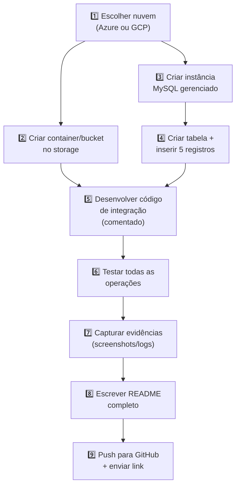

# 📋 Atividade 4.1 — Armazenamento de Dados em Nuvem: Storage + Banco de Dados + Integração

> **Disciplina:** Computação em Nuvem II (ISW035)  
> **Professor:** Ronan Adriel Zenatti — FATEC Jahu / Centro Paula Souza  
> **Avaliação:** T1 — Bancos de Dados Gerenciados (2,0 pontos — Individual)  
> **Entrega:** Repositório GitHub (link enviado via plataforma institucional)

---

## 1. Objetivo

Demonstrar, de forma prática, a capacidade de provisionar e integrar serviços de armazenamento em nuvem — **object storage** (container/bucket) e **banco de dados MySQL gerenciado** — conectando-os a uma aplicação funcional desenvolvida na linguagem de programação do projeto interdisciplinar.

---

## 2. O que Deve Ser Feito

Você deverá escolher **uma** das duas plataformas de nuvem (Azure **ou** Google Cloud) e realizar as seguintes entregas:

### 2.1 Infraestrutura em Nuvem

1. **Criar um container (Azure Blob Storage) ou bucket (Google Cloud Storage)** para armazenamento de arquivos (imagens, PDFs, documentos de texto — o tipo de arquivo fica a seu critério).

2. **Criar uma instância de banco de dados MySQL gerenciado** (Azure Database for MySQL **ou** Cloud SQL for MySQL) com ao menos **uma tabela** contendo dados previamente inseridos (mínimo 5 registros).

### 2.2 Código de Integração

3. **Desenvolver um script/aplicação** na linguagem de programação do projeto interdisciplinar que realize as seguintes operações:

   - **Storage — Inclusão de arquivo:** enviar (upload) um arquivo para o container/bucket.
   - **Storage — Exclusão de arquivo:** remover (delete) um arquivo do container/bucket.
   - **Storage — Listagem:** listar os arquivos presentes no container/bucket.
   - **Banco de Dados — Consulta:** conectar-se ao MySQL em nuvem e listar os dados previamente preenchidos na tabela.

   O código deve ser **inteiramente comentado**, explicando cada bloco: o que está sendo feito, por que, quais credenciais/configurações são necessárias e como cada operação funciona.

### 2.3 Repositório GitHub

4. **Organizar tudo em um repositório GitHub** contendo:

   - O código-fonte da aplicação.
   - Um arquivo `README.md` completo (detalhes na seção 4).
   - Um arquivo `.env.example` mostrando quais variáveis de ambiente são necessárias (sem valores reais de senha/chave).
   - Evidências de funcionamento (screenshots ou logs de saída do terminal).

---

## 3. Requisitos Técnicos

| Item | Detalhes |
|---|---|
| **Nuvem** | Azure **ou** Google Cloud (apenas uma, à sua escolha) |
| **Object Storage** | Azure Blob Storage (container) **ou** Google Cloud Storage (bucket) |
| **Banco de Dados** | Azure Database for MySQL **ou** Cloud SQL for MySQL |
| **Linguagem** | A mesma do projeto interdisciplinar da turma |
| **Credenciais** | Nunca devem ser commitadas no repositório — use variáveis de ambiente ou arquivo `.env` incluído no `.gitignore` |
| **Tabela MySQL** | Mínimo 1 tabela, mínimo 5 registros pré-inseridos |
| **Comentários no código** | Obrigatório em todos os blocos (imports, conexão, operações, tratamento de erros) |

### Sobre as Credenciais — IMPORTANTE

Seu repositório **não pode conter** senhas, chaves de API, connection strings com credenciais ou qualquer informação sensível. Use uma das seguintes abordagens:

- Arquivo `.env` local (listado no `.gitignore`) + biblioteca de leitura de variáveis (como `python-dotenv`, `dotenv` para Node.js, etc.)
- Variáveis de ambiente do sistema operacional.
- Forneça um arquivo `.env.example` mostrando o formato esperado, com valores fictícios.

---

## 4. Estrutura Esperada do Repositório

```
cnuvem2-t1-seunome/
├── README.md                  ← Documentação completa (veja abaixo)
├── .gitignore                 ← Deve incluir .env, credenciais, __pycache__, etc.
├── .env.example               ← Modelo de variáveis de ambiente (sem valores reais)
├── src/                       ← Código-fonte da aplicação
│   └── (seus arquivos)
├── sql/
│   └── schema.sql             ← Script SQL de criação da tabela + INSERT dos dados
├── evidencias/                ← Screenshots ou logs de execução
│   ├── upload-arquivo.png
│   ├── delete-arquivo.png
│   ├── listagem-storage.png
│   └── consulta-mysql.png
└── (demais arquivos do projeto)
```

### O que o README.md Deve Conter

O `README.md` é a parte **mais importante** da entrega além do código. Ele deve permitir que qualquer pessoa (incluindo o professor) consiga entender e reproduzir o que você fez. Inclua obrigatoriamente:

1. **Título e identificação** — nome do aluno, disciplina, semestre.

2. **Descrição do projeto** — o que a aplicação faz, em linguagem clara.

3. **Plataforma escolhida** — Azure ou Google Cloud e justificativa breve da escolha.

4. **Serviços utilizados** — lista dos serviços provisionados com nomes e configurações escolhidas (tier/sku, região, redundância, etc.).

5. **Como os serviços foram configurados** — passo a passo resumido de como você criou o container/bucket e a instância MySQL (pode ser via Portal/Console ou CLI — inclua os comandos se usou CLI).

6. **Diagrama de arquitetura** — diagrama simples mostrando a relação entre os componentes (pode ser em Mermaid, imagem ou texto). Exemplo mínimo:

   ```
   [Aplicação Local] → [Container/Bucket no Azure/GCP]
                     → [MySQL Gerenciado no Azure/GCP]
   ```

7. **Pré-requisitos** — o que precisa estar instalado para executar (linguagem, SDK, dependências).

8. **Como executar** — passo a passo desde clonar o repositório até rodar o código e ver os resultados.

9. **Estrutura da tabela MySQL** — nome da tabela, colunas, tipos de dados e os dados inseridos.

10. **Evidências** — referência às screenshots/logs na pasta `evidencias/`.

---

## 5. Critérios de Avaliação

| Critério | Pontuação | O que Será Avaliado |
|---|---|---|
| **Storage** | **0,5 pt** | Container/bucket criado e funcional; código realiza upload, delete e listagem de arquivos corretamente |
| **Banco de Dados** | **0,5 pt** | Instância MySQL provisionada; tabela criada com dados; código conecta e lista registros corretamente |
| **Código e Comentários** | **0,5 pt** | Código funcional, organizado e **inteiramente comentado** explicando cada operação; uso correto de variáveis de ambiente para credenciais |
| **Documentação (README)** | **0,5 pt** | README completo conforme seção 4; `.env.example` presente; evidências de execução; diagrama de arquitetura |
| **Total** | **2,0 pts** | — |

### O que Causa Perda de Pontos

- Credenciais (senhas, chaves, connection strings) commitadas no repositório: **-0,5 pt**.
- Código sem comentários ou com comentários genéricos ("faz a conexão"): **-0,25 pt**.
- README incompleto ou sem instruções de execução: **-0,25 pt**.
- Código que não executa (erros de sintaxe, dependências faltantes): perda parcial ou total do critério correspondente.

### O que Agrega Valor (diferencial, não obrigatório)

- Tratamento de erros robusto (try/except com mensagens claras).
- Uso de funções/classes organizadas (não tudo em um único bloco sequencial).
- Uso de CLI (ao invés de apenas portal) documentado no README.
- Demonstração de lifecycle policy no storage ou backup configurado no banco.
- Arquivo `Makefile`, `docker-compose.yml` ou script de setup que automatize a instalação de dependências.

---

## 6. Dicas Práticas

### Custos

- Use os **tiers gratuitos** ou mais baratos disponíveis:
  - Azure: `Standard_B1ms` (Burstable) para MySQL; `Standard LRS` para Storage.
  - GCP: `db-f1-micro` para Cloud SQL; bucket `Regional Standard`.
- **Exclua os recursos após a entrega** se não for utilizá-los no projeto interdisciplinar, para não consumir seus créditos.
- Configure **alertas de orçamento** para evitar surpresas.

### Firewall do Banco de Dados

- Para acessar o MySQL da sua máquina local, você precisará liberar seu IP público no firewall do banco.
- Descubra seu IP: acesse [ifconfig.me](https://ifconfig.me) ou [whatismyip.com](https://www.whatismyip.com/).
- No Azure: crie uma firewall rule com seu IP.
- No GCP: adicione seu IP em "Authorized Networks" da instância Cloud SQL.

### Testando a Conexão MySQL

Antes de codificar, teste a conexão com um cliente MySQL padrão:

```bash
# Testar conexão (substitua os valores)
mysql -h HOST_DO_BANCO -u USUARIO -p --ssl-mode=REQUIRED
```

Se conseguir conectar e executar `SELECT 1;`, sua configuração de rede está correta.

### Script SQL de Exemplo

Crie o arquivo `sql/schema.sql` para documentar e facilitar a recriação da tabela:

```sql
-- schema.sql — Criação da tabela e inserção de dados iniciais
-- Disciplina: Computação em Nuvem II (ISW035)

CREATE DATABASE IF NOT EXISTS app_projeto;
USE app_projeto;

CREATE TABLE IF NOT EXISTS produtos (
    id          INT AUTO_INCREMENT PRIMARY KEY,
    nome        VARCHAR(100)   NOT NULL,
    descricao   TEXT,
    preco       DECIMAL(10,2)  NOT NULL,
    categoria   VARCHAR(50),
    criado_em   DATETIME       DEFAULT CURRENT_TIMESTAMP
);

INSERT INTO produtos (nome, descricao, preco, categoria) VALUES
    ('Notebook Gamer', 'Notebook 16GB RAM, RTX 4060', 5499.90, 'Eletrônicos'),
    ('Mouse Wireless', 'Mouse ergonômico sem fio', 149.90, 'Periféricos'),
    ('Teclado Mecânico', 'Teclado switch blue, RGB', 329.90, 'Periféricos'),
    ('Monitor 27"', 'Monitor IPS 144Hz', 1899.00, 'Eletrônicos'),
    ('Webcam Full HD', 'Webcam 1080p com microfone', 249.90, 'Periféricos');
```

---

## 7. Modelo de `.env.example`

```bash
# .env.example — Copie para .env e preencha com seus valores reais
# NUNCA commite o arquivo .env no repositório!

# === Configuração do Banco de Dados MySQL ===
DB_HOST=seu-servidor.mysql.database.azure.com
DB_PORT=3306
DB_NAME=app_projeto
DB_USER=seu_usuario
DB_PASSWORD=sua_senha_aqui

# === Configuração do Storage ===
# Se Azure:
AZURE_STORAGE_CONNECTION_STRING=DefaultEndpointsProtocol=https;AccountName=...;AccountKey=...
AZURE_CONTAINER_NAME=arquivos

# Se Google Cloud:
# GCP_BUCKET_NAME=seu-bucket-nome
# GOOGLE_APPLICATION_CREDENTIALS=caminho/para/service-account.json
```

---

## 8. Fluxo Resumido



---

## 9. Entrega

- **Formato:** Link do repositório GitHub (público ou com acesso concedido ao professor).
- **Prazo:** Conforme calendário divulgado em sala.
- **Individual:** Cada aluno deve ter seu próprio repositório. Repositórios idênticos ou com histórico de commits copiado serão considerados plágio.

---

> **Referência:** Este trabalho é parte da avaliação T1 (Bancos de Dados Gerenciados) conforme o Plano de Ensino da disciplina ISW035. Os conceitos necessários foram abordados nas Aulas 02, 03 e 04 do material de estudo.  
> Em caso de dúvidas, procure o professor em sala ou pelo e-mail institucional.
