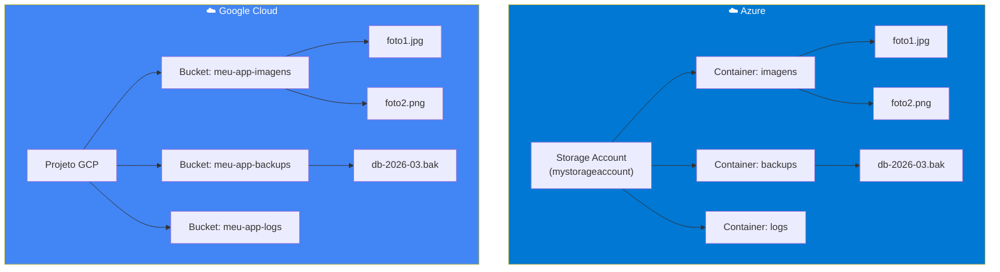
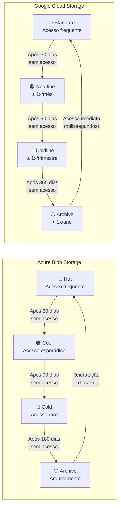
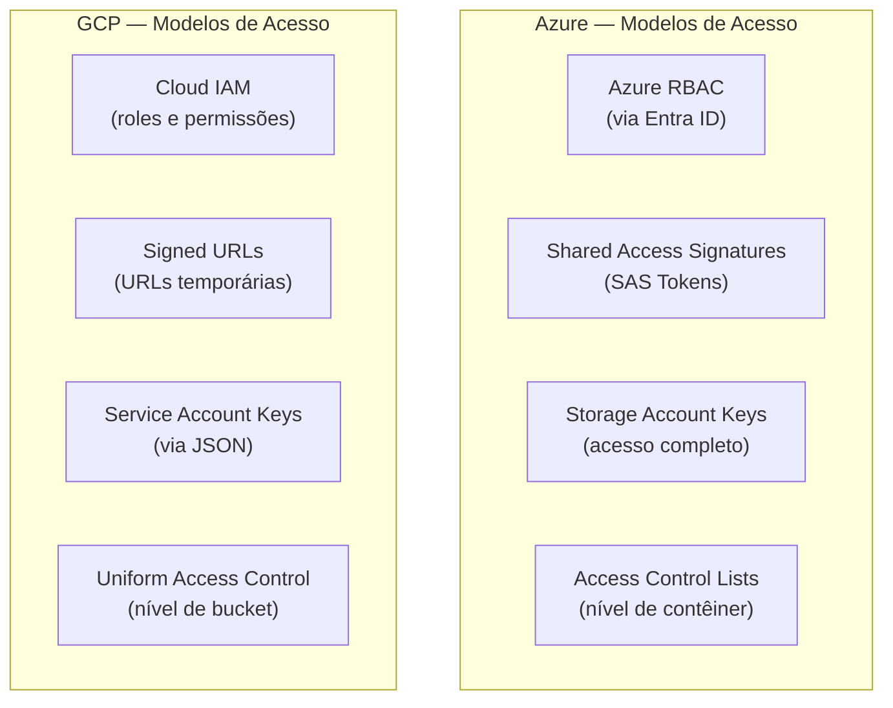
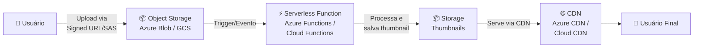
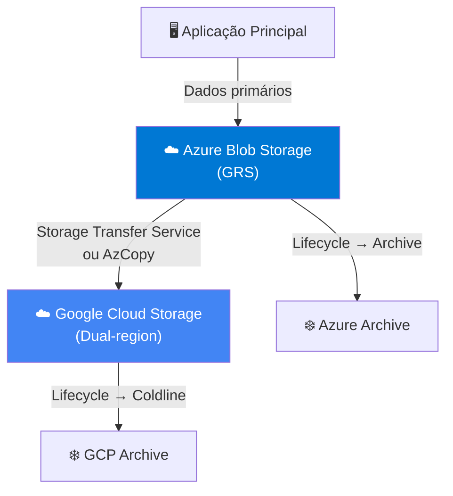
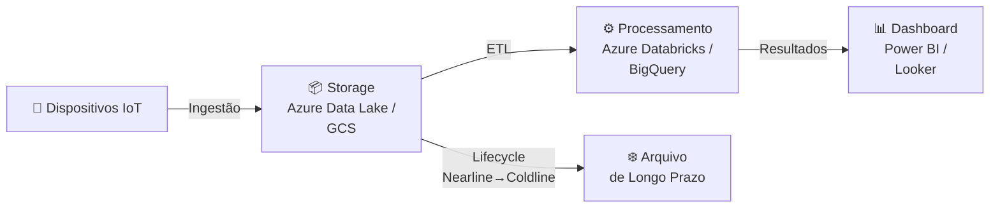

# Aula 02 — Armazenamento de Dados em Nuvem: Objetos

> **Disciplina:** Computação em Nuvem II (ISW035)  
> **Professor:** Ronan Adriel Zenatti — FATEC Jahu / Centro Paula Souza  
> **Semestre:** 1º/2026  
> **Carga Horária:** 4h práticas

---

## 1. Visão Geral e Contextualização

O armazenamento de objetos é o pilar fundamental de qualquer arquitetura moderna em nuvem. Diferentemente do armazenamento em blocos (discos virtuais) e do armazenamento de arquivos (file shares), o armazenamento de objetos trata cada dado como uma unidade independente — um "objeto" — composto por três partes: os dados em si (payload), os metadados descritivos e um identificador único (chave). Esse modelo é ideal para cenários de alta escala, pois elimina a necessidade de hierarquias de diretórios, permitindo que bilhões de objetos coexistam em um namespace plano e altamente distribuído.

Nesta aula, vamos explorar como as duas principais plataformas de nuvem pública — **Microsoft Azure** e **Google Cloud Platform (GCP)** — implementam o armazenamento de objetos. Você perceberá que os conceitos são essencialmente os mesmos; o que muda são nomes de serviços, detalhes de configuração e algumas estratégias específicas de cada provedor.

### Mapa de Equivalência de Serviços

| Conceito | Azure | Google Cloud |
|---|---|---|
| Serviço de armazenamento de objetos | Azure Blob Storage | Cloud Storage |
| Contêiner lógico de objetos | Container (contêiner) | Bucket |
| Unidade de dados armazenada | Blob | Object |
| Conta/entidade de gerenciamento | Storage Account | Projeto + Bucket |
| Endpoint de acesso | `<conta>.blob.core.windows.net` | `storage.googleapis.com/<bucket>` |
| Ferramenta CLI principal | `az storage` / AzCopy | `gcloud storage` / gsutil |
| Ferramenta visual desktop | Azure Storage Explorer | Google Cloud Console / gsutil |

---

## 2. Arquitetura dos Serviços de Armazenamento de Objetos

### 2.1 Azure Blob Storage — Estrutura Hierárquica

No Azure, toda operação de armazenamento começa pela criação de uma **Storage Account** (Conta de Armazenamento). Essa conta é o contêiner de nível mais alto e define configurações como redundância, região e desempenho. Dentro dela, existem quatro serviços: Blob (objetos), Files (compartilhamentos), Queues (filas) e Tables (tabelas NoSQL). Para esta aula, nosso foco é o serviço de Blob.

Dentro do serviço de Blob, você cria **contêineres** para organizar seus blobs. Pense nos contêineres como pastas de primeiro nível — eles não podem ser aninhados, mas você pode simular subpastas usando prefixos no nome dos blobs (por exemplo, `imagens/2026/foto.jpg`).

### 2.2 Google Cloud Storage — Estrutura por Buckets

No GCP, o armazenamento de objetos é gerenciado pelo serviço **Cloud Storage**. A unidade organizacional principal é o **bucket**, que é globalmente único (nenhum bucket em todo o GCP pode ter o mesmo nome). Ao criar um bucket, você define sua localização (região, dual-region ou multi-region) e a classe de armazenamento padrão. Objetos são armazenados dentro de buckets e identificados por chaves (nomes) que podem simular hierarquias de diretórios com o uso de `/`.



### 2.3 Tipos de Conta de Armazenamento (Azure)

O Azure oferece diferentes tipos de contas de armazenamento, cada uma otimizada para cenários específicos. Todas são criptografadas automaticamente com SSE (Storage Service Encryption) usando AES de 256 bits.

| Tipo de Conta | Uso Recomendado |
|---|---|
| **Standard general-purpose v2** | A maioria dos cenários — Blob, Files, Queues, Tables e Data Lake. Suporta todas as redundâncias. |
| **Premium block blobs** | Cenários com altas taxas de transação ou que exigem latência consistentemente baixa. Suporta LRS e ZRS. |
| **Premium file shares** | Compartilhamentos de arquivo de alto desempenho para aplicações enterprise. Suporta LRS e ZRS. |
| **Premium page blobs** | Cenários de blobs de página com alto desempenho (ex.: discos de VM não gerenciados). |

No GCP, essa distinção não existe da mesma forma: o Cloud Storage é um serviço unificado onde a diferenciação se dá pela **classe de armazenamento** e **localização** do bucket, não pelo tipo de "conta". Essa simplicidade é uma das características do modelo Google.

---

## 3. Classes de Armazenamento e Camadas de Acesso

Um dos conceitos mais importantes em armazenamento na nuvem é a **classificação por temperatura dos dados**: dados "quentes" são acessados com frequência; dados "frios" raramente são tocados. Ambas as plataformas oferecem camadas otimizadas para diferentes padrões de acesso, permitindo equilíbrio entre custo de armazenamento e custo de recuperação.

### 3.1 Tabela Comparativa de Camadas

| Característica | Azure Hot | Azure Cool | Azure Cold | Azure Archive | GCP Standard | GCP Nearline | GCP Coldline | GCP Archive |
|---|---|---|---|---|---|---|---|---|
| **Padrão de acesso** | Frequente | Pouco frequente | Raro | Rarissimo | Frequente | ≤ 1x/mês | ≤ 1x/trimestre | < 1x/ano |
| **Retenção mínima** | Nenhuma | 30 dias | 90 dias | 180 dias | Nenhuma | 30 dias | 90 dias | 365 dias |
| **Custo de armazenamento** | Mais alto | Médio | Baixo | Mais baixo | Mais alto | Médio | Baixo | Mais baixo |
| **Custo de acesso/recuperação** | Mais baixo | Médio | Alto | Mais alto | Mais baixo | Médio | Alto | Mais alto |
| **Latência de acesso** | Milissegundos | Milissegundos | Milissegundos | Horas (reidratação) | Milissegundos | Milissegundos | Milissegundos | Milissegundos |
| **Durabilidade** | 11+ noves | 11+ noves | 11+ noves | 11+ noves | 11 noves | 11 noves | 11 noves | 11 noves |

> **Ponto-chave de diferenciação:** No Azure, a camada Archive exige um processo de **reidratação** que pode levar horas antes que os dados se tornem acessíveis. No GCP, **todas as classes** oferecem latência de milissegundos para acesso — inclusive a classe Archive. A penalidade no GCP é financeira (custo de recuperação mais alto), não de tempo.

### 3.2 Diagrama de Transição entre Camadas



### 3.3 Exemplos Práticos de Aplicação de Classes

**Exemplo 1 — E-commerce com catálogo de imagens:** Uma loja virtual armazena milhares de fotos de produtos que são acessadas centenas de vezes por dia. Essas imagens devem ficar na camada Hot (Azure) ou Standard (GCP) para garantir tempos de resposta baixos. No entanto, fotos de produtos descontinuados há mais de 6 meses podem ser movidas para Cool/Nearline, pois são raramente consultadas, mas ainda precisam estar disponíveis para consultas eventuais de garantia ou histórico.

**Exemplo 2 — Sistema de saúde com prontuários digitalizados:** Prontuários de pacientes ativos precisam de acesso frequente (Hot/Standard). Prontuários de pacientes que não consultam há mais de um ano podem ser movidos para Cold/Coldline. Prontuários de pacientes falecidos ou inativos há mais de 5 anos, mas que precisam ser retidos por exigência legal, são candidatos ideais para Archive em ambas as plataformas. No caso do Azure, é preciso planejar o tempo de reidratação caso um prontuário arquivado precise ser consultado em uma emergência judicial.

**Exemplo 3 — Plataforma de streaming de vídeo:** Vídeos recém-publicados ficam na camada Hot/Standard para atender à demanda inicial de visualizações. Após 60 dias, a maioria dos vídeos perde popularidade e pode ser movida para Cool/Nearline. Vídeos antigos de catálogo (mais de um ano sem visualizações significativas) podem ir para Coldline/Cold, mantendo-se tecnicamente acessíveis caso um vídeo volte a viralizar.

---

## 4. Redundância e Replicação de Dados

A redundância determina quantas cópias dos seus dados existem e onde elas estão distribuídas. Esse é um dos fatores mais críticos em uma arquitetura de nuvem, pois define diretamente a durabilidade, disponibilidade e o custo do armazenamento.

### 4.1 Estratégias de Redundância — Azure

O Azure oferece seis opções de redundância, organizadas em duas categorias: região única e múltiplas regiões.

| Estratégia | Réplicas | Regiões | Zonas | Proteção | Durabilidade |
|---|---|---|---|---|---|
| **LRS** (Locally Redundant) | 3 | 1 | 1 | Falhas de disco, nó e rack | 11 noves |
| **ZRS** (Zone Redundant) | 3 | 1 | 3 | Falhas de disco, nó, rack e zona | 12 noves |
| **GRS** (Geo Redundant) | 6 | 2 | 1+1 | Desastres regionais | 16 noves |
| **RA-GRS** (Read-Access GRS) | 6 | 2 | 1+1 | GRS + leitura na secundária | 16 noves |
| **GZRS** (Geo-Zone Redundant) | 6 | 2 | 3+1 | Falhas de zona + desastres regionais | 16 noves |
| **RA-GZRS** (Read-Access GZRS) | 6 | 2 | 3+1 | GZRS + leitura na secundária | 16 noves |

```mermaid
graph TB
    subgraph LRS["LRS — 3 réplicas, 1 datacenter"]
        R1["Réplica 1"] --- R2["Réplica 2"] --- R3["Réplica 3"]
    end

    subgraph ZRS["ZRS — 3 réplicas, 3 zonas"]
        Z1["Zona 1<br/>Réplica"] ---|"Síncrono"| Z2["Zona 2<br/>Réplica"]
        Z2 ---|"Síncrono"| Z3["Zona 3<br/>Réplica"]
    end

    subgraph GRS["GRS — 6 réplicas, 2 regiões"]
        direction LR
        PR["Região Primária<br/>3 réplicas (LRS)"] -->|"Assíncrono<br/>> 300 milhas"| SR["Região Secundária<br/>3 réplicas (LRS)"]
    end

    subgraph GZRS["GZRS — 6 réplicas, 2 regiões, 3+ zonas"]
        direction LR
        PZ["Região Primária<br/>3 zonas (ZRS)"] -->|"Assíncrono<br/>> 300 milhas"| SZ["Região Secundária<br/>3 réplicas (LRS)"]
    end
```



### 4.2 Estratégias de Redundância — Google Cloud

O GCP adota uma abordagem baseada na **localização do bucket** em vez de opções de redundância separadas. Quando você cria um bucket, a escolha de localização determina automaticamente como os dados são replicados.

| Tipo de Localização | Redundância | Equivalente Azure | RPO Padrão | Durabilidade |
|---|---|---|---|---|
| **Regional** (ex.: `us-central1`) | Multi-zona dentro da região | ZRS | N/A (local) | 11 noves |
| **Dual-region** (ex.: `nam4`) | 2 regiões, active-active | GZRS / RA-GZRS | 1h padrão / 15min turbo | 11 noves |
| **Multi-region** (ex.: `us`, `eu`) | Múltiplas regiões em um continente | GRS (com mais regiões) | 1h padrão | 11 noves |

> **Diferença arquitetural importante:** O GCP usa uma arquitetura **active-active** para buckets dual-region e multi-region. Isso significa que, diferente do Azure GRS (que mantém a região secundária apenas como cópia passiva por padrão), no GCP ambas as regiões servem dados simultaneamente, com RTO (Recovery Time Objective) de **zero** — a falha de uma região é transparente para os clientes. No Azure, para obter leitura ativa na região secundária, é necessário usar RA-GRS ou RA-GZRS.

### 4.3 Turbo Replication (GCP)

Um recurso exclusivo do GCP para buckets dual-region é o **Turbo Replication**, que garante um RPO (Recovery Point Objective) de 15 minutos — ou seja, em caso de desastre, a perda máxima de dados é de 15 minutos. Na replicação padrão, 99,9% dos objetos são replicados dentro de 1 hora. O Turbo Replication tem custo adicional, mas é essencial para workloads que exigem alta disponibilidade e baixo RPO.

### 4.4 Exemplos Práticos de Redundância

**Exemplo 1 — Startup com orçamento limitado:** Uma startup que hospeda seu site em São Paulo e cujo tráfego é predominantemente brasileiro pode usar LRS no Azure (menor custo) ou um bucket Regional no GCP (`southamerica-east1`). Se os dados forem facilmente recriáveis (cache, dados derivados), essa é uma escolha razoável. Para dados críticos como banco de dados de clientes, a recomendação mínima seria ZRS (Azure) ou Regional (GCP, que já é multi-zona).

**Exemplo 2 — Banco com exigências regulatórias:** Instituições financeiras normalmente precisam de dados replicados em regiões geográficas distintas para atender a requisitos de continuidade de negócios. No Azure, a escolha seria GZRS ou RA-GZRS. No GCP, um bucket dual-region com Turbo Replication ativado proporciona RPO de 15 minutos e RTO de zero.

**Exemplo 3 — Plataforma global de mídia:** Uma empresa que serve conteúdo para usuários em todo o mundo se beneficia do multi-region tanto no Azure (RA-GRS com CDN) quanto no GCP (bucket multi-region `us`, `eu` ou `asia`). O GCP tem vantagem aqui com a arquitetura active-active nativa, enquanto no Azure é necessário configurar explicitamente a leitura na secundária com RA-GRS.

---

## 5. Criação e Configuração de Armazenamento

### 5.1 Azure — Criar Storage Account e Container

**Via Portal Azure:**
1. Acesse o Portal Azure → "Criar um recurso" → "Conta de armazenamento"
2. Defina: Grupo de Recursos, Nome (globalmente único, 3-24 caracteres, apenas letras minúsculas e números), Região, Desempenho (Standard/Premium), Redundância (LRS/ZRS/GRS/etc.)
3. Em "Avançado", configure: Transferência segura obrigatória (HTTPS), Camada de acesso padrão (Hot/Cool)
4. Revise e crie

**Via Azure CLI:**

```bash
# Criar grupo de recursos
az group create --name rg-cnuvem2 --location brazilsouth

# Criar conta de armazenamento com ZRS e camada Hot
az storage account create \
    --name stcnuvem2app2026 \
    --resource-group rg-cnuvem2 \
    --location brazilsouth \
    --sku Standard_ZRS \
    --kind StorageV2 \
    --access-tier Hot \
    --min-tls-version TLS1_2

# Criar um contêiner para imagens
az storage container create \
    --name imagens \
    --account-name stcnuvem2app2026 \
    --public-access off

# Fazer upload de um arquivo
az storage blob upload \
    --account-name stcnuvem2app2026 \
    --container-name imagens \
    --name produto/foto1.jpg \
    --file ./foto1.jpg
```

### 5.2 GCP — Criar Bucket e Upload de Objetos

**Via Console GCP:**
1. Acesse Cloud Console → Cloud Storage → "Criar bucket"
2. Defina: Nome (globalmente único), Localização (Region/Dual-region/Multi-region), Classe padrão (Standard/Nearline/etc.), Controle de acesso (Uniform/Fine-grained)
3. Configure: Proteção de dados (Soft delete, Object versioning, Retention policy)
4. Crie o bucket

**Via gcloud CLI:**

```bash
# Criar bucket regional com classe Standard
gcloud storage buckets create gs://cnuvem2-app-imagens-2026 \
    --location=southamerica-east1 \
    --default-storage-class=STANDARD \
    --uniform-bucket-level-access

# Criar bucket dual-region com Turbo Replication
gcloud storage buckets create gs://cnuvem2-app-backups-2026 \
    --location=nam4 \
    --default-storage-class=NEARLINE \
    --enable-autoclass

# Fazer upload de um arquivo
gcloud storage cp ./foto1.jpg gs://cnuvem2-app-imagens-2026/produto/foto1.jpg

# Fazer upload de múltiplos arquivos em paralelo
gcloud storage cp -r ./imagens/ gs://cnuvem2-app-imagens-2026/imagens/
```

### 5.3 Endpoints de Acesso

Cada objeto armazenado possui uma URL única que permite acesso direto. Entender o formato desses endpoints é fundamental para integrar armazenamento com aplicações.

**Azure:**
```
https://<storage-account>.blob.core.windows.net/<container>/<blob>
https://stcnuvem2app2026.blob.core.windows.net/imagens/produto/foto1.jpg
```

**GCP:**
```
https://storage.googleapis.com/<bucket>/<object>
https://storage.googleapis.com/cnuvem2-app-imagens-2026/produto/foto1.jpg

# Formato alternativo (URL autenticada)
https://storage.cloud.google.com/<bucket>/<object>
```

| Serviço Azure | Padrão de Endpoint |
|---|---|
| Blobs | `https://<conta>.blob.core.windows.net` |
| Tables | `https://<conta>.table.core.windows.net` |
| Queues | `https://<conta>.queue.core.windows.net` |
| Files | `https://<conta>.file.core.windows.net` |

No GCP, o Cloud Storage utiliza um endpoint unificado: `https://storage.googleapis.com` para todos os tipos de operação com objetos.

---

## 6. Gerenciamento do Ciclo de Vida

Uma das funcionalidades mais poderosas do armazenamento em nuvem é a capacidade de automatizar a movimentação de dados entre camadas com base em regras de ciclo de vida. Isso elimina a necessidade de gerenciamento manual e garante otimização contínua de custos.

### 6.1 Azure — Lifecycle Management Policies

No Azure, as regras de ciclo de vida são definidas como políticas JSON aplicadas à Storage Account. Cada regra especifica filtros (por prefixo, tipo de blob, tags) e ações (mover para Cool, mover para Archive, excluir).

```json
{
  "rules": [
    {
      "name": "moverParaCool30dias",
      "enabled": true,
      "type": "Lifecycle",
      "definition": {
        "filters": {
          "blobTypes": ["blockBlob"],
          "prefixMatch": ["imagens/"]
        },
        "actions": {
          "baseBlob": {
            "tierToCool": {
              "daysAfterModificationGreaterThan": 30
            },
            "tierToArchive": {
              "daysAfterModificationGreaterThan": 180
            },
            "delete": {
              "daysAfterModificationGreaterThan": 365
            }
          }
        }
      }
    }
  ]
}
```

### 6.2 GCP — Object Lifecycle Management

No GCP, as regras de ciclo de vida são configuradas no nível do bucket. As condições incluem idade do objeto, classe atual, número de versões mais recentes e data de criação.

```json
{
  "lifecycle": {
    "rule": [
      {
        "action": {
          "type": "SetStorageClass",
          "storageClass": "NEARLINE"
        },
        "condition": {
          "age": 30,
          "matchesStorageClass": ["STANDARD"]
        }
      },
      {
        "action": {
          "type": "SetStorageClass",
          "storageClass": "COLDLINE"
        },
        "condition": {
          "age": 90,
          "matchesStorageClass": ["NEARLINE"]
        }
      },
      {
        "action": {
          "type": "SetStorageClass",
          "storageClass": "ARCHIVE"
        },
        "condition": {
          "age": 365,
          "matchesStorageClass": ["COLDLINE"]
        }
      },
      {
        "action": {
          "type": "Delete"
        },
        "condition": {
          "age": 730
        }
      }
    ]
  }
}
```

**Via gcloud CLI:**
```bash
# Aplicar regras de ciclo de vida a partir de um arquivo JSON
gcloud storage buckets update gs://cnuvem2-app-imagens-2026 \
    --lifecycle-file=lifecycle.json
```

### 6.3 Autoclass (GCP) — Exclusividade Google

O GCP oferece um recurso chamado **Autoclass** que automatiza completamente o gerenciamento de classes de armazenamento. Quando habilitado, o Autoclass monitora os padrões de acesso de cada objeto individualmente e move automaticamente os objetos para a classe mais econômica, sem que o administrador precise definir regras. Se um objeto frio voltar a ser acessado com frequência, ele é promovido de volta para Standard automaticamente. Não existem taxas de exclusão antecipada nem de transição de classe quando o Autoclass está ativo.

```bash
# Criar bucket com Autoclass habilitado
gcloud storage buckets create gs://cnuvem2-autoclass-2026 \
    --location=southamerica-east1 \
    --enable-autoclass
```

> **No Azure**, o equivalente mais próximo é a combinação de regras de lifecycle com camadas de acesso, mas não há um mecanismo automático nativo que promova objetos de volta para Hot quando o acesso aumenta. É necessário fazer isso manualmente ou via Azure Functions.

### 6.4 Exemplos Práticos de Ciclo de Vida

**Exemplo 1 — Logs de aplicação:** Logs dos últimos 7 dias ficam em Hot/Standard para análise em tempo real. Após 30 dias, movem-se para Cool/Nearline para investigações esporádicas. Após 90 dias, vão para Cold/Coldline. Após 1 ano, são excluídos (ou movidos para Archive se houver exigência regulatória).

**Exemplo 2 — Backups diários de banco de dados:** O backup do dia atual fica em Hot/Standard. Backups dos últimos 30 dias ficam em Cool/Nearline. Backups mensais do último ano ficam em Cold/Coldline. Backups anuais ficam em Archive por até 7 anos.

**Exemplo 3 — Imagens de câmeras de segurança:** Imagens dos últimos 3 dias ficam em Hot/Standard para revisão imediata. Após 30 dias, passam para Nearline/Cool. Após 90 dias, passam para Coldline/Cold. Após 180 dias, são excluídas (salvo por ordem judicial).

---

## 7. Segurança do Armazenamento

A segurança do armazenamento é um tema transversal que permeia todas as decisões arquiteturais. Ambas as plataformas oferecem múltiplas camadas de proteção, desde a criptografia automática até controles de acesso granulares.

### 7.1 Criptografia em Repouso

| Aspecto | Azure | GCP |
|---|---|---|
| Criptografia padrão | AES-256, sempre ativa, não pode ser desabilitada | AES-256, sempre ativa, não pode ser desabilitada |
| Chaves gerenciadas pela plataforma | Microsoft-managed keys (padrão) | Google-managed keys (padrão) |
| Chaves gerenciadas pelo cliente | Azure Key Vault (CMK) | Cloud KMS (CMEK) |
| Chaves fornecidas pelo cliente | Customer-provided keys (CPK) | Customer-supplied encryption keys (CSEK) |

### 7.2 Criptografia em Trânsito

Ambas as plataformas exigem (ou fortemente recomendam) HTTPS/TLS para todas as operações de armazenamento. No Azure, a opção "Transferência segura necessária" garante que apenas requisições HTTPS sejam aceitas. No GCP, o TLS é aplicado por padrão em todas as APIs.

### 7.3 Controle de Acesso



**Azure — Shared Access Signatures (SAS):**
Uma SAS é um URI assinado que concede acesso temporário e restrito a recursos de armazenamento, sem compartilhar as chaves da conta. Existem três tipos: SAS de conta (acesso a múltiplos serviços), SAS de serviço (acesso a um serviço específico) e SAS de delegação de usuário (baseada em credenciais do Entra ID, a mais segura).

A URL de um SAS contém parâmetros como: versão do serviço (`sv`), recurso (`sr`), permissões (`sp`), hora de início (`st`), hora de expiração (`se`), protocolo (`spr`) e assinatura criptográfica (`sig`).

**GCP — Signed URLs:**
O equivalente no GCP são as **Signed URLs**, que fornecem acesso temporário a objetos específicos. Elas são geradas usando uma chave de service account e incluem uma data de expiração. Signed URLs podem ser criadas via client libraries, gsutil ou gcloud CLI.

```bash
# Azure: Gerar SAS Token via CLI
az storage blob generate-sas \
    --account-name stcnuvem2app2026 \
    --container-name imagens \
    --name produto/foto1.jpg \
    --permissions r \
    --expiry 2026-03-15T00:00:00Z \
    --https-only

# GCP: Gerar Signed URL via gcloud
gcloud storage sign-url \
    gs://cnuvem2-app-imagens-2026/produto/foto1.jpg \
    --duration=1h \
    --private-key-file=sa-key.json
```

### 7.4 Firewalls e Endpoints de Rede

Ambas as plataformas permitem restringir o acesso ao armazenamento por regras de rede, garantindo que apenas sub-redes específicas ou IPs autorizados possam acessar os dados.

| Recurso | Azure | GCP |
|---|---|---|
| Firewall de IP | Storage Firewall (por IP/CIDR) | Cloud Armor / Firewall Rules |
| Acesso via rede virtual | Service Endpoints + Private Endpoints | VPC Service Controls + Private Service Connect |
| Acesso privado (sem IP público) | Private Link | Private Google Access |

### 7.5 Exemplos Práticos de Segurança

**Exemplo 1 — API de upload de imagens:** Uma aplicação web precisa permitir que usuários façam upload de fotos. Em vez de expor as chaves da conta de armazenamento no frontend, o backend gera uma SAS (Azure) ou Signed URL (GCP) com permissão apenas de escrita e validade de 15 minutos. O frontend usa essa URL temporária para fazer o upload diretamente ao storage, sem trafegar o arquivo pelo backend.

**Exemplo 2 — Compliance LGPD para dados sensíveis:** Uma aplicação que armazena documentos pessoais utiliza Customer-Managed Keys (Azure Key Vault / GCP Cloud KMS) para garantir que a organização tenha controle total sobre as chaves de criptografia. Adicionalmente, o acesso ao storage é restrito via Private Endpoints (Azure) ou VPC Service Controls (GCP), garantindo que os dados nunca trafeguem pela internet pública.

**Exemplo 3 — Ambiente de desenvolvimento com acesso restrito:** Para ambientes de desenvolvimento, são criados SAS tokens / Signed URLs com permissões limitadas (apenas leitura, apenas um contêiner/bucket específico) e expiração curta (8 horas). Isso garante que desenvolvedores possam testar integrações sem ter acesso completo ao armazenamento de produção.

---

## 8. Replicação de Objetos

Além da redundância nativa (que protege contra falhas de hardware e zona), ambas as plataformas oferecem mecanismos para replicar objetos entre diferentes contas/buckets, regiões ou até projetos.

### 8.1 Azure — Object Replication

O Azure Blob Storage suporta replicação de objetos **assíncrona** entre contêineres em diferentes Storage Accounts, potencialmente em diferentes regiões. Isso é útil para minimizar latência de leitura (colocando réplicas mais perto dos usuários), otimizar cargas de trabalho de computação e distribuir dados globalmente.

### 8.2 GCP — Cross-bucket Replication e Transfer Service

No GCP, existem duas abordagens principais: **Cross-bucket Replication** (replicação nativa entre buckets) e o **Storage Transfer Service** (para transferências programadas ou baseadas em eventos entre buckets, projetos ou até provedores diferentes).

### 8.3 Exemplos Práticos de Replicação

**Exemplo 1 — CDN caseira:** Replicar objetos de um bucket/contêiner na região `us-east1`/`eastus` para buckets/contêineres em `europe-west1`/`westeurope` e `asia-east1`/`eastasia`, reduzindo a latência para usuários em diferentes continentes.

**Exemplo 2 — Migração entre nuvens:** Usar o GCP Storage Transfer Service para migrar dados de um Azure Blob Storage para um Cloud Storage bucket, ou vice-versa usando AzCopy.

**Exemplo 3 — Separação de ambientes:** Replicar dados de produção (anonimizados) para um bucket/contêiner de desenvolvimento em outra região, garantindo que a equipe de QA tenha dados realistas sem acessar o ambiente produtivo.

---

## 9. Ferramentas de Gerenciamento

| Ferramenta | Azure | GCP | Uso Principal |
|---|---|---|---|
| Portal Web | Portal Azure | Cloud Console | Gerenciamento visual, criação de recursos |
| CLI Principal | Azure CLI (`az`) | gcloud CLI | Automação e scripts |
| CLI Especializada | AzCopy | gsutil (legado) / gcloud storage | Transferência otimizada de dados |
| App Desktop | Azure Storage Explorer | N/A (usa Console web) | Gerenciamento visual avançado |
| SDKs | Python, .NET, Java, JS, Go | Python, .NET, Java, JS, Go, Ruby, PHP, C++ |
| REST API | Azure Storage REST API | Cloud Storage JSON/XML API | Integração programática |

O **Azure Storage Explorer** é um aplicativo gratuito multiplataforma (Windows, Mac, Linux) que permite navegar, criar, excluir e gerenciar recursos de armazenamento de forma visual. É particularmente útil para desenvolvimento e depuração. No GCP, o equivalente mais próximo é o **Cloud Console** no navegador, que oferece funcionalidades similares diretamente na interface web.

---

## 10. Cenários de Integração entre Serviços

Estes cenários demonstram como o armazenamento de objetos se integra com outros serviços em nuvem que serão abordados nas próximas aulas.

### Cenário 1 — Pipeline de Processamento de Imagens



> **Integração futura:** Azure Functions e Cloud Functions serão abordados na **Aula 14 (Computação Serverless)**.

### Cenário 2 — Backup e Disaster Recovery Multi-Cloud



> **Integração futura:** Estratégias de disaster recovery multi-cloud serão aprofundadas na **Aula 13 (Alta Disponibilidade e DR)**.

### Cenário 3 — Data Lake para Analytics



> **Integração futura:** Bancos de dados gerenciados e processamento serão abordados na **Aula 04 (Bancos de Dados Gerenciados)**.

---

## 11. Resumo Comparativo Final

| Aspecto | Azure Blob Storage | Google Cloud Storage |
|---|---|---|
| **Modelo de organização** | Storage Account → Container → Blob | Projeto → Bucket → Object |
| **Namespace** | Nome da conta (globalmente único) | Nome do bucket (globalmente único) |
| **Camadas de acesso** | Hot, Cool, Cold, Archive | Standard, Nearline, Coldline, Archive |
| **Reidratação de archive** | Necessária (horas) | Não necessária (milissegundos) |
| **Redundância regional** | LRS, ZRS | Regional (multi-zona nativo) |
| **Redundância geográfica** | GRS, RA-GRS, GZRS, RA-GZRS | Dual-region, Multi-region |
| **Arquitetura geo** | Active-passive (com RA-* para leitura) | Active-active nativo |
| **Turbo Replication** | N/A | Disponível (RPO 15 min) |
| **Autoclass** | N/A (usar lifecycle rules) | Disponível (automático por objeto) |
| **Criptografia padrão** | AES-256, sempre ativa | AES-256, sempre ativa |
| **Acesso temporário** | SAS Tokens | Signed URLs |
| **CLI de transferência** | AzCopy | gcloud storage cp |

---

## 12. Exercícios Propostos

1. **Exercício Comparativo:** Crie uma Storage Account no Azure (LRS, Hot) e um bucket no GCP (Regional, Standard) na mesma região equivalente (ex.: Brazil South / southamerica-east1). Faça upload do mesmo arquivo em ambos e compare as URLs de acesso resultantes.

2. **Exercício de Lifecycle:** Configure uma política de ciclo de vida em ambas as plataformas que mova objetos para a camada mais fria após 30 dias e os exclua após 365 dias. Documente as diferenças no formato JSON/YAML entre Azure e GCP.

3. **Exercício de Segurança:** Gere um SAS token (Azure) e uma Signed URL (GCP) para o mesmo objeto, ambos com validade de 1 hora e permissão apenas de leitura. Teste o acesso em uma janela anônima do navegador.

4. **Exercício de Custos:** Usando as calculadoras de preços de ambas as plataformas, calcule o custo mensal para armazenar 1 TB de dados com os seguintes padrões: 200 GB acessados diariamente (Hot/Standard), 500 GB acessados mensalmente (Cool/Nearline) e 300 GB acessados anualmente (Archive). Compare os resultados.

---

## 13. Referências e Leitura Complementar

**Documentação Oficial Azure:**
- [Visão geral do Armazenamento do Azure](https://learn.microsoft.com/azure/storage/common/storage-introduction)
- [Camadas de acesso para dados de blob](https://learn.microsoft.com/azure/storage/blobs/access-tiers-overview)
- [Redundância do Armazenamento do Azure](https://learn.microsoft.com/azure/storage/common/storage-redundancy)
- [Gerenciamento de ciclo de vida do Blob](https://learn.microsoft.com/azure/storage/blobs/lifecycle-management-overview)

**Documentação Oficial GCP:**
- [Cloud Storage — Visão geral](https://cloud.google.com/storage/docs/introduction)
- [Classes de armazenamento](https://cloud.google.com/storage/docs/storage-classes)
- [Localizações de bucket](https://cloud.google.com/storage/docs/locations)
- [Disponibilidade e durabilidade dos dados](https://cloud.google.com/storage/docs/availability-durability)
- [Object Lifecycle Management](https://cloud.google.com/storage/docs/lifecycle)

**Certificações relacionadas:**
- Azure: AZ-104 (Microsoft Azure Administrator) — Módulo "Implementar e gerenciar armazenamento"
- GCP: Associate Cloud Engineer — Seção "Configurar armazenamento e banco de dados"

---

> **Próxima Aula:** [Aula 03 — Armazenamento de Dados Avançado: File Storage, Backups e Integração via SDK](./Aula_03-Armazenamento_de_Dados_Avancado.md)
