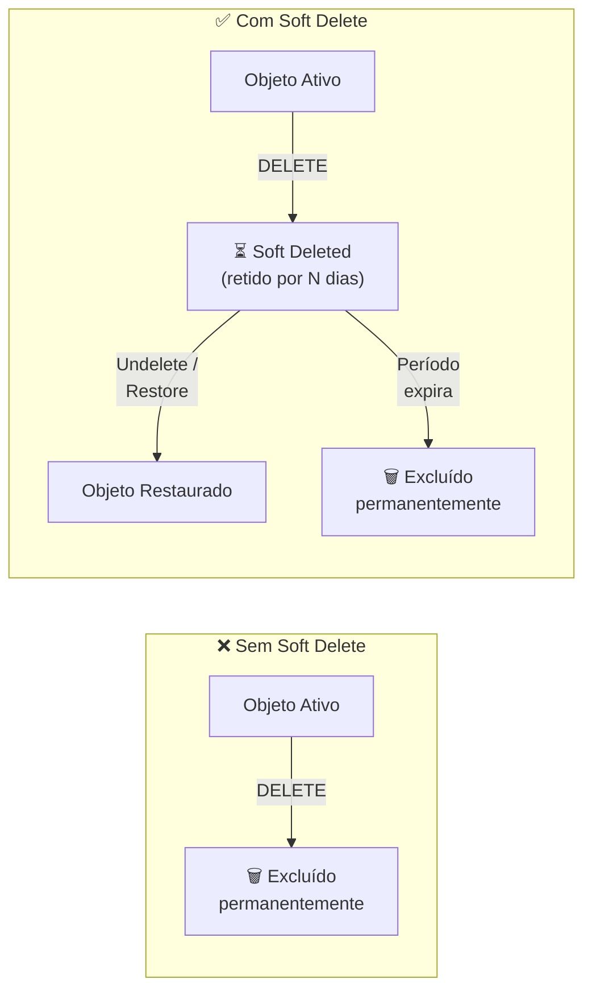
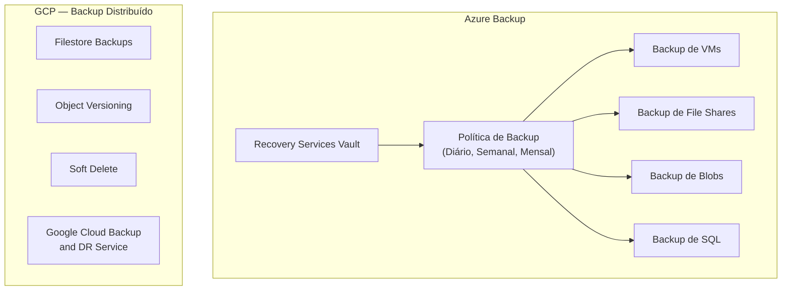
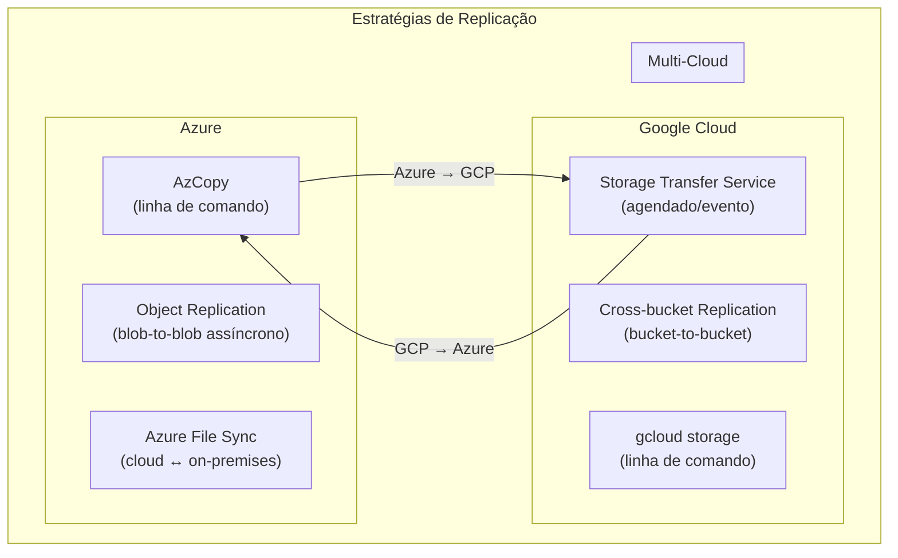
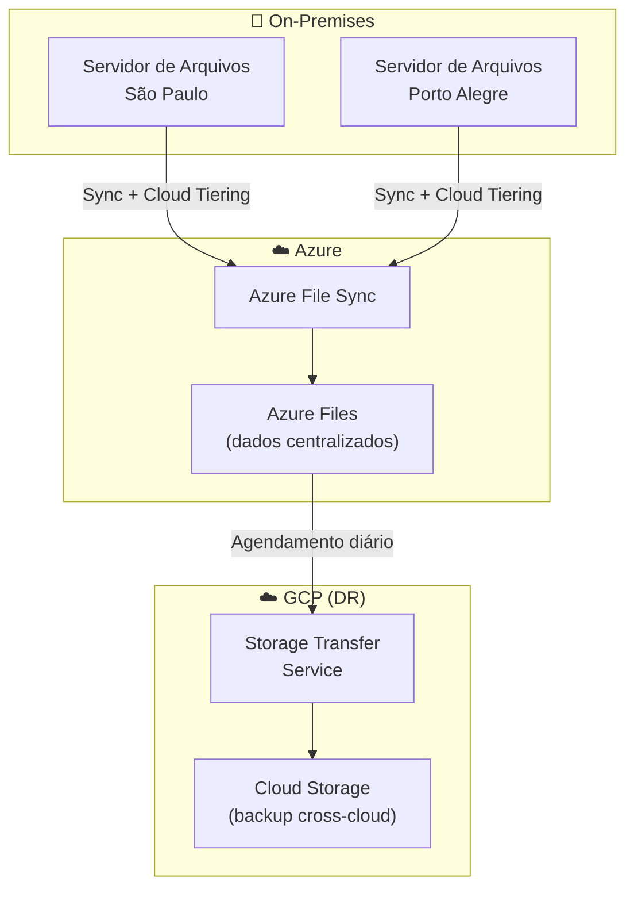
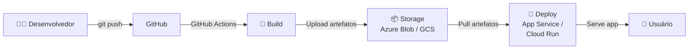
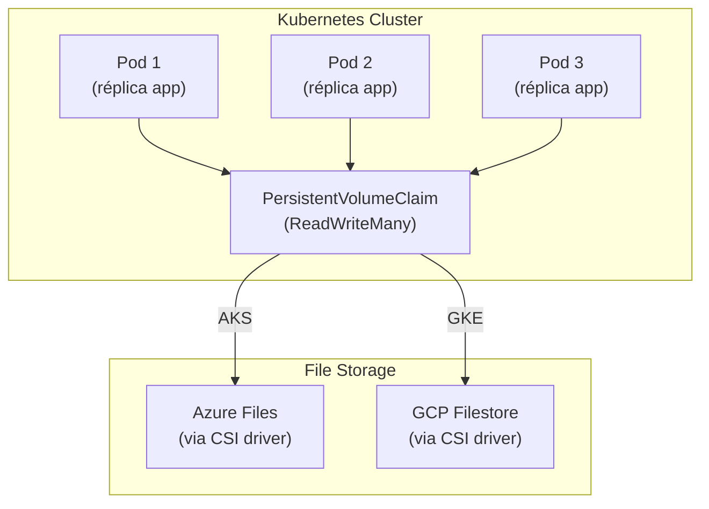

# Aula 03 — Armazenamento de Dados Avançado: File Storage, Backups e Integração via SDK

> **Disciplina:** Computação em Nuvem II (ISW035)  
> **Professor:** Ronan Adriel Zenatti — FATEC Jahu / Centro Paula Souza  
> **Semestre:** 1º/2026  
> **Carga Horária:** 4h práticas

---

## 1. Contextualização

Na aula anterior, exploramos o armazenamento de objetos (Azure Blob Storage e Google Cloud Storage), ideal para dados não estruturados em grande escala. Nesta aula, avançamos para três temas complementares e igualmente essenciais: o **armazenamento de arquivos compartilhados** (file storage), as **estratégias de backup e proteção de dados**, e a **integração programática via SDKs** usando Python.

O file storage difere fundamentalmente do object storage: enquanto o armazenamento de objetos trabalha com um namespace plano e acesso via API REST, o file storage oferece um **sistema de arquivos hierárquico** acessível via protocolos de rede tradicionais (SMB e NFS). Isso torna o file storage ideal para cenários de "lift-and-shift" de aplicações legadas, compartilhamento de dados entre VMs e workloads que exigem acesso concorrente a arquivos, como diretórios home de usuários, ferramentas de desenvolvimento e aplicações empresariais.

### Mapa de Equivalência — File Storage e Backup

| Conceito | Azure | Google Cloud |
|---|---|---|
| File storage gerenciado | Azure Files | Filestore |
| Protocolo principal | SMB 3.0 (padrão) + NFS | NFS (padrão) + NFSv4.1 c/ Kerberos |
| Backup gerenciado | Azure Backup | Filestore Backups + Cloud Storage |
| Snapshots de objetos | Blob Snapshots + Versioning | Object Versioning + Soft Delete |
| Snapshots de file share | File Share Snapshots | Filestore Snapshots |
| Exclusão temporária | Soft Delete (Blobs e Files) | Soft Delete (objetos) |
| Ferramenta de transferência | AzCopy | Storage Transfer Service |
| SDK Python principal | `azure-storage-blob` / `azure-storage-file-share` | `google-cloud-storage` |

---

## 2. File Storage Gerenciado

### 2.1 Azure Files — Compartilhamentos SMB/NFS na Nuvem

O **Azure Files** é um serviço de compartilhamento de arquivos totalmente gerenciado, acessível via protocolo SMB (Server Message Block) 3.0 ou NFS 4.1. Ele funciona como um servidor de arquivos na nuvem: você cria compartilhamentos (shares), define cotas de espaço e conecta máquinas virtuais, contêineres ou até máquinas on-premises aos compartilhamentos.

O Azure Files reside dentro de uma Storage Account, aproveitando todas as configurações de redundância, criptografia e controle de acesso da conta. Cada compartilhamento pode ter até 100 TiB de capacidade (com a opção "large file shares" habilitada) e suporta milhares de conexões simultâneas.

**Camadas de desempenho do Azure Files:**

| Camada | Throughput | IOPS | Uso Recomendado |
|---|---|---|---|
| **Premium** | Até 5 GiB/s | Até 100.000 IOPS | Bancos de dados, aplicações de alta performance, workloads interativos |
| **Transaction Optimized** | Até 300 MiB/s | Variável por transação | Workloads com muitas operações pequenas (ex.: ferramentas de desenvolvimento) |
| **Hot** | Até 300 MiB/s | Variável | Compartilhamento de arquivos de uso geral |
| **Cool** | Até 300 MiB/s | Variável | Arquivos acessados esporadicamente, arquivamento online |

**Quando usar Azure Files vs. Azure Blob Storage:**

| Aspecto | Azure Files | Azure Blob Storage |
|---|---|---|
| **Protocolo** | SMB 3.0, NFS 4.1, REST | REST, SDKs |
| **Cenário principal** | Lift-and-shift, shares compartilhados, diretórios home | Dados não estruturados em escala, streaming, analytics |
| **Acesso** | Montagem como unidade de rede | Acesso via URL/API |
| **Namespace** | Hierárquico (pastas e subpastas) | Plano (simula hierarquia com prefixos) |
| **Concorrência** | Múltiplas VMs/contêineres montando o mesmo share | Múltiplos leitores/escritores via API |

### 2.2 Google Cloud Filestore — NFS Gerenciado

O **Filestore** é o serviço de file storage gerenciado do GCP, oferecendo servidores NFS (Network File System) totalmente gerenciados. Diferente do Azure Files, que tem SMB como protocolo principal, o Filestore é baseado em NFS, tornando-o particularmente adequado para workloads Linux, Kubernetes (GKE) e HPC (High Performance Computing).

O Filestore está disponível em diferentes camadas de serviço (service tiers), cada uma otimizada para diferentes requisitos de desempenho e disponibilidade.

**Camadas de serviço do Filestore:**

| Camada | Disponibilidade | Redundância | Capacidade | Uso Recomendado |
|---|---|---|---|---|
| **Basic HDD** | Zonal | Intra-zona | 1-63.9 TiB | Compartilhamento de arquivos geral, dev/test |
| **Basic SSD** | Zonal | Intra-zona | 2.5-63.9 TiB | Workloads que exigem baixa latência |
| **Zonal** | Zonal | Multi-zona (dentro da zona) | 1-100 TiB | Enterprise NAS, HPC, renderização |
| **Regional** | Regional (99.99% SLA) | Multi-zona (3 zonas) | 1-100 TiB | Aplicações críticas, ERP, alta disponibilidade |

> **Diferença arquitetural fundamental:** No Azure Files, o protocolo padrão é SMB (nativo do Windows), com NFS disponível como opção adicional. No Filestore, o protocolo nativo é NFS (versões 3 e 4.1), o que o torna mais adequado para ambientes Linux. Para workloads que necessitam de SMB no GCP, a alternativa é o **NetApp Volumes** (serviço parceiro disponível no Cloud Marketplace que suporta SMB, NFS e multi-protocolo).

### 2.3 Criando e Montando File Shares

**Azure Files — Criar e montar via CLI:**

```bash
# Criar compartilhamento de arquivo (dentro de uma Storage Account existente)
az storage share-rm create \
    --storage-account stcnuvem2app2026 \
    --name dados-compartilhados \
    --quota 100 \
    --access-tier Hot

# Obter a chave de acesso
STORAGE_KEY=$(az storage account keys list \
    --account-name stcnuvem2app2026 \
    --query '[0].value' -o tsv)

# Montar no Linux (porta 445 deve estar aberta)
sudo mkdir -p /mnt/azure-share
sudo mount -t cifs \
    //stcnuvem2app2026.file.core.windows.net/dados-compartilhados \
    /mnt/azure-share \
    -o vers=3.0,username=stcnuvem2app2026,password=$STORAGE_KEY,\
    dir_mode=0777,file_mode=0777,serverino

# Montar no Windows (PowerShell)
# $connectTestResult = Test-NetConnection -ComputerName stcnuvem2app2026.file.core.windows.net -Port 445
# net use Z: \\stcnuvem2app2026.file.core.windows.net\dados-compartilhados /user:AZURE\stcnuvem2app2026 $STORAGE_KEY
```

**Google Cloud Filestore — Criar e montar via CLI:**

```bash
# Criar instância Filestore (Basic HDD, 1 TB)
gcloud filestore instances create filestore-cnuvem2 \
    --zone=southamerica-east1-a \
    --tier=BASIC_HDD \
    --file-share=name="dados_compartilhados",capacity=1TB \
    --network=name="default"

# Obter o IP da instância
gcloud filestore instances describe filestore-cnuvem2 \
    --zone=southamerica-east1-a \
    --format="value(networks[0].ipAddresses[0])"

# Montar no Linux (a VM deve estar na mesma rede VPC)
sudo apt-get -y install nfs-common
sudo mkdir -p /mnt/filestore-share
sudo mount 10.x.x.x:/dados_compartilhados /mnt/filestore-share

# Verificar montagem
df -h /mnt/filestore-share
```

### 2.4 Comparativo Detalhado: Azure Files vs. Filestore

| Característica | Azure Files | GCP Filestore |
|---|---|---|
| **Protocolo principal** | SMB 3.0 | NFSv3 |
| **Protocolo secundário** | NFS 4.1 | NFSv4.1 (com Kerberos) |
| **Capacidade máxima** | 100 TiB por share | 100 TiB por instância |
| **SLA máximo** | 99.9% (Standard) / 99.95% (Premium ZRS) | 99.99% (Regional tier) |
| **Redundância** | LRS, ZRS, GRS, GZRS | Zonal (Basic) / Multi-zona regional (Regional tier) |
| **Integração com Kubernetes** | Azure Files CSI driver | Filestore CSI driver |
| **Integração com VMware** | Azure VMware Solution | Google Cloud VMware Engine |
| **Criptografia em trânsito** | SMB 3.0 com criptografia | NFSv4.1 com Kerberos (krb5p) |
| **Snapshots** | Share-level snapshots | Instance-level snapshots |
| **Backup** | Azure Backup (integrado) | Filestore Backups |
| **Escalabilidade** | Sem tempo de inatividade | Sem tempo de inatividade |
| **Preço base (Standard)** | ~$0.06/GiB/mês | ~$0.20/GiB/mês (Basic HDD) |

### 2.5 Exemplos Práticos de File Storage

**Exemplo 1 — Lift-and-shift de servidor de arquivos corporativo:** Uma empresa migra seu servidor de arquivos Windows on-premises para a nuvem. No Azure, ela cria um compartilhamento Azure Files com camada Premium e monta via SMB nas VMs Windows na nuvem, mantendo a mesma experiência do usuário (unidade de rede Z:). No GCP, como o Filestore é NFS-nativo, a empresa pode optar por usar o NetApp Volumes (que suporta SMB) ou migrar os workloads para Linux e usar Filestore diretamente.

**Exemplo 2 — Armazenamento compartilhado para cluster Kubernetes:** Uma aplicação em Kubernetes precisa que múltiplos pods leiam e escrevam nos mesmos arquivos (por exemplo, um CMS que armazena uploads). No Azure, o Azure Files CSI driver permite criar PersistentVolumes acessíveis por múltiplos pods simultaneamente (ReadWriteMany). No GCP, o Filestore CSI driver proporciona a mesma funcionalidade, sendo particularmente eficiente para workloads de alto throughput.

**Exemplo 3 — Diretórios home para desenvolvedores:** Uma equipe de 50 desenvolvedores precisa de diretórios home persistentes em VMs efêmeras. No Azure, cada desenvolvedor tem uma pasta no compartilhamento Azure Files, montada automaticamente via script de inicialização da VM. No GCP, o Filestore Regional (com SLA de 99.99%) garante que os dados estejam disponíveis mesmo durante manutenções de zona, com montagem NFS configurada no startup script da instância.

---

## 3. Estratégias de Backup e Proteção de Dados

A proteção de dados vai muito além da redundância de armazenamento. Inclui versionamento, exclusão temporária, snapshots, backups agendados e políticas de retenção. Cada mecanismo protege contra um tipo diferente de ameaça: a redundância protege contra falhas de hardware; o versionamento protege contra alterações acidentais; a exclusão temporária protege contra deleções acidentais; e os backups protegem contra desastres e ransomware.

### 3.1 Versionamento de Objetos

O versionamento mantém cópias históricas de cada objeto toda vez que ele é modificado ou sobrescrito. Isso permite recuperar versões anteriores de qualquer arquivo.

**Azure — Blob Versioning:**

```bash
# Habilitar versionamento na Storage Account
az storage account blob-service-properties update \
    --account-name stcnuvem2app2026 \
    --enable-versioning true

# Listar versões de um blob
az storage blob list \
    --account-name stcnuvem2app2026 \
    --container-name dados \
    --include v \
    --output table
```

**GCP — Object Versioning:**

```bash
# Habilitar versionamento no bucket
gcloud storage buckets update gs://cnuvem2-app-dados-2026 \
    --versioning

# Listar versões de um objeto
gcloud storage ls --all-versions gs://cnuvem2-app-dados-2026/relatorio.pdf

# Restaurar uma versão anterior
gcloud storage cp \
    gs://cnuvem2-app-dados-2026/relatorio.pdf#<generation-number> \
    gs://cnuvem2-app-dados-2026/relatorio.pdf
```

### 3.2 Exclusão Temporária (Soft Delete)

A exclusão temporária (soft delete) mantém os dados em um estado de "exclusão lógica" por um período configurável, permitindo recuperação sem necessidade de backup.



**Azure — Soft Delete para Blobs e Files:**

```bash
# Habilitar soft delete para blobs (retenção de 30 dias)
az storage account blob-service-properties update \
    --account-name stcnuvem2app2026 \
    --enable-delete-retention true \
    --delete-retention-days 30

# Habilitar soft delete para file shares (retenção de 14 dias)
az storage account file-service-properties update \
    --account-name stcnuvem2app2026 \
    --enable-delete-retention true \
    --delete-retention-days 14

# Listar blobs excluídos temporariamente
az storage blob list \
    --account-name stcnuvem2app2026 \
    --container-name dados \
    --include d \
    --output table

# Restaurar um blob excluído
az storage blob undelete \
    --account-name stcnuvem2app2026 \
    --container-name dados \
    --name relatorio.pdf
```

**GCP — Soft Delete para Objetos:**

```bash
# Configurar soft delete com retenção de 30 dias
gcloud storage buckets update gs://cnuvem2-app-dados-2026 \
    --soft-delete-duration=30d

# Listar objetos soft-deleted
gcloud storage ls --soft-deleted gs://cnuvem2-app-dados-2026/

# Restaurar um objeto soft-deleted
gcloud storage restore gs://cnuvem2-app-dados-2026/relatorio.pdf
```

### 3.3 Snapshots de File Shares

Snapshots são capturas pontuais (point-in-time) do estado completo de um file share. Diferente do versionamento (que rastreia objetos individuais), um snapshot captura o estado consistente de todo o compartilhamento em um único momento.

**Azure — File Share Snapshots:**

Os snapshots do Azure Files são **incrementais** — apenas as mudanças desde o último snapshot são armazenadas, otimizando o consumo de espaço. Eles são criados no nível do compartilhamento e permitem restauração no nível de arquivo individual.

```bash
# Criar snapshot de um file share
az storage share snapshot \
    --name dados-compartilhados \
    --account-name stcnuvem2app2026

# Listar snapshots
az storage share list \
    --account-name stcnuvem2app2026 \
    --include-snapshots \
    --output table
```

**GCP — Filestore Snapshots:**

Os snapshots do Filestore capturam o estado completo da instância. Eles podem ser usados para criar novas instâncias ou restaurar dados.

```bash
# Criar snapshot de uma instância Filestore
gcloud filestore instances snapshots create snapshot-2026-03-01 \
    --instance=filestore-cnuvem2 \
    --region=southamerica-east1

# Listar snapshots
gcloud filestore instances snapshots list \
    --instance=filestore-cnuvem2 \
    --region=southamerica-east1
```

### 3.4 Azure Backup — Proteção Integrada

O Azure Backup é um serviço gerenciado que centraliza a proteção de VMs, bancos de dados, blobs e file shares. Para Azure Files, o backup é integrado nativamente e oferece backup agendado, retenção de longo prazo e restauração granular (nível de arquivo).



### 3.5 GCP Filestore Backups

O Filestore oferece backups nativos que criam cópias completas dos dados em Cloud Storage. Diferente dos snapshots (que são rápidos e locais), os backups podem ser armazenados em regiões diferentes da instância original, proporcionando proteção geográfica.

```bash
# Criar backup de instância Filestore
gcloud filestore backups create backup-2026-03-01 \
    --instance=filestore-cnuvem2 \
    --file-share=dados_compartilhados \
    --instance-zone=southamerica-east1-a \
    --region=southamerica-east1

# Restaurar a partir de um backup (cria nova instância)
gcloud filestore instances restore filestore-cnuvem2-restored \
    --source-backup=backup-2026-03-01 \
    --source-backup-region=southamerica-east1 \
    --file-share=name="dados_restaurados",capacity=1TB \
    --zone=southamerica-east1-b \
    --network=name="default"
```

### 3.6 Tabela Comparativa — Mecanismos de Proteção

| Mecanismo | Azure | GCP | Proteção Contra |
|---|---|---|---|
| **Redundância** | LRS/ZRS/GRS/GZRS | Regional/Dual-region/Multi-region | Falhas de hardware e zona |
| **Versionamento** | Blob Versioning | Object Versioning | Alterações e sobrescritas acidentais |
| **Soft Delete** | Soft Delete (1-365 dias) | Soft Delete (7-90 dias) | Exclusões acidentais |
| **Snapshots (Objetos)** | Blob Snapshots | N/A (usa versionamento) | Captura pontual de objetos |
| **Snapshots (Files)** | File Share Snapshots | Filestore Snapshots | Captura pontual de compartilhamento |
| **Backup gerenciado** | Azure Backup (centralizado) | Filestore Backups / Backup and DR Service | Desastres e ransomware |
| **Point-in-time Restore** | Blob point-in-time restore | N/A (usar versionamento + lifecycle) | Restauração de contêiner a um momento |
| **Retention Policy** | Immutable Storage (WORM) | Bucket Lock / Retention Policy | Compliance e exigências legais |
| **Object Lock** | Legal Hold + Time-based retention | Object Hold + Retention policy | Proteção contra exclusão regulatória |

### 3.7 Exemplos Práticos de Backup e Proteção

**Exemplo 1 — Proteção contra ransomware em file shares corporativos:** Uma empresa configura soft delete com retenção de 30 dias e snapshots diários automáticos no Azure Files. Se um ransomware criptografar todos os arquivos do compartilhamento, a equipe de TI pode restaurar o snapshot mais recente anterior ao ataque. No GCP Filestore, a mesma estratégia é aplicada com Filestore Snapshots diários e backups semanais em outra região.

**Exemplo 2 — Compliance LGPD com retenção obrigatória:** Uma organização de saúde precisa reter prontuários por 20 anos sem possibilidade de alteração ou exclusão. No Azure, ela usa Immutable Storage com política time-based de 20 anos. No GCP, ela configura uma Retention Policy com Bucket Lock, que torna a política de retenção permanente e irremovível, atendendo aos requisitos de WORM (Write Once, Read Many).

**Exemplo 3 — Recuperação granular de documentos editados incorretamente:** Um funcionário sobrescreve acidentalmente um relatório crítico. Com versionamento habilitado (tanto no Azure Blob Versioning quanto no GCP Object Versioning), o administrador lista as versões anteriores do arquivo e restaura a versão correta em segundos, sem precisar recorrer a backups.

---

## 4. Estratégias de Replicação Avançada

### 4.1 Azure — Replicação de Dados

O Azure oferece múltiplos mecanismos para replicar dados entre regiões e contas de armazenamento.

**Object Replication:** Replica blobs de forma assíncrona entre contêineres em diferentes Storage Accounts. Requer que o versionamento esteja habilitado em ambas as contas (origem e destino). É configurado por meio de políticas que definem quais contêineres e prefixos devem ser replicados.

**Azure File Sync:** Embora não abordado em profundidade nesta aula, o Azure File Sync permite centralizar file shares no Azure Files enquanto mantém caches locais em servidores Windows on-premises. Ele habilita **cloud tiering**, que move automaticamente arquivos acessados com menos frequência para a nuvem, mantendo apenas os mais recentes localmente.

### 4.2 GCP — Replicação e Transferência

**Cross-bucket Replication:** Permite replicar objetos automaticamente entre buckets independentes, útil para cenários onde dual-region ou multi-region não são suficientes (por exemplo, replicação para uma região específica que não está disponível como par dual-region).

**Storage Transfer Service:** Serviço gerenciado para transferências em larga escala, suportando transferências programadas, baseadas em eventos (quando novos objetos são criados), entre provedores de nuvem (Azure Blob → GCS, AWS S3 → GCS) e até de fontes on-premises.



### 4.3 Exemplos Práticos de Replicação

**Exemplo 1 — Replicação multi-cloud para DR:** Uma empresa mantém seus dados primários no Azure (Brazil South) e replica um subconjunto crítico para o GCP (southamerica-east1) usando o Storage Transfer Service. Se o Azure sofrer uma indisponibilidade regional, a aplicação pode failover para o GCP usando os dados replicados.

**Exemplo 2 — Distribuição de conteúdo global:** Um provedor de e-learning replica seus vídeos educacionais do Azure (East US) para GCP (asia-east1) usando pipelines CI/CD com AzCopy e gcloud storage, garantindo baixa latência para alunos na Ásia sem depender de CDN.

**Exemplo 3 — Azure File Sync para escritório híbrido:** Uma empresa com escritórios em São Paulo e Porto Alegre usa Azure File Sync: o file share principal está no Azure Files, e cada escritório tem um Windows Server com cache local. Arquivos recentes ficam no cache local (acesso rápido), enquanto arquivos antigos são automaticamente movidos para a nuvem via cloud tiering. Quando um funcionário precisa de um arquivo antigo, ele é transparentemente baixado da nuvem.

---

## 5. Integração via SDK — Python

A integração programática com o armazenamento em nuvem é essencial para automação, aplicações web, pipelines de dados e qualquer cenário onde a interação manual não é viável. Ambas as plataformas oferecem SDKs robustas para Python (e outras linguagens).

### 5.1 Instalação dos SDKs

```bash
# SDK Azure para Blob Storage e File Shares
pip install azure-storage-blob azure-storage-file-share azure-identity

# SDK Google Cloud para Cloud Storage
pip install google-cloud-storage
```

### 5.2 Azure — Operações com Blob Storage via Python

```python
"""
Azure Blob Storage — Operações básicas com SDK Python
Disciplina: Computação em Nuvem II (ISW035) — FATEC Jahu
"""
from azure.storage.blob import BlobServiceClient, BlobClient, ContainerClient
from azure.storage.blob import generate_blob_sas, BlobSasPermissions
from azure.identity import DefaultAzureCredential
from datetime import datetime, timedelta, timezone
import os

# --- AUTENTICAÇÃO ---
# Opção 1: Connection String (desenvolvimento — NÃO usar em produção!)
connection_string = os.environ.get("AZURE_STORAGE_CONNECTION_STRING")
blob_service = BlobServiceClient.from_connection_string(connection_string)

# Opção 2: Managed Identity / Entra ID (recomendado para produção)
# credential = DefaultAzureCredential()
# blob_service = BlobServiceClient(
#     account_url="https://stcnuvem2app2026.blob.core.windows.net",
#     credential=credential
# )

# --- CRIAR CONTÊINER ---
container_name = "documentos"
try:
    container_client = blob_service.create_container(
        container_name, 
        public_access=None  # Acesso privado (sem acesso anônimo)
    )
    print(f"Contêiner '{container_name}' criado com sucesso.")
except Exception as e:
    print(f"Contêiner já existe ou erro: {e}")
    container_client = blob_service.get_container_client(container_name)

# --- UPLOAD DE ARQUIVO ---
blob_name = "relatorios/2026/relatorio-marco.pdf"
local_file = "./relatorio-marco.pdf"

with open(local_file, "rb") as data:
    blob_client = container_client.upload_blob(
        name=blob_name,
        data=data,
        overwrite=True,  # Sobrescreve se já existir
        metadata={        # Metadados personalizados
            "departamento": "TI",
            "autor": "Prof. Ronan",
            "classificacao": "interno"
        }
    )
    print(f"Upload concluído: {blob_client.url}")

# --- DOWNLOAD DE ARQUIVO ---
download_path = "./download-relatorio.pdf"
blob_client = container_client.get_blob_client(blob_name)

with open(download_path, "wb") as download_file:
    download_data = blob_client.download_blob()
    download_file.write(download_data.readall())
    print(f"Download concluído: {download_path}")

# --- LISTAR BLOBS COM FILTRO ---
print("\n--- Blobs no contêiner 'documentos' ---")
for blob in container_client.list_blobs(name_starts_with="relatorios/"):
    print(f"  {blob.name} | Tamanho: {blob.size} bytes | "
          f"Camada: {blob.blob_tier} | Modificado: {blob.last_modified}")

# --- GERAR SAS TOKEN (acesso temporário) ---
account_name = "stcnuvem2app2026"
account_key = os.environ.get("AZURE_STORAGE_KEY")

sas_token = generate_blob_sas(
    account_name=account_name,
    container_name=container_name,
    blob_name=blob_name,
    account_key=account_key,
    permission=BlobSasPermissions(read=True),   # Apenas leitura
    expiry=datetime.now(timezone.utc) + timedelta(hours=1)  # Expira em 1 hora
)

sas_url = f"https://{account_name}.blob.core.windows.net/{container_name}/{blob_name}?{sas_token}"
print(f"\nURL com SAS (válida por 1 hora):\n{sas_url}")

# --- ALTERAR CAMADA DE ACESSO ---
blob_client.set_standard_blob_tier("Cool")  # Mover para Cool
print(f"\nBlob movido para camada Cool.")

# --- COPIAR BLOB ENTRE CONTÊINERES ---
source_url = blob_client.url
dest_container = blob_service.get_container_client("backup-documentos")
try:
    dest_container.create_container()
except:
    pass

dest_blob = dest_container.get_blob_client("copia-" + blob_name)
dest_blob.start_copy_from_url(source_url)
print(f"Cópia iniciada para contêiner 'backup-documentos'.")
```

### 5.3 GCP — Operações com Cloud Storage via Python

```python
"""
Google Cloud Storage — Operações básicas com SDK Python
Disciplina: Computação em Nuvem II (ISW035) — FATEC Jahu
"""
from google.cloud import storage
from google.cloud.storage import transfer_manager
from datetime import datetime, timedelta, timezone
import os

# --- AUTENTICAÇÃO ---
# Opção 1: Autenticação automática (usa GOOGLE_APPLICATION_CREDENTIALS 
#          ou credenciais padrão da VM/Cloud Shell)
client = storage.Client()

# Opção 2: Autenticação explícita com arquivo de service account
# client = storage.Client.from_service_account_json("sa-key.json")

# --- CRIAR BUCKET ---
bucket_name = "cnuvem2-documentos-2026"
try:
    bucket = client.create_bucket(
        bucket_name,
        location="southamerica-east1"
    )
    # Definir classe de armazenamento padrão
    bucket.storage_class = "STANDARD"
    bucket.patch()
    print(f"Bucket '{bucket_name}' criado em {bucket.location}.")
except Exception as e:
    print(f"Bucket já existe ou erro: {e}")
    bucket = client.bucket(bucket_name)

# --- UPLOAD DE ARQUIVO ---
object_name = "relatorios/2026/relatorio-marco.pdf"
local_file = "./relatorio-marco.pdf"

blob = bucket.blob(object_name)
blob.metadata = {                  # Metadados personalizados
    "departamento": "TI",
    "autor": "Prof. Ronan",
    "classificacao": "interno"
}
blob.upload_from_filename(local_file)
print(f"Upload concluído: gs://{bucket_name}/{object_name}")
print(f"URL pública (se bucket for público): {blob.public_url}")

# --- DOWNLOAD DE ARQUIVO ---
download_path = "./download-relatorio.pdf"
blob = bucket.blob(object_name)
blob.download_to_filename(download_path)
print(f"Download concluído: {download_path}")

# --- LISTAR OBJETOS COM FILTRO ---
print(f"\n--- Objetos no bucket '{bucket_name}' ---")
blobs = client.list_blobs(
    bucket_name, 
    prefix="relatorios/",  # Filtrar por prefixo (como uma "pasta")
    max_results=100
)
for blob in blobs:
    print(f"  {blob.name} | Tamanho: {blob.size} bytes | "
          f"Classe: {blob.storage_class} | Atualizado: {blob.updated}")

# --- GERAR SIGNED URL (acesso temporário) ---
blob = bucket.blob(object_name)
signed_url = blob.generate_signed_url(
    version="v4",
    expiration=timedelta(hours=1),        # Expira em 1 hora
    method="GET"                           # Apenas leitura
)
print(f"\nSigned URL (válida por 1 hora):\n{signed_url}")

# --- ALTERAR CLASSE DE ARMAZENAMENTO ---
blob = bucket.blob(object_name)
blob.update_storage_class("NEARLINE")  # Mover para Nearline
print(f"\nObjeto movido para classe Nearline.")

# --- COPIAR OBJETO ENTRE BUCKETS ---
dest_bucket_name = "cnuvem2-backup-documentos-2026"
try:
    dest_bucket = client.create_bucket(dest_bucket_name, location="us-central1")
except:
    dest_bucket = client.bucket(dest_bucket_name)

source_blob = bucket.blob(object_name)
dest_blob = bucket.copy_blob(
    source_blob, 
    dest_bucket, 
    "copia-" + object_name
)
print(f"Cópia concluída para bucket '{dest_bucket_name}'.")

# --- UPLOAD EM LOTE (múltiplos arquivos em paralelo) ---
# O transfer_manager permite uploads paralelos eficientes
local_dir = "./documentos/"
if os.path.isdir(local_dir):
    file_list = [
        os.path.join(local_dir, f) 
        for f in os.listdir(local_dir) 
        if os.path.isfile(os.path.join(local_dir, f))
    ]
    
    results = transfer_manager.upload_many_from_filenames(
        bucket,
        file_list,
        source_directory=local_dir,
        max_concurrency=8,           # 8 uploads paralelos
        blob_name_prefix="lote/"     # Prefixo no bucket
    )
    
    for name, result in zip(file_list, results):
        if isinstance(result, Exception):
            print(f"  ❌ Falha: {name} — {result}")
        else:
            print(f"  ✅ Upload: {name}")
```

### 5.4 Exemplo Completo — Função Utilitária Multi-Cloud

Este exemplo demonstra uma classe utilitária que abstrai operações de armazenamento, permitindo que a mesma aplicação funcione com Azure ou GCP dependendo da configuração.

```python
"""
Classe utilitária para armazenamento multi-cloud (Azure + GCP)
Demonstra o padrão de abstração usado em aplicações cloud-agnostic.
Disciplina: Computação em Nuvem II (ISW035) — FATEC Jahu
"""
from abc import ABC, abstractmethod
import os


class CloudStorageProvider(ABC):
    """Interface abstrata para operações de armazenamento."""
    
    @abstractmethod
    def upload(self, local_path: str, remote_path: str) -> str:
        """Faz upload e retorna a URL do objeto."""
        pass
    
    @abstractmethod
    def download(self, remote_path: str, local_path: str) -> None:
        """Faz download do objeto para o caminho local."""
        pass
    
    @abstractmethod
    def generate_temp_url(self, remote_path: str, hours: int = 1) -> str:
        """Gera URL temporária para acesso ao objeto."""
        pass
    
    @abstractmethod
    def list_objects(self, prefix: str = "") -> list:
        """Lista objetos com o prefixo informado."""
        pass


class AzureBlobProvider(CloudStorageProvider):
    """Implementação para Azure Blob Storage."""
    
    def __init__(self, connection_string: str, container_name: str):
        from azure.storage.blob import BlobServiceClient
        self.service = BlobServiceClient.from_connection_string(connection_string)
        self.container = self.service.get_container_client(container_name)
        self.container_name = container_name
    
    def upload(self, local_path: str, remote_path: str) -> str:
        with open(local_path, "rb") as data:
            blob = self.container.upload_blob(remote_path, data, overwrite=True)
        return blob.url
    
    def download(self, remote_path: str, local_path: str) -> None:
        blob = self.container.get_blob_client(remote_path)
        with open(local_path, "wb") as f:
            f.write(blob.download_blob().readall())
    
    def generate_temp_url(self, remote_path: str, hours: int = 1) -> str:
        from azure.storage.blob import generate_blob_sas, BlobSasPermissions
        from datetime import datetime, timedelta, timezone
        account_name = self.service.account_name
        account_key = os.environ.get("AZURE_STORAGE_KEY")
        sas = generate_blob_sas(
            account_name=account_name,
            container_name=self.container_name,
            blob_name=remote_path,
            account_key=account_key,
            permission=BlobSasPermissions(read=True),
            expiry=datetime.now(timezone.utc) + timedelta(hours=hours)
        )
        return f"https://{account_name}.blob.core.windows.net/{self.container_name}/{remote_path}?{sas}"
    
    def list_objects(self, prefix: str = "") -> list:
        return [
            {"name": b.name, "size": b.size, "modified": str(b.last_modified)}
            for b in self.container.list_blobs(name_starts_with=prefix)
        ]


class GCPStorageProvider(CloudStorageProvider):
    """Implementação para Google Cloud Storage."""
    
    def __init__(self, bucket_name: str):
        from google.cloud import storage
        self.client = storage.Client()
        self.bucket = self.client.bucket(bucket_name)
        self.bucket_name = bucket_name
    
    def upload(self, local_path: str, remote_path: str) -> str:
        blob = self.bucket.blob(remote_path)
        blob.upload_from_filename(local_path)
        return f"gs://{self.bucket_name}/{remote_path}"
    
    def download(self, remote_path: str, local_path: str) -> None:
        blob = self.bucket.blob(remote_path)
        blob.download_to_filename(local_path)
    
    def generate_temp_url(self, remote_path: str, hours: int = 1) -> str:
        from datetime import timedelta
        blob = self.bucket.blob(remote_path)
        return blob.generate_signed_url(
            version="v4",
            expiration=timedelta(hours=hours),
            method="GET"
        )
    
    def list_objects(self, prefix: str = "") -> list:
        return [
            {"name": b.name, "size": b.size, "modified": str(b.updated)}
            for b in self.client.list_blobs(self.bucket_name, prefix=prefix)
        ]


# --- USO DA ABSTRAÇÃO ---
def main():
    """
    Exemplo de uso: a mesma lógica de aplicação funciona com qualquer provedor.
    A escolha do provedor é feita por variável de ambiente.
    """
    cloud_provider = os.environ.get("CLOUD_PROVIDER", "gcp")
    
    if cloud_provider == "azure":
        storage = AzureBlobProvider(
            connection_string=os.environ["AZURE_STORAGE_CONNECTION_STRING"],
            container_name="documentos"
        )
    elif cloud_provider == "gcp":
        storage = GCPStorageProvider(bucket_name="cnuvem2-documentos-2026")
    else:
        raise ValueError(f"Provedor não suportado: {cloud_provider}")
    
    # A partir daqui, o código é idêntico independente do provedor
    url = storage.upload("./relatorio.pdf", "relatorios/2026/marco.pdf")
    print(f"Upload concluído: {url}")
    
    temp_url = storage.generate_temp_url("relatorios/2026/marco.pdf", hours=2)
    print(f"URL temporária: {temp_url}")
    
    objetos = storage.list_objects(prefix="relatorios/")
    for obj in objetos:
        print(f"  {obj['name']} — {obj['size']} bytes")


if __name__ == "__main__":
    main()
```

### 5.5 Exemplos Práticos de Integração via SDK

**Exemplo 1 — Aplicação Flask com upload de imagens:** Uma aplicação web Flask recebe uploads de imagens de usuários. O backend usa o SDK Python para fazer upload diretamente ao Azure Blob Storage ou GCP Cloud Storage, retornando uma Signed URL/SAS para que o frontend exiba a imagem. A escolha do provedor é definida por variável de ambiente, permitindo migração entre nuvens sem alterar o código da aplicação.

**Exemplo 2 — Pipeline de ETL com dados de sensores:** Um pipeline de dados recebe arquivos CSV de sensores IoT a cada hora. O SDK Python faz upload dos arquivos brutos para a camada Hot/Standard, processa os dados com pandas, gera relatórios consolidados e faz upload dos resultados para uma pasta separada. Arquivos brutos com mais de 30 dias são automaticamente movidos para Nearline/Cool via lifecycle policy, configurada uma vez via SDK.

**Exemplo 3 — Sistema de backup automatizado:** Um script Python executado via cron (ou Cloud Scheduler/Azure Automation) comprime diretórios importantes em `.tar.gz`, faz upload para o storage com timestamp no nome, e remove backups locais com mais de 7 dias. O versionamento no bucket/contêiner garante que, mesmo se o script sobrescrever um arquivo por engano, as versões anteriores são preservadas.

---

## 6. Cenários de Integração entre Serviços

### Cenário 1 — Ambiente Híbrido com File Sync



> **Integração futura:** Redes virtuais e conectividade híbrida serão abordadas na **Aula 12 (Redes Virtuais e Conectividade)**.

### Cenário 2 — CI/CD com Artefatos em Storage



> **Integração futura:** CI/CD na Nuvem será o tema da **Aula 08 (CI/CD — Do GitHub Actions aos Serviços Nativos)**.

### Cenário 3 — Armazenamento para Containers com PersistentVolumes



> **Integração futura:** Containerização e Orquestração serão abordados na **Aula 06 (Containerização e Orquestração na Nuvem)**.

---

## 7. Resumo Comparativo Final — Aula 03

| Aspecto | Azure | Google Cloud |
|---|---|---|
| **File Storage Gerenciado** | Azure Files (SMB/NFS) | Filestore (NFS) / NetApp Volumes (SMB+NFS) |
| **SLA máximo File Storage** | 99.95% (Premium ZRS) | 99.99% (Filestore Regional) |
| **Protocolo padrão** | SMB 3.0 | NFSv3 |
| **Snapshots** | File Share + Blob Snapshots | Filestore Snapshots |
| **Soft Delete** | Blobs (1-365 dias) + Files (1-365 dias) | Objetos (7-90 dias) |
| **Backup gerenciado** | Azure Backup (centralizado) | Filestore Backups + Backup and DR Service |
| **Versionamento** | Blob Versioning | Object Versioning |
| **Replicação cross-region** | Object Replication + AzCopy | Cross-bucket Replication + Storage Transfer Service |
| **Sync híbrido** | Azure File Sync (com cloud tiering) | N/A nativo (usar Storage Transfer Service) |
| **SDK Python (Blob/Object)** | `azure-storage-blob` | `google-cloud-storage` |
| **SDK Python (Files)** | `azure-storage-file-share` | `google-cloud-filestore` (admin API) |
| **Imutabilidade (WORM)** | Immutable Storage | Bucket Lock + Retention Policy |

---

## 8. Exercícios Propostos

1. **Exercício File Storage:** Crie um compartilhamento Azure Files e uma instância Filestore no GCP. Monte ambos em VMs Linux e crie um script que escreva um arquivo de teste em cada um. Documente os comandos de montagem e as diferenças entre SMB e NFS.

2. **Exercício de Backup:** Habilite versionamento e soft delete em um contêiner Azure Blob e em um bucket GCP. Faça upload de um arquivo, sobrescreva-o 3 vezes e depois delete. Recupere a segunda versão usando o SDK Python. Documente os comandos e outputs.

3. **Exercício SDK Multi-Cloud:** Usando o exemplo da classe `CloudStorageProvider` como base, implemente um script que faça backup de uma pasta local para ambas as nuvens simultaneamente, gerando um log com timestamp, URL temporária e tamanho de cada arquivo enviado.

4. **Exercício de Custo Comparativo:** Calcule o custo mensal para uma instância de file storage com 2 TiB de capacidade em cada plataforma. Considere os tiers Standard (Azure) e Basic HDD (GCP). Inclua estimativas para snapshots semanais e backups mensais.

---

## 9. Referências e Leitura Complementar

**Documentação Oficial Azure:**
- [Introdução ao Azure Files](https://learn.microsoft.com/azure/storage/files/storage-files-introduction)
- [Azure Backup — Visão geral](https://learn.microsoft.com/azure/backup/backup-overview)
- [Soft delete para blobs](https://learn.microsoft.com/azure/storage/blobs/soft-delete-blob-overview)
- [SDK Python para Azure Storage](https://learn.microsoft.com/python/api/overview/azure/storage-blob-readme)

**Documentação Oficial GCP:**
- [Filestore — Visão geral](https://cloud.google.com/filestore/docs/overview)
- [Object Versioning](https://cloud.google.com/storage/docs/object-versioning)
- [Soft Delete](https://cloud.google.com/storage/docs/soft-delete)
- [SDK Python para Cloud Storage](https://cloud.google.com/python/docs/reference/storage/latest)
- [Storage Transfer Service](https://cloud.google.com/storage-transfer/docs/overview)

**Certificações relacionadas:**
- Azure: AZ-104 — Módulo "Configurar Arquivos do Azure" e "Configurar segurança de armazenamento"
- GCP: Associate Cloud Engineer — Seção "Gerenciar dados e recursos de armazenamento"

---

> **Aula Anterior:** [Aula 02 — Armazenamento de Dados em Nuvem: Objetos](./Aula_02-Armazenamento_de_Dados_Objetos.md)  
> **Próxima Aula:** [Aula 04 — Bancos de Dados Gerenciados](./Aula_04-Bancos_de_Dados_Gerenciados.md)
