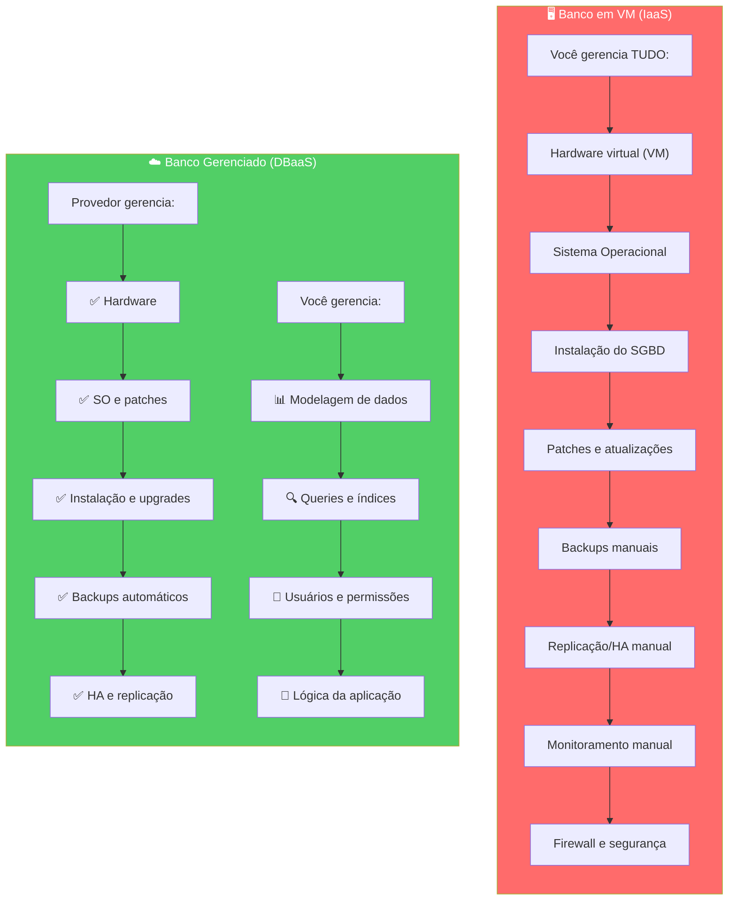
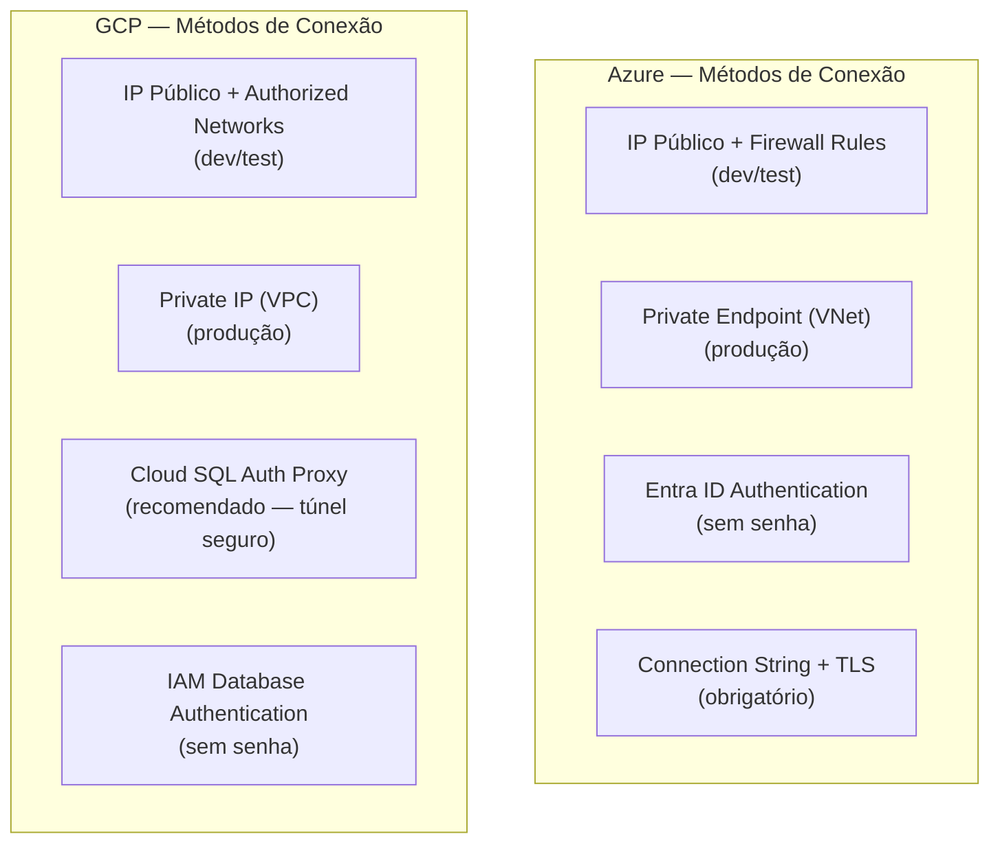
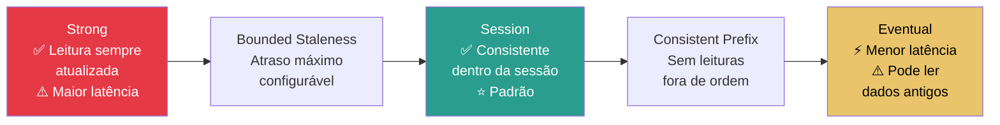
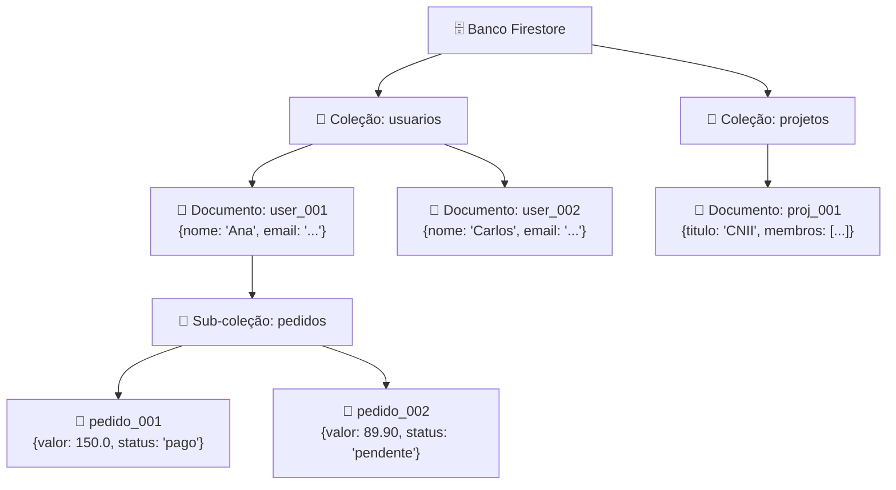
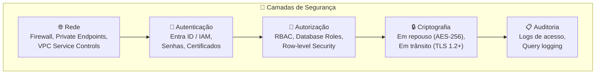
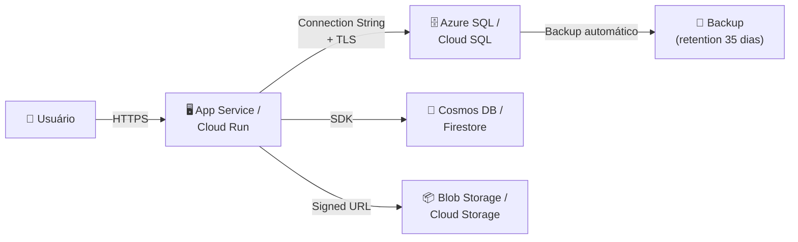
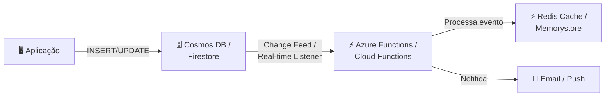
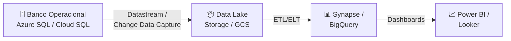

# Aula 04 — Bancos de Dados Gerenciados

> **Disciplina:** Computação em Nuvem II (ISW035)  
> **Professor:** Ronan Adriel Zenatti — FATEC Jahu / Centro Paula Souza  
> **Semestre:** 1º/2026  
> **Carga Horária:** 4h práticas  
> **⚠️ TRABALHO PRÁTICO 1 (T1) — 2,0 pts — Individual:** Implementar camada de dados do projeto interdisciplinar (storage + banco + integração + documentação)

---

## 1. Visão Geral e Contextualização

Nas aulas 02 e 03, trabalhamos com armazenamento de dados não estruturados (objetos e arquivos). Agora, avançamos para o armazenamento de dados **estruturados e semiestruturados** por meio de bancos de dados gerenciados — o modelo conhecido como **DBaaS** (Database as a Service).

A premissa do DBaaS é simples: o provedor de nuvem assume toda a responsabilidade operacional — provisionamento de hardware, patching de sistema operacional, atualização de versões do banco, backups automáticos, alta disponibilidade e monitoramento — enquanto você foca na modelagem dos dados, otimização de consultas e lógica da aplicação.

### Por que DBaaS em vez de instalar o banco na VM?



### Mapa de Equivalência — Bancos de Dados

| Tipo | Microsoft Azure | Google Cloud | Motor/Protocolo |
|---|---|---|---|
| Relacional gerenciado (multi-engine) | Azure SQL Database | Cloud SQL | SQL Server, MySQL, PostgreSQL |
| Relacional gerenciado (proprietário) | Azure SQL Managed Instance | AlloyDB | PostgreSQL-compatível |
| NoSQL documento | Cosmos DB (API NoSQL) | Firestore | JSON/Documento |
| NoSQL chave-valor | Cosmos DB (API Table) | Firestore / Memorystore | Chave-valor |
| NoSQL grafo | Cosmos DB (API Gremlin) | N/A nativo (usar Neo4j no Marketplace) | Grafo |
| NoSQL colunar (wide-column) | Cosmos DB (API Cassandra) | Bigtable | Colunar |
| Cache in-memory | Azure Cache for Redis | Memorystore (Redis/Memcached) | Redis |
| Data warehouse | Azure Synapse Analytics | BigQuery | SQL analítico |

---

## 2. Bancos de Dados Relacionais Gerenciados

### 2.1 Azure SQL Database

O **Azure SQL Database** é o serviço DBaaS relacional principal do Azure. Ele é baseado no motor do SQL Server, mas oferece funcionalidades adicionais como escalabilidade elástica, inteligência integrada (tuning automático de queries) e geo-replicação nativa. Suporta também MySQL e PostgreSQL por meio dos serviços **Azure Database for MySQL** e **Azure Database for PostgreSQL**.

**Modelos de compra do Azure SQL Database:**

| Modelo | Descrição | Melhor Para |
|---|---|---|
| **DTU-based** (Database Transaction Units) | Pacotes pré-configurados de compute, memória e I/O | Workloads previsíveis, simplicidade de gestão |
| **vCore-based** | Escolha independente de vCPUs, memória e storage | Controle granular, migração de licenças existentes |
| **Serverless** | Auto-escala compute e pausa quando inativo | Dev/test, workloads intermitentes |
| **Hyperscale** | Escala até 100 TB com backups quase instantâneos | Bancos muito grandes, OLTP de alta performance |

**Edições do Azure Database for MySQL/PostgreSQL:**

| Tier | vCores | RAM | Storage | Uso |
|---|---|---|---|---|
| **Burstable** | 1-20 | 2-80 GiB | Até 16 TiB | Dev/test, workloads leves |
| **General Purpose** | 2-96 | 8-384 GiB | Até 16 TiB | A maioria das aplicações de produção |
| **Business Critical** (Memory Optimized) | 2-96 | 16-768 GiB | Até 16 TiB | Workloads de alta performance, OLTP intensivo |

### 2.2 Google Cloud SQL

O **Cloud SQL** é o serviço DBaaS relacional do GCP, suportando três motores: MySQL, PostgreSQL e SQL Server. Ele oferece provisionamento simples, backups automáticos, replicação, patching e integração nativa com outros serviços GCP como Cloud Run, GKE e BigQuery.

**Edições do Cloud SQL:**

| Edição | Descrição | Melhor Para |
|---|---|---|
| **Enterprise** | Tier de uso geral, equilibra custo e performance | 80% dos workloads: dev/test, apps web, negócios |
| **Enterprise Plus** | Hardware otimizado, Data Cache (NVMe local), manutenção sub-segundo | Apps de missão crítica, alto throughput, baixa latência |

**Tipos de máquina do Cloud SQL:**

| Tipo | vCPUs | Memória | Uso |
|---|---|---|---|
| **Lightweight** | Shared (0.6-1 vCPU) | 0.6-3.75 GB | Dev/test, protótipos |
| **Standard** | 1-96 | 3.75-624 GB | Workloads de produção gerais |
| **High Memory** | 2-96 | 6.5-624 GB | Workloads memory-intensive (caches, analytics) |

> **Novidade 2025/2026:** O Cloud SQL agora oferece integração direta com **Vertex AI** para geração de embeddings vetoriais e busca por similaridade (vector search) usando `pgvector` no PostgreSQL e suporte nativo a vectores no MySQL. Isso permite construir aplicações de Retrieval-Augmented Generation (RAG) diretamente no banco relacional, sem necessidade de um banco vetorial separado.

### 2.3 Comparativo Detalhado — Bancos Relacionais

| Aspecto | Azure SQL Database / Azure DB for MySQL-PG | Google Cloud SQL |
|---|---|---|
| **Motores suportados** | SQL Server, MySQL, PostgreSQL | MySQL, PostgreSQL, SQL Server |
| **SLA máximo** | 99.995% (Business Critical + Zone Redundant) | 99.99% (Enterprise Plus com HA regional) |
| **Backup automático** | Até 35 dias de retenção + long-term (até 10 anos) | Até 365 dias de retenção + PITR |
| **Alta disponibilidade** | Zone-redundant (réplicas em 3 zonas) | Regional HA (failover automático entre zonas) |
| **Réplicas de leitura** | Até 4 réplicas (geo-replication) | Até 10 réplicas (cross-region) |
| **Serverless** | Sim (Azure SQL Database Serverless) | Não (mas instances podem ser paradas) |
| **Hyperscale (100+ TB)** | Sim (Azure SQL Hyperscale) | Não (máx ~64 TB, usar AlloyDB para escala) |
| **Criptografia em repouso** | AES-256, TDE (Transparent Data Encryption) | AES-256 (Google-managed ou CMEK) |
| **Criptografia em trânsito** | TLS 1.2+ obrigatório | TLS 1.2+ (via Cloud SQL Auth Proxy recomendado) |
| **Connection Pooling gerenciado** | N/A nativo (usar PgBouncer externo) | Cloud SQL Managed Connection Pooling (GA 2025) |
| **Integração com IA** | Azure OpenAI + SQL Server ML Services | Vertex AI + pgvector / MySQL vector search |
| **Migração assistida** | Azure Database Migration Service | Database Migration Service (DMS) |
| **Preço base (aprox.)** | A partir de ~$5/mês (Serverless) | A partir de ~$7/mês (Lightweight) |

### 2.4 Provisionamento Prático

**Azure — Criar Azure Database for PostgreSQL:**

```bash
# Criar servidor PostgreSQL Flexible
az postgres flexible-server create \
    --resource-group rg-cnuvem2 \
    --name pg-cnuvem2-2026 \
    --location brazilsouth \
    --admin-user cnuvem2admin \
    --admin-password 'SenhaSegura@2026!' \
    --sku-name Standard_B1ms \
    --tier Burstable \
    --storage-size 32 \
    --version 16 \
    --yes

# Criar regra de firewall (permitir IP do aluno)
az postgres flexible-server firewall-rule create \
    --resource-group rg-cnuvem2 \
    --name pg-cnuvem2-2026 \
    --rule-name AllowMyIP \
    --start-ip-address SEU.IP.AQUI \
    --end-ip-address SEU.IP.AQUI

# Criar banco de dados
az postgres flexible-server db create \
    --resource-group rg-cnuvem2 \
    --server-name pg-cnuvem2-2026 \
    --database-name app_projeto

# String de conexão resultante:
# Host: pg-cnuvem2-2026.postgres.database.azure.com
# Port: 5432
# Database: app_projeto
# User: cnuvem2admin
# SSL: require
```

**GCP — Criar Cloud SQL for PostgreSQL:**

```bash
# Criar instância Cloud SQL (PostgreSQL 16, Enterprise)
gcloud sql instances create pg-cnuvem2-2026 \
    --database-version=POSTGRES_16 \
    --tier=db-f1-micro \
    --region=southamerica-east1 \
    --root-password='SenhaSegura@2026!' \
    --storage-size=10GB \
    --storage-auto-increase \
    --backup-start-time=03:00 \
    --enable-point-in-time-recovery \
    --availability-type=zonal

# Autorizar IP do aluno para acesso
gcloud sql instances patch pg-cnuvem2-2026 \
    --authorized-networks=SEU.IP.AQUI/32

# Criar banco de dados
gcloud sql databases create app_projeto \
    --instance=pg-cnuvem2-2026

# Criar usuário de aplicação (sem ser root)
gcloud sql users create app_user \
    --instance=pg-cnuvem2-2026 \
    --password='AppSenha@2026!'

# String de conexão (IP público):
# Host: <IP público da instância>
# Port: 5432
# Database: app_projeto
# User: app_user
# SSL: recomendado (ou usar Cloud SQL Auth Proxy)
```

### 2.5 Conexão Segura

A segurança da conexão ao banco é um dos pontos mais críticos. Ambas as plataformas oferecem múltiplas camadas de proteção.



**Cloud SQL Auth Proxy (GCP):** Um recurso diferencial do GCP é o **Cloud SQL Auth Proxy**, um binário leve que cria um túnel criptografado entre a aplicação e a instância Cloud SQL. Ele elimina a necessidade de configurar regras de firewall, certificados SSL manuais ou IPs autorizados. A autenticação é feita via IAM, e a conexão usa TLS sem configuração adicional.

```bash
# Instalar o Cloud SQL Auth Proxy
curl -o cloud-sql-proxy \
    https://storage.googleapis.com/cloud-sql-connectors/cloud-sql-proxy/v2.14.0/cloud-sql-proxy.linux.amd64
chmod +x cloud-sql-proxy

# Iniciar o proxy (a aplicação conecta em localhost:5432)
./cloud-sql-proxy PROJECT_ID:southamerica-east1:pg-cnuvem2-2026 \
    --port=5432

# Na aplicação, conectar como se fosse local:
# Host: 127.0.0.1
# Port: 5432
# Database: app_projeto
# User: app_user
```

### 2.6 Exemplos Práticos — Bancos Relacionais

**Exemplo 1 — Aplicação web SaaS multi-tenant:** Uma aplicação SaaS hospeda dados de múltiplos clientes. No Azure, usa-se Azure SQL Database com elastic pools, onde múltiplos bancos compartilham recursos de forma elástica, reduzindo custos. No GCP, usa-se Cloud SQL Enterprise com réplicas de leitura para distribuir queries de relatórios, enquanto o banco principal atende escritas.

**Exemplo 2 — API REST com Flask e PostgreSQL:** Uma API Flask conecta-se ao PostgreSQL gerenciado para operações CRUD. No Azure, a connection string inclui `sslmode=require` e o hostname termina em `.postgres.database.azure.com`. No GCP, a aplicação usa o Cloud SQL Auth Proxy em produção (conectando em `localhost:5432`) ou connector libraries em Cloud Run.

**Exemplo 3 — Migração de banco on-premises para nuvem:** Uma empresa com MySQL 8.0 on-premises migra para a nuvem. No Azure, usa-se o Database Migration Service (DMS) com replicação contínua, minimizando o downtime para minutos. No GCP, o Database Migration Service faz o mesmo, suportando inclusive migração de Azure para GCP via replicação nativa.

---

## 3. Bancos de Dados NoSQL Gerenciados

### 3.1 Azure Cosmos DB

O **Cosmos DB** é o serviço NoSQL multi-modelo do Azure, projetado para distribuição global, baixa latência (single-digit milliseconds) e escalabilidade horizontal elástica. Sua característica mais distintiva é o suporte a **múltiplas APIs de acesso** sobre o mesmo motor de armazenamento.

**APIs do Cosmos DB:**

| API | Modelo de Dados | Compatível com | Quando Usar |
|---|---|---|---|
| **NoSQL** (nativa) | Documento (JSON) | API proprietária + SQL-like queries | Nova aplicação, máxima performance |
| **MongoDB** | Documento (BSON) | MongoDB wire protocol | Migração de MongoDB existente |
| **Cassandra** | Wide-column | Apache Cassandra CQL | Workloads Cassandra existentes |
| **Gremlin** | Grafo | Apache TinkerPop Gremlin | Grafos de relacionamentos |
| **Table** | Chave-valor | Azure Table Storage | Migração de Table Storage |
| **PostgreSQL** (Citus) | Relacional distribuído | PostgreSQL + Citus | HTAP, multi-tenant relacional |

**Modelos de consistência do Cosmos DB (exclusividade Azure):**

O Cosmos DB oferece 5 níveis de consistência, um espectro entre consistência forte e eventual, permitindo trade-offs precisos entre latência, throughput e garantias de leitura.



### 3.2 Google Cloud Firestore

O **Firestore** é o banco NoSQL de documentos do GCP, com forte integração com o ecossistema Firebase. Ele é projetado para aplicações móveis e web que necessitam de sincronização em tempo real, suporte offline e escalabilidade automática.

**Modos do Firestore:**

| Modo | Descrição | Melhor Para |
|---|---|---|
| **Native Mode** | Suporte completo a real-time listeners, offline sync e mobile SDKs | Apps móveis, web apps com sync em tempo real |
| **Datastore Mode** | Compatível com a antiga API Datastore, sem real-time listeners | Backend de APIs, workloads server-side |

**Modelo de dados do Firestore:**

O Firestore organiza dados em **documentos** (objetos JSON de até 1 MiB) dentro de **coleções**. Documentos podem conter sub-coleções, formando uma hierarquia natural. Cada documento é identificado por um caminho: `colecao/documento/subcolecao/subdocumento`.



### 3.3 Google Cloud Bigtable

Para cenários que exigem armazenamento de **séries temporais**, dados de IoT ou workloads analíticos de baixa latência em escala de petabytes, o GCP oferece o **Bigtable** — o mesmo sistema que sustenta serviços como Gmail, Google Maps e Google Analytics. O equivalente no Azure é o Cosmos DB com API Cassandra.

### 3.4 Comparativo — NoSQL

| Aspecto | Azure Cosmos DB | Google Firestore | Google Bigtable |
|---|---|---|---|
| **Modelo principal** | Multi-modelo (documento, grafo, chave-valor, colunar) | Documento (JSON) | Wide-column |
| **Distribuição global** | Multi-region writes nativos | Multi-region (modo Native) | Multi-cluster replication |
| **Consistência** | 5 níveis configuráveis | Strong (padrão) | Eventual (single-cluster) / Strong (single-row) |
| **Real-time sync** | Change Feed | Real-time listeners (nativo) | N/A |
| **Offline support** | N/A nativo | Sim (mobile/web SDKs) | N/A |
| **Query language** | SQL-like (API NoSQL) | Structured queries com filtros | Scan/Get com filtros |
| **Escalabilidade** | Horizontal (partições lógicas) | Automática (sem configuração) | Horizontal (nodes) |
| **Throughput model** | Request Units (RU/s) ou Serverless | Baseado em operações (reads/writes/deletes) | Baseado em nodes + storage |
| **SLA** | 99.999% (multi-region writes) | 99.999% (multi-region) | 99.999% (multi-cluster) |
| **Preço base** | ~$25/mês (Serverless, 1000 RU/s) | Pay-per-use (primeiros 50k reads/dia grátis) | ~$465/mês (1 node) |
| **Free tier** | 1000 RU/s + 25 GB grátis | 1 GiB storage + 50k reads + 20k writes/dia | N/A |

### 3.5 Provisionamento Prático — NoSQL

**Azure — Criar conta Cosmos DB (API NoSQL):**

```bash
# Criar conta Cosmos DB
az cosmosdb create \
    --resource-group rg-cnuvem2 \
    --name cosmos-cnuvem2-2026 \
    --kind GlobalDocumentDB \
    --locations regionName=brazilsouth failoverPriority=0 \
    --default-consistency-level Session \
    --enable-free-tier true

# Criar banco de dados
az cosmosdb sql database create \
    --resource-group rg-cnuvem2 \
    --account-name cosmos-cnuvem2-2026 \
    --name app_projeto

# Criar container (equivalente a "tabela")
az cosmosdb sql container create \
    --resource-group rg-cnuvem2 \
    --account-name cosmos-cnuvem2-2026 \
    --database-name app_projeto \
    --name usuarios \
    --partition-key-path "/cidade" \
    --throughput 400
```

**GCP — Criar banco Firestore:**

```bash
# Criar banco Firestore (modo Native)
gcloud firestore databases create \
    --location=southamerica-east1 \
    --type=firestore-native

# A partir daqui, a interação é via SDK ou Console
# Não há criação explícita de coleções — elas são criadas implicitamente
# ao inserir o primeiro documento
```

### 3.6 Integração via Python — NoSQL

**Azure Cosmos DB:**

```python
"""
Azure Cosmos DB (API NoSQL) — Operações básicas
"""
from azure.cosmos import CosmosClient, PartitionKey
import os

client = CosmosClient(
    url=os.environ["COSMOS_ENDPOINT"],
    credential=os.environ["COSMOS_KEY"]
)

database = client.get_database_client("app_projeto")
container = database.get_container_client("usuarios")

# Criar documento
usuario = {
    "id": "user_001",
    "nome": "Ana Silva",
    "email": "ana@example.com",
    "cidade": "Jaú",
    "cursos": ["Cloud Computing II", "Banco de Dados"]
}
container.upsert_item(usuario)

# Consultar com SQL-like
query = "SELECT * FROM c WHERE c.cidade = @cidade"
items = container.query_items(
    query=query,
    parameters=[{"name": "@cidade", "value": "Jaú"}],
    enable_cross_partition_query=False
)
for item in items:
    print(f"{item['nome']} — {item['email']}")
```

**Google Firestore:**

```python
"""
Google Cloud Firestore — Operações básicas
"""
from google.cloud import firestore

db = firestore.Client()

# Criar documento
doc_ref = db.collection("usuarios").document("user_001")
doc_ref.set({
    "nome": "Ana Silva",
    "email": "ana@example.com",
    "cidade": "Jaú",
    "cursos": ["Cloud Computing II", "Banco de Dados"]
})

# Consultar com filtros
query = db.collection("usuarios").where("cidade", "==", "Jaú")
docs = query.stream()
for doc in docs:
    data = doc.to_dict()
    print(f"{data['nome']} — {data['email']}")

# Real-time listener (exclusividade Firestore)
def on_snapshot(doc_snapshot, changes, read_time):
    for doc in doc_snapshot:
        print(f"Atualização em tempo real: {doc.to_dict()}")

doc_ref.on_snapshot(on_snapshot)
```

### 3.7 Exemplos Práticos — NoSQL

**Exemplo 1 — Catálogo de produtos e-commerce:** Um e-commerce armazena produtos com atributos variáveis (roupas têm tamanho/cor; eletrônicos têm voltagem/garantia). No Cosmos DB, cada produto é um documento JSON com partition key `/categoria`. No Firestore, cada produto é um documento na coleção `produtos`, com sub-coleções para avaliações e histórico de preços.

**Exemplo 2 — Chat em tempo real:** Uma aplicação de chat precisa de sincronização em tempo real. O Firestore (Native Mode) é ideal: cada mensagem é um documento na sub-coleção `mensagens` dentro de um documento de `conversas`. Os real-time listeners notificam instantaneamente todos os participantes. No Cosmos DB, usa-se o Change Feed para implementar funcionalidade similar, mas requer mais código de infraestrutura.

**Exemplo 3 — Dashboard de IoT com séries temporais:** Milhares de sensores enviam leituras a cada segundo. No Azure, o Cosmos DB com partition key `/sensor_id` e TTL (Time-to-Live) de 30 dias descarta dados antigos automaticamente. No GCP, o Bigtable é a escolha ideal para esse volume, com row key composta por `sensor_id#timestamp` para queries eficientes por faixa temporal.

---

## 4. Segurança de Banco de Dados na Nuvem

### 4.1 Camadas de Proteção



### 4.2 Tabela Comparativa de Segurança

| Recurso | Azure | GCP |
|---|---|---|
| **Firewall de IP** | Server-level firewall rules | Authorized Networks |
| **Acesso privado** | Private Endpoint (VNet) | Private IP (VPC) |
| **Proxy seguro** | N/A (usa Private Endpoint) | Cloud SQL Auth Proxy |
| **Autenticação sem senha** | Entra ID (Azure AD) | IAM Database Authentication |
| **Criptografia em repouso** | TDE (SQL Server) / AES-256 | AES-256 (Google-managed ou CMEK) |
| **Criptografia em trânsito** | TLS 1.2+ (obrigatório) | TLS 1.2+ (recomendado, obrigatório via Proxy) |
| **Auditoria** | Azure SQL Auditing + Log Analytics | Cloud Audit Logs + Cloud Logging |
| **Threat Detection** | Advanced Threat Protection | N/A nativo (usar Security Command Center) |
| **Compliance** | SOC 1/2/3, ISO 27001, HIPAA, PCI DSS | SOC 1/2/3, ISO 27001, HIPAA, PCI DSS |

### 4.3 Exemplos Práticos de Segurança

**Exemplo 1 — Princípio do menor privilégio:** Em produção, a aplicação NUNCA deve conectar como `root` ou `admin`. Cria-se um usuário com permissões restritas (`SELECT`, `INSERT`, `UPDATE` em tabelas específicas). No Azure: `CREATE USER app_reader WITH PASSWORD = '...'`. No GCP: `gcloud sql users create` + `GRANT SELECT ON ...`.

**Exemplo 2 — Eliminação de acesso público:** Em produção, desabilita-se o IP público do banco. No Azure, usa-se Private Endpoint para expor o banco apenas na VNet. No GCP, configura-se Private IP na VPC e desabilita-se o IP público da instância Cloud SQL.

**Exemplo 3 — Rotação de credenciais com Vault:** Em vez de armazenar senhas em variáveis de ambiente, usa-se Azure Key Vault ou GCP Secret Manager para armazenar e rotacionar automaticamente credenciais de banco. A aplicação busca a senha no vault a cada inicialização.

---

## 5. Cenários de Integração

### Cenário 1 — Aplicação Full-Stack com Banco Gerenciado



> **Integração futura:** Deploy de aplicações será abordado na **Aula 05 (Plataformas de Aplicação — PaaS)**.

### Cenário 2 — Event-Driven com Change Streams



> **Integração futura:** Serverless e Event-Driven serão abordados nas **Aulas 14 e 15**.

### Cenário 3 — Data Lake com Ingestão de Banco Operacional



> **Integração futura:** Analytics e BI não são escopo direto desta disciplina, mas a arquitetura de dados é relevante para a compreensão do ecossistema.

---

## 6. Resumo Comparativo Final

| Aspecto | Azure | Google Cloud |
|---|---|---|
| **Relacional principal** | Azure SQL Database + Azure DB for MySQL/PG | Cloud SQL (MySQL, PG, SQL Server) |
| **Relacional avançado** | Azure SQL Managed Instance / Hyperscale | AlloyDB (PG-compatível, HTAP) |
| **NoSQL documento** | Cosmos DB (multi-API) | Firestore |
| **NoSQL colunar** | Cosmos DB (API Cassandra) | Bigtable |
| **Cache** | Azure Cache for Redis | Memorystore (Redis/Memcached) |
| **Migração** | Database Migration Service | Database Migration Service |
| **Proxy de conexão** | N/A (Private Endpoint) | Cloud SQL Auth Proxy |
| **Free tier relacional** | 750h/mês B1ms (12 meses) | 30 dias free trial + lightweight tier |
| **Free tier NoSQL** | 1000 RU/s + 25 GB (Cosmos DB) | 1 GiB + 50k reads/dia (Firestore) |

---

## 7. Trabalho Prático 1 (T1) — 2,0 pontos — Individual

### Requisitos

Implementar a **camada de dados** do projeto interdisciplinar, contemplando:

1. **Storage (0,5 pt):** Bucket/contêiner configurado com lifecycle policy e acesso seguro (SAS/Signed URL)
2. **Banco de dados (0,5 pt):** Instância relacional ou NoSQL provisionada com firewall configurado e usuário de aplicação separado do admin
3. **Integração (0,5 pt):** Script Python que conecta ao banco E ao storage, demonstrando operações CRUD
4. **Documentação (0,5 pt):** README no repositório Git com diagrama de arquitetura (Mermaid), connection strings (sem senhas!), e justificativa das escolhas técnicas

### Entrega

Repositório Git com código, documentação e evidências (screenshots ou logs de execução).

---

## 8. Referências

**Azure:**
- [Azure SQL Database — Documentação](https://learn.microsoft.com/azure/azure-sql/database/)
- [Azure Cosmos DB — Documentação](https://learn.microsoft.com/azure/cosmos-db/)
- [Azure Database for PostgreSQL](https://learn.microsoft.com/azure/postgresql/)

**GCP:**
- [Cloud SQL — Visão geral](https://cloud.google.com/sql/docs/introduction)
- [Firestore — Documentação](https://cloud.google.com/firestore/docs)
- [Cloud SQL Auth Proxy](https://cloud.google.com/sql/docs/postgres/sql-proxy)
- [AlloyDB — Documentação](https://cloud.google.com/alloydb/docs)

---

> **Aula Anterior:** [Aula 03 — Armazenamento de Dados Avançado](./Aula_03-Armazenamento_de_Dados_Avancado.md)  
> **Próxima Aula:** [Aula 05 — Plataformas de Aplicação — PaaS](./Aula_05-Plataformas_de_Aplicacao_PaaS.md)
