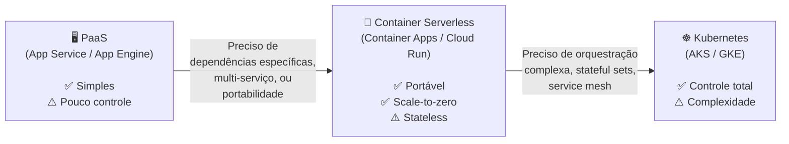
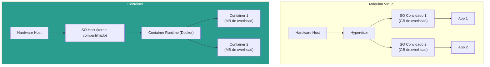
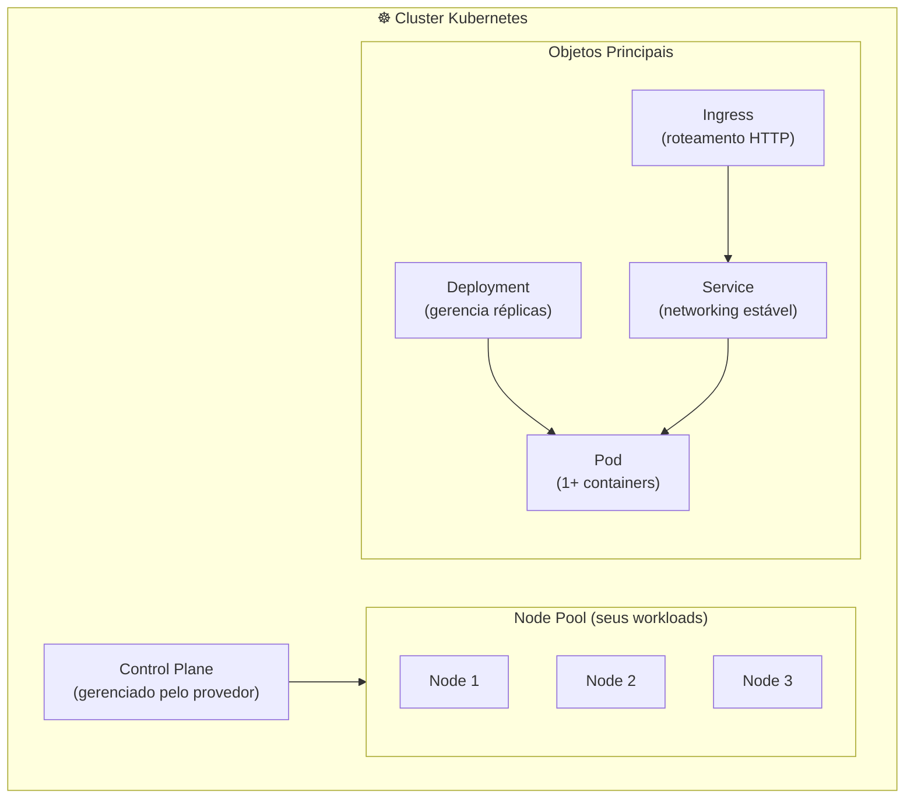
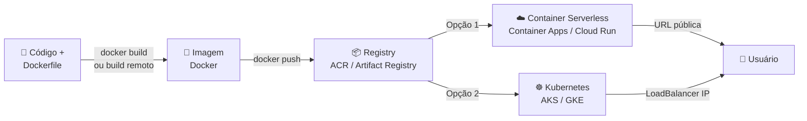
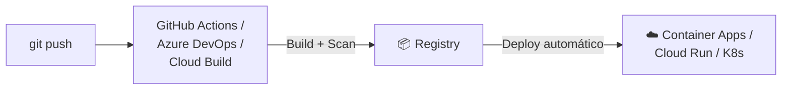

# Aula 06 — Containerização e Orquestração na Nuvem

> **Disciplina:** Computação em Nuvem II (ISW035)  
> **Professor:** Ronan Adriel Zenatti — FATEC Jahu / Centro Paula Souza  
> **Semestre:** 1º/2026  
> **Carga Horária:** 4h práticas

---

## 1. Visão Geral e Contextualização

Na Aula 05, hospedamos aplicações usando PaaS (App Service e App Engine), onde o provedor gerencia o runtime. Agora, damos um passo adiante: empacotamos a aplicação **e** seu ambiente de execução em um **container Docker**, obtendo portabilidade total — o mesmo container roda idêntico na sua máquina, no CI/CD, na nuvem Azure ou no GCP.

Esta aula cobre três estágios progressivos de maturidade com containers na nuvem: publicar imagens em **registros cloud**, executar containers de forma **serverless** (sem gerenciar servidores) e orquestrar múltiplos containers com **Kubernetes gerenciado**.

### De PaaS a Containers — Quando Migrar?



### Mapa de Equivalência — Containers

| Conceito | Microsoft Azure | Google Cloud |
|---|---|---|
| Registro de imagens | Azure Container Registry (ACR) | Artifact Registry |
| Container serverless (HTTP) | Container Apps | Cloud Run |
| Container serverless (tarefas) | Container Apps Jobs | Cloud Run Jobs |
| Kubernetes gerenciado | Azure Kubernetes Service (AKS) | Google Kubernetes Engine (GKE) |
| Container rápido (sem orquestração) | Azure Container Instances (ACI) | N/A (usar Cloud Run) |

---

## 2. Containers — Revisão Rápida

### 2.1 Container vs. Máquina Virtual



| Aspecto | VM | Container |
|---|---|---|
| **Isolamento** | SO completo (forte) | Processo isolado (kernel compartilhado) |
| **Overhead** | GBs (SO inteiro) | MBs (apenas dependências da app) |
| **Startup** | Minutos | Segundos |
| **Portabilidade** | Imagem de VM (grande, acoplada ao hypervisor) | Imagem Docker (leve, roda em qualquer Docker host) |
| **Densidade** | Dezenas por servidor | Centenas por servidor |

### 2.2 Dockerfile — Empacotando a Aplicação

O **Dockerfile** é a receita que define como construir a imagem do container. Cada instrução cria uma camada (layer), e camadas são cacheadas para builds rápidos.

```dockerfile
# Dockerfile para aplicação Flask (Python)
# Estágio 1: imagem base leve
FROM python:3.12-slim AS base

# Metadados
LABEL maintainer="Prof. Ronan Zenatti"
LABEL course="CNII-ISW035"

# Variáveis de ambiente
ENV PYTHONDONTWRITEBYTECODE=1 \
    PYTHONUNBUFFERED=1 \
    PORT=8080

# Diretório de trabalho
WORKDIR /app

# Instalar dependências (camada cacheada separadamente)
COPY requirements.txt .
RUN pip install --no-cache-dir -r requirements.txt

# Copiar código-fonte
COPY . .

# Usuário não-root (segurança)
RUN adduser --disabled-password --no-create-home appuser
USER appuser

# Expor porta
EXPOSE ${PORT}

# Comando de inicialização
CMD ["gunicorn", "--bind", "0.0.0.0:8080", "--workers", "2", "app:app"]
```

```bash
# Build da imagem
docker build -t cnuvem2-app:v1 .

# Testar localmente
docker run -p 8080:8080 --env-file .env cnuvem2-app:v1

# Verificar no navegador: http://localhost:8080
```

---

## 3. Registros de Imagens na Nuvem

Antes de fazer deploy de um container na nuvem, a imagem precisa estar em um **registro (registry)** acessível pelo serviço de destino. Registros cloud são repositórios privados de imagens Docker, integrados com o sistema de IAM e autenticação de cada plataforma.

### 3.1 Azure Container Registry (ACR)

```bash
# Criar registry
az acr create \
    --resource-group rg-cnuvem2 \
    --name acrcnuvem2026 \
    --sku Basic \
    --location brazilsouth

# Autenticar Docker no ACR
az acr login --name acrcnuvem2026

# Tagear imagem para o ACR
docker tag cnuvem2-app:v1 acrcnuvem2026.azurecr.io/cnuvem2-app:v1

# Push para o ACR
docker push acrcnuvem2026.azurecr.io/cnuvem2-app:v1

# Listar imagens no registry
az acr repository list --name acrcnuvem2026 --output table
```

### 3.2 Google Artifact Registry

```bash
# Habilitar API
gcloud services enable artifactregistry.googleapis.com

# Criar repositório
gcloud artifacts repositories create cnuvem2-repo \
    --repository-format=docker \
    --location=southamerica-east1 \
    --description="Imagens do curso CNII"

# Configurar autenticação Docker
gcloud auth configure-docker southamerica-east1-docker.pkg.dev

# Tagear imagem
docker tag cnuvem2-app:v1 \
    southamerica-east1-docker.pkg.dev/PROJECT_ID/cnuvem2-repo/cnuvem2-app:v1

# Push
docker push \
    southamerica-east1-docker.pkg.dev/PROJECT_ID/cnuvem2-repo/cnuvem2-app:v1

# Listar imagens
gcloud artifacts docker images list \
    southamerica-east1-docker.pkg.dev/PROJECT_ID/cnuvem2-repo
```

### 3.3 Comparativo — Registros

| Aspecto | Azure Container Registry | Google Artifact Registry |
|---|---|---|
| **Formatos** | Docker, OCI, Helm charts | Docker, OCI, Helm, Maven, npm, Python, apt, Go |
| **SKUs** | Basic / Standard / Premium | Standard (único) |
| **Geo-replicação** | Sim (Premium) | Multi-region automático |
| **Scanning de vulnerabilidades** | Microsoft Defender for Containers | Artifact Analysis (integrado) |
| **Build integrado** | ACR Tasks (`az acr build`) | Cloud Build (`gcloud builds submit`) |
| **URL do registry** | `<nome>.azurecr.io` | `<region>-docker.pkg.dev/<project>/<repo>` |
| **Free tier** | Não | 0.5 GB grátis/mês |

> **Dica prática:** Ambos os registros suportam **build remoto** — você envia o Dockerfile e o código-fonte, e o build acontece na nuvem, sem precisar de Docker local. Isso é especialmente útil em pipelines CI/CD e em máquinas sem Docker instalado.

```bash
# Azure: Build remoto via ACR Tasks
az acr build --registry acrcnuvem2026 --image cnuvem2-app:v2 .

# GCP: Build remoto via Cloud Build
gcloud builds submit --tag \
    southamerica-east1-docker.pkg.dev/PROJECT_ID/cnuvem2-repo/cnuvem2-app:v2
```

---

## 4. Container Serverless — Deploy sem Gerenciar Servidores

### 4.1 Azure Container Apps

O **Azure Container Apps** é um serviço serverless baseado em Kubernetes (usa KEDA, Dapr e Envoy internamente) que abstrai toda a complexidade de um cluster. Você faz deploy de containers e o serviço cuida do escalonamento, load balancing e networking.

```bash
# Criar ambiente de Container Apps
az containerapp env create \
    --resource-group rg-cnuvem2 \
    --name env-cnuvem2 \
    --location brazilsouth

# Deploy do container
az containerapp create \
    --resource-group rg-cnuvem2 \
    --name app-cnuvem2 \
    --environment env-cnuvem2 \
    --image acrcnuvem2026.azurecr.io/cnuvem2-app:v1 \
    --registry-server acrcnuvem2026.azurecr.io \
    --target-port 8080 \
    --ingress external \
    --min-replicas 0 \
    --max-replicas 5 \
    --env-vars DATABASE_URL=secretref:db-url \
    --query properties.configuration.ingress.fqdn -o tsv

# URL resultante: app-cnuvem2.<hash>.brazilsouth.azurecontainerapps.io
```

### 4.2 Google Cloud Run

O **Cloud Run** é a plataforma serverless de containers do GCP, baseada em Knative. Aceita qualquer container que escute em uma porta HTTP e escala automaticamente de zero a milhares de instâncias.

```bash
# Deploy direto (Cloud Run puxa a imagem do Artifact Registry)
gcloud run deploy cnuvem2-app \
    --image=southamerica-east1-docker.pkg.dev/PROJECT_ID/cnuvem2-repo/cnuvem2-app:v1 \
    --region=southamerica-east1 \
    --port=8080 \
    --allow-unauthenticated \
    --min-instances=0 \
    --max-instances=5 \
    --set-env-vars="FLASK_ENV=production" \
    --add-cloudsql-instances=PROJECT_ID:southamerica-east1:pg-cnuvem2-2026

# URL resultante: https://cnuvem2-app-<hash>-rj.a.run.app

# Verificar status
gcloud run services describe cnuvem2-app --region=southamerica-east1
```

### 4.3 Comparativo — Container Serverless

| Aspecto | Azure Container Apps | Google Cloud Run |
|---|---|---|
| **Base tecnológica** | Kubernetes + KEDA + Dapr + Envoy | Knative |
| **Scale to zero** | ✅ | ✅ |
| **Cold start** | 5-15 segundos | 1-5 segundos (geralmente mais rápido) |
| **Max instâncias** | 300 por app | 1000 por serviço |
| **Timeout máximo** | 30 min (HTTP) | 60 min (HTTP) / 24h (jobs) |
| **Protocolos** | HTTP, TCP, gRPC | HTTP, gRPC, WebSocket |
| **Dapr integrado** | ✅ (service discovery, pub/sub, state) | ❌ |
| **Revisões/versões** | ✅ (traffic splitting) | ✅ (traffic splitting) |
| **GPU** | ✅ | ✅ |
| **VNet integration** | ✅ | ✅ (VPC connector / Direct VPC egress) |
| **Conexão a banco SQL** | Via connection string / VNet | Via Cloud SQL connector (nativo) |
| **Free tier** | 180.000 vCPU-seg/mês + 360.000 GiB-seg/mês | 2M requests/mês + 360.000 vCPU-seg/mês |
| **Preço compute** | ~$0.000024/vCPU-seg | ~$0.000024/vCPU-seg |

### 4.4 Exemplos Práticos — Container Serverless

**Exemplo 1 — API de microserviço com scale-to-zero:** Uma API que processa 100 requisições/hora durante o dia e zero à noite. Com Container Apps ou Cloud Run configurado com `min-instances=0`, a aplicação escala para zero fora do horário comercial, custando $0 quando inativa. No PaaS tradicional (App Service B1), você pagaria 24/7.

**Exemplo 2 — Worker de processamento de imagens:** Um container recebe URLs de imagens de uma fila, redimensiona e salva no storage. No Azure, usa-se Container Apps com KEDA scaler conectado ao Service Bus. No GCP, Cloud Run Jobs processam itens do Pub/Sub com escalonamento baseado em mensagens pendentes.

**Exemplo 3 — Deploy blue/green sem downtime:** Uma nova versão do container é deployada como revisão com 0% do tráfego. Após testes internos, o tráfego é gradualmente migrado (10% → 50% → 100%). Se houver problemas, o rollback é instantâneo via traffic splitting.

---

## 5. Kubernetes Gerenciado — AKS vs. GKE

Para aplicações complexas com múltiplos serviços, comunicação inter-serviço, persistência de estado e políticas de rede avançadas, o Kubernetes é a ferramenta padrão da indústria. Ambos os provedores oferecem Kubernetes **gerenciado**, onde o control plane (API server, etcd, scheduler) é mantido pelo provedor.

### 5.1 Conceitos Fundamentais do Kubernetes



### 5.2 Comparativo — AKS vs. GKE

| Aspecto | Azure Kubernetes Service (AKS) | Google Kubernetes Engine (GKE) |
|---|---|---|
| **Control plane** | Gratuito (gerenciado pelo Azure) | Gratuito (Standard) / ~$73/mês (Enterprise) |
| **Versões K8s** | Múltiplas (geralmente 1-2 atrás do upstream) | Múltiplas (release channels: Rapid/Regular/Stable) |
| **Autopilot** | N/A (mas tem Virtual Nodes com ACI) | GKE Autopilot (nodes gerenciados automaticamente) |
| **Node pools** | System + User pools | Default pool + pools adicionais |
| **Networking** | Azure CNI / kubenet | GKE VPC-native (alias IPs) |
| **Service mesh** | Istio-based (add-on) ou Open Service Mesh | Istio / Anthos Service Mesh |
| **GitOps** | Flux v2 (integrado) | Config Sync |
| **Monitoramento** | Azure Monitor + Container Insights | Cloud Monitoring + GKE Dashboard |
| **Registry integrado** | ACR (attach nativo) | Artifact Registry (nativo) |
| **Scale to zero nodes** | KEDA + Virtual Nodes (ACI) | GKE Autopilot + HPA |
| **Free tier** | Control plane grátis | Standard tier grátis (paga só nodes) |

### 5.3 Deploy no AKS e GKE

**Criando um cluster AKS:**

```bash
# Criar cluster AKS (2 nodes, tamanho pequeno)
az aks create \
    --resource-group rg-cnuvem2 \
    --name aks-cnuvem2 \
    --node-count 2 \
    --node-vm-size Standard_B2s \
    --enable-managed-identity \
    --attach-acr acrcnuvem2026 \
    --generate-ssh-keys

# Obter credenciais kubectl
az aks get-credentials --resource-group rg-cnuvem2 --name aks-cnuvem2

# Verificar
kubectl get nodes
```

**Criando um cluster GKE:**

```bash
# Criar cluster GKE Autopilot (Google gerencia os nodes)
gcloud container clusters create-auto gke-cnuvem2 \
    --region=southamerica-east1 \
    --release-channel=regular

# Obter credenciais kubectl
gcloud container clusters get-credentials gke-cnuvem2 \
    --region=southamerica-east1

# Verificar
kubectl get nodes
```

### 5.4 Manifesto YAML — Deployment + Service

O mesmo manifesto Kubernetes funciona em AKS e GKE (essa é a beleza do Kubernetes como padrão aberto). Apenas as configurações de registry e annotations específicas de nuvem diferem.

```yaml
# deployment.yaml — Funciona em AKS e GKE
apiVersion: apps/v1
kind: Deployment
metadata:
  name: cnuvem2-app
  labels:
    app: cnuvem2-app
spec:
  replicas: 2
  selector:
    matchLabels:
      app: cnuvem2-app
  template:
    metadata:
      labels:
        app: cnuvem2-app
    spec:
      containers:
        - name: app
          # Azure: acrcnuvem2026.azurecr.io/cnuvem2-app:v1
          # GCP:   southamerica-east1-docker.pkg.dev/PROJECT/cnuvem2-repo/cnuvem2-app:v1
          image: acrcnuvem2026.azurecr.io/cnuvem2-app:v1
          ports:
            - containerPort: 8080
          env:
            - name: FLASK_ENV
              value: "production"
            - name: DATABASE_URL
              valueFrom:
                secretKeyRef:
                  name: db-credentials
                  key: url
          resources:
            requests:
              cpu: "250m"
              memory: "256Mi"
            limits:
              cpu: "500m"
              memory: "512Mi"
          readinessProbe:
            httpGet:
              path: /health
              port: 8080
            initialDelaySeconds: 5
            periodSeconds: 10
---
apiVersion: v1
kind: Service
metadata:
  name: cnuvem2-app-svc
spec:
  type: LoadBalancer
  selector:
    app: cnuvem2-app
  ports:
    - port: 80
      targetPort: 8080
```

```bash
# Aplicar manifesto (funciona em AKS e GKE!)
kubectl apply -f deployment.yaml

# Verificar pods
kubectl get pods -l app=cnuvem2-app

# Obter IP externo do serviço
kubectl get svc cnuvem2-app-svc
```

### 5.5 Migrando YAML do Kind para a Nuvem

Se você já desenvolveu com **Kind** (Kubernetes in Docker) localmente, a migração para AKS ou GKE é direta. As principais mudanças são:

| Componente | Kind (local) | AKS / GKE (nuvem) |
|---|---|---|
| **Imagem** | Local (`cnuvem2-app:v1`) | Registry cloud (`acr.../cnuvem2-app:v1`) |
| **Service type** | `NodePort` ou `ClusterIP` | `LoadBalancer` (provisiona IP público) |
| **Secrets** | `kubectl create secret` (manual) | Key Vault / Secret Manager (integrados) |
| **Storage** | `hostPath` | PersistentVolumeClaim (discos gerenciados) |
| **Ingress** | Nginx Ingress local | Azure App Gateway / GKE Ingress (L7 LB) |

### 5.6 Exemplos Práticos — Kubernetes

**Exemplo 1 — Microserviços com comunicação inter-serviço:** Uma aplicação composta por 3 serviços (frontend, API, worker) onde cada serviço é um Deployment separado. Services do tipo ClusterIP permitem comunicação interna, e um Ingress expõe apenas o frontend. O mesmo manifesto roda em AKS e GKE.

**Exemplo 2 — Auto-scaling baseado em CPU:** Um Horizontal Pod Autoscaler (HPA) monitora uso de CPU dos pods e escala de 2 para 10 réplicas quando a CPU ultrapassa 70%. No AKS, o cluster autoscaler adiciona nodes ao pool quando os pods não cabem nos nodes existentes. No GKE Autopilot, isso é automático.

**Exemplo 3 — Blue/Green deployment com Kubernetes:** Dois Deployments (`app-v1` e `app-v2`) coexistem no cluster. Um Service aponta para `app-v1`. Para promover `v2`, altera-se o selector do Service. Se algo falhar, reverte-se o selector para `v1` — rollback instantâneo.

---

## 6. Fluxo Completo — Do Código ao Deploy



---

## 7. Cenários de Integração com Aulas Futuras

### Cenário 1 — CI/CD para Containers



> **Aula 08:** CI/CD na Nuvem com scanning de segurança em imagens Docker.

### Cenário 2 — Monitoramento de Containers

> **Aula 10:** Azure Monitor Container Insights e GKE Cloud Monitoring para métricas de pods, nodes e containers.

### Cenário 3 — IaC para provisionar Cluster + Deploy

> **Aula 07:** Usar Terraform para provisionar o cluster AKS/GKE E fazer o deploy dos manifests, tudo versionado no Git.

---

## 8. Resumo Comparativo Final

| Nível | Azure | GCP | Quando Usar |
|---|---|---|---|
| **Registry** | ACR | Artifact Registry | Armazenar imagens de container |
| **Container Serverless** | Container Apps | Cloud Run | APIs, microserviços, scale-to-zero |
| **Container Task/Job** | Container Apps Jobs | Cloud Run Jobs | Processamento em lote, ETL |
| **Kubernetes Gerenciado** | AKS | GKE | Aplicações complexas, multi-serviço, stateful |
| **Container Simples** | ACI | Cloud Run | Execução rápida de container isolado |

---

## 9. Exercícios Propostos

1. **Exercício Docker:** Crie um Dockerfile para a aplicação do projeto interdisciplinar. Faça build local, execute com `docker run` e verifique que todas as rotas funcionam.

2. **Exercício Registry:** Publique a imagem no ACR ou Artifact Registry usando build remoto (sem Docker local). Liste a imagem publicada via CLI.

3. **Exercício Container Serverless:** Faça deploy da imagem no Container Apps ou Cloud Run. Configure scale-to-zero e obtenha a URL pública. Teste com `curl` ou navegador.

4. **Exercício Kubernetes (bônus):** Crie um cluster AKS ou GKE com 2 nodes. Aplique o manifesto YAML de Deployment + Service. Acesse a aplicação via LoadBalancer IP.

---

## 10. Referências

**Azure:**
- [Azure Container Registry](https://learn.microsoft.com/azure/container-registry/)
- [Azure Container Apps](https://learn.microsoft.com/azure/container-apps/)
- [Azure Kubernetes Service](https://learn.microsoft.com/azure/aks/)

**GCP:**
- [Artifact Registry](https://cloud.google.com/artifact-registry/docs)
- [Cloud Run](https://cloud.google.com/run/docs)
- [Google Kubernetes Engine](https://cloud.google.com/kubernetes-engine/docs)

**Docker e Kubernetes:**
- [Dockerfile Best Practices](https://docs.docker.com/build/building/best-practices/)
- [Kubernetes Documentation](https://kubernetes.io/docs/)

---

> **Aula Anterior:** [Aula 05 — Plataformas de Aplicação — PaaS](./Aula_05-Plataformas_de_Aplicacao_PaaS.md)  
> **Próxima Aula:** [Aula 07 — Infraestrutura como Código — IaC](./Aula_07-Infraestrutura_como_Codigo_IaC.md)
