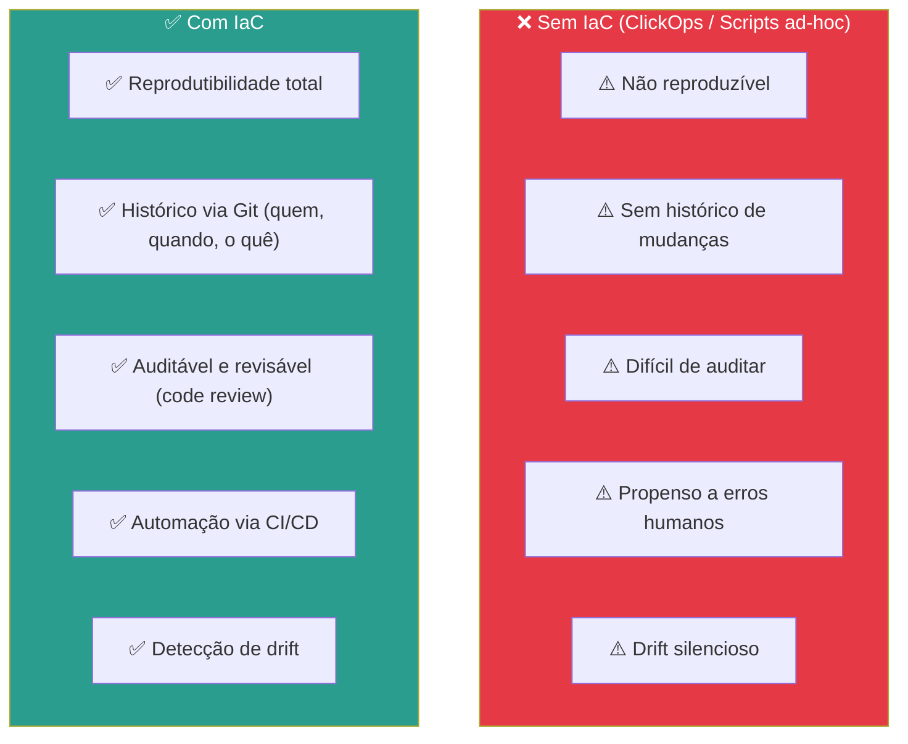
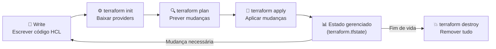
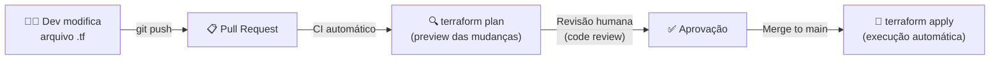
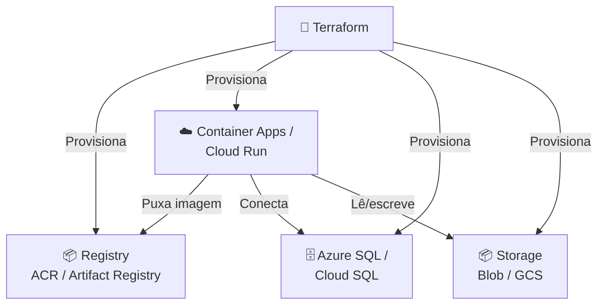

# Aula 07 — Infraestrutura como Código (IaC)

> **Disciplina:** Computação em Nuvem II (ISW035)  
> **Professor:** Ronan Adriel Zenatti — FATEC Jahu / Centro Paula Souza  
> **Semestre:** 1º/2026  
> **Carga Horária:** 4h práticas

---

## 1. Visão Geral e Contextualização

Até agora, provisionamos recursos na nuvem de duas formas: pelo **Portal/Console** (clicando em botões) e pela **CLI** (executando comandos). Ambas funcionam, mas apresentam problemas em ambientes reais: são difíceis de reproduzir, não mantêm histórico de mudanças, e dependem de documentação manual para que outra pessoa consiga recriar o mesmo ambiente.

A **Infraestrutura como Código (IaC)** resolve esses problemas ao tratar a infraestrutura como software: você descreve o estado desejado em arquivos de texto, versiona esses arquivos no Git, e uma ferramenta se encarrega de criar, modificar ou destruir os recursos para que a realidade corresponda ao código.

### Por que IaC?



### Mapa de Ferramentas IaC

| Ferramenta | Tipo | Azure | GCP | Multi-Cloud | Linguagem |
|---|---|---|---|---|---|
| **Terraform** | Declarativo | ✅ | ✅ | ✅ (AWS, K8s, SaaS...) | HCL |
| **Bicep** | Declarativo | ✅ | ❌ | ❌ (apenas Azure) | Bicep DSL |
| **Pulumi** | Declarativo/Imperativo | ✅ | ✅ | ✅ | Python, TS, Go, C# |
| **ARM Templates** | Declarativo | ✅ | ❌ | ❌ | JSON |
| **Deployment Manager** | Declarativo | ❌ | ✅ | ❌ | YAML/Jinja2 |
| **Google Cloud CLI** | Imperativo | ❌ | ✅ | ❌ | Bash/Comandos |
| **Azure CLI** | Imperativo | ✅ | ❌ | ❌ | Bash/Comandos |

> **Escolha para esta disciplina:** Usaremos **Terraform** como ferramenta principal por ser **multi-cloud** — o mesmo fluxo de trabalho, linguagem e conceitos se aplicam a Azure, GCP e qualquer outro provedor. Também apresentaremos **Bicep** como alternativa Azure-nativa para quem trabalha exclusivamente no ecossistema Microsoft.

---

## 2. Terraform — Fundamentos

### 2.1 O que é Terraform

O **Terraform** é uma ferramenta de IaC open-source criada pela HashiCorp. Ele usa uma linguagem declarativa chamada **HCL (HashiCorp Configuration Language)** para descrever o estado desejado da infraestrutura. O Terraform suporta centenas de **providers** — plugins que sabem como interagir com APIs de provedores de nuvem, SaaS e outras plataformas.

### 2.2 Conceitos Fundamentais

| Conceito | Descrição |
|---|---|
| **Provider** | Plugin que conecta o Terraform a uma plataforma (azurerm, google, aws, kubernetes...) |
| **Resource** | Unidade de infraestrutura gerenciada (VM, banco, bucket, rede...) |
| **Data Source** | Consulta a dados existentes sem criar/modificar recursos |
| **Variable** | Parâmetro de entrada configurável (como parâmetros de função) |
| **Output** | Valores exportados após o deploy (IPs, URLs, IDs...) |
| **State** | Arquivo que mapeia recursos do código para recursos reais na nuvem |
| **Module** | Conjunto reutilizável de recursos (como uma "função" de infraestrutura) |

### 2.3 O Ciclo de Vida do Terraform



```bash
# 1. Inicializar (baixa providers, configura backend de state)
terraform init

# 2. Planejar (mostra o que será criado/modificado/destruído)
terraform plan

# 3. Aplicar (executa as mudanças)
terraform apply

# 4. Destruir (remove TODOS os recursos gerenciados)
terraform destroy
```

### 2.4 State — O Coração do Terraform

O **state file** (`terraform.tfstate`) é o mapeamento entre o código HCL e os recursos reais na nuvem. Sem ele, o Terraform não sabe quais recursos existem e não pode calcular o que precisa mudar.

| Aspecto | Local State | Remote State |
|---|---|---|
| **Armazenamento** | Arquivo local no disco | Azure Blob Storage / GCS Bucket / Terraform Cloud |
| **Colaboração** | ❌ Apenas 1 pessoa | ✅ Time inteiro |
| **Lock** | ❌ Sem proteção contra execuções simultâneas | ✅ Locking automático |
| **Segurança** | ⚠️ Contém secrets em texto plano | ✅ Criptografado em repouso |
| **Backup** | ❌ Manual | ✅ Versionamento automático |
| **Recomendação** | Apenas para desenvolvimento local | **Obrigatório em produção e times** |

**Configurando Remote State no Azure:**

```hcl
# backend.tf
terraform {
  backend "azurerm" {
    resource_group_name  = "rg-terraform-state"
    storage_account_name = "sttfstatecnuvem2"
    container_name       = "tfstate"
    key                  = "cnuvem2.tfstate"
  }
}
```

**Configurando Remote State no GCP:**

```hcl
# backend.tf
terraform {
  backend "gcs" {
    bucket = "cnuvem2-terraform-state"
    prefix = "terraform/state"
  }
}
```

---

## 3. Terraform na Prática — Azure

### 3.1 Estrutura de Arquivos

```
infra-azure/
├── main.tf           ← Recursos principais
├── variables.tf      ← Variáveis de entrada
├── outputs.tf        ← Valores de saída
├── providers.tf      ← Configuração de providers
├── backend.tf        ← Configuração de state remoto
└── terraform.tfvars  ← Valores das variáveis (no .gitignore se tiver secrets)
```

### 3.2 Exemplo Completo — Storage Account + Container + SQL Database

```hcl
# providers.tf — Configuração do provider Azure
terraform {
  required_version = ">= 1.7"

  required_providers {
    azurerm = {
      source  = "hashicorp/azurerm"
      version = "~> 4.0"
    }
  }
}

provider "azurerm" {
  features {}
  subscription_id = var.subscription_id
}
```

```hcl
# variables.tf — Variáveis de entrada
variable "subscription_id" {
  description = "ID da assinatura Azure"
  type        = string
}

variable "location" {
  description = "Região Azure"
  type        = string
  default     = "brazilsouth"
}

variable "project_name" {
  description = "Nome do projeto (usado em nomes de recursos)"
  type        = string
  default     = "cnuvem2"
}

variable "db_admin_password" {
  description = "Senha do administrador do banco de dados"
  type        = string
  sensitive   = true  # Não aparece no output do plan/apply
}
```

```hcl
# main.tf — Recursos
# ========================================
# Resource Group
# ========================================
resource "azurerm_resource_group" "main" {
  name     = "rg-${var.project_name}"
  location = var.location

  tags = {
    environment = "education"
    course      = "ISW035"
    managed_by  = "terraform"
  }
}

# ========================================
# Storage Account + Container
# ========================================
resource "azurerm_storage_account" "main" {
  name                     = "st${var.project_name}2026"
  resource_group_name      = azurerm_resource_group.main.name
  location                 = azurerm_resource_group.main.location
  account_tier             = "Standard"
  account_replication_type = "LRS"
  min_tls_version          = "TLS1_2"

  blob_properties {
    delete_retention_policy {
      days = 7  # Soft delete
    }
  }
}

resource "azurerm_storage_container" "arquivos" {
  name                  = "arquivos"
  storage_account_id    = azurerm_storage_account.main.id
  container_access_type = "private"
}

# ========================================
# Azure Database for PostgreSQL (Flexible)
# ========================================
resource "azurerm_postgresql_flexible_server" "main" {
  name                          = "pg-${var.project_name}-2026"
  resource_group_name           = azurerm_resource_group.main.name
  location                      = azurerm_resource_group.main.location
  version                       = "16"
  administrator_login           = "${var.project_name}admin"
  administrator_password        = var.db_admin_password
  sku_name                      = "B_Standard_B1ms"
  storage_mb                    = 32768
  backup_retention_days         = 7
  geo_redundant_backup_enabled  = false

  zone = "1"
}

resource "azurerm_postgresql_flexible_server_database" "app" {
  name      = "app_projeto"
  server_id = azurerm_postgresql_flexible_server.main.id
  charset   = "UTF8"
  collation = "en_US.utf8"
}

# Firewall: permitir serviços Azure
resource "azurerm_postgresql_flexible_server_firewall_rule" "azure_services" {
  name             = "AllowAzureServices"
  server_id        = azurerm_postgresql_flexible_server.main.id
  start_ip_address = "0.0.0.0"
  end_ip_address   = "0.0.0.0"
}
```

```hcl
# outputs.tf — Valores de saída
output "resource_group_name" {
  value = azurerm_resource_group.main.name
}

output "storage_account_name" {
  value = azurerm_storage_account.main.name
}

output "storage_connection_string" {
  value     = azurerm_storage_account.main.primary_connection_string
  sensitive = true
}

output "database_host" {
  value = azurerm_postgresql_flexible_server.main.fqdn
}

output "database_name" {
  value = azurerm_postgresql_flexible_server_database.app.name
}
```

---

## 4. Terraform na Prática — Google Cloud

### 4.1 Exemplo Completo — Bucket + Cloud SQL

```hcl
# providers.tf — Configuração do provider Google
terraform {
  required_version = ">= 1.7"

  required_providers {
    google = {
      source  = "hashicorp/google"
      version = "~> 6.0"
    }
  }
}

provider "google" {
  project = var.project_id
  region  = var.region
}
```

```hcl
# variables.tf
variable "project_id" {
  description = "ID do projeto GCP"
  type        = string
}

variable "region" {
  description = "Região GCP"
  type        = string
  default     = "southamerica-east1"
}

variable "project_name" {
  description = "Nome do projeto"
  type        = string
  default     = "cnuvem2"
}

variable "db_root_password" {
  description = "Senha root do banco de dados"
  type        = string
  sensitive   = true
}
```

```hcl
# main.tf — Recursos GCP

# ========================================
# Cloud Storage Bucket
# ========================================
resource "google_storage_bucket" "main" {
  name          = "${var.project_name}-arquivos-2026"
  location      = var.region
  storage_class = "STANDARD"
  force_destroy = true  # Permite destruir mesmo com objetos dentro (dev only)

  uniform_bucket_level_access = true

  versioning {
    enabled = true
  }

  lifecycle_rule {
    action {
      type          = "SetStorageClass"
      storage_class = "NEARLINE"
    }
    condition {
      age = 30  # Mover para Nearline após 30 dias
    }
  }

  soft_delete_policy {
    retention_duration_seconds = 604800  # 7 dias
  }

  labels = {
    environment = "education"
    course      = "isw035"
    managed_by  = "terraform"
  }
}

# ========================================
# Cloud SQL for PostgreSQL
# ========================================
resource "google_sql_database_instance" "main" {
  name             = "pg-${var.project_name}-2026"
  database_version = "POSTGRES_16"
  region           = var.region
  root_password    = var.db_root_password

  settings {
    tier              = "db-f1-micro"
    availability_type = "ZONAL"
    disk_size         = 10
    disk_autoresize   = true

    backup_configuration {
      enabled                        = true
      point_in_time_recovery_enabled = true
      start_time                     = "03:00"
    }

    ip_configuration {
      ipv4_enabled = true
      authorized_networks {
        name  = "allow-all-temp"
        value = "0.0.0.0/0"  # ⚠️ Apenas para dev! Restringir em produção
      }
    }

    user_labels = {
      environment = "education"
      managed_by  = "terraform"
    }
  }

  deletion_protection = false  # Permitir destroy (dev only)
}

resource "google_sql_database" "app" {
  name     = "app_projeto"
  instance = google_sql_database_instance.main.name
}

resource "google_sql_user" "app" {
  name     = "app_user"
  instance = google_sql_database_instance.main.name
  password = var.db_root_password
}
```

```hcl
# outputs.tf
output "bucket_name" {
  value = google_storage_bucket.main.name
}

output "bucket_url" {
  value = google_storage_bucket.main.url
}

output "database_ip" {
  value = google_sql_database_instance.main.public_ip_address
}

output "database_connection_name" {
  value = google_sql_database_instance.main.connection_name
}
```

---

## 5. Bicep — Alternativa Azure-Nativa

### 5.1 O que é Bicep

O **Bicep** é a linguagem de IaC nativa do Azure, desenvolvida pela Microsoft como substituta dos ARM Templates (JSON). Ele compila para ARM Templates automaticamente, oferecendo uma sintaxe limpa e concisa.

### 5.2 Terraform vs. Bicep

| Aspecto | Terraform | Bicep |
|---|---|---|
| **Multi-cloud** | ✅ Azure, GCP, AWS, K8s, SaaS... | ❌ Apenas Azure |
| **Linguagem** | HCL (HashiCorp Configuration Language) | Bicep DSL (compila para ARM JSON) |
| **State file** | ✅ Obrigatório (local ou remoto) | ❌ Não usa state file (ARM gerencia) |
| **Detecção de drift** | ✅ `terraform plan` compara state vs realidade | ⚠️ `what-if` (menos maduro) |
| **Destroy** | ✅ `terraform destroy` remove tudo | ❌ Não tem destroy nativo (remover via CLI/portal) |
| **Day-0 Azure support** | ⚠️ Pode atrasar dias/semanas vs novos serviços | ✅ Suporta novos serviços Azure no dia do lançamento |
| **Módulos** | Terraform Registry (milhares de módulos) | Bicep Modules + Template Specs |
| **Curva de aprendizado** | Moderada (novo para quem só conhece Azure) | Baixa (intuitivo para quem conhece Azure) |
| **Licença** | BSL 1.1 (uso comercial permitido) | Open source (MIT) |

### 5.3 Exemplo Bicep — Storage Account

```bicep
// main.bicep — Storage Account com container
@description('Região de deploy')
param location string = resourceGroup().location

@description('Nome do projeto')
param projectName string = 'cnuvem2'

// Storage Account
resource storageAccount 'Microsoft.Storage/storageAccounts@2023-05-01' = {
  name: 'st${projectName}2026'
  location: location
  kind: 'StorageV2'
  sku: {
    name: 'Standard_LRS'
  }
  properties: {
    minimumTlsVersion: 'TLS1_2'
    allowBlobPublicAccess: false
  }
  tags: {
    environment: 'education'
    course: 'ISW035'
    managed_by: 'bicep'
  }
}

// Blob container
resource blobContainer 'Microsoft.Storage/storageAccounts/blobServices/containers@2023-05-01' = {
  name: '${storageAccount.name}/default/arquivos'
  properties: {
    publicAccess: 'None'
  }
}

// Outputs
output storageAccountName string = storageAccount.name
output storageAccountId string = storageAccount.id
```

```bash
# Deploy Bicep via Azure CLI
az deployment group create \
    --resource-group rg-cnuvem2 \
    --template-file main.bicep \
    --parameters projectName=cnuvem2

# Preview (what-if) — equivalente ao terraform plan
az deployment group what-if \
    --resource-group rg-cnuvem2 \
    --template-file main.bicep
```

---

## 6. Boas Práticas de IaC

### 6.1 Organização de Código

| Prática | Descrição |
|---|---|
| **Um diretório por ambiente** | `infra/dev/`, `infra/staging/`, `infra/prod/` — cada um com seu state |
| **Variáveis para tudo que muda** | Nomes, regiões, SKUs, senhas — nunca hardcoded no código |
| **Sensitive = true** | Marcar variáveis com senhas/chaves como sensitive |
| **Terraform modules** | Agrupar recursos relacionados em módulos reutilizáveis |
| **Tags/Labels** | Sempre aplicar tags (`environment`, `project`, `managed_by`) para rastreabilidade |

### 6.2 Segurança

| Prática | Descrição |
|---|---|
| **Nunca commitar secrets** | `terraform.tfvars` com senhas vai no `.gitignore` |
| **Remote state criptografado** | Armazenar state em storage com criptografia em repouso |
| **State lock** | Configurar locking para evitar execuções simultâneas |
| **Principle of least privilege** | Service principal / Service account com permissões mínimas |
| **Scanning de IaC** | Usar ferramentas como `tfsec`, `checkov` ou `trivy` para detectar configurações inseguras |

### 6.3 Versionamento e CI/CD



> **Integração futura:** A automação do pipeline Terraform será aprofundada na **Aula 08 (CI/CD na Nuvem)**.

---

## 7. Exemplos Práticos de IaC

**Exemplo 1 — Reproduzir ambiente de desenvolvimento:** Um novo desenvolvedor entra no time. Em vez de seguir um documento de 20 páginas para configurar o ambiente, ele executa `terraform init && terraform apply` e em 5 minutos tem um resource group, storage account, banco de dados e container app idênticos ao dos colegas.

**Exemplo 2 — Disaster recovery via IaC:** O ambiente de produção em Brazil South sofre uma indisponibilidade. O time executa o mesmo código Terraform apontando para a região East US, e em 15 minutos toda a infraestrutura (storage, banco, app) está recriada na região secundária. Os dados são restaurados dos backups geo-replicados.

**Exemplo 3 — Auditoria e compliance:** A equipe de segurança precisa saber quem autorizou a abertura da porta 3306 para 0.0.0.0/0 no firewall do banco. Como toda mudança passa por Pull Request no Git, o histórico mostra exatamente quem, quando e por que a regra foi adicionada — com o `terraform plan` no PR mostrando a mudança proposta.

---

## 8. Cenários de Integração

### Cenário 1 — IaC + Containers (Aulas 06 + 07)



### Cenário 2 — Multi-Cloud com Terraform

```hcl
# Mesmo projeto Terraform, dois providers
provider "azurerm" {
  features {}
}

provider "google" {
  project = "meu-projeto-gcp"
  region  = "southamerica-east1"
}

# Banco primário no Azure
resource "azurerm_postgresql_flexible_server" "primary" { ... }

# Backup do storage no GCP
resource "google_storage_bucket" "backup" { ... }
```

### Cenário 3 — IaC + CI/CD + Monitoramento (Aulas 07 + 08 + 10)

> Terraform provisiona a infraestrutura, CI/CD faz deploy do código, e o monitoramento garante que tudo funciona — tudo definido como código, versionado e auditável.

---

## 9. Resumo Comparativo Final

| Aspecto | Terraform | Bicep | Pulumi |
|---|---|---|---|
| **Multi-cloud** | ✅ | ❌ (apenas Azure) | ✅ |
| **Linguagem** | HCL | Bicep DSL | Python, TypeScript, Go, C# |
| **State management** | State file (obrigatório) | Sem state (ARM gerencia) | State file (Pulumi Cloud ou self-managed) |
| **Destroy** | ✅ `terraform destroy` | ❌ Manual | ✅ `pulumi destroy` |
| **Curva de aprendizado** | Moderada (nova linguagem) | Baixa (intuitivo p/ Azure) | Baixa (usa linguagens conhecidas) |
| **Ecossistema** | Maior (Registry, módulos, comunidade) | Crescente (Azure-focused) | Crescente |
| **Ciclo** | init → plan → apply → destroy | deploy → what-if | up → preview → destroy |
| **Melhor para** | Multi-cloud, times DevOps, padronização | Azure-only, times Microsoft, simplicidade | Devs que preferem linguagens gerais |

---

## 10. Exercícios Propostos

1. **Exercício Terraform Básico:** Crie um arquivo `main.tf` que provisione uma Storage Account (Azure) ou um Bucket (GCP). Execute o ciclo completo: `init → plan → apply`. Verifique no portal/console que o recurso foi criado. Execute `destroy` para remover.

2. **Exercício Infraestrutura Completa:** Usando Terraform, provisione em uma única execução: storage + banco de dados + regra de firewall. Use variáveis para nome do projeto e senha do banco. Documente os outputs (hostname do banco, nome do storage).

3. **Exercício Bicep (se Azure):** Recrie o exercício 1 usando Bicep ao invés de Terraform. Compare a sintaxe e a experiência de deploy. Documente as diferenças percebidas.

4. **Exercício State Remoto:** Configure um remote backend (Azure Blob ou GCS) para o state do Terraform. Verifique que o arquivo `terraform.tfstate` não é mais criado localmente.

---

## 11. Referências

**Terraform:**
- [Terraform — Documentação Oficial](https://developer.hashicorp.com/terraform/docs)
- [Terraform Azure Provider](https://registry.terraform.io/providers/hashicorp/azurerm/latest/docs)
- [Terraform Google Provider](https://registry.terraform.io/providers/hashicorp/google/latest/docs)
- [Terraform Tutorials](https://developer.hashicorp.com/terraform/tutorials)

**Bicep:**
- [Bicep — Documentação Oficial](https://learn.microsoft.com/azure/azure-resource-manager/bicep/)
- [Bicep vs Terraform](https://learn.microsoft.com/azure/developer/terraform/comparing-terraform-and-bicep)

**Boas Práticas:**
- [Terraform Best Practices](https://developer.hashicorp.com/terraform/cloud-docs/recommended-practices)
- [tfsec — Scanner de segurança](https://github.com/aquasecurity/tfsec)

---

> **Aula Anterior:** [Aula 06 — Containerização e Orquestração na Nuvem](./Aula_06-Containerizacao_e_Orquestracao_na_Nuvem.md)  
> **Próxima Aula:** [Aula 08 — CI/CD na Nuvem — Do GitHub Actions aos Serviços Nativos](./Aula_08-CICD_na_Nuvem.md)
