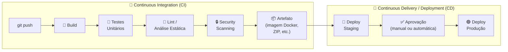
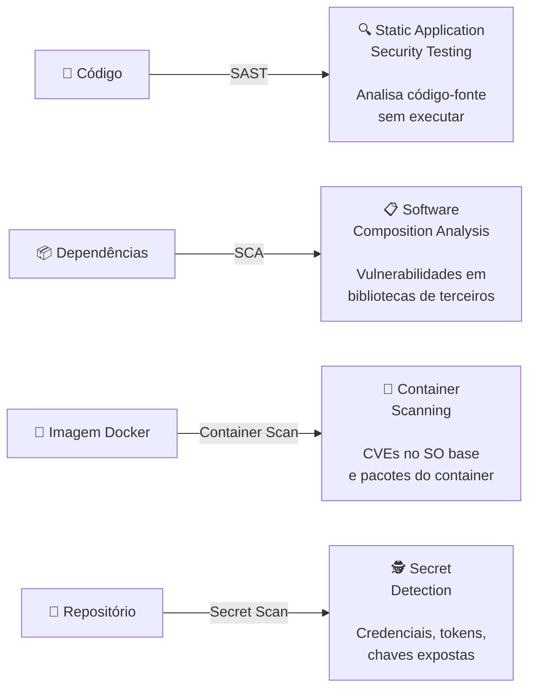
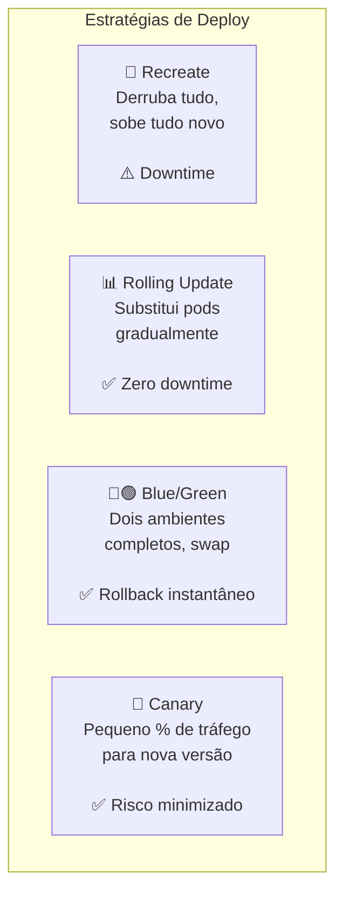
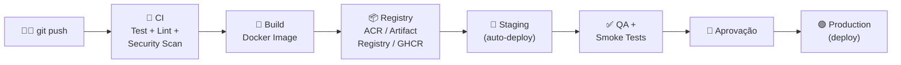
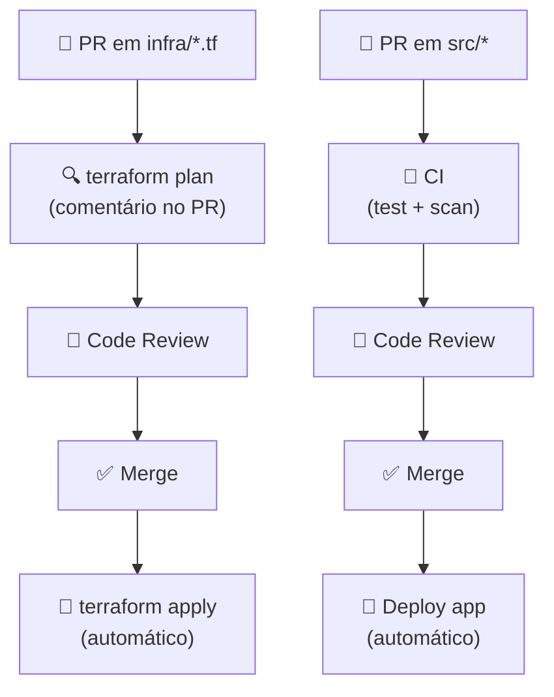

# Aula 08 — CI/CD na Nuvem: Do GitHub Actions aos Serviços Nativos

> **Disciplina:** Computação em Nuvem II (ISW035)  
> **Professor:** Ronan Adriel Zenatti — FATEC Jahu / Centro Paula Souza  
> **Semestre:** 1º/2026  
> **Carga Horária:** 4h práticas

---

## 1. Visão Geral e Contextualização

Nas aulas anteriores, fizemos deploy de aplicações manualmente: executando `az webapp deploy`, `gcloud app deploy`, `kubectl apply` ou `docker push` diretamente do terminal. Isso funciona para aprendizado, mas em ambientes profissionais é insustentável — cada deploy manual é uma oportunidade para erros humanos, configurações esquecidas e versões inconsistentes.

**CI/CD** (Continuous Integration / Continuous Delivery) automatiza todo o caminho do `git push` até a aplicação rodando em produção: build, testes, scanning de segurança, deploy em staging, aprovação e promoção para produção.

### CI vs. CD — Conceitos



| Conceito | Descrição |
|---|---|
| **Continuous Integration (CI)** | Cada push dispara build + testes automaticamente. O objetivo é detectar problemas cedo. |
| **Continuous Delivery** | O artefato está sempre **pronto** para ir para produção, mas o deploy final requer aprovação humana. |
| **Continuous Deployment** | O deploy em produção é **automático** — sem aprovação manual. Requer alta confiança nos testes. |

### Mapa de Equivalência — CI/CD

| Conceito | GitHub (cross-cloud) | Azure Nativo | GCP Nativo |
|---|---|---|---|
| CI/CD principal | GitHub Actions | Azure DevOps Pipelines | Cloud Build |
| Repositório de código | GitHub Repos | Azure Repos | Cloud Source Repositories |
| Registro de artefatos | GitHub Packages / GHCR | Azure Artifacts + ACR | Artifact Registry |
| Gerenciamento de projetos | GitHub Issues + Projects | Azure Boards | Jira (3rd party) / Google Issue Tracker |
| Scanning de segurança | Dependabot + CodeQL | Microsoft Defender for DevOps | Artifact Analysis |
| Secrets | GitHub Secrets | Azure Key Vault + Variable Groups | Secret Manager |
| Deploy contínuo | GitHub Actions → Azure / GCP | Azure Pipelines Release | Cloud Deploy |

---

## 2. GitHub Actions — A Base Universal

O **GitHub Actions** é a ferramenta CI/CD que adotaremos como base nesta disciplina, por três razões: é onde o código já está (GitHub), funciona com **qualquer** provedor de nuvem, e usa YAML — a mesma linguagem de configuração que Kubernetes, Docker Compose e Terraform.

### 2.1 Anatomia de um Workflow

```yaml
# .github/workflows/ci-cd.yml
name: CI/CD Pipeline              # Nome do workflow

on:                                # Eventos que disparam o workflow
  push:
    branches: [main]               # Quando fizer push em main
  pull_request:
    branches: [main]               # Quando abrir PR para main

env:                               # Variáveis globais
  PYTHON_VERSION: "3.12"
  APP_NAME: "cnuvem2-app"

jobs:                              # Jobs executam em paralelo (por padrão)
  # ─────────────────────────────────
  # JOB 1: Build e Testes
  # ─────────────────────────────────
  test:
    name: "🧪 Build & Test"
    runs-on: ubuntu-latest         # Runner (VM efêmera do GitHub)
    
    steps:
      - name: Checkout código
        uses: actions/checkout@v4  # Action pré-construída do marketplace
      
      - name: Setup Python
        uses: actions/setup-python@v5
        with:
          python-version: ${{ env.PYTHON_VERSION }}
          cache: pip
      
      - name: Instalar dependências
        run: |
          pip install -r requirements.txt
          pip install pytest flake8
      
      - name: Lint (análise estática)
        run: flake8 --max-line-length=120 src/
      
      - name: Testes unitários
        run: pytest tests/ -v --tb=short
        env:
          DATABASE_URL: "sqlite:///test.db"  # Banco de teste local

  # ─────────────────────────────────
  # JOB 2: Security Scanning
  # ─────────────────────────────────
  security:
    name: "🔒 Security Scan"
    runs-on: ubuntu-latest
    needs: test                    # Só roda se 'test' passar
    
    steps:
      - uses: actions/checkout@v4
      
      - name: Scan de dependências (pip-audit)
        run: |
          pip install pip-audit
          pip-audit -r requirements.txt
      
      - name: Scan de secrets (Gitleaks)
        uses: gitleaks/gitleaks-action@v2
        env:
          GITHUB_TOKEN: ${{ secrets.GITHUB_TOKEN }}
  
  # ─────────────────────────────────
  # JOB 3: Build e Push da Imagem Docker
  # ─────────────────────────────────
  build-image:
    name: "🐳 Build Docker Image"
    runs-on: ubuntu-latest
    needs: [test, security]        # Depende de ambos os jobs
    if: github.ref == 'refs/heads/main'  # Só em push para main (não em PRs)
    
    outputs:
      image-tag: ${{ steps.meta.outputs.tags }}
    
    steps:
      - uses: actions/checkout@v4
      
      - name: Metadados da imagem
        id: meta
        uses: docker/metadata-action@v5
        with:
          images: |
            ghcr.io/${{ github.repository }}
          tags: |
            type=sha,prefix=
            type=raw,value=latest
      
      - name: Login no GitHub Container Registry
        uses: docker/login-action@v3
        with:
          registry: ghcr.io
          username: ${{ github.actor }}
          password: ${{ secrets.GITHUB_TOKEN }}
      
      - name: Build e Push
        uses: docker/build-push-action@v5
        with:
          context: .
          push: true
          tags: ${{ steps.meta.outputs.tags }}
          cache-from: type=gha
          cache-to: type=gha,mode=max

  # ─────────────────────────────────
  # JOB 4: Deploy (escolha Azure OU GCP)
  # ─────────────────────────────────
  deploy:
    name: "🚀 Deploy Production"
    runs-on: ubuntu-latest
    needs: build-image
    environment: production        # Requer aprovação manual (configurável)
    
    steps:
      - uses: actions/checkout@v4
      
      # ---- OPÇÃO A: Deploy no Azure Container Apps ----
      - name: Login no Azure
        uses: azure/login@v2
        with:
          creds: ${{ secrets.AZURE_CREDENTIALS }}
      
      - name: Deploy no Container Apps
        uses: azure/container-apps-deploy-action@v1
        with:
          resourceGroup: rg-cnuvem2
          containerAppName: ${{ env.APP_NAME }}
          imageToDeploy: ghcr.io/${{ github.repository }}:latest
      
      # ---- OPÇÃO B: Deploy no Google Cloud Run ----
      # - name: Autenticar no GCP
      #   uses: google-github-actions/auth@v2
      #   with:
      #     credentials_json: ${{ secrets.GCP_SA_KEY }}
      #
      # - name: Deploy no Cloud Run
      #   uses: google-github-actions/deploy-cloudrun@v2
      #   with:
      #     service: ${{ env.APP_NAME }}
      #     region: southamerica-east1
      #     image: ghcr.io/${{ github.repository }}:latest
```

### 2.2 Componentes do GitHub Actions

| Componente | Descrição | Exemplo |
|---|---|---|
| **Workflow** | Arquivo YAML que define o pipeline completo | `.github/workflows/ci-cd.yml` |
| **Event/Trigger** | O que dispara o workflow | `push`, `pull_request`, `schedule`, `workflow_dispatch` |
| **Job** | Conjunto de steps que roda em um runner | `test`, `build`, `deploy` |
| **Step** | Uma ação individual dentro de um job | `run: pytest` ou `uses: actions/checkout@v4` |
| **Action** | Componente reutilizável do Marketplace | `docker/build-push-action@v5` |
| **Runner** | Máquina virtual que executa o job | `ubuntu-latest`, `windows-latest`, `macos-latest` |
| **Secret** | Variável criptografada (credenciais) | `${{ secrets.AZURE_CREDENTIALS }}` |
| **Environment** | Contexto de deploy com proteções | `production` (com aprovação manual) |
| **Artifact** | Arquivo persistido entre jobs | Relatórios de teste, binários compilados |

---

## 3. Serviços CI/CD Nativos das Nuvens

### 3.1 Azure DevOps Pipelines

O **Azure DevOps** é uma plataforma ALM (Application Lifecycle Management) completa que inclui repositórios Git, boards de projeto, CI/CD, artefatos e planos de teste. O componente de CI/CD é o **Azure Pipelines**.

**Equivalência GitHub Actions → Azure Pipelines:**

| GitHub Actions | Azure Pipelines |
|---|---|
| `on: push` | `trigger: - main` |
| `jobs:` | `stages: / jobs:` |
| `runs-on: ubuntu-latest` | `pool: vmImage: 'ubuntu-latest'` |
| `steps:` | `steps:` |
| `uses: actions/checkout@v4` | `- checkout: self` |
| `run: pytest` | `- script: pytest` |
| `secrets.MY_SECRET` | `$(MY_SECRET)` (Variable Groups / Key Vault) |
| `environment: production` | `environment: production` (com approvals) |

**Exemplo de Azure Pipeline (YAML):**

```yaml
# azure-pipelines.yml
trigger:
  branches:
    include:
      - main

pool:
  vmImage: 'ubuntu-latest'

variables:
  pythonVersion: '3.12'
  imageName: 'cnuvem2-app'

stages:
  - stage: Build
    displayName: '🔨 Build & Test'
    jobs:
      - job: Test
        steps:
          - task: UsePythonVersion@0
            inputs:
              versionSpec: $(pythonVersion)
          
          - script: |
              pip install -r requirements.txt
              pip install pytest
              pytest tests/ -v
            displayName: 'Instalar deps e testar'
  
  - stage: Deploy
    displayName: '🚀 Deploy'
    dependsOn: Build
    condition: succeeded()
    jobs:
      - deployment: DeployProd
        environment: production
        strategy:
          runOnce:
            deploy:
              steps:
                - task: AzureWebAppContainer@1
                  inputs:
                    azureSubscription: 'MinhaSub'
                    appName: $(imageName)
                    containers: 'acrcnuvem2026.azurecr.io/$(imageName):latest'
```

### 3.2 Google Cloud Build

O **Cloud Build** é o serviço CI/CD serverless do GCP. Ele usa um arquivo `cloudbuild.yaml` para definir os passos do pipeline e pode construir imagens Docker, executar testes e fazer deploy automaticamente.

**Equivalência GitHub Actions → Cloud Build:**

| GitHub Actions | Cloud Build |
|---|---|
| `on: push` | Trigger de repositório (Cloud Source Repos ou GitHub) |
| `jobs: / steps:` | `steps:` (sequenciais por padrão) |
| `runs-on: ubuntu-latest` | Worker gerenciado (sem configuração) |
| `uses: docker/build-push-action` | `name: 'gcr.io/cloud-builders/docker'` |
| `secrets.MY_SECRET` | `secretEnv` + Secret Manager |
| `environment: production` | Cloud Deploy (para entrega gerenciada) |

**Exemplo de Cloud Build:**

```yaml
# cloudbuild.yaml
steps:
  # Passo 1: Instalar dependências e rodar testes
  - name: 'python:3.12-slim'
    entrypoint: 'bash'
    args:
      - '-c'
      - |
        pip install -r requirements.txt pytest
        pytest tests/ -v
    id: 'test'

  # Passo 2: Build da imagem Docker
  - name: 'gcr.io/cloud-builders/docker'
    args: [
      'build',
      '-t', 'southamerica-east1-docker.pkg.dev/$PROJECT_ID/cnuvem2-repo/cnuvem2-app:$SHORT_SHA',
      '-t', 'southamerica-east1-docker.pkg.dev/$PROJECT_ID/cnuvem2-repo/cnuvem2-app:latest',
      '.'
    ]
    id: 'build'

  # Passo 3: Push para Artifact Registry
  - name: 'gcr.io/cloud-builders/docker'
    args: ['push', '--all-tags', 'southamerica-east1-docker.pkg.dev/$PROJECT_ID/cnuvem2-repo/cnuvem2-app']
    id: 'push'

  # Passo 4: Deploy no Cloud Run
  - name: 'gcr.io/google.com/cloudsdktool/cloud-sdk'
    entrypoint: 'gcloud'
    args: [
      'run', 'deploy', 'cnuvem2-app',
      '--image', 'southamerica-east1-docker.pkg.dev/$PROJECT_ID/cnuvem2-repo/cnuvem2-app:$SHORT_SHA',
      '--region', 'southamerica-east1',
      '--allow-unauthenticated'
    ]
    id: 'deploy'

images:
  - 'southamerica-east1-docker.pkg.dev/$PROJECT_ID/cnuvem2-repo/cnuvem2-app'

options:
  logging: CLOUD_LOGGING_ONLY
```

```bash
# Executar manualmente
gcloud builds submit --config=cloudbuild.yaml .

# Configurar trigger automático (push para main)
gcloud builds triggers create github \
    --repo-name=cnuvem2-projeto \
    --repo-owner=SEU_USUARIO \
    --branch-pattern="^main$" \
    --build-config=cloudbuild.yaml
```

### 3.3 Comparativo das Três Plataformas

| Aspecto | GitHub Actions | Azure DevOps Pipelines | Google Cloud Build |
|---|---|---|---|
| **Modelo** | Event-driven, YAML | Multi-stage, YAML ou visual | Step-based, YAML |
| **Repositório** | GitHub (obrigatório) | Azure Repos ou GitHub | Cloud Source, GitHub, Bitbucket |
| **Runners** | GitHub-hosted ou self-hosted | Microsoft-hosted ou self-hosted | Workers gerenciados |
| **Marketplace** | 20.000+ Actions | 1.000+ Extensions | Cloud Builders (limitado) |
| **Paralelismo** | Jobs paralelos nativos | Stages + Jobs paralelos | Steps sequenciais (paralelo via fan-out) |
| **Free tier** | 2.000 min/mês (privado) | 1.800 min/mês (1 job paralelo) | 120 min/dia grátis |
| **Melhor para** | Projetos no GitHub, multi-cloud | Ecossistema Microsoft, enterprise | Projetos GCP-native |
| **Curva de aprendizado** | Baixa | Moderada-alta | Baixa-moderada |

---

## 4. DevSecOps — Segurança no Pipeline

DevSecOps integra práticas de segurança em **cada fase** do pipeline CI/CD, em vez de deixar a segurança para o final. A ideia é "shift left" — encontrar e corrigir problemas de segurança o mais cedo possível.

### 4.1 Tipos de Scanning



### 4.2 Ferramentas por Tipo

| Tipo de Scan | Ferramenta | GitHub Actions | Azure DevOps | Cloud Build |
|---|---|---|---|---|
| **SAST** | CodeQL, Semgrep, SonarQube | `github/codeql-action` | SonarQube Extension | Cloud Code Scanning |
| **SCA (Dependências)** | Dependabot, pip-audit, Trivy | Dependabot (nativo) | WhiteSource/Mend | Artifact Analysis |
| **Container Scan** | Trivy, Snyk, Grype | `aquasecurity/trivy-action` | Defender for Containers | Artifact Analysis (nativo) |
| **Secret Detection** | Gitleaks, TruffleHog | `gitleaks/gitleaks-action` | Credential Scanner | Secret Manager + IAM |
| **IaC Scan** | tfsec, Checkov, KICS | `aquasecurity/tfsec-action` | Checkov Extension | Nenhum nativo |

### 4.3 Exemplo Prático — Pipeline com Security Scanning

```yaml
# Trecho adicional para o workflow GitHub Actions
  security-scan:
    name: "🛡️ DevSecOps Scan"
    runs-on: ubuntu-latest
    needs: test
    steps:
      - uses: actions/checkout@v4
      
      # SCA: Vulnerabilidades em dependências Python
      - name: Audit de dependências
        run: |
          pip install pip-audit
          pip-audit -r requirements.txt --format json --output audit-results.json
      
      # Container Scan: Vulnerabilidades na imagem Docker
      - name: Build imagem para scan
        run: docker build -t scan-target:latest .
      
      - name: Trivy Container Scan
        uses: aquasecurity/trivy-action@master
        with:
          image-ref: 'scan-target:latest'
          format: 'sarif'
          output: 'trivy-results.sarif'
          severity: 'CRITICAL,HIGH'
          exit-code: '1'     # Falha o pipeline se encontrar CRITICAL ou HIGH
      
      # IaC Scan: Verificar configurações Terraform
      - name: tfsec IaC Scan
        uses: aquasecurity/tfsec-action@v1.0.3
        with:
          working_directory: infra/
      
      # Secret Scan: Verificar se há credenciais no código
      - name: Gitleaks Secret Scan
        uses: gitleaks/gitleaks-action@v2
        env:
          GITHUB_TOKEN: ${{ secrets.GITHUB_TOKEN }}
      
      # Upload resultados para GitHub Security tab
      - name: Upload SARIF
        uses: github/codeql-action/upload-sarif@v3
        if: always()
        with:
          sarif_file: 'trivy-results.sarif'
```

### 4.4 Exemplos Práticos de DevSecOps

**Exemplo 1 — Bloqueio de PR com vulnerabilidade crítica:** Um desenvolvedor atualiza uma dependência Python que tem uma CVE crítica publicada. O pipeline de CI detecta a vulnerabilidade via `pip-audit`, falha o check do PR e impede o merge até que a dependência seja corrigida ou atualizada para uma versão segura.

**Exemplo 2 — Detecção de secrets no código:** Um desenvolvedor acidentalmente commita uma connection string com senha no código. O Gitleaks detecta o padrão no scan de segurança, bloqueia o pipeline e notifica a equipe. A credencial é rotacionada imediatamente e o commit é revertido.

**Exemplo 3 — Imagem Docker com SO vulnerável:** Um Dockerfile usa `python:3.12-bullseye` como base, que contém CVEs no OpenSSL. O Trivy scan identifica as vulnerabilidades na imagem, reporta no SARIF e o pipeline falha. O time atualiza para `python:3.12-slim-bookworm` (base mais recente) e o scan passa.

---

## 5. Boas Práticas de CI/CD

### 5.1 Pipeline Design

| Prática | Descrição |
|---|---|
| **Fail fast** | Coloque testes rápidos (lint, unit tests) antes dos lentos (integration, e2e) |
| **Cache de dependências** | Use cache de pip/npm/docker layers para acelerar builds |
| **Artefatos imutáveis** | Tagear imagens com SHA do commit, não apenas `latest` |
| **Environments com aprovação** | Produção deve requerer aprovação manual (ao menos no início) |
| **Secrets nunca em YAML** | Use GitHub Secrets, Key Vault ou Secret Manager |
| **Branch protection** | Exija CI verde + code review antes de merge em main |

### 5.2 Estratégias de Deploy



| Estratégia | Downtime | Rollback | Custo | Complexidade | Quando Usar |
|---|---|---|---|---|---|
| **Recreate** | Sim | Lento | Baixo | Baixa | Dev/test, aplicações tolerantes a downtime |
| **Rolling Update** | Não | Médio | Baixo | Baixa | Padrão para Kubernetes (default) |
| **Blue/Green** | Não | Instantâneo | Alto (2x infra) | Média | Aplicações críticas, validação completa |
| **Canary** | Não | Instantâneo | Médio | Alta | Mudanças arriscadas, feature flags |

---

## 6. Cenários de Integração

### Cenário 1 — Pipeline Completo: Code → Cloud



### Cenário 2 — CI/CD + IaC (Aulas 07 + 08)



### Cenário 3 — Multi-Cloud Deploy

> Um único workflow GitHub Actions pode deployar no Azure E no GCP simultaneamente (ou sequencialmente), usando jobs separados com credentials diferentes. Isso é a base para estratégias de disaster recovery multi-cloud.

---

## 7. Resumo Comparativo Final

| Aspecto | GitHub Actions | Azure DevOps | Cloud Build |
|---|---|---|---|
| **Melhor para** | Multi-cloud, projetos GitHub | Ecossistema Microsoft, enterprise | Projetos GCP-native |
| **Arquivo de config** | `.github/workflows/*.yml` | `azure-pipelines.yml` | `cloudbuild.yaml` |
| **Modelo de execução** | Event-driven, Jobs paralelos | Stages → Jobs → Tasks | Steps sequenciais |
| **Marketplace/Plugins** | 20.000+ Actions | 1.000+ Extensions | Cloud Builders |
| **Deploy Azure** | `azure/login` + actions | Nativo (1st class) | Via gcloud (possível mas atípico) |
| **Deploy GCP** | `google-github-actions/*` | Via service connections | Nativo (1st class) |
| **Security scanning** | Dependabot, CodeQL, Trivy | Defender for DevOps, Extensions | Artifact Analysis |
| **Free tier** | 2.000 min/mês (privado) | 1.800 min/mês | 120 min/dia |

---

## 8. Exercícios Propostos

1. **Exercício CI Básico:** Crie um workflow GitHub Actions que, a cada push em `main`, execute `pip install`, `flake8` (lint) e `pytest` (testes). Garanta que o workflow falha se algum teste quebrar.

2. **Exercício Docker Build + Push:** Estenda o workflow para fazer build de uma imagem Docker e push para o GitHub Container Registry (GHCR). Tagear a imagem com o SHA do commit.

3. **Exercício Security Scanning:** Adicione um job de segurança com `pip-audit` (dependências) e `gitleaks` (secrets). Faça o pipeline falhar se encontrar vulnerabilidades críticas.

4. **Exercício Deploy Automatizado:** Configure o deploy automático para Container Apps (Azure) ou Cloud Run (GCP), disparado após o build bem-sucedido. Use GitHub Environments com aprovação manual para produção.

---

## 9. Referências

**GitHub Actions:**
- [GitHub Actions — Documentação](https://docs.github.com/actions)
- [GitHub Actions Marketplace](https://github.com/marketplace?type=actions)
- [Workflow syntax reference](https://docs.github.com/actions/reference/workflow-syntax-for-github-actions)

**Azure DevOps:**
- [Azure Pipelines — Documentação](https://learn.microsoft.com/azure/devops/pipelines/)
- [Deploy to Azure using GitHub Actions](https://learn.microsoft.com/azure/developer/github/connect-from-azure)

**Google Cloud Build:**
- [Cloud Build — Documentação](https://cloud.google.com/build/docs)
- [Deploy to Cloud Run with Cloud Build](https://cloud.google.com/build/docs/deploying-builds/deploy-cloud-run)

**DevSecOps:**
- [Trivy — Container Scanner](https://trivy.dev/)
- [Gitleaks — Secret Detection](https://github.com/gitleaks/gitleaks)
- [pip-audit — Python Dependency Audit](https://github.com/pypa/pip-audit)

---

> **Aula Anterior:** [Aula 07 — Infraestrutura como Código](./Aula_07-Infraestrutura_como_Codigo_IaC.md)  
> **Próxima Aula:** [Aula 09 — Avaliação Prática 1](./Aula_09-Avaliacao_Pratica_1.md)
