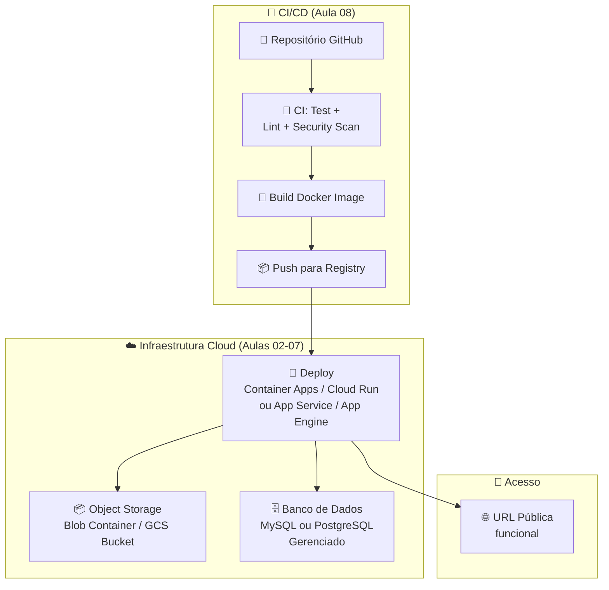
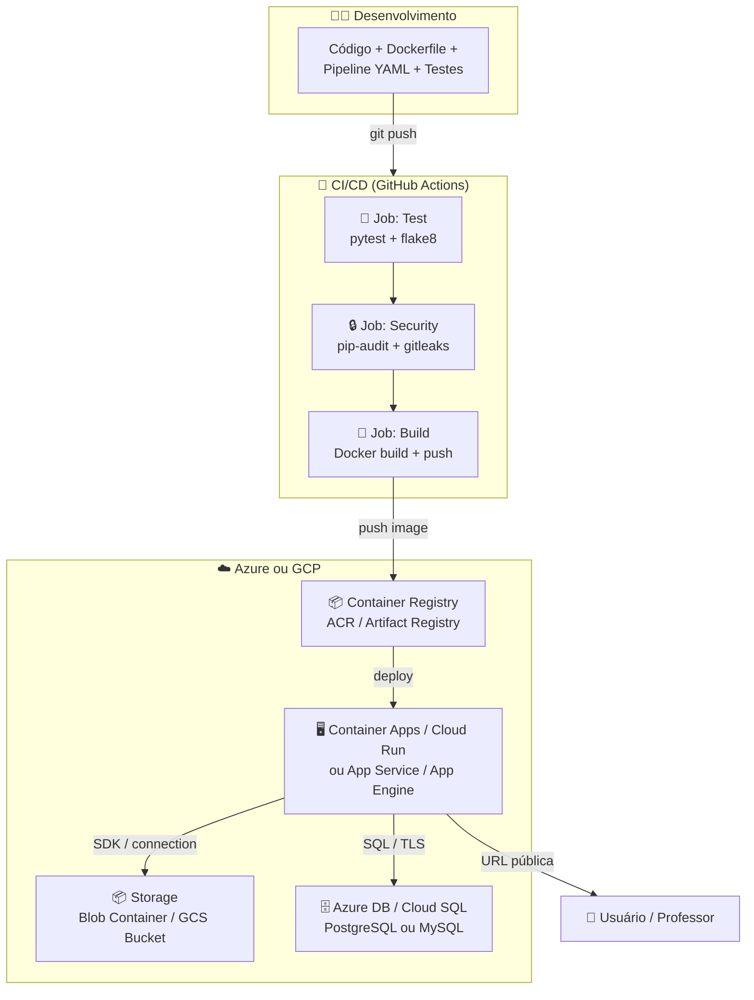

# Aula 09 — Avaliação Prática 1 (P1)

> **Disciplina:** Computação em Nuvem II (ISW035)  
> **Professor:** Ronan Adriel Zenatti — FATEC Jahu / Centro Paula Souza  
> **Semestre:** 1º/2026  
> **Avaliação:** P1 — Avaliação Prática (Individual)  
> **Duração:** Aula completa (4h)

---

## 1. Objetivo

Demonstrar **domínio prático** dos conteúdos abordados nas Aulas 01 a 08, implementando uma solução completa que integre múltiplas camadas de serviços em nuvem em um fluxo funcional e automatizado.

Esta avaliação exige que você, individualmente, construa e demonstre uma aplicação cloud-native que contemple: **armazenamento de objetos, banco de dados gerenciado, containerização, deploy em plataforma cloud e pipeline CI/CD com scanning de segurança**.

---

## 2. Escopo da Avaliação

### O que Será Avaliado

Você deve entregar uma **solução funcional** composta pelos seguintes componentes, todos integrados entre si:



### Componentes Obrigatórios

| # | Componente | Referência | O que Demonstrar |
|---|---|---|---|
| 1 | **Object Storage** | Aulas 02-03 | Container/bucket criado, acessível pela aplicação, com pelo menos uma operação (upload, listagem ou download) |
| 2 | **Banco de Dados Gerenciado** | Aula 04 | Instância MySQL ou PostgreSQL provisionada, tabela com dados, consulta funcional via aplicação |
| 3 | **Containerização** | Aula 06 | Dockerfile funcional, imagem publicada em registry cloud (ACR, Artifact Registry ou GHCR) |
| 4 | **Deploy em Cloud** | Aulas 05-06 | Aplicação acessível via URL pública (Container Apps, Cloud Run, App Service ou App Engine) |
| 5 | **CI/CD com Security** | Aula 08 | Pipeline GitHub Actions (ou equivalente) que execute: testes, scanning de segurança (ao menos 1 tipo) e build da imagem Docker |

---

## 3. Requisitos Técnicos

### 3.1 Plataforma

- **Nuvem:** Azure **ou** Google Cloud (apenas uma plataforma).
- **Linguagem:** Livre (recomendada a do projeto interdisciplinar).
- **Repositório:** GitHub (público ou com acesso ao professor).

### 3.2 Aplicação

A aplicação deve ser **funcional** — não precisa ser complexa, mas deve demonstrar integração real entre os serviços. O mínimo esperado:

- Ao menos **2 rotas/endpoints** que interajam com o storage e/ou banco.
- Ao menos **1 operação de escrita** (insert no banco ou upload no storage).
- Ao menos **1 operação de leitura** (select no banco ou listagem no storage).
- Endpoint `/health` retornando status da aplicação.

### 3.3 Pipeline CI/CD

O pipeline deve ser acionado por push no branch `main` e incluir, no mínimo:

- **Build e testes:** instalar dependências + executar ao menos 1 teste automatizado.
- **Security scanning:** ao menos 1 tipo de scan (dependências, secrets, container ou IaC).
- **Build de imagem Docker:** construir e publicar imagem em registry.
- O deploy automatizado é **desejável, mas não obrigatório** — se não for automático, documente o processo manual.

### 3.4 Documentação

O repositório deve conter um `README.md` com:

1. **Descrição** da solução e arquitetura (diagrama Mermaid ou imagem).
2. **Serviços utilizados** com configurações escolhidas.
3. **URL pública** da aplicação em funcionamento.
4. **Como executar localmente** (pré-requisitos, variáveis de ambiente, comandos).
5. **Explicação do pipeline CI/CD** — o que cada job/step faz.
6. **Evidências**: screenshots das execuções do pipeline (actions passando), da aplicação acessível e dos resultados do security scan.

---

## 4. Critérios de Avaliação

| Critério | Pontuação | Detalhamento |
|---|---|---|
| **Storage** | **0,5 pt** | Container/bucket funcional, integrado à aplicação, com operação de escrita e/ou leitura |
| **Banco de Dados** | **0,5 pt** | Instância gerenciada provisionada, tabela com dados, consulta funcional, conexão segura (sem senha exposta no código) |
| **Containerização + Deploy** | **1,0 pt** | Dockerfile funcional (0,25), imagem no registry (0,25), aplicação acessível via URL pública (0,25), endpoint `/health` (0,25) |
| **CI/CD + Security** | **0,5 pt** | Pipeline funcional no GitHub Actions (ou equivalente) com: testes (0,15), security scan (0,15), build de imagem (0,20) |
| **Documentação** | **0,5 pt** | README completo conforme seção 3.4: diagrama (0,10), URL funcional (0,10), instruções de execução (0,10), evidências do pipeline (0,10), explicação do pipeline (0,10) |
| **Total** | **3,0 pts** | — |

### Penalidades

| Infração | Penalidade |
|---|---|
| Credenciais (senhas, chaves, tokens) commitadas no repositório | **-0,5 pt** |
| Aplicação não acessível na URL informada no momento da avaliação | **-0,5 pt** |
| Pipeline CI/CD inexistente ou não funcional | Perda do critério correspondente (0,5 pt) |
| Plágio (repositórios com histórico idêntico ou código copiado) | **Nota zero** |

### Diferenciais (não obrigatórios, agregam à avaliação qualitativa)

- Deploy automatizado via pipeline (CD completo, não apenas CI).
- Múltiplos tipos de security scanning (dependências + container + secrets).
- Terraform/Bicep para provisionamento da infraestrutura (IaC — Aula 07).
- Estratégia de deploy avançada (canary, blue/green, traffic splitting).
- Testes de integração além dos unitários.
- Monitoramento ou logging configurado.

---

## 5. Estrutura Esperada do Repositório

```
cnuvem2-p1-seunome/
├── .github/
│   └── workflows/
│       └── ci-cd.yml              ← Pipeline CI/CD
├── src/                           ← Código-fonte da aplicação
│   ├── app.py                     ← (ou equivalente na linguagem escolhida)
│   ├── requirements.txt
│   └── ...
├── tests/                         ← Testes automatizados
│   └── test_app.py
├── infra/                         ← (Opcional) Terraform/Bicep
│   └── main.tf
├── sql/
│   └── schema.sql                 ← Script de criação da tabela
├── Dockerfile                     ← Definição do container
├── .dockerignore
├── .gitignore                     ← Inclui .env, .tfstate, __pycache__
├── .env.example                   ← Modelo de variáveis de ambiente
├── README.md                      ← Documentação completa
└── evidencias/                    ← Screenshots do pipeline e aplicação
    ├── pipeline-ci.png
    ├── security-scan.png
    ├── app-health.png
    └── app-storage.png
```

---

## 6. Checklist de Preparação

Use este checklist para verificar que sua entrega está completa antes de submeter:

### Infraestrutura
- [ ] Storage (container/bucket) criado e funcional
- [ ] Banco de dados gerenciado provisionado com tabela e dados
- [ ] Firewall/authorized networks configurados para a aplicação (não 0.0.0.0/0 em produção)
- [ ] Credenciais armazenadas em variáveis de ambiente / secrets (não no código)

### Aplicação
- [ ] Dockerfile funcional, build sem erros
- [ ] Imagem publicada no registry (ACR, Artifact Registry ou GHCR)
- [ ] Aplicação deployada e acessível via URL pública
- [ ] Endpoint `/health` retornando HTTP 200
- [ ] Ao menos 1 endpoint que interage com o storage
- [ ] Ao menos 1 endpoint que interage com o banco de dados

### Pipeline CI/CD
- [ ] Arquivo `.github/workflows/ci-cd.yml` (ou equivalente) funcional
- [ ] Job de testes executando e passando
- [ ] Ao menos 1 tipo de security scanning configurado
- [ ] Build de imagem Docker no pipeline
- [ ] Pipeline executa corretamente no último push para main

### Documentação
- [ ] README.md com diagrama de arquitetura
- [ ] README.md com URL pública da aplicação
- [ ] README.md com instruções de execução local
- [ ] README.md com explicação do pipeline
- [ ] `.env.example` com todas as variáveis necessárias (sem valores reais)
- [ ] `sql/schema.sql` com script de criação da tabela
- [ ] Evidências (screenshots) na pasta `evidencias/`
- [ ] Nenhuma credencial ou secret commitado no repositório

---

## 7. Mapa de Referência — De que Aula Vem Cada Componente

| Componente | Aula de Referência | Conceitos-Chave |
|---|---|---|
| Object Storage | [Aula 02](./Aula_02-Armazenamento_de_Dados_Objetos.md) | Blob/Bucket, classes, lifecycle, SAS/Signed URL |
| Backups e SDKs | [Aula 03](./Aula_03-Armazenamento_de_Dados_Avancado.md) | Soft delete, versionamento, SDK Python |
| Banco de Dados | [Aula 04](./Aula_04-Bancos_de_Dados_Gerenciados.md) | Cloud SQL / Azure DB, firewall, connection strings |
| PaaS (alternativa ao container) | [Aula 05](./Aula_05-Plataformas_de_Aplicacao_PaaS.md) | App Service / App Engine, deploy, env vars |
| Docker e Container Serverless | [Aula 06](./Aula_06-Containerizacao_e_Orquestracao_na_Nuvem.md) | Dockerfile, ACR/Artifact Registry, Container Apps/Cloud Run |
| IaC (diferencial) | [Aula 07](./Aula_07-Infraestrutura_como_Codigo_IaC.md) | Terraform, init/plan/apply, state |
| CI/CD e DevSecOps | [Aula 08](./Aula_08-CICD_na_Nuvem.md) | GitHub Actions, security scanning, pipeline YAML |

---

## 8. Dicas Finais

### Sobre Custos
- Use **tiers gratuitos** (Free/Burstable para bancos, scale-to-zero para containers).
- **Destrua recursos** que não precisa mais — especialmente clusters Kubernetes.
- Configure **alertas de orçamento** em ambas as plataformas.

### Sobre o Pipeline
- Comece simples: um job que roda `pytest` já é um CI válido. Depois adicione scanning e build.
- Se o deploy automático estiver dando problemas, **documente o deploy manual** e foque nos outros critérios.
- Commits frequentes e descritivos no Git demonstram progresso — não faça um único commit gigante.

### Sobre a Apresentação
- A aplicação deve estar **funcional e acessível** no momento da avaliação.
- Se a URL cair antes da avaliação, tenha os screenshots como evidência e esteja preparado para re-deployar durante a aula.
- O professor poderá fazer perguntas sobre qualquer componente — entenda o que você construiu.

---

## 9. Entrega

| Item | Detalhes |
|---|---|
| **Formato** | Link do repositório GitHub |
| **Prazo** | Até o início da aula de avaliação (conforme calendário) |
| **Individual** | Cada aluno deve ter repositório e infraestrutura próprios |
| **Presencial** | A avaliação é presencial — esteja preparado para demonstrar e responder perguntas |

---

## 10. Diagrama de Arquitetura — Exemplo de Referência

O diagrama abaixo ilustra uma solução completa que atende todos os critérios. Sua implementação não precisa ser idêntica, mas deve cobrir os mesmos componentes.



---

> **Aula Anterior:** [Aula 08 — CI/CD na Nuvem](./Aula_08-CICD_na_Nuvem.md)  
> **Próxima Aula:** [Aula 10 — Monitoramento: Nativo vs Open Source](./Aula_10-Monitoramento_Nativo_vs_Open_Source.md)
