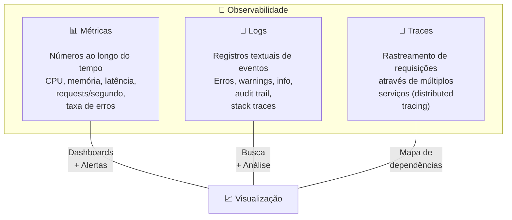
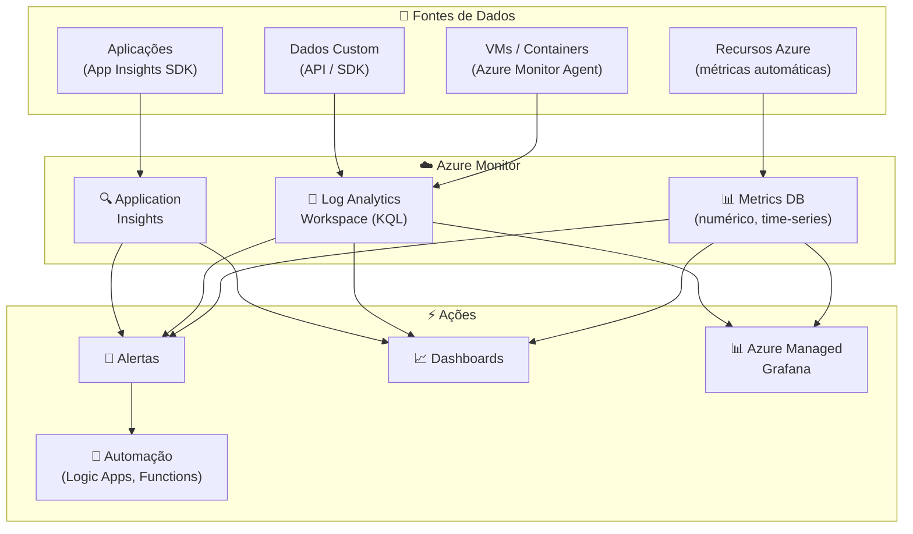
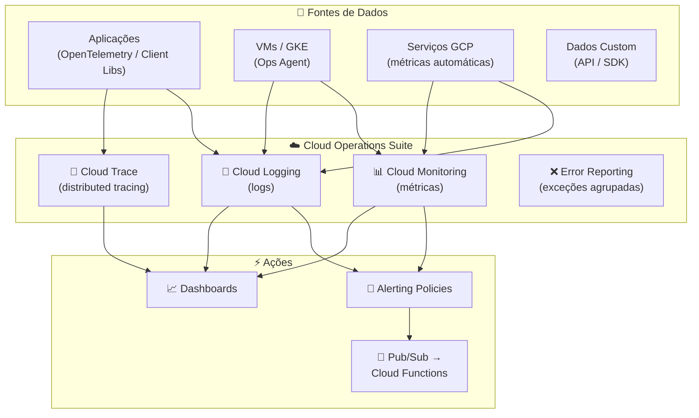
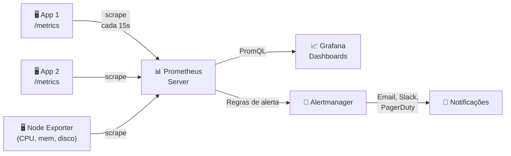
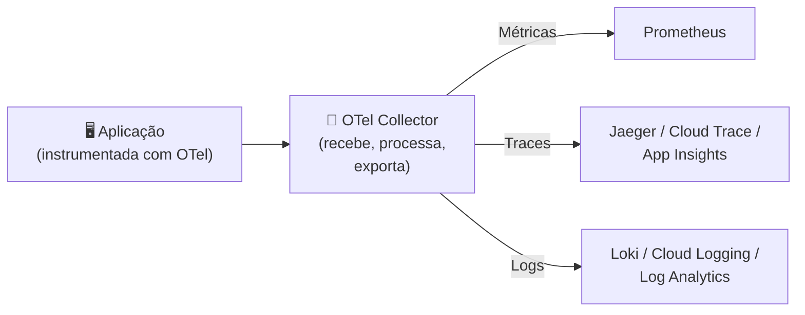
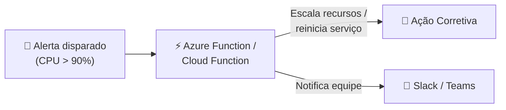
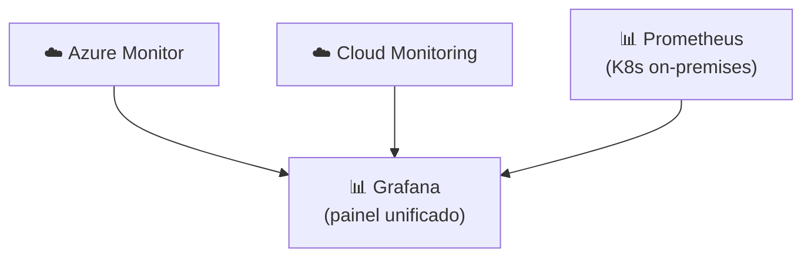

# Aula 10 — Monitoramento: Nativo vs Open Source

> **Disciplina:** Computação em Nuvem II (ISW035)  
> **Professor:** Ronan Adriel Zenatti — FATEC Jahu / Centro Paula Souza  
> **Semestre:** 1º/2026  
> **Carga Horária:** 4h práticas

---

## 1. Visão Geral e Contextualização

Após a avaliação prática (Aula 09), iniciamos o bloco de **Operações**. Provisionar infraestrutura e fazer deploy é apenas metade do trabalho — a outra metade é garantir que tudo **continue funcionando** corretamente. Monitoramento é o olho que nunca pisca: coleta métricas de saúde, centraliza logs, detecta anomalias e dispara alertas antes que os usuários percebam problemas.

### Os Três Pilares da Observabilidade



| Pilar | Pergunta que Responde | Exemplo |
|---|---|---|
| **Métricas** | "Como está o sistema agora?" | CPU a 85%, latência P95 = 320ms, 42 req/s |
| **Logs** | "O que aconteceu?" | `ERROR 2026-03-10 14:23:01 - Connection refused to pg-cnuvem2:5432` |
| **Traces** | "Onde está o gargalo?" | Request levou 1.2s: 50ms no API gateway, 150ms na app, 1000ms no banco |

### Mapa de Equivalência — Monitoramento

| Conceito | Azure | GCP | Open Source |
|---|---|---|---|
| Plataforma central | Azure Monitor | Cloud Operations Suite | Prometheus + Grafana |
| Métricas | Azure Metrics | Cloud Monitoring | Prometheus |
| Logs | Log Analytics (KQL) | Cloud Logging | Loki / ELK Stack |
| Traces | Application Insights | Cloud Trace | Jaeger / Zipkin |
| Dashboards | Azure Dashboards / Workbooks | Cloud Monitoring Dashboards | Grafana |
| Alertas | Azure Alerts / Action Groups | Alerting Policies / Notification Channels | Alertmanager (Prometheus) |
| APM (Application Performance) | Application Insights | Cloud Trace + Error Reporting | OpenTelemetry + Jaeger |
| Linguagem de query | KQL (Kusto Query Language) | Logging Query Language + MQL | PromQL (Prometheus) |

---

## 2. Monitoramento Nativo — Azure Monitor

### 2.1 Arquitetura do Azure Monitor

O **Azure Monitor** é a plataforma unificada de observabilidade do Azure. Ele coleta automaticamente métricas de todos os recursos Azure e oferece integração profunda com Log Analytics (para logs), Application Insights (para APM) e Azure Dashboards (para visualização).



### 2.2 Application Insights — APM para Aplicações

O **Application Insights** é o componente de APM (Application Performance Monitoring) do Azure Monitor. Ele coleta telemetria detalhada da aplicação: requests, dependências, exceções, traces e métricas de performance customizadas.

**Habilitando Application Insights para Python/Flask:**

```python
# Instalar: pip install opencensus-ext-azure opencensus-ext-flask
from opencensus.ext.azure.trace_exporter import AzureExporter
from opencensus.ext.flask.flask_middleware import FlaskMiddleware
from opencensus.trace.samplers import ProbabilitySampler
from flask import Flask
import os

app = Flask(__name__)

# Configurar Application Insights
FlaskMiddleware(
    app,
    exporter=AzureExporter(
        connection_string=os.environ.get("APPLICATIONINSIGHTS_CONNECTION_STRING")
    ),
    sampler=ProbabilitySampler(rate=1.0)  # 100% de sampling (dev)
)

@app.route("/")
def index():
    return {"status": "ok"}
```

### 2.3 Configurando Alertas no Azure

```bash
# Criar Action Group (quem é notificado)
az monitor action-group create \
    --resource-group rg-cnuvem2 \
    --name ag-cnuvem2-email \
    --short-name agcnuvem2 \
    --action email admin admin@fatecjahu.edu.br

# Criar alerta: CPU > 80% por 5 minutos
az monitor metrics alert create \
    --resource-group rg-cnuvem2 \
    --name "alert-cpu-high" \
    --scopes "/subscriptions/.../resourceGroups/rg-cnuvem2/providers/..." \
    --condition "avg Percentage CPU > 80" \
    --window-size 5m \
    --evaluation-frequency 1m \
    --action ag-cnuvem2-email \
    --severity 2 \
    --description "CPU acima de 80% por 5 minutos"
```

### 2.4 KQL — Kusto Query Language

O KQL é a linguagem de consulta do Log Analytics. É poderosa, parecida com SQL, e permite filtrar, agregar e visualizar dados de logs.

```kql
// Requisições com erro nos últimos 30 minutos
requests
| where timestamp > ago(30m)
| where success == false
| summarize errorCount = count() by operation_Name, resultCode
| order by errorCount desc

// Latência P95 por endpoint na última hora
requests
| where timestamp > ago(1h)
| summarize p95_duration = percentile(duration, 95) by operation_Name
| order by p95_duration desc

// Exceções mais frequentes hoje
exceptions
| where timestamp > ago(1d)
| summarize count() by type, outerMessage
| order by count_ desc
| take 10
```

---

## 3. Monitoramento Nativo — Google Cloud Operations Suite

### 3.1 Arquitetura do Cloud Operations

A **Cloud Operations Suite** (anteriormente Stackdriver) é o conjunto de serviços de observabilidade do GCP, composta por serviços separados mas integrados entre si.



### 3.2 Cloud Logging — Centralização de Logs

O **Cloud Logging** coleta logs automaticamente de todos os serviços GCP (Cloud Run, GKE, Cloud SQL, App Engine, etc.) e permite busca, filtragem e análise com uma linguagem de query própria.

**Exemplos de queries no Cloud Logging:**

```
# Erros da aplicação Cloud Run nas últimas 2 horas
resource.type="cloud_run_revision"
resource.labels.service_name="cnuvem2-app"
severity>=ERROR
timestamp>="2026-03-10T12:00:00Z"

# Logs de conexão recusada no Cloud SQL
resource.type="cloudsql_database"
textPayload:"connection refused"

# Requests lentas (> 1 segundo) no App Engine
resource.type="gae_app"
httpRequest.latency>"1s"
```

**Exportando logs para BigQuery (análise avançada):**

```bash
# Criar sink para enviar logs para BigQuery
gcloud logging sinks create logs-to-bigquery \
    bigquery.googleapis.com/projects/PROJECT_ID/datasets/app_logs \
    --log-filter='resource.type="cloud_run_revision" severity>=WARNING'
```

### 3.3 Configurando Alertas no GCP

```bash
# Criar canal de notificação (email)
gcloud beta monitoring channels create \
    --display-name="Email Admin" \
    --type=email \
    --channel-labels=email_address=admin@fatecjahu.edu.br

# Criar política de alerta via Console ou Terraform
# (a CLI para alertas é limitada; recomenda-se Console ou Terraform)
```

**Via Terraform (recomendado):**

```hcl
resource "google_monitoring_alert_policy" "cpu_high" {
  display_name = "CPU > 80% por 5 minutos"
  combiner     = "OR"

  conditions {
    display_name = "CPU alta"
    condition_threshold {
      filter          = "resource.type=\"cloud_run_revision\" AND metric.type=\"run.googleapis.com/container/cpu/utilizations\""
      comparison      = "COMPARISON_GT"
      threshold_value = 0.8
      duration        = "300s"  # 5 minutos
      aggregations {
        alignment_period   = "60s"
        per_series_aligner = "ALIGN_MEAN"
      }
    }
  }

  notification_channels = [google_monitoring_notification_channel.email.id]
}
```

---

## 4. Monitoramento Open Source — Prometheus + Grafana

### 4.1 Por que Open Source?

| Aspecto | Nativo (Azure Monitor / Cloud Ops) | Open Source (Prometheus + Grafana) |
|---|---|---|
| **Vendor lock-in** | ⚠️ Alto (acoplado ao provedor) | ✅ Zero (roda em qualquer lugar) |
| **Setup** | ✅ Automático (pré-integrado) | ⚠️ Manual (instalar, configurar, manter) |
| **Custo** | 💰 Por volume de dados ingeridos | 💰 Infra própria (VMs/containers) + tempo de operação |
| **Customização** | ⚠️ Limitada ao que o provedor oferece | ✅ Total (dashboards, alertas, exporters) |
| **Multi-cloud** | ❌ Específico de um provedor | ✅ Monitora Azure, GCP, AWS, on-premises |
| **Comunidade** | Documentação do provedor | 🌍 Enorme comunidade + milhares de exporters |
| **Escalabilidade** | ✅ Gerenciada automaticamente | ⚠️ Requer planejamento (Thanos, Cortex para escala) |

### 4.2 Prometheus — Coleta de Métricas

O **Prometheus** é o padrão de facto para coleta de métricas em ambientes cloud-native e Kubernetes. Ele usa um modelo de **pull** — o Prometheus "raspa" (scrapes) endpoints `/metrics` dos serviços a intervalos regulares.



**Expondo métricas em Flask (Python):**

```python
# pip install prometheus-flask-instrumentator
from prometheus_flask_instrumentator import Instrumentator
from flask import Flask

app = Flask(__name__)

# Habilitar métricas automáticas no endpoint /metrics
Instrumentator().instrument(app).expose(app)

@app.route("/")
def index():
    return {"status": "ok"}

# Acesse http://localhost:8080/metrics para ver as métricas no formato Prometheus
```

**Exemplo de saída do endpoint `/metrics`:**

```
# HELP http_requests_total Total HTTP requests
# TYPE http_requests_total counter
http_requests_total{method="GET",endpoint="/",status="200"} 1523
http_requests_total{method="GET",endpoint="/health",status="200"} 8742
http_requests_total{method="POST",endpoint="/api/upload",status="201"} 89
http_requests_total{method="POST",endpoint="/api/upload",status="500"} 3

# HELP http_request_duration_seconds HTTP request duration
# TYPE http_request_duration_seconds histogram
http_request_duration_seconds_bucket{endpoint="/",le="0.1"} 1500
http_request_duration_seconds_bucket{endpoint="/",le="0.5"} 1520
http_request_duration_seconds_bucket{endpoint="/",le="1.0"} 1523
```

### 4.3 Grafana — Visualização Universal

O **Grafana** é a plataforma de visualização mais popular do ecossistema open source. Ele se conecta a múltiplas fontes de dados — Prometheus, Loki, Elasticsearch, Azure Monitor, Cloud Monitoring, InfluxDB e dezenas mais — unificando tudo em dashboards interativos.

> **Azure Managed Grafana** e **GCP Cloud Monitoring com Grafana** são serviços gerenciados que oferecem Grafana como serviço, pré-integrados com os dados nativos de cada plataforma. Isso combina o melhor dos dois mundos: dados nativos + visualização open source.

### 4.4 PromQL — Exemplos de Queries

```promql
# Taxa de requisições por segundo nos últimos 5 minutos
rate(http_requests_total[5m])

# Latência P95 nos últimos 10 minutos
histogram_quantile(0.95, rate(http_request_duration_seconds_bucket[10m]))

# Taxa de erros (% de status 5xx)
sum(rate(http_requests_total{status=~"5.."}[5m]))
/
sum(rate(http_requests_total[5m])) * 100

# Uso de CPU por container (em Kubernetes)
rate(container_cpu_usage_seconds_total{namespace="cnuvem2"}[5m])

# Memória utilizada por pod
container_memory_working_set_bytes{namespace="cnuvem2"} / 1024 / 1024
```

---

## 5. OpenTelemetry — O Padrão Unificado

O **OpenTelemetry (OTel)** é um projeto open source da CNCF (Cloud Native Computing Foundation) que padroniza a coleta de métricas, logs e traces. Ele é **agnóstico de backend** — o mesmo código de instrumentação envia dados para Prometheus, Jaeger, Azure Monitor, Cloud Trace ou qualquer outro backend compatível.



> **Recomendação para projetos novos:** Use OpenTelemetry como camada de instrumentação desde o início. Assim, se você precisar trocar de backend (por exemplo, de Azure Monitor para Grafana Cloud), basta mudar a configuração do exporter — o código da aplicação não muda.

---

## 6. Comparativo Detalhado — Nativo vs. Open Source

| Aspecto | Azure Monitor + App Insights | GCP Cloud Operations | Prometheus + Grafana |
|---|---|---|---|
| **Setup inicial** | Minutos (auto-instrumentação) | Minutos (automático para serviços GCP) | Horas (instalar, configurar, deploy) |
| **Custo para 10 GB logs/mês** | ~$23 (Log Analytics) | ~$5 (Cloud Logging) | $0 (software) + custo da infra |
| **Custo para 100 GB logs/mês** | ~$230 | ~$50 | $0 + custo da infra (~$50-100/mês) |
| **Retenção padrão** | 30 dias (Logs) / 90 dias (App Insights) | 30 dias (Logging) / 24 meses (Monitoring) | Ilimitada (limitada por disco) |
| **Query language** | KQL (Kusto) | Logging QL + MQL | PromQL |
| **Alertas** | Alert Rules + Action Groups | Alerting Policies + Notification Channels | Alertmanager |
| **Dashboards** | Azure Dashboards, Workbooks | Cloud Monitoring Dashboards | Grafana (mais flexível) |
| **Multi-cloud** | ❌ (Azure-centric) | ❌ (GCP-centric) | ✅ (qualquer fonte) |
| **Container/K8s monitoring** | Container Insights (AKS) | GKE Monitoring Dashboard | kube-prometheus-stack (Helm) |
| **APM** | Application Insights | Cloud Trace + Error Reporting | Jaeger + OpenTelemetry |
| **Manutenção** | Zero (gerenciado) | Zero (gerenciado) | Alta (upgrades, storage, HA) |
| **Vendor lock-in** | Alto | Alto | Zero |

---

## 7. Exemplos Práticos de Monitoramento

**Exemplo 1 — Dashboard de saúde para Container Apps / Cloud Run:** Configurar um dashboard que mostre em tempo real: total de requisições por minuto, latência P50/P95/P99, taxa de erros (4xx e 5xx), uso de CPU e memória por revisão, e contagem de instâncias ativas. No Azure, usando Azure Dashboards com métricas do Container Apps. No GCP, usando Cloud Monitoring Dashboard com métricas do Cloud Run. Alternativa: Azure Managed Grafana ou Grafana OSS conectando-se a ambos os backends.

**Exemplo 2 — Alerta de indisponibilidade do banco de dados:** Criar um alerta que dispara quando a conexão ao banco falha por mais de 2 minutos consecutivos. No Azure, usar métricas de "Connection Failed" do Azure Database com Action Group que envia email + webhook para Slack. No GCP, usar Log-based Metric do Cloud Logging filtrando `severity=ERROR AND textPayload:"connection"` com Alerting Policy que notifica via email.

**Exemplo 3 — Análise post-mortem de incidente:** Após um incidente de lentidão, usar Application Insights (Azure) ou Cloud Trace (GCP) para identificar que o gargalo estava em queries SQL sem índice. O distributed trace mostra: request → app (50ms) → SQL query (4500ms) → response. Com essa informação, cria-se o índice, a latência cai de 4.5s para 80ms, e configura-se um alerta para latência P95 > 500ms para prevenir recorrências.

---

## 8. Cenários de Integração

### Cenário 1 — Monitoramento + CI/CD (Aulas 08 + 10)

> O pipeline CI/CD faz deploy de uma nova versão e automaticamente verifica os dashboards de monitoramento. Se a taxa de erros aumentar nos primeiros 5 minutos, o deploy é automaticamente revertido (canary rollback baseado em métricas).

### Cenário 2 — Monitoramento + Alertas + Serverless (Aulas 10 + 14)



### Cenário 3 — Observabilidade Multi-Cloud com Grafana



---

## 9. Resumo Comparativo Final

| Aspecto | Azure Monitor | GCP Cloud Operations | Prometheus + Grafana |
|---|---|---|---|
| **Melhor para** | Workloads Azure, enterprise, APM | Workloads GCP, GKE, logging barato | Multi-cloud, K8s, controle total |
| **Custo** | Alto para grandes volumes | Moderado | Baixo (custo é operação) |
| **Setup** | Automático | Automático | Manual |
| **Lock-in** | Alto | Alto | Zero |
| **Manutenção** | Zero | Zero | Alta |
| **Ecossistema** | Azure-centric | GCP-centric | Universal |
| **Recomendação** | Usar para o provedor principal | Usar para o provedor principal | Adicionar para visão multi-cloud |

---

## 10. Exercícios Propostos

1. **Exercício Métricas Nativas:** Acesse o portal Azure ou Cloud Console e explore as métricas automáticas do recurso que você provisionou na P1 (Container Apps / Cloud Run / App Service). Identifique: total de requests, latência média e taxa de erros. Capture um screenshot do gráfico.

2. **Exercício Logs:** Execute uma query nos logs para encontrar erros recentes da sua aplicação. No Azure, use KQL no Log Analytics. No GCP, use o Logs Explorer com filtro de severity. Documente a query e o resultado.

3. **Exercício Alertas:** Crie um alerta que notifique por email quando a latência P95 da sua aplicação ultrapassar 1 segundo por mais de 3 minutos. Teste disparando requests lentas.

4. **Exercício Prometheus (bônus):** Adicione o endpoint `/metrics` à sua aplicação Flask/Express usando a biblioteca apropriada. Execute localmente com Docker e visualize as métricas no formato Prometheus.

---

## 11. Referências

**Azure:**
- [Azure Monitor — Visão Geral](https://learn.microsoft.com/azure/azure-monitor/overview)
- [Application Insights — Python](https://learn.microsoft.com/azure/azure-monitor/app/opencensus-python)
- [KQL Quick Reference](https://learn.microsoft.com/azure/data-explorer/kql-quick-reference)

**GCP:**
- [Cloud Monitoring — Documentação](https://cloud.google.com/monitoring/docs)
- [Cloud Logging — Documentação](https://cloud.google.com/logging/docs)
- [Cloud Trace — Documentação](https://cloud.google.com/trace/docs)

**Open Source:**
- [Prometheus — Documentação](https://prometheus.io/docs/)
- [Grafana — Documentação](https://grafana.com/docs/)
- [OpenTelemetry — Getting Started](https://opentelemetry.io/docs/)

---

> **Aula Anterior:** [Aula 09 — Avaliação Prática 1](./Aula_09-Avaliacao_Pratica_1.md)  
> **Próxima Aula:** [Aula 11 — Segurança, Identidade e DevSecOps](./Aula_11-Seguranca_Identidade_e_DevSecOps.md)
