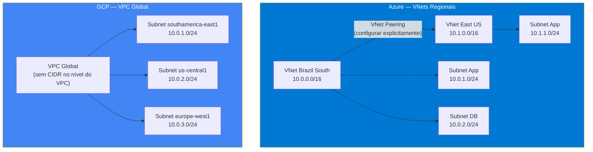
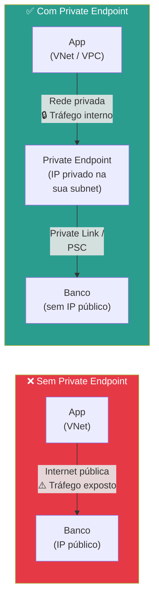
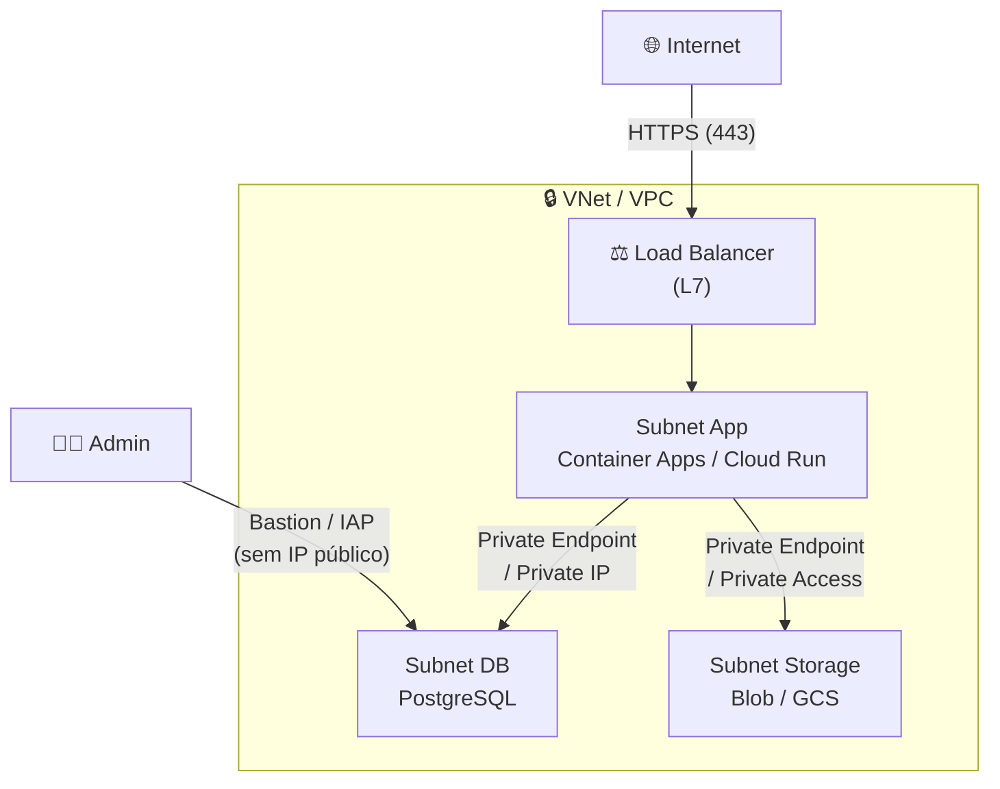
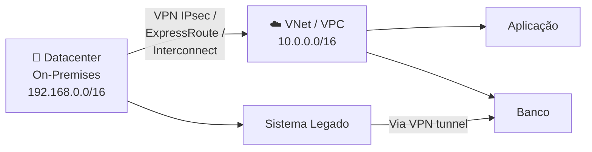

# Aula 12 — Redes Virtuais e Conectividade

> **Disciplina:** Computação em Nuvem II (ISW035)  
> **Professor:** Ronan Adriel Zenatti — FATEC Jahu / Centro Paula Souza  
> **Semestre:** 1º/2026  
> **Carga Horária:** 4h práticas

---

## 1. Visão Geral e Contextualização

Até agora, usamos recursos de rede implicitamente: quando criamos uma VM, um banco de dados ou um container, a nuvem configurou a rede "por baixo dos panos". Nesta aula, tornamos explícito o que estava implícito: entendemos como as **redes virtuais** funcionam, como controlar o tráfego com **regras de firewall**, e como conectar serviços de forma segura via **endpoints privados**, eliminando exposição à internet pública.

### Por que Redes Importam?

Toda comunicação entre serviços passa pela rede. Se a rede estiver mal configurada, seus dados podem ser expostos à internet, sua aplicação pode ser inacessível, ou o desempenho pode degradar. A rede é a **base invisível** que sustenta tudo — storage, bancos, containers, funções serverless.

### Mapa de Equivalência — Networking

| Conceito | Azure | GCP |
|---|---|---|
| Rede virtual | VNet (Virtual Network) | VPC (Virtual Private Cloud) |
| Sub-rede | Subnet (regional, dentro de 1 VNet) | Subnet (regional, dentro do VPC global) |
| Escopo da rede | **Regional** (1 VNet = 1 região) | **Global** (1 VPC = todas as regiões) |
| Firewall de sub-rede | Network Security Group (NSG) | VPC Firewall Rules |
| Firewall gerenciado (L7) | Azure Firewall | Cloud Firewall / Cloud Armor |
| Acesso privado a serviços | Private Endpoint (Private Link) | Private Service Connect / Private Google Access |
| Service Endpoint | Service Endpoints | N/A (usa Private Google Access) |
| Peering entre redes | VNet Peering | VPC Network Peering |
| Conectividade híbrida (VPN) | VPN Gateway | Cloud VPN (HA VPN) |
| Conectividade dedicada | ExpressRoute | Cloud Interconnect |
| NAT de saída | NAT Gateway | Cloud NAT |
| Load Balancer L4 | Azure Load Balancer | Network Load Balancer |
| Load Balancer L7 | Application Gateway / Front Door | HTTP(S) Load Balancer |
| Bastion (acesso SSH seguro) | Azure Bastion | Identity-Aware Proxy (IAP) |

---

## 2. Redes Virtuais — Conceitos Fundamentais

### 2.1 Azure VNet vs. GCP VPC — Diferença Arquitetural

A diferença mais fundamental entre as duas plataformas está no **escopo** da rede virtual:



| Aspecto | Azure VNet | GCP VPC |
|---|---|---|
| **Escopo** | Regional (1 VNet = 1 região) | Global (1 VPC = todas as regiões) |
| **CIDR** | Definido no VNet (ex.: 10.0.0.0/16) | Definido por subnet (VPC não tem CIDR) |
| **Comunicação entre regiões** | Requer VNet Peering explícito | Automática (subnets no mesmo VPC já se comunicam) |
| **Tipo de subnet** | Sem distinção explícita (público/privado via NSG) | Sem distinção (controle via Firewall Rules) |
| **IP de VMs** | NIC separada como recurso; Public IP como recurso separado | IP interno automático; External IP opcional |
| **Modo de criação** | Manual (definir CIDR, subnets) | Auto (subnets em todas as regiões) ou Custom |

> **Implicação prática:** No GCP, se você criar uma VM em `southamerica-east1` e outra em `us-central1`, ambas no mesmo VPC, elas já se comunicam nativamente via rede interna. No Azure, VMs em regiões diferentes precisam estar em VNets diferentes, conectadas por VNet Peering.

### 2.2 Criação de Redes Virtuais

**Azure — Criar VNet com subnets:**

```bash
# Criar VNet com address space
az network vnet create \
    --resource-group rg-cnuvem2 \
    --name vnet-cnuvem2 \
    --location brazilsouth \
    --address-prefix 10.0.0.0/16

# Criar subnet para aplicações
az network vnet subnet create \
    --resource-group rg-cnuvem2 \
    --vnet-name vnet-cnuvem2 \
    --name subnet-app \
    --address-prefix 10.0.1.0/24

# Criar subnet para banco de dados
az network vnet subnet create \
    --resource-group rg-cnuvem2 \
    --vnet-name vnet-cnuvem2 \
    --name subnet-db \
    --address-prefix 10.0.2.0/24
```

**GCP — Criar VPC com subnets customizadas:**

```bash
# Criar VPC no modo custom (sem subnets automáticas)
gcloud compute networks create vpc-cnuvem2 \
    --subnet-mode=custom

# Criar subnet na região de São Paulo
gcloud compute networks subnets create subnet-app-br \
    --network=vpc-cnuvem2 \
    --region=southamerica-east1 \
    --range=10.0.1.0/24

# Criar subnet nos EUA
gcloud compute networks subnets create subnet-app-us \
    --network=vpc-cnuvem2 \
    --region=us-central1 \
    --range=10.0.2.0/24

# Habilitar Private Google Access (acesso a APIs sem IP público)
gcloud compute networks subnets update subnet-app-br \
    --region=southamerica-east1 \
    --enable-private-google-access
```

---

## 3. Firewalls e Regras de Segurança de Rede

### 3.1 Azure — Network Security Groups (NSG)

Os **NSGs** são o firewall de nível de subnet/NIC no Azure. Cada NSG contém regras de entrada (inbound) e saída (outbound) que permitem ou negam tráfego com base em: IP de origem/destino, porta, protocolo e prioridade.

```bash
# Criar NSG
az network nsg create \
    --resource-group rg-cnuvem2 \
    --name nsg-app

# Regra: permitir HTTP (porta 80) de qualquer origem
az network nsg rule create \
    --resource-group rg-cnuvem2 \
    --nsg-name nsg-app \
    --name AllowHTTP \
    --priority 100 \
    --direction Inbound \
    --access Allow \
    --protocol Tcp \
    --destination-port-ranges 80

# Regra: permitir HTTPS (porta 443)
az network nsg rule create \
    --resource-group rg-cnuvem2 \
    --nsg-name nsg-app \
    --name AllowHTTPS \
    --priority 110 \
    --direction Inbound \
    --access Allow \
    --protocol Tcp \
    --destination-port-ranges 443

# Regra: negar todo o resto (já é padrão, mas explícito para clareza)
az network nsg rule create \
    --resource-group rg-cnuvem2 \
    --nsg-name nsg-app \
    --name DenyAllInbound \
    --priority 4096 \
    --direction Inbound \
    --access Deny \
    --protocol '*' \
    --destination-port-ranges '*'

# Associar NSG à subnet
az network vnet subnet update \
    --resource-group rg-cnuvem2 \
    --vnet-name vnet-cnuvem2 \
    --name subnet-app \
    --network-security-group nsg-app
```

### 3.2 GCP — VPC Firewall Rules

No GCP, as regras de firewall são aplicadas no nível do **VPC** (não por subnet), com filtragem baseada em tags de rede, service accounts ou CIDR ranges.

```bash
# Regra: permitir HTTP/HTTPS para instâncias com tag "web"
gcloud compute firewall-rules create allow-http-https \
    --network=vpc-cnuvem2 \
    --allow=tcp:80,tcp:443 \
    --target-tags=web \
    --source-ranges=0.0.0.0/0 \
    --description="Permitir HTTP e HTTPS para servidores web"

# Regra: permitir SSH apenas de IP específico
gcloud compute firewall-rules create allow-ssh-admin \
    --network=vpc-cnuvem2 \
    --allow=tcp:22 \
    --target-tags=ssh-allowed \
    --source-ranges=203.0.113.50/32 \
    --description="SSH apenas do IP do admin"

# Regra: permitir comunicação interna entre todas as instâncias
gcloud compute firewall-rules create allow-internal \
    --network=vpc-cnuvem2 \
    --allow=tcp,udp,icmp \
    --source-ranges=10.0.0.0/16 \
    --description="Comunicação interna livre dentro do VPC"

# Regra: negar todo tráfego de entrada (prioridade baixa, já é padrão implícito)
gcloud compute firewall-rules create deny-all-ingress \
    --network=vpc-cnuvem2 \
    --action=DENY \
    --rules=all \
    --direction=INGRESS \
    --priority=65534 \
    --source-ranges=0.0.0.0/0
```

### 3.3 Comparativo — Firewall

| Aspecto | Azure NSG | GCP Firewall Rules |
|---|---|---|
| **Escopo** | Subnet ou NIC (network interface) | VPC (global, aplicado via tags ou SA) |
| **Direção** | Inbound + Outbound (separados) | Ingress + Egress (separados) |
| **Target** | Subnet, NIC ou Application Security Group | Tags de rede, Service Accounts ou CIDR |
| **Prioridade** | 100-4096 (menor = mais prioritário) | 0-65535 (menor = mais prioritário) |
| **Padrão Ingress** | Deny all (exceto VNet interno e LB) | Deny all (exceto regras implícitas) |
| **Padrão Egress** | Allow all | Allow all |
| **Stateful** | Sim (resposta automática permitida) | Sim |
| **Logging** | NSG Flow Logs | VPC Flow Logs |

---

## 4. Endpoints Privados — Eliminando Exposição Pública

Em produção, o banco de dados e o storage **não devem** ter IP público. O acesso deve ocorrer exclusivamente pela rede virtual privada, usando endpoints privados. Isso garante que o tráfego nunca saia da rede do provedor.

### 4.1 Conceito



### 4.2 Azure — Private Endpoints

```bash
# Criar Private Endpoint para PostgreSQL
az network private-endpoint create \
    --resource-group rg-cnuvem2 \
    --name pe-postgres \
    --vnet-name vnet-cnuvem2 \
    --subnet subnet-db \
    --private-connection-resource-id $(az postgres flexible-server show \
        --resource-group rg-cnuvem2 \
        --name pg-cnuvem2-2026 \
        --query id -o tsv) \
    --group-id postgresqlServer \
    --connection-name pe-pg-connection

# Desabilitar acesso público no banco
az postgres flexible-server update \
    --resource-group rg-cnuvem2 \
    --name pg-cnuvem2-2026 \
    --public-access Disabled
```

### 4.3 GCP — Private IP e Private Service Connect

```bash
# Alocar range de IP para Private Services
gcloud compute addresses create google-managed-services-range \
    --global \
    --purpose=VPC_PEERING \
    --prefix-length=16 \
    --network=vpc-cnuvem2

# Criar conexão privada
gcloud services vpc-peerings connect \
    --service=servicenetworking.googleapis.com \
    --ranges=google-managed-services-range \
    --network=vpc-cnuvem2

# Configurar Cloud SQL para usar apenas IP privado
gcloud sql instances patch pg-cnuvem2-2026 \
    --network=vpc-cnuvem2 \
    --no-assign-ip  # Remove IP público
```

### 4.4 Exemplos Práticos — Endpoints Privados

**Exemplo 1 — Aplicação web com banco privado:** O Container Apps / Cloud Run conecta-se ao PostgreSQL exclusivamente via rede privada. No Azure, usa-se VNet Integration no Container Apps + Private Endpoint no banco. No GCP, usa-se VPC connector no Cloud Run + Cloud SQL com Private IP. O banco não tem IP público, eliminando vetores de ataque.

**Exemplo 2 — Storage sem acesso público:** Desabilitar acesso público no storage (tanto blob quanto bucket) e configurar acesso apenas via Private Endpoint (Azure) / Private Google Access (GCP). Aplicações na VNet/VPC acessam o storage normalmente; qualquer tentativa de acesso pela internet é negada.

**Exemplo 3 — Acesso administrativo via Bastion:** Para acessar VMs de banco de dados em subnets privadas (sem IP público), usa-se Azure Bastion (sessão SSH/RDP via portal, sem expor portas) ou GCP Identity-Aware Proxy (túnel IAP que permite SSH sem IP público na VM).

---

## 5. Conectividade Híbrida e Entre Nuvens

### 5.1 VPN Site-to-Site

Conexão criptografada entre a rede on-premises e a nuvem, trafegando pela internet pública.

| Aspecto | Azure VPN Gateway | GCP Cloud VPN (HA VPN) |
|---|---|---|
| **Throughput máximo** | Até 10 Gbps (VpnGw5) | Até 3 Gbps por túnel (escala com múltiplos túneis) |
| **SLA com HA** | 99.95% (active-active) | 99.99% (HA VPN com 4 túneis) |
| **Protocolo** | IPsec/IKEv2 | IPsec/IKEv2 |
| **Roteamento** | Estático ou BGP | BGP (recomendado) via Cloud Router |
| **Custo base** | ~$140/mês (VpnGw1) | ~$73/mês (por gateway HA) |

### 5.2 Conexão Dedicada

Para cenários que exigem largura de banda garantida e latência previsível, sem trafegar pela internet.

| Aspecto | Azure ExpressRoute | GCP Cloud Interconnect |
|---|---|---|
| **Tipo** | Circuito dedicado via parceiro | Dedicated (10/100 Gbps) ou Partner (50 Mbps-50 Gbps) |
| **Bandwidth** | 50 Mbps a 10 Gbps (até 100 Gbps) | 10 Gbps ou 100 Gbps (Dedicated) |
| **SLA** | 99.95% (Standard) / 99.99% (com redundância) | 99.99% (com topologia recomendada) |
| **Casos de uso** | DR, migração em massa, workloads latency-sensitive | Mesmo |

### 5.3 VNet/VPC Peering

Peering conecta duas redes virtuais para que recursos em ambas se comuniquem usando IPs privados, sem gateway ou internet.

```bash
# Azure: Peering bidirecional entre 2 VNets
az network vnet peering create \
    --resource-group rg-cnuvem2 \
    --name peer-br-to-us \
    --vnet-name vnet-brazil \
    --remote-vnet vnet-eastus \
    --allow-vnet-access

az network vnet peering create \
    --resource-group rg-eastus \
    --name peer-us-to-br \
    --vnet-name vnet-eastus \
    --remote-vnet vnet-brazil \
    --allow-vnet-access

# GCP: Peering entre 2 VPCs (raro, pois VPC é global)
gcloud compute networks peerings create peer-vpc1-to-vpc2 \
    --network=vpc-cnuvem2 \
    --peer-network=vpc-outro-projeto \
    --peer-project=outro-projeto-id
```

---

## 6. Cenários de Integração

### Cenário 1 — Arquitetura de Rede Segura para Produção



### Cenário 2 — Conectividade Híbrida (On-Premises + Nuvem)



> **Integração futura:** Migração de workloads on-premises será aprofundada na **Aula 16 (Migração para a Nuvem)**.

### Cenário 3 — Multi-Cloud Networking

> Conectar Azure VNet e GCP VPC via VPN Site-to-Site, permitindo que recursos em ambas as nuvens se comuniquem por rede privada. Ambas as plataformas suportam BGP para roteamento dinâmico entre si.

---

## 7. Resumo Comparativo Final

| Aspecto | Azure | GCP |
|---|---|---|
| **Rede Virtual** | VNet (regional) | VPC (global) |
| **Subnets** | Regionais (herdam CIDR da VNet) | Regionais (CIDR independente do VPC) |
| **Firewall** | NSG (por subnet/NIC) | VPC Firewall Rules (por tag/SA, global) |
| **Private Endpoints** | Private Link + Private Endpoint | Private Service Connect + Private Google Access |
| **VPN** | VPN Gateway | Cloud VPN (HA VPN) |
| **Conexão dedicada** | ExpressRoute | Cloud Interconnect |
| **Peering** | VNet Peering (regional ou global) | VPC Network Peering |
| **NAT** | NAT Gateway | Cloud NAT |
| **Bastion** | Azure Bastion | Identity-Aware Proxy (IAP) |
| **DNS privado** | Private DNS Zones | Cloud DNS Private Zones |
| **Diferença-chave** | VNets são regionais, peering necessário entre regiões | VPC é global, subnets de regiões diferentes se comunicam nativamente |

---

## 8. Exercícios Propostos

1. **Exercício VNet/VPC:** Crie uma rede virtual com 2 subnets (app + db) na plataforma escolhida. Documente os CIDR ranges e os comandos usados. Verifique com `az network vnet show` ou `gcloud compute networks describe`.

2. **Exercício Firewall:** Crie regras de firewall (NSG ou VPC Firewall Rules) que permitam apenas HTTP/HTTPS na subnet app e bloqueiem todo acesso direto à subnet db, exceto pela subnet app. Teste conectividade e documente.

3. **Exercício Private Endpoint:** Configure o banco de dados provisionado na Aula 04 para usar Private Endpoint (Azure) ou Private IP (GCP). Desabilite o acesso público e verifique que a aplicação ainda consegue conectar via rede privada.

4. **Exercício de Diagrama:** Desenhe (Mermaid ou ferramenta gráfica) a topologia de rede completa do seu projeto interdisciplinar, incluindo: subnets, regras de firewall, endpoints privados e fluxo de tráfego (internet → LB → app → banco/storage).

---

## 9. Referências

**Azure:**
- [VNet — Documentação](https://learn.microsoft.com/azure/virtual-network/)
- [NSG — Documentação](https://learn.microsoft.com/azure/virtual-network/network-security-groups-overview)
- [Private Link e Private Endpoints](https://learn.microsoft.com/azure/private-link/)
- [VPN Gateway](https://learn.microsoft.com/azure/vpn-gateway/)

**GCP:**
- [VPC — Documentação](https://cloud.google.com/vpc/docs)
- [Firewall Rules](https://cloud.google.com/vpc/docs/firewalls)
- [Private Google Access](https://cloud.google.com/vpc/docs/private-google-access)
- [Cloud VPN](https://cloud.google.com/network-connectivity/docs/vpn)

---

> **Aula Anterior:** [Aula 11 — Segurança, Identidade e DevSecOps](./Aula_11-Seguranca_Identidade_e_DevSecOps.md)  
> **Próxima Aula:** [Aula 13 — Alta Disponibilidade e DR](./Aula_13-Alta_Disponibilidade_e_DR.md)
