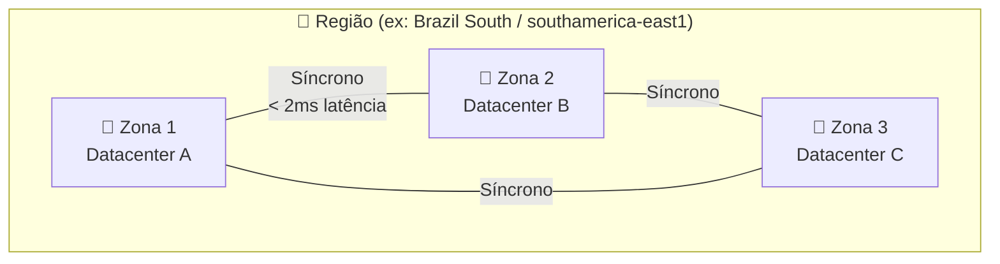
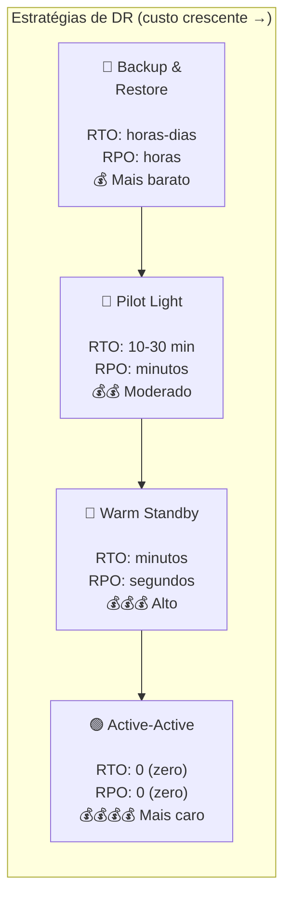
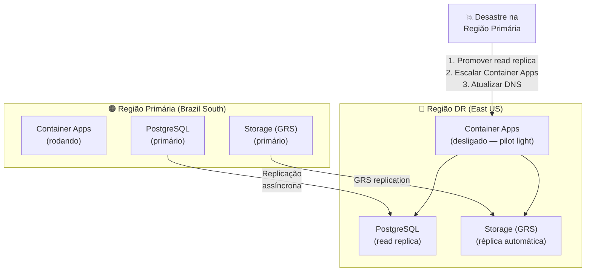
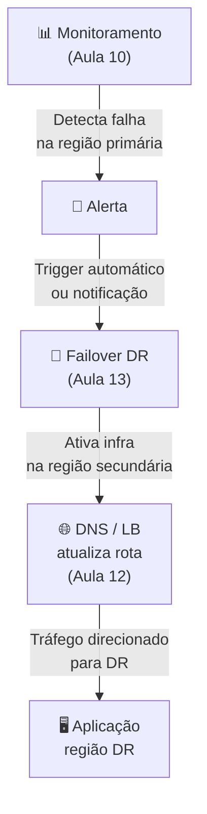

# Aula 13 — Alta Disponibilidade e Disaster Recovery

> **Disciplina:** Computação em Nuvem II (ISW035)  
> **Professor:** Ronan Adriel Zenatti — FATEC Jahu / Centro Paula Souza  
> **Semestre:** 1º/2026  
> **Carga Horária:** 4h práticas  
> **Avaliação:** T2 — Alta Disponibilidade e DR (inclui Trabalho Prático 2 — 2,0 pts — Grupo)

---

## 1. Visão Geral e Contextualização

Tudo falha, eventualmente. Discos queimam, datacenters sofrem quedas de energia, cabos submarinos são danificados, regiões inteiras ficam indisponíveis. A diferença entre uma empresa que sobrevive a essas falhas e uma que sofre perda catastrófica está no **planejamento de Alta Disponibilidade (HA)** e **Disaster Recovery (DR)**.

HA e DR não são a mesma coisa. HA é sobre **prevenir** interrupções (manter o sistema rodando apesar de falhas). DR é sobre **recuperar** quando a prevenção falha (restaurar o sistema após um desastre).

### Conceitos Fundamentais

| Conceito | Definição | Exemplo |
|---|---|---|
| **SLA** (Service Level Agreement) | Porcentagem de tempo que o serviço deve estar disponível | 99.99% = máx 52 minutos de downtime/ano |
| **RTO** (Recovery Time Objective) | Tempo máximo aceitável para restaurar o serviço após uma falha | RTO de 1 hora = sistema deve voltar em até 1h |
| **RPO** (Recovery Point Objective) | Quantidade máxima aceitável de perda de dados (medida em tempo) | RPO de 15 min = pode perder até 15 min de dados |
| **MTTR** (Mean Time to Recover) | Tempo médio real para recuperar o serviço | Se historicamente leva 45 min para restaurar um backup |
| **MTBF** (Mean Time Between Failures) | Intervalo médio entre falhas | Se o banco cai 1 vez a cada 6 meses em média |

### Quantificando SLA em Downtime

| SLA | Downtime/Ano | Downtime/Mês | Downtime/Semana | Nível |
|---|---|---|---|---|
| 99% | 3,65 dias | 7,3 horas | 1,68 horas | Básico |
| 99.9% | 8,76 horas | 43,8 minutos | 10,1 minutos | Padrão |
| 99.95% | 4,38 horas | 21,9 minutos | 5,04 minutos | Alto |
| 99.99% | 52,6 minutos | 4,38 minutos | 1,01 minutos | Muito alto |
| 99.999% | 5,26 minutos | 26,3 segundos | 6,05 segundos | Missão crítica |

> **Regra prática:** Cada "9" adicional no SLA tipicamente **dobra o custo** da infraestrutura. Defina o SLA com base no **impacto real** de downtime no negócio, não em perfeição técnica.

---

## 2. Alta Disponibilidade (HA) — Prevenindo Interrupções

### 2.1 Zonas de Disponibilidade

Zonas de Disponibilidade (AZs) são datacenters fisicamente separados dentro da mesma região, com energia, refrigeração e conectividade independentes. A replicação entre zonas é **síncrona** (sem perda de dados em caso de falha de zona).



### 2.2 HA por Camada de Serviço

| Camada | Azure HA | GCP HA | SLA Resultante |
|---|---|---|---|
| **Storage** | ZRS (3 zonas na região) | Regional bucket (multi-zona nativo) | 99.9% - 99.99% |
| **Banco relacional** | Zone-redundant (réplica em 3 zonas) | Regional HA (failover automático entre zonas) | 99.95% - 99.99% |
| **Banco NoSQL** | Cosmos DB multi-region writes | Firestore (multi-region nativo) | 99.999% |
| **Container serverless** | Container Apps (multi-replica) | Cloud Run (multi-zona automático) | 99.95% |
| **Kubernetes** | AKS com node pools multi-zona | GKE Regional cluster (nodes em 3 zonas) | 99.95% |
| **PaaS** | App Service zone-redundant | App Engine (automático) | 99.95% |

### 2.3 HA no Banco de Dados — Configuração Prática

**Azure — PostgreSQL com Zone Redundancy:**

```bash
# Criar servidor com HA habilitada
az postgres flexible-server create \
    --resource-group rg-cnuvem2 \
    --name pg-cnuvem2-ha \
    --location brazilsouth \
    --sku-name Standard_D2s_v3 \
    --tier GeneralPurpose \
    --high-availability ZoneRedundant \
    --zone 1 \
    --standby-zone 2 \
    --admin-user cnuvem2admin \
    --admin-password 'SenhaHA@2026!'

# A réplica standby é mantida sincronamente na zona 2
# Failover automático em caso de falha da zona 1 (< 120 segundos)
```

**GCP — Cloud SQL com Regional HA:**

```bash
# Criar instância com HA (failover automático)
gcloud sql instances create pg-cnuvem2-ha \
    --database-version=POSTGRES_16 \
    --tier=db-custom-2-7680 \
    --region=southamerica-east1 \
    --availability-type=REGIONAL \
    --root-password='SenhaHA@2026!' \
    --storage-auto-increase \
    --backup-start-time=03:00 \
    --enable-point-in-time-recovery

# availability-type=REGIONAL cria automaticamente réplica em outra zona
# Failover automático (30-120 segundos)
```

### 2.4 Exemplos Práticos de HA

**Exemplo 1 — E-commerce que não pode cair:** Um e-commerce que fatura R$ 100.000/hora durante a Black Friday implementa: banco com HA zone-redundant (failover automático < 2 min), storage com ZRS/Regional (dados em 3 zonas), Container Apps/Cloud Run com múltiplas réplicas em diferentes zonas, e Load Balancer distribuindo tráfego. SLA composto: ~99.95%.

**Exemplo 2 — API de pagamentos com SLA contratual:** Uma fintech contratou SLA de 99.99% com seus clientes. Implementa: Cosmos DB multi-region writes (99.999%), Container Apps com min-replicas=3 em zonas diferentes, e health checks a cada 10 segundos com failover automático. O SLA do componente mais fraco define o SLA do sistema.

**Exemplo 3 — Aplicação acadêmica (custo-eficiente):** Uma aplicação interna da faculdade pode tolerar até 4 horas de downtime/mês. Usa banco Burstable sem HA (mais barato), storage LRS/Regional, e Container Apps com scale-to-zero. SLA efetivo: ~99.5% — adequado para o caso de uso, com custo 5x menor que a solução HA completa.

---

## 3. Disaster Recovery (DR) — Recuperando de Desastres

### 3.1 Estratégias de DR

As estratégias de DR variam em custo e velocidade de recuperação. A escolha depende do RTO/RPO exigido pelo negócio.



| Estratégia | Descrição | RTO | RPO | Custo |
|---|---|---|---|---|
| **Backup & Restore** | Backups regulares armazenados em outra região; restauração manual sob demanda | Horas a dias | Horas (último backup) | Baixo |
| **Pilot Light** | Infraestrutura mínima na região DR (banco replicando, mas sem compute); escala-se em caso de desastre | 10-30 min | Minutos (replicação assíncrona) | Moderado |
| **Warm Standby** | Cópia reduzida do ambiente de produção rodando na região DR, pronta para receber tráfego | Minutos | Segundos | Alto |
| **Active-Active** | Duas regiões completas servindo tráfego simultaneamente com balanceamento global | Zero | Zero | Muito alto |

### 3.2 Replicação Multi-Região

**Azure — Geo-Replicação:**

| Serviço | Mecanismo | RPO |
|---|---|---|
| Storage (GRS/RA-GRS) | Replicação assíncrona para região pareada | ~15 minutos |
| Storage (GZRS) | ZRS local + replicação geo assíncrona | ~15 minutos |
| Azure SQL / PostgreSQL | Geo-replication / Read replicas cross-region | Segundos a minutos |
| Cosmos DB | Multi-region writes | Próximo de zero |
| Container Registry (ACR) | Geo-replication (Premium) | Minutos |

**GCP — Replicação Multi-Região:**

| Serviço | Mecanismo | RPO |
|---|---|---|
| Cloud Storage (Dual-region) | Replicação assíncrona automática | 1h padrão / 15 min (Turbo) |
| Cloud Storage (Multi-region) | Distribuição em múltiplas regiões | 1h padrão |
| Cloud SQL | Cross-region read replicas | Segundos a minutos |
| Firestore | Multi-region (automático em Native mode) | Próximo de zero |
| Artifact Registry | Multi-region (automático) | Minutos |

### 3.3 Implementando DR — Exemplo Prático

**Cenário: Pilot Light com Azure**



```bash
# 1. Criar read replica cross-region (pré-configurado)
az postgres flexible-server replica create \
    --resource-group rg-cnuvem2-dr \
    --name pg-cnuvem2-dr \
    --source-server pg-cnuvem2-ha \
    --location eastus

# 2. Em caso de desastre: promover replica
az postgres flexible-server replica stop-replication \
    --resource-group rg-cnuvem2-dr \
    --name pg-cnuvem2-dr
# Agora pg-cnuvem2-dr é um servidor independente (read-write)

# 3. Escalar Container Apps na região DR
az containerapp update \
    --resource-group rg-cnuvem2-dr \
    --name app-cnuvem2-dr \
    --min-replicas 2

# 4. Atualizar DNS para apontar para região DR
az network dns record-set a update ...
```

**Cenário: Pilot Light com GCP**

```bash
# 1. Criar read replica cross-region
gcloud sql instances create pg-cnuvem2-dr \
    --master-instance-name=pg-cnuvem2-ha \
    --region=us-central1

# 2. Em caso de desastre: promover replica
gcloud sql instances promote-replica pg-cnuvem2-dr

# 3. Deploy Cloud Run na região DR
gcloud run deploy cnuvem2-app \
    --image=southamerica-east1-docker.pkg.dev/PROJECT/cnuvem2-repo/cnuvem2-app:latest \
    --region=us-central1 \
    --allow-unauthenticated

# 4. Atualizar Cloud DNS / Load Balancer global
```

### 3.4 Plano de Disaster Recovery — Documento Essencial

Todo plano de DR deve conter, no mínimo:

| Seção | Conteúdo |
|---|---|
| **Classificação de sistemas** | Quais sistemas são críticos, importantes e auxiliares |
| **RTO e RPO por sistema** | Tempo máximo de recuperação e perda de dados aceitável |
| **Topologia de replicação** | Quais dados são replicados, para onde e com que frequência |
| **Procedimento de failover** | Passo a passo detalhado para ativar o DR (comandos, responsáveis) |
| **Procedimento de failback** | Como retornar para a região primária após o incidente |
| **Teste de DR** | Cronograma de testes regulares (mensal, trimestral) |
| **Comunicação** | Quem é notificado, canais de comunicação, escalonamento |

### 3.5 Exemplos Práticos de DR

**Exemplo 1 — Backup & Restore para aplicação interna:** Uma aplicação de controle de estoque faz backup do banco diariamente para outra região. RTO de 4 horas, RPO de 24 horas. Em caso de desastre, restaura-se o último backup e redeploya a aplicação manualmente na região DR. Custo adicional: apenas o storage dos backups.

**Exemplo 2 — Pilot Light para SaaS:** Uma aplicação SaaS mantém: read replica do banco na região DR (replicando continuamente), imagem Docker no registry replicado, e Container Apps/Cloud Run configurado mas com 0 réplicas. Em caso de desastre: promove a replica, escala para 2+ réplicas e atualiza o DNS. RTO: 15-30 minutos. RPO: minutos.

**Exemplo 3 — Active-Active para fintech:** Uma API de pagamentos roda em duas regiões simultaneamente (Brazil South + East US / southamerica-east1 + us-central1). O Cosmos DB (multi-region writes) ou Firestore (multi-region) garante RPO zero. Um Global Load Balancer distribui tráfego e faz failover automático. RTO: zero. RPO: zero. Custo: ~2x de uma região.

---

## 4. Testando DR — Game Days

Planos de DR que não são testados não funcionam quando precisam. **Game Days** são exercícios simulados onde a equipe pratica o failover em condições controladas.

| Tipo de Teste | Descrição | Frequência Recomendada |
|---|---|---|
| **Tabletop exercise** | Discussão teórica do plano ("e se...") | Trimestral |
| **Failover parcial** | Testar failover de um componente (ex: banco) | Mensal |
| **Failover completo** | Simular desastre regional e executar todo o procedimento | Semestral |
| **Chaos engineering** | Injetar falhas reais na produção para validar resiliência | Contínuo (após maturidade) |

---

## 5. Cenários de Integração

### Cenário 1 — HA + DR + Monitoramento (Aulas 10 + 12 + 13)



### Cenário 2 — IaC + DR (Aulas 07 + 13)

> Toda a infraestrutura de DR é definida em Terraform. Em caso de desastre, executar `terraform apply -var="region=eastus"` provisiona toda a infraestrutura na região DR em minutos, usando o mesmo código que criou a produção.

---

## 6. Trabalho Prático 2 (T2) — 2,0 pontos — Grupo

### Requisitos

Implementar no projeto interdisciplinar os seguintes aspectos de **monitoramento, segurança e resiliência**:

| # | Componente | Pontuação |
|---|---|---|
| 1 | **Monitoramento:** Dashboard ou alertas configurados para ao menos 2 métricas da aplicação (latência, erros, CPU, etc.) | 0,5 pt |
| 2 | **Segurança:** Managed Identity / Service Account configurada para a aplicação (sem senhas no código); ou secrets em Key Vault / Secret Manager | 0,5 pt |
| 3 | **Resiliência:** Ao menos 1 mecanismo de HA implementado (banco com HA, storage com redundância multi-zona, réplicas da aplicação) | 0,5 pt |
| 4 | **Documentação:** Plano de DR simplificado com: diagrama de topologia, RTO/RPO definidos para o projeto, e procedimento de failover documentado | 0,5 pt |

### Entrega

Repositório GitHub do grupo com evidências (screenshots, logs, diagramas) e documentação no README.

---

## 7. Resumo Comparativo Final

| Aspecto | Azure | GCP |
|---|---|---|
| **HA de banco** | Zone-redundant (3 zonas, failover auto) | Regional HA (failover auto entre zonas) |
| **HA de storage** | ZRS (3 zonas) / GZRS (3 zonas + geo) | Regional (multi-zona nativo) / Dual-region |
| **DR de banco** | Geo-replication / Cross-region read replica | Cross-region read replica |
| **DR de storage** | GRS / RA-GRS / GZRS | Dual-region / Multi-region + Turbo Replication |
| **Global Load Balancer** | Azure Front Door / Traffic Manager | Cloud Load Balancing (global L7) |
| **RPO mínimo (storage)** | ~15 min (GRS) | 15 min (Turbo) / 1h (padrão) |
| **RPO mínimo (NoSQL)** | ~0 (Cosmos DB multi-region writes) | ~0 (Firestore multi-region) |
| **Active-Active nativo** | Cosmos DB + Traffic Manager | Dual-region buckets (RTO=0) + Global LB |
| **Chaos Engineering** | Azure Chaos Studio | Nenhum nativo (usar Chaos Monkey / LitmusChaos) |

---

## 8. Exercícios Propostos

1. **Exercício SLA:** Calcule o SLA composto de uma arquitetura com: Load Balancer (99.99%) → Container Apps (99.95%) → PostgreSQL HA (99.99%) → Storage ZRS (99.9%). Use a fórmula: SLA composto = SLA₁ × SLA₂ × SLA₃ × SLA₄. Qual o downtime máximo anual?

2. **Exercício HA:** Habilite HA no banco de dados do projeto interdisciplinar (zone-redundant no Azure ou Regional HA no GCP). Documente a configuração e capture o status da réplica.

3. **Exercício DR Teórico:** Elabore um plano de DR simplificado para o projeto interdisciplinar contendo: RTO/RPO definidos, diagrama de topologia primária + DR, e procedimento de failover (passo a passo com comandos).

4. **Exercício Failover:** Se tiver read replica cross-region, execute um failover simulado: promova a replica, verifique que a aplicação se reconecta, e depois reconfigure a replicação de volta. Documente o tempo total de recuperação (MTTR medido).

---

## 9. Referências

**Azure:**
- [Alta Disponibilidade — Documentação](https://learn.microsoft.com/azure/architecture/framework/resiliency/overview)
- [Disaster Recovery — Azure Architecture Center](https://learn.microsoft.com/azure/architecture/framework/resiliency/backup-and-recovery)
- [Azure Chaos Studio](https://learn.microsoft.com/azure/chaos-studio/)
- [PostgreSQL — Alta Disponibilidade](https://learn.microsoft.com/azure/postgresql/flexible-server/concepts-high-availability)

**GCP:**
- [Designing for High Availability](https://cloud.google.com/architecture/framework/reliability/design-scale-high-availability)
- [Disaster Recovery Planning Guide](https://cloud.google.com/architecture/dr-scenarios-planning-guide)
- [Cloud SQL — High Availability](https://cloud.google.com/sql/docs/postgres/high-availability)
- [Data Availability and Durability (Cloud Storage)](https://cloud.google.com/storage/docs/availability-durability)

---

> **Aula Anterior:** [Aula 12 — Redes Virtuais e Conectividade](./Aula_12-Redes_Virtuais_e_Conectividade.md)  
> **Próxima Aula:** [Aula 14 — Computação Serverless](./Aula_14-Computacao_Serverless.md)
