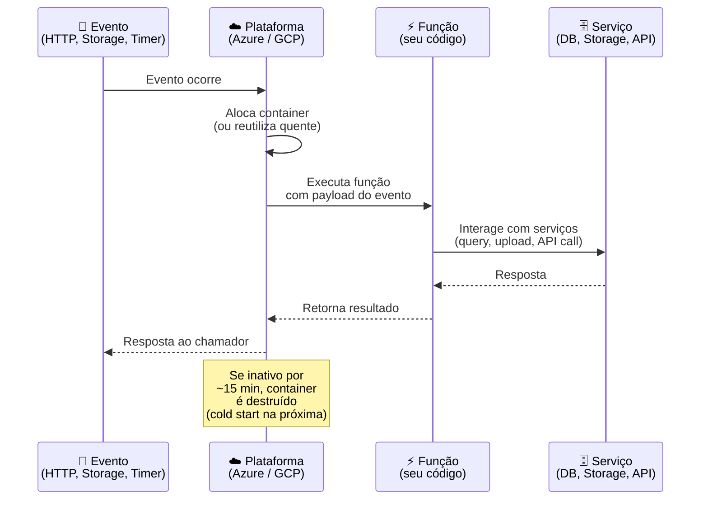
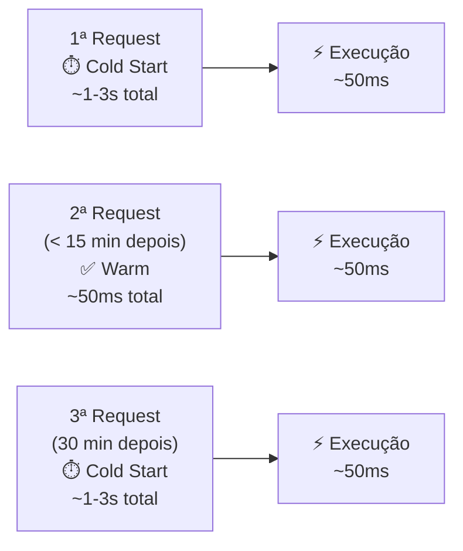
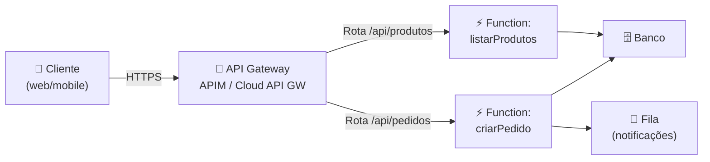
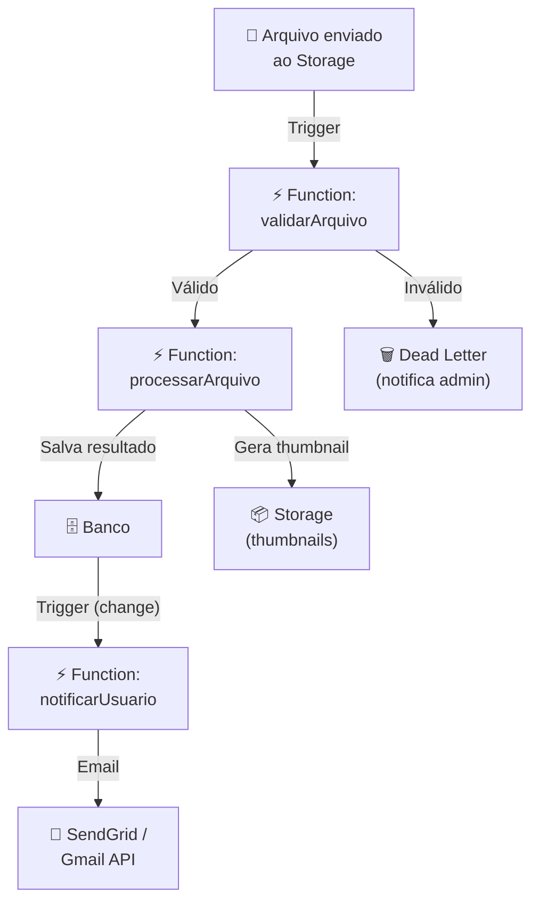
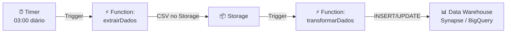
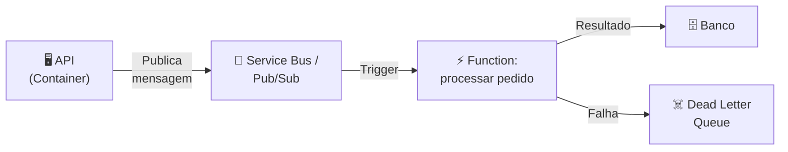

# Aula 14 — Computação Serverless

> **Disciplina:** Computação em Nuvem II (ISW035)  
> **Professor:** Ronan Adriel Zenatti — FATEC Jahu / Centro Paula Souza  
> **Semestre:** 1º/2026  
> **Carga Horária:** 4h práticas

---

## 1. Visão Geral e Contextualização

Na Aula 05 (PaaS) e Aula 06 (Containers), deployamos aplicações que rodam **continuamente** — um servidor esperando por requisições 24 horas por dia, 7 dias por semana. Isso faz sentido para aplicações com tráfego constante, mas é desperdiço para cenários onde a lógica precisa executar apenas **em resposta a um evento**: um arquivo foi enviado ao storage, um registro mudou no banco, um timer disparou, ou uma requisição HTTP chegou.

A **computação serverless** (FaaS — Functions as a Service) inverte o modelo: em vez de manter um servidor rodando, você escreve **funções** curtas e o provedor as executa sob demanda, escalando de zero a milhares de instâncias automaticamente. Você paga apenas pelo tempo de execução real da função, não por infraestrutura ociosa.

### Serverless no Espectro de Abstração

```mermaid
graph LR
    IaaS["🖥️ IaaS<br/>VMs<br/><br/>Você gerencia: SO,<br/>runtime, app, escala"]
    CaaS["🐳 CaaS<br/>Containers<br/><br/>Você gerencia:<br/>imagem, app, config"]
    PaaS["📦 PaaS<br/>App Service /<br/>App Engine<br/><br/>Você gerencia:<br/>código, config"]
    FaaS["⚡ FaaS<br/>Functions<br/><br/>Você gerencia:<br/>apenas a função"]
    
    IaaS -->|"Mais controle<br/>Mais responsabilidade"| CaaS -->|""| PaaS -->|""| FaaS
    
    style FaaS fill:#2a9d8f,color:#fff
```

### Mapa de Equivalência — Serverless

| Conceito | Azure | GCP |
|---|---|---|
| FaaS (Functions) | Azure Functions | Cloud Functions (2nd gen) |
| Orquestração de workflows | Durable Functions / Logic Apps | Cloud Workflows / Eventarc |
| API Gateway | Azure API Management | Cloud API Gateway / Apigee |
| Eventos entre serviços | Event Grid | Eventarc |
| Agendamento (cron) | Timer trigger (Functions) | Cloud Scheduler |
| Processamento de streams | Event Hubs + Functions | Pub/Sub + Cloud Functions |

---

## 2. Paradigma Serverless — Conceitos Fundamentais

### 2.1 Como Funciona



### 2.2 Triggers (Gatilhos)

O trigger define **o que** dispara a execução da função. Cada trigger fornece dados de contexto (payload) para a função.

| Trigger | Azure Functions | GCP Cloud Functions | Caso de Uso |
|---|---|---|---|
| **HTTP** | HTTP trigger | HTTP trigger | APIs, webhooks, endpoints REST |
| **Storage** | Blob trigger | Cloud Storage trigger | Processar arquivo enviado (resize, validação) |
| **Timer/Cron** | Timer trigger (CRON expression) | Cloud Scheduler + Pub/Sub | Limpeza agendada, relatórios diários |
| **Banco de dados** | Cosmos DB trigger | Firestore trigger | Reagir a mudanças de dados |
| **Fila de mensagens** | Service Bus trigger / Queue trigger | Pub/Sub trigger | Processamento assíncrono, workers |
| **Eventos de plataforma** | Event Grid trigger | Eventarc trigger | Reagir a eventos de infraestrutura |
| **Autenticação** | N/A (via Event Grid) | Firebase Auth trigger | Onboarding de novos usuários |

### 2.3 Cold Start vs. Warm Start

O **cold start** é o tempo adicional que a plataforma leva para inicializar um novo container quando a função não foi chamada recentemente. É o principal trade-off do modelo serverless.

| Aspecto | Cold Start | Warm Start |
|---|---|---|
| **Quando ocorre** | Primeira invocação ou após período de inatividade (~15-20 min) | Invocações subsequentes enquanto o container está ativo |
| **Latência adicional** | 200ms a 5 segundos (depende do runtime e dependências) | Insignificante (~1-10ms overhead) |
| **Como mitigar (Azure)** | Premium Plan (instâncias pré-aquecidas) / Provisioned Concurrency | Manter tráfego mínimo |
| **Como mitigar (GCP)** | `--min-instances=1` no Cloud Functions 2nd gen | Cloud Scheduler ping periódico |
| **Runtimes mais rápidos** | Node.js, Go, Python (interpretados/compilados leves) | — |
| **Runtimes mais lentos** | Java, .NET (JVM/CLR startup mais pesado) | — |



---

## 3. Azure Functions — Implementação Prática

### 3.1 Planos de Hospedagem

| Plano | Escala | Cold Start | Max Execução | Preço | Melhor Para |
|---|---|---|---|---|---|
| **Consumption** (Serverless) | 0 → 200 instâncias | Sim (~1-5s) | 10 min (padrão), 30 min (max) | Pay-per-execution | Workloads intermitentes, protótipos |
| **Flex Consumption** | 0 → 1000 instâncias | Configurável (always-ready) | 30 min | Pay-per-execution + instâncias pré-alocadas | Tráfego variável com picos |
| **Premium** | 1 → ilimitado | Não (instâncias pré-aquecidas) | Ilimitado | Por instância (a partir de ~$0.173/hora) | Produção, VNet integration |
| **Dedicated** (App Service) | Manual / Autoscale | Não (sempre rodando) | Ilimitado | Plano App Service | Reutilizar infraestrutura existente |

### 3.2 Exemplo: HTTP Trigger — API Simples

```python
# function_app.py — Azure Functions v2 (Python)
import azure.functions as func
import json
import logging
import os

app = func.FunctionApp()

# ─── HTTP TRIGGER: API para consultar produtos ───
@app.route(route="produtos", methods=["GET"])
def listar_produtos(req: func.HttpRequest) -> func.HttpResponse:
    """Retorna lista de produtos do banco de dados."""
    logging.info("Requisição recebida: GET /api/produtos")
    
    # Em produção, conectar ao banco via connection string do Key Vault
    produtos = [
        {"id": 1, "nome": "Notebook Gamer", "preco": 5499.90},
        {"id": 2, "nome": "Mouse Wireless", "preco": 149.90},
        {"id": 3, "nome": "Teclado Mecânico", "preco": 329.90},
    ]
    
    return func.HttpResponse(
        body=json.dumps({"produtos": produtos}, ensure_ascii=False),
        mimetype="application/json",
        status_code=200
    )

@app.route(route="produtos/{id}", methods=["GET"])
def buscar_produto(req: func.HttpRequest) -> func.HttpResponse:
    """Retorna um produto por ID."""
    produto_id = req.route_params.get("id")
    logging.info(f"Buscando produto ID: {produto_id}")
    
    # Simulação — em produção, consultar banco
    return func.HttpResponse(
        body=json.dumps({"id": produto_id, "nome": "Produto Exemplo"}),
        mimetype="application/json"
    )
```

### 3.3 Exemplo: Blob Trigger — Processamento de Arquivo

```python
# function_app.py — Blob trigger
@app.blob_trigger(arg_name="blob", path="uploads/{name}",
                   connection="AzureWebJobsStorage")
def processar_upload(blob: func.InputStream):
    """Disparada quando um arquivo é enviado ao container 'uploads'."""
    logging.info(f"Novo arquivo: {blob.name} | Tamanho: {blob.length} bytes")
    
    # Exemplo: validar tipo do arquivo
    if not blob.name.lower().endswith(('.jpg', '.png', '.pdf')):
        logging.warning(f"Tipo de arquivo não suportado: {blob.name}")
        return
    
    # Ler conteúdo
    content = blob.read()
    logging.info(f"Arquivo processado: {blob.name} ({len(content)} bytes)")
    
    # Em produção: redimensionar imagem, extrair texto de PDF,
    # salvar metadata no banco, etc.
```

### 3.4 Exemplo: Timer Trigger — Tarefa Agendada

```python
# function_app.py — Timer trigger (cron)
@app.timer_trigger(schedule="0 0 3 * * *", arg_name="timer",
                    run_on_startup=False)
def limpeza_diaria(timer: func.TimerRequest):
    """Executa diariamente às 03:00 UTC — limpeza de dados antigos."""
    logging.info("Iniciando limpeza diária de dados temporários")
    
    if timer.past_due:
        logging.warning("Timer atrasado — executando agora")
    
    # Lógica de limpeza: remover registros com mais de 90 dias,
    # mover arquivos antigos para archive, enviar relatório por email
    registros_removidos = 42  # Simulação
    logging.info(f"Limpeza concluída: {registros_removidos} registros removidos")
```

### 3.5 Deploy de Azure Functions

```bash
# Pré-requisitos
pip install azure-functions-core-tools

# Criar Function App no Azure
az functionapp create \
    --resource-group rg-cnuvem2 \
    --name func-cnuvem2-2026 \
    --storage-account stcnuvem2app2026 \
    --consumption-plan-location brazilsouth \
    --runtime python \
    --runtime-version 3.12 \
    --functions-version 4 \
    --os-type linux

# Deploy
func azure functionapp publish func-cnuvem2-2026

# Testar
curl https://func-cnuvem2-2026.azurewebsites.net/api/produtos
```

---

## 4. Google Cloud Functions — Implementação Prática

### 4.1 Gerações do Cloud Functions

O GCP oferece duas gerações de Cloud Functions. A **2nd gen** (construída sobre Cloud Run) é a recomendada para novos projetos.

| Aspecto | 1st gen | 2nd gen (recomendada) |
|---|---|---|
| **Base** | Infraestrutura proprietária | Cloud Run + Eventarc |
| **Timeout máximo** | 9 minutos | 60 minutos (HTTP) |
| **Concorrência** | 1 request por instância | Até 1000 requests por instância |
| **Min instances** | ❌ | ✅ (para evitar cold start) |
| **Triggers** | HTTP, Pub/Sub, Cloud Storage | HTTP, Pub/Sub, Cloud Storage, Eventarc (100+ fontes) |
| **Traffic splitting** | ❌ | ✅ (via Cloud Run) |
| **VPC connector** | ✅ | ✅ |
| **Memória máxima** | 8 GB | 32 GB |
| **vCPUs máximo** | 2 | 8 |

### 4.2 Exemplo: HTTP Trigger — API Simples

```python
# main.py — Cloud Functions (2nd gen, Python)
import functions_framework
import json

@functions_framework.http
def listar_produtos(request):
    """HTTP Cloud Function — Retorna lista de produtos."""
    
    # CORS headers
    if request.method == "OPTIONS":
        headers = {
            "Access-Control-Allow-Origin": "*",
            "Access-Control-Allow-Methods": "GET",
            "Access-Control-Allow-Headers": "Content-Type",
        }
        return ("", 204, headers)
    
    produtos = [
        {"id": 1, "nome": "Notebook Gamer", "preco": 5499.90},
        {"id": 2, "nome": "Mouse Wireless", "preco": 149.90},
        {"id": 3, "nome": "Teclado Mecânico", "preco": 329.90},
    ]
    
    headers = {"Access-Control-Allow-Origin": "*"}
    return (json.dumps({"produtos": produtos}, ensure_ascii=False), 200, headers)
```

```
# requirements.txt
functions-framework==3.*
google-cloud-storage==2.*
google-cloud-firestore==2.*
```

### 4.3 Exemplo: Cloud Storage Trigger — Processamento de Arquivo

```python
# main.py — Cloud Storage trigger
import functions_framework
from google.cloud import storage

@functions_framework.cloud_event
def processar_upload(cloud_event):
    """Disparada quando um arquivo é enviado ao bucket."""
    data = cloud_event.data
    
    bucket_name = data["bucket"]
    file_name = data["name"]
    content_type = data.get("contentType", "unknown")
    size = data.get("size", 0)
    
    print(f"Novo arquivo: gs://{bucket_name}/{file_name}")
    print(f"Tipo: {content_type} | Tamanho: {size} bytes")
    
    # Validar tipo
    allowed_types = ["image/jpeg", "image/png", "application/pdf"]
    if content_type not in allowed_types:
        print(f"⚠️ Tipo não suportado: {content_type}")
        return
    
    # Processar arquivo
    client = storage.Client()
    bucket = client.bucket(bucket_name)
    blob = bucket.blob(file_name)
    
    # Exemplo: adicionar metadata de processamento
    blob.metadata = {"processed": "true", "processor": "cloud-function-v1"}
    blob.patch()
    
    print(f"✅ Arquivo processado: {file_name}")
```

### 4.4 Exemplo: Pub/Sub Trigger — Processamento Assíncrono

```python
# main.py — Pub/Sub trigger
import functions_framework
import base64
import json

@functions_framework.cloud_event
def processar_mensagem(cloud_event):
    """Disparada quando uma mensagem chega no tópico Pub/Sub."""
    
    # Decodificar mensagem (Pub/Sub envia em base64)
    message_data = base64.b64decode(cloud_event.data["message"]["data"]).decode()
    payload = json.loads(message_data)
    
    print(f"Mensagem recebida: {payload}")
    
    # Processar conforme o tipo de evento
    event_type = payload.get("type")
    
    if event_type == "novo_pedido":
        # Processar pedido, enviar email de confirmação, atualizar estoque
        print(f"Processando pedido #{payload['pedido_id']}")
    elif event_type == "pagamento_confirmado":
        # Atualizar status do pedido, notificar logística
        print(f"Pagamento confirmado para pedido #{payload['pedido_id']}")
    else:
        print(f"Tipo de evento desconhecido: {event_type}")
```

### 4.5 Deploy de Cloud Functions

```bash
# Deploy HTTP function (2nd gen)
gcloud functions deploy listar-produtos \
    --gen2 \
    --runtime=python312 \
    --region=southamerica-east1 \
    --source=. \
    --entry-point=listar_produtos \
    --trigger-http \
    --allow-unauthenticated \
    --min-instances=0 \
    --max-instances=10 \
    --memory=256Mi

# Deploy Storage trigger
gcloud functions deploy processar-upload \
    --gen2 \
    --runtime=python312 \
    --region=southamerica-east1 \
    --source=. \
    --entry-point=processar_upload \
    --trigger-event-filters="type=google.cloud.storage.object.v1.finalized" \
    --trigger-event-filters="bucket=cnuvem2-uploads-2026"

# Deploy Pub/Sub trigger
gcloud functions deploy processar-mensagem \
    --gen2 \
    --runtime=python312 \
    --region=southamerica-east1 \
    --source=. \
    --entry-point=processar_mensagem \
    --trigger-topic=cnuvem2-eventos

# Deploy Timer (via Cloud Scheduler + Pub/Sub)
gcloud scheduler jobs create pubsub limpeza-diaria \
    --schedule="0 3 * * *" \
    --topic=cnuvem2-limpeza \
    --message-body='{"action": "cleanup"}' \
    --time-zone="America/Sao_Paulo"
```

---

## 5. Comparativo Detalhado — Azure Functions vs. Cloud Functions

| Aspecto | Azure Functions | GCP Cloud Functions (2nd gen) |
|---|---|---|
| **Linguagens** | C#, JavaScript/TS, Python, Java, PowerShell, Go (preview) | Node.js, Python, Go, Java, .NET, Ruby, PHP |
| **Planos** | Consumption, Flex Consumption, Premium, Dedicated | Serverless (único, baseado em Cloud Run) |
| **Scale to zero** | ✅ (Consumption) | ✅ |
| **Cold start** | 1-5s (Consumption), ~0 (Premium) | 200ms-3s (depende do runtime) |
| **Max execução** | 10 min (Consumption), ilimitado (Premium) | 60 min (HTTP), 9 min (event, 1st gen) |
| **Concorrência por instância** | 1 (padrão) | Até 1000 (2nd gen) |
| **Min instances** | ✅ (Premium, Flex Consumption) | ✅ (2nd gen, `--min-instances`) |
| **Bindings (I/O declarativo)** | ✅ (exclusividade Azure — simplifica código) | ❌ (usa SDK explicitamente) |
| **Durable Functions (workflows)** | ✅ (orquestração stateful nativa) | ❌ (usar Cloud Workflows) |
| **Triggers nativos** | HTTP, Blob, Queue, Timer, Cosmos DB, Service Bus, Event Grid | HTTP, Cloud Storage, Pub/Sub, Firestore, Eventarc (100+) |
| **VNet integration** | ✅ (Premium plan) | ✅ (VPC connector) |
| **Monitoramento** | Application Insights (automático) | Cloud Logging + Cloud Trace |
| **Free tier** | 1M execuções + 400.000 GB-s/mês | 2M invocações + 400.000 GB-s + 200.000 GHz-s/mês |
| **Preço por execução** | $0.20 por milhão | $0.40 por milhão |
| **Preço por GB-s** | $0.000016 | $0.0000025 |

### Bindings do Azure Functions — Diferencial

Os **bindings** são uma funcionalidade exclusiva do Azure Functions que permite conectar entrada/saída a serviços (Storage, Cosmos DB, Service Bus, etc.) de forma declarativa, sem escrever código de conexão. Isso reduz significativamente o boilerplate.

```python
# Sem bindings (GCP ou qualquer plataforma):
from google.cloud import storage
client = storage.Client()
bucket = client.bucket("meu-bucket")
blob = bucket.blob("output.json")
blob.upload_from_string(json.dumps(resultado))

# Com bindings (Azure Functions):
@app.blob_output(arg_name="outputBlob", path="output/{name}.json",
                  connection="AzureWebJobsStorage")
def processar(req, outputBlob: func.Out[str]):
    outputBlob.set(json.dumps(resultado))  # Escrita automática no blob!
```

---

## 6. Padrões Arquiteturais Serverless

### 6.1 Padrão: API Backend



### 6.2 Padrão: Processamento Event-Driven



### 6.3 Padrão: Processamento Agendado (ETL)



---

## 7. Exemplos Práticos Completos

**Exemplo 1 — Redimensionamento automático de imagens:** Um e-commerce recebe fotos de produtos em alta resolução. Quando uma imagem é enviada ao bucket `uploads/`, uma Cloud Function / Azure Function é disparada automaticamente. A função lê a imagem, cria versões em 3 tamanhos (thumb 150px, médio 600px, grande 1200px), salva no bucket `processed/` e registra as URLs no banco de dados. O custo é proporcional ao número de uploads — sem imagens, sem custo.

**Exemplo 2 — Webhook de pagamento:** Uma integração com gateway de pagamento (PagSeguro, Stripe) envia notificações HTTP (webhooks) quando pagamentos são confirmados. Uma função HTTP recebe o webhook, valida a assinatura, atualiza o status do pedido no banco, envia email de confirmação ao cliente e publica uma mensagem no Service Bus / Pub/Sub para que o sistema de logística prepare o envio. Cada etapa é desacoplada e escalável independentemente.

**Exemplo 3 — Relatório diário automatizado:** Todo dia às 06:00, um timer trigger dispara uma função que consulta o banco de dados, calcula métricas do dia anterior (vendas, novos usuários, erros), gera um PDF com o relatório e o envia por email para a equipe de gestão. A função executa por ~30 segundos uma vez ao dia, custando frações de centavo por mês.

---

## 8. Quando NÃO Usar Serverless

Serverless não é solução universal. Evite quando:

| Cenário | Por que Evitar Serverless | Alternativa |
|---|---|---|
| **Aplicação sempre ativa com tráfego constante** | Pay-per-execution é mais caro que instância dedicada 24/7 | Container Apps / Cloud Run com min-instances, ou PaaS |
| **Execução longa (> 15 min)** | Limites de timeout em planos serverless | Container Jobs, VMs, ou batch processing |
| **Aplicação stateful com sessão** | Functions são stateless por padrão | PaaS ou containers com session affinity |
| **Latência ultra-baixa obrigatória** | Cold starts adicionam 1-5s na primeira requisição | Container com min-instances ou Premium plan |
| **Dependências pesadas (ML models, etc.)** | Container images grandes = cold start longo | Container serverless (Cloud Run) com imagens pré-carregadas |

---

## 9. Cenários de Integração com Aulas Futuras

### Cenário 1 — Functions + Filas de Mensagens (Aulas 14 + 15)



> **Aula 15:** Filas de Mensagens e Event-Driven Architecture aprofundará este padrão.

### Cenário 2 — Functions + Monitoramento (Aulas 10 + 14)

> Azure Functions com Application Insights coleta automaticamente métricas de execução (duração, erros, cold starts). Cloud Functions integra com Cloud Logging e Cloud Trace para o mesmo efeito.

### Cenário 3 — Functions + IaC (Aulas 07 + 14)

> Provisionar Function Apps / Cloud Functions via Terraform, incluindo triggers, variáveis de ambiente e permissões IAM — tudo versionado no Git.

---

## 10. Resumo Comparativo Final

| Aspecto | Azure Functions | GCP Cloud Functions |
|---|---|---|
| **Modelo** | Consumption / Flex / Premium / Dedicated | Serverless (baseado em Cloud Run) |
| **Geração atual** | v4 (in-process + isolated worker) | 2nd gen (Cloud Run + Eventarc) |
| **Diferencial** | Bindings + Durable Functions | Concorrência por instância + Eventarc (100+ triggers) |
| **Cold start** | 1-5s (Consumption) | 200ms-3s |
| **Free tier** | 1M exec + 400k GB-s | 2M exec + 400k GB-s |
| **Melhor para** | Ecossistema Azure, .NET, workflows complexos (Durable) | APIs leves, event-driven GCP, integração Firebase |
| **Deploy** | `func azure functionapp publish` | `gcloud functions deploy` |

---

## 11. Exercícios Propostos

1. **Exercício HTTP Function:** Crie uma função HTTP (Azure Functions ou Cloud Functions) que receba um JSON `{"nome": "...", "email": "..."}` via POST e retorne um JSON com os dados + timestamp de recebimento. Deploy e teste com `curl`.

2. **Exercício Storage Trigger:** Crie uma função que é disparada quando um arquivo é enviado ao bucket/container do projeto. A função deve logar o nome, tamanho e tipo do arquivo. Teste enviando um arquivo via CLI ou SDK.

3. **Exercício Timer:** Crie uma função agendada (cron) que executa a cada 5 minutos, consulta a tabela do banco de dados e loga a contagem de registros. No GCP, use Cloud Scheduler + Pub/Sub trigger. No Azure, use Timer trigger.

4. **Exercício de Custo:** Calcule o custo mensal de uma função HTTP que recebe 100.000 requests/mês, com execução média de 200ms e 256MB de memória, em ambas as plataformas. Compare com o custo de um Container Apps / Cloud Run com min-instances=1. A partir de quantas execuções/mês o serverless fica mais caro?

---

## 12. Referências

**Azure:**
- [Azure Functions — Documentação](https://learn.microsoft.com/azure/azure-functions/)
- [Azure Functions Python Developer Guide](https://learn.microsoft.com/azure/azure-functions/functions-reference-python)
- [Durable Functions — Padrões](https://learn.microsoft.com/azure/azure-functions/durable/durable-functions-overview)
- [Triggers and Bindings Reference](https://learn.microsoft.com/azure/azure-functions/functions-triggers-bindings)

**GCP:**
- [Cloud Functions — Documentação](https://cloud.google.com/functions/docs)
- [Cloud Functions 2nd gen Overview](https://cloud.google.com/functions/docs/concepts/version-comparison)
- [Eventarc — Triggers](https://cloud.google.com/eventarc/docs)
- [Cloud Scheduler](https://cloud.google.com/scheduler/docs)

**Conceitos:**
- [Serverless Architectures — Martin Fowler](https://martinfowler.com/articles/serverless.html)
- [Serverless Framework](https://www.serverless.com/)

---

> **Aula Anterior:** [Aula 13 — Alta Disponibilidade e DR](./Aula_13-Alta_Disponibilidade_e_DR.md)  
> **Próxima Aula:** [Aula 15 — Filas de Mensagens e Event-Driven](./Aula_15-Filas_de_Mensagens_e_Event_Driven.md)
