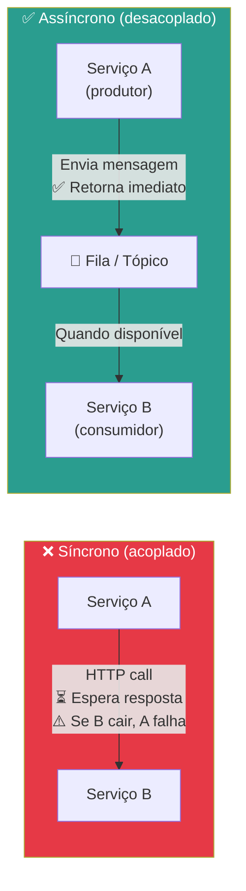
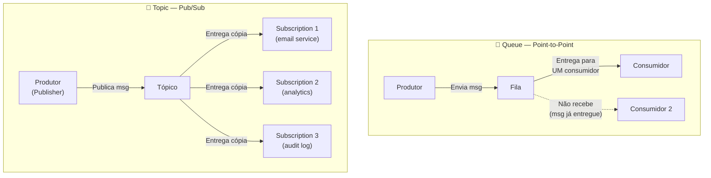
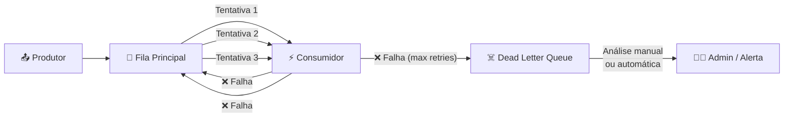
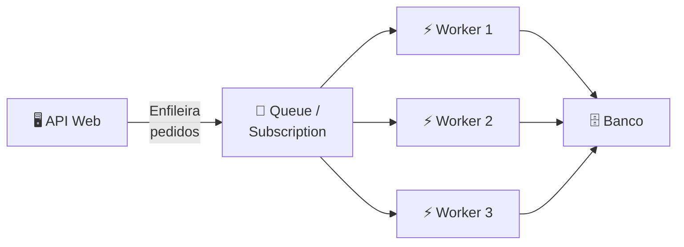
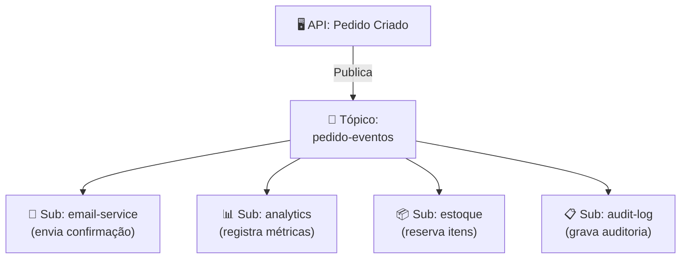
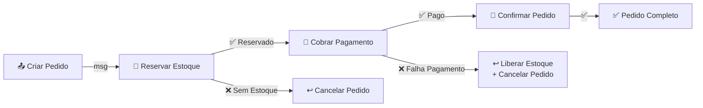
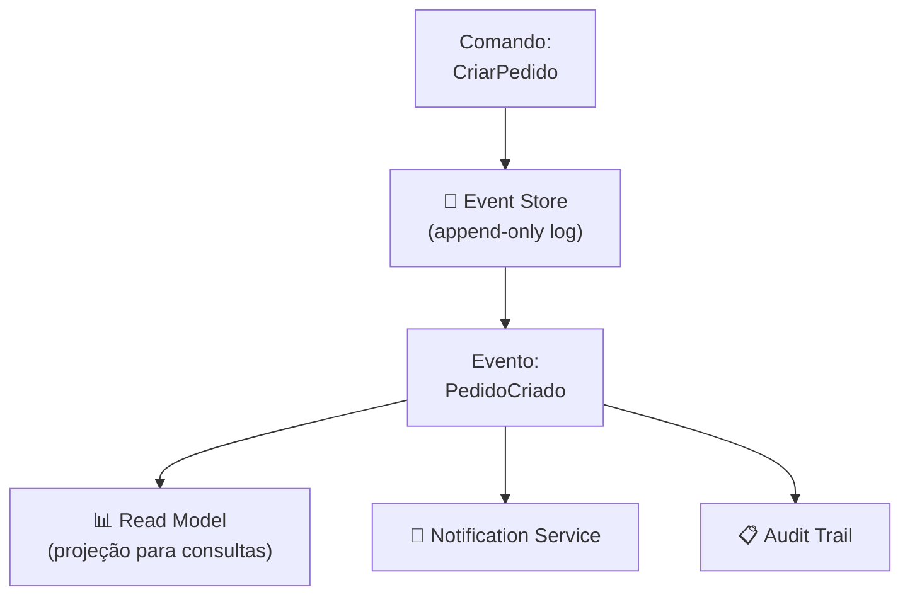
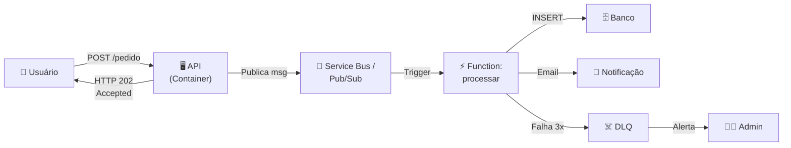

# Aula 15 — Filas de Mensagens e Arquitetura Event-Driven

> **Disciplina:** Computação em Nuvem II (ISW035)  
> **Professor:** Ronan Adriel Zenatti — FATEC Jahu / Centro Paula Souza  
> **Semestre:** 1º/2026  
> **Carga Horária:** 4h práticas

---

## 1. Visão Geral e Contextualização

Na Aula 14, vimos que funções serverless são disparadas por **eventos**. Mas o que acontece quando o volume de eventos é alto, quando o processamento é lento, ou quando o consumidor está temporariamente indisponível? É aqui que entram as **filas de mensagens** e a **arquitetura event-driven** — mecanismos que desacoplam produtores de consumidores, garantindo que nenhuma mensagem se perca e que cada componente evolua e escale de forma independente.

### Comunicação Síncrona vs. Assíncrona



| Aspecto | Síncrono (HTTP direto) | Assíncrono (via fila/tópico) |
|---|---|---|
| **Acoplamento** | Alto (A depende de B estar online) | Baixo (A e B independentes) |
| **Latência** | Determinada pelo componente mais lento | A retorna imediato; B processa quando puder |
| **Resiliência** | Se B cair, A também falha | Se B cair, mensagens ficam na fila até B voltar |
| **Escala** | A e B precisam escalar juntos | A e B escalam independentemente |
| **Garantia de entrega** | Nenhuma (se a resposta se perder) | At-least-once ou exactly-once (configurável) |
| **Ordenação** | Implícita (request-response) | Configurável (FIFO, particionamento) |
| **Quando usar** | Operações que precisam de resposta imediata | Processamento em background, integração entre serviços |

### Mapa de Equivalência — Mensageria

| Conceito | Azure | GCP | Open Source |
|---|---|---|---|
| Fila de mensagens (Queue) | Azure Queue Storage / Service Bus Queue | N/A nativo (usar Pub/Sub pull) | RabbitMQ, Redis |
| Pub/Sub (tópicos) | Service Bus Topics | Cloud Pub/Sub | Apache Kafka, RabbitMQ |
| Event streaming | Event Hubs | Pub/Sub (Lite) | Apache Kafka |
| Event routing | Event Grid | Eventarc | N/A |
| Dead Letter Queue | Service Bus DLQ (nativo) | Pub/Sub Dead Letter Topic | RabbitMQ DLQ |
| Scheduled messages | Service Bus (scheduling nativo) | Cloud Tasks | N/A |

---

## 2. Conceitos Fundamentais de Mensageria

### 2.1 Queue (Fila) vs. Topic (Tópico)



| Padrão | Descrição | Quando Usar | Exemplo |
|---|---|---|---|
| **Queue** (Point-to-Point) | Cada mensagem é processada por **exatamente um** consumidor | Distribuição de trabalho (work queue), processamento paralelo | Fila de pedidos: cada pedido processado por 1 worker |
| **Topic** (Pub/Sub) | Cada mensagem é entregue a **todos** os assinantes | Fan-out, notificação para múltiplos serviços | Novo pedido → email + estoque + analytics |

### 2.2 Garantias de Entrega

| Garantia | Descrição | Trade-off |
|---|---|---|
| **At-most-once** | Mensagem entregue no máximo 1 vez (pode ser perdida) | Mais rápido, sem duplicatas, mas possível perda |
| **At-least-once** | Mensagem entregue ao menos 1 vez (pode haver duplicatas) | Sem perda, mas consumidor deve ser **idempotente** |
| **Exactly-once** | Mensagem entregue exatamente 1 vez (sem perda nem duplicata) | Mais complexo e caro; nem todos os serviços suportam |

> **Na prática:** A maioria dos sistemas usa **at-least-once** com consumidores **idempotentes** — ou seja, processar a mesma mensagem duas vezes produz o mesmo resultado que processar uma vez. Isso é mais simples e performático do que exactly-once.

### 2.3 Dead Letter Queue (DLQ)

A Dead Letter Queue (DLQ) é uma fila especial que recebe mensagens que **não puderam ser processadas** com sucesso após um número configurável de tentativas. Em vez de descartar a mensagem (perda de dados) ou ficar em loop infinito (recurso desperdiçado), ela é movida para a DLQ para análise posterior.



**Cenários que geram mensagens na DLQ:**
- Mensagem com formato inválido (JSON malformado, campos obrigatórios faltando)
- Serviço de destino indisponível persistentemente (banco fora do ar)
- Lógica de negócio falha (produto não encontrado, saldo insuficiente)
- Mensagem expirada (TTL — Time-to-Live — ultrapassado)
- Falha de autenticação/autorização ao acessar recurso dependente

---

## 3. Azure Service Bus — Implementação Prática

### 3.1 Visão Geral

O **Azure Service Bus** é o serviço de mensageria enterprise do Azure, suportando tanto filas (queues) quanto tópicos (topics/subscriptions). Ele oferece features avançadas como transações, sessões, deduplicação, agendamento de mensagens e dead-letter queues nativas.

**Tiers do Service Bus:**

| Tier | Throughput | Max msg size | Features | Preço base |
|---|---|---|---|---|
| **Basic** | 100 ops/s | 256 KB | Queues apenas | ~$0.05/milhão |
| **Standard** | 1.000+ ops/s | 256 KB | Queues + Topics, DLQ, scheduling | ~$10/mês |
| **Premium** | Ilimitado (por MU) | 100 MB | Tudo + VNet, BYOK, JMS 2.0 | ~$668/mês |

### 3.2 Criação e Uso — Queue

```bash
# Criar namespace do Service Bus
az servicebus namespace create \
    --resource-group rg-cnuvem2 \
    --name sb-cnuvem2-2026 \
    --location brazilsouth \
    --sku Standard

# Criar fila
az servicebus queue create \
    --resource-group rg-cnuvem2 \
    --namespace-name sb-cnuvem2-2026 \
    --name fila-pedidos \
    --max-delivery-count 5 \
    --default-message-time-to-live P7D \
    --dead-lettering-on-message-expiration true \
    --enable-dead-lettering-on-filter-evaluation-exceptions true

# Criar tópico com subscriptions
az servicebus topic create \
    --resource-group rg-cnuvem2 \
    --namespace-name sb-cnuvem2-2026 \
    --name topico-eventos

az servicebus topic subscription create \
    --resource-group rg-cnuvem2 \
    --namespace-name sb-cnuvem2-2026 \
    --topic-name topico-eventos \
    --name sub-email \
    --max-delivery-count 3 \
    --dead-lettering-on-message-expiration true

az servicebus topic subscription create \
    --resource-group rg-cnuvem2 \
    --namespace-name sb-cnuvem2-2026 \
    --topic-name topico-eventos \
    --name sub-analytics
```

### 3.3 Código Python — Service Bus

```python
"""
Azure Service Bus — Produtor e Consumidor
"""
from azure.servicebus import ServiceBusClient, ServiceBusMessage
import json
import os

connection_string = os.environ["SERVICEBUS_CONNECTION_STRING"]

# ═══════════════════════════════════
# PRODUTOR — Enviar mensagem para fila
# ═══════════════════════════════════
def enviar_pedido(pedido: dict):
    """Envia um pedido para a fila de processamento."""
    with ServiceBusClient.from_connection_string(connection_string) as client:
        with client.get_queue_sender("fila-pedidos") as sender:
            mensagem = ServiceBusMessage(
                body=json.dumps(pedido),
                content_type="application/json",
                subject="novo_pedido",
                application_properties={
                    "prioridade": "alta",
                    "origem": "api-web"
                }
            )
            sender.send_messages(mensagem)
            print(f"✅ Pedido #{pedido['id']} enviado para a fila")

# ═══════════════════════════════════
# CONSUMIDOR — Processar mensagens da fila
# ═══════════════════════════════════
def processar_pedidos():
    """Processa pedidos da fila continuamente."""
    with ServiceBusClient.from_connection_string(connection_string) as client:
        with client.get_queue_receiver("fila-pedidos") as receiver:
            for msg in receiver:
                try:
                    pedido = json.loads(str(msg))
                    print(f"📦 Processando pedido #{pedido['id']}: {pedido['produto']}")
                    
                    # Lógica de processamento...
                    # Se tudo ok, confirmar (complete)
                    receiver.complete_message(msg)
                    print(f"✅ Pedido #{pedido['id']} processado com sucesso")
                    
                except json.JSONDecodeError:
                    # Mensagem malformada → Dead Letter
                    receiver.dead_letter_message(
                        msg,
                        reason="FormatoInvalido",
                        error_description="JSON inválido no corpo da mensagem"
                    )
                    print(f"☠️ Mensagem enviada para DLQ: JSON inválido")
                    
                except Exception as e:
                    # Falha temporária → abandonar (será reentregue)
                    receiver.abandon_message(msg)
                    print(f"⚠️ Falha temporária, msg será reentregue: {e}")

# ═══════════════════════════════════
# PUBLICADOR — Pub/Sub via Topic
# ═══════════════════════════════════
def publicar_evento(evento: dict):
    """Publica evento no tópico (entrega para TODOS os assinantes)."""
    with ServiceBusClient.from_connection_string(connection_string) as client:
        with client.get_topic_sender("topico-eventos") as sender:
            mensagem = ServiceBusMessage(
                body=json.dumps(evento),
                content_type="application/json",
                subject=evento["tipo"]
            )
            sender.send_messages(mensagem)
            print(f"📢 Evento '{evento['tipo']}' publicado no tópico")


# Exemplo de uso
if __name__ == "__main__":
    # Enviar pedido para fila
    enviar_pedido({"id": 1001, "produto": "Notebook", "valor": 5499.90})
    
    # Publicar evento para tópico (fan-out)
    publicar_evento({
        "tipo": "pedido_criado",
        "pedido_id": 1001,
        "cliente": "Ana Silva"
    })
    # O evento é entregue para sub-email E sub-analytics simultaneamente
```

---

## 4. Google Cloud Pub/Sub — Implementação Prática

### 4.1 Visão Geral

O **Cloud Pub/Sub** é o serviço de mensageria global do GCP. Diferente do Service Bus (que distingue queues e topics), o Pub/Sub usa um modelo unificado baseado em **topics** e **subscriptions**. Para simular uma fila point-to-point, cria-se um tópico com apenas uma subscription.

**Modelos de entrega:**

| Modelo | Descrição | Equivalente Azure |
|---|---|---|
| **Pull** | O consumidor busca mensagens quando está pronto | Service Bus receiver (peek-lock) |
| **Push** | O Pub/Sub envia mensagens para um endpoint HTTP | Service Bus + Azure Functions trigger |
| **BigQuery subscription** | Mensagens escritas diretamente no BigQuery | Event Hubs Capture → Data Lake |
| **Cloud Storage subscription** | Mensagens escritas em arquivos no GCS | Event Hubs Capture → Blob Storage |

### 4.2 Criação e Uso

```bash
# Criar tópico
gcloud pubsub topics create topico-pedidos

# Criar subscription (pull — equivalente a uma fila)
gcloud pubsub subscriptions create sub-processar-pedidos \
    --topic=topico-pedidos \
    --ack-deadline=60 \
    --max-delivery-attempts=5 \
    --dead-letter-topic=projects/PROJECT_ID/topics/dlq-pedidos \
    --message-retention-duration=7d

# Criar Dead Letter Topic
gcloud pubsub topics create dlq-pedidos
gcloud pubsub subscriptions create sub-dlq-monitor \
    --topic=dlq-pedidos

# Criar segunda subscription (fan-out — pub/sub real)
gcloud pubsub subscriptions create sub-analytics-pedidos \
    --topic=topico-pedidos \
    --ack-deadline=30

# Publicar mensagem via CLI (para teste)
gcloud pubsub topics publish topico-pedidos \
    --message='{"id": 1001, "produto": "Notebook", "valor": 5499.90}' \
    --attribute="tipo=novo_pedido,prioridade=alta"

# Ler mensagem via CLI (para teste)
gcloud pubsub subscriptions pull sub-processar-pedidos --auto-ack --limit=10
```

### 4.3 Código Python — Pub/Sub

```python
"""
Google Cloud Pub/Sub — Publicador e Assinante
"""
from google.cloud import pubsub_v1
from concurrent.futures import TimeoutError
import json
import os

project_id = os.environ.get("GCP_PROJECT_ID", "meu-projeto")

# ═══════════════════════════════════
# PUBLICADOR — Enviar mensagem ao tópico
# ═══════════════════════════════════
def publicar_pedido(pedido: dict):
    """Publica um pedido no tópico."""
    publisher = pubsub_v1.PublisherClient()
    topic_path = publisher.topic_path(project_id, "topico-pedidos")
    
    # Serializar dados
    data = json.dumps(pedido).encode("utf-8")
    
    # Publicar com atributos (metadados)
    future = publisher.publish(
        topic_path,
        data=data,
        tipo="novo_pedido",       # Atributo custom
        prioridade="alta",         # Atributo custom
        origem="api-web"           # Atributo custom
    )
    
    message_id = future.result()  # Bloqueia até confirmação
    print(f"✅ Pedido #{pedido['id']} publicado (msg_id: {message_id})")
    return message_id


# ═══════════════════════════════════
# ASSINANTE — Consumir mensagens (Pull)
# ═══════════════════════════════════
def processar_pedidos(timeout: int = 300):
    """Processa pedidos da subscription continuamente."""
    subscriber = pubsub_v1.SubscriberClient()
    subscription_path = subscriber.subscription_path(
        project_id, "sub-processar-pedidos"
    )
    
    def callback(message):
        """Callback chamado para cada mensagem recebida."""
        try:
            pedido = json.loads(message.data.decode("utf-8"))
            tipo = message.attributes.get("tipo", "desconhecido")
            
            print(f"📦 [{tipo}] Processando pedido #{pedido['id']}: {pedido['produto']}")
            
            # Lógica de processamento...
            # Exemplo: salvar no banco, atualizar estoque, etc.
            
            # Se ok, confirmar (ack)
            message.ack()
            print(f"✅ Pedido #{pedido['id']} processado e confirmado")
            
        except json.JSONDecodeError:
            # Mensagem inválida — nack com DLQ configurada
            print(f"☠️ Mensagem inválida — será movida para DLQ após max retries")
            message.nack()
            
        except Exception as e:
            # Falha temporária — nack para reentrega
            print(f"⚠️ Erro temporário: {e} — msg será reentregue")
            message.nack()
    
    # Iniciar streaming pull (assíncrono)
    streaming_pull_future = subscriber.subscribe(subscription_path, callback=callback)
    print(f"🎧 Escutando mensagens em {subscription_path}...")
    
    try:
        streaming_pull_future.result(timeout=timeout)
    except TimeoutError:
        streaming_pull_future.cancel()
        streaming_pull_future.result()
        print("⏰ Timeout — subscriber encerrado")


# ═══════════════════════════════════
# FAN-OUT — Publicar evento para múltiplos serviços
# ═══════════════════════════════════
def publicar_evento_fanout(evento: dict):
    """
    Publica evento no tópico. Como temos 2 subscriptions
    (sub-processar-pedidos e sub-analytics-pedidos),
    ambas receberão uma cópia da mensagem.
    """
    publisher = pubsub_v1.PublisherClient()
    topic_path = publisher.topic_path(project_id, "topico-pedidos")
    
    data = json.dumps(evento).encode("utf-8")
    future = publisher.publish(topic_path, data=data, tipo=evento["tipo"])
    print(f"📢 Evento '{evento['tipo']}' publicado (fan-out para 2 subscriptions)")
    return future.result()


# Exemplo de uso
if __name__ == "__main__":
    # Publicar pedido
    publicar_pedido({
        "id": 1001,
        "produto": "Notebook Gamer",
        "valor": 5499.90,
        "cliente": "Ana Silva"
    })
    
    # Consumir (roda por 60 segundos)
    processar_pedidos(timeout=60)
```

---

## 5. Comparativo Detalhado — Service Bus vs. Pub/Sub

| Aspecto | Azure Service Bus | Google Cloud Pub/Sub |
|---|---|---|
| **Modelo** | Queues (point-to-point) + Topics (pub/sub) | Topics + Subscriptions (unificado) |
| **Queue nativa** | ✅ (Service Bus Queue) | ❌ (simulada com 1 subscription por tópico) |
| **Dead Letter Queue** | ✅ Nativa (sub-fila automática) | ✅ (Dead Letter Topic — configurável) |
| **Ordering (FIFO)** | ✅ (Sessions) | ✅ (Ordering Keys) |
| **Transações** | ✅ (atomic send/complete) | ❌ |
| **Deduplicação** | ✅ (message ID based, janela configurável) | ❌ nativa (implementar idempotência no consumer) |
| **Scheduling** | ✅ (ScheduledEnqueueTimeUtc nativo) | ❌ (usar Cloud Tasks ou Cloud Scheduler) |
| **Filtros por subscription** | ✅ (SQL-like filters em subscriptions) | ✅ (filtros por atributo de mensagem) |
| **Max message size** | 256 KB (Standard) / 100 MB (Premium) | 10 MB |
| **Retenção** | 14 dias (Standard) / 90 dias (Premium) | 31 dias (padrão), até 365 dias |
| **Throughput** | ~1.000 ops/s (Standard) / ilimitado (Premium) | Auto-scale (milhões de msg/s) |
| **Modelo de entrega** | Pull (peek-lock / receive-and-delete) | Pull ou Push (HTTP endpoint) |
| **BigQuery integration** | ❌ (via Event Hubs + Stream Analytics) | ✅ (BigQuery subscription nativa) |
| **Global routing** | ❌ (namespace regional) | ✅ (tópico global, publish de qualquer região) |
| **Free tier** | Nenhum | 10 GB grátis/mês |
| **Preço base** | ~$10/mês (Standard namespace) | $0.04/GB publicado + $0/GB primeiro 10 GB entregue |
| **Ecossistema** | Azure Functions trigger, Logic Apps, Event Grid | Cloud Functions trigger, Eventarc, Dataflow |

---

## 6. Padrões Arquiteturais Event-Driven

### 6.1 Padrão: Work Queue (distribuição de trabalho)



> Múltiplos workers competem pelas mensagens na fila. Cada mensagem é processada por exatamente um worker, permitindo paralelismo natural. Se um worker falha, a mensagem volta para a fila.

### 6.2 Padrão: Fan-Out (notificação para múltiplos serviços)



> O produtor publica uma única mensagem; cada subscription recebe uma cópia independente. Adicionar um novo consumidor (ex: serviço de fraude) não requer mudanças no produtor.

### 6.3 Padrão: Saga (transação distribuída)



> Em vez de uma transação SQL ACID que trava recursos, cada etapa é uma mensagem independente. Se qualquer etapa falha, mensagens **compensatórias** desfazem as etapas anteriores (padrão Saga).

### 6.4 Padrão: Event Sourcing + CQRS (avançado)



> Em vez de armazenar o estado atual (CRUD), armazena-se a **sequência de eventos** que levaram ao estado atual. Permite reconstruir o estado a qualquer ponto no tempo, auditoria completa e múltiplas views (projeções) dos mesmos dados.

---

## 7. Exemplos Práticos Completos

**Exemplo 1 — E-commerce: processamento assíncrono de pedidos:** O frontend envia pedidos via API REST. A API valida o payload e publica na fila `fila-pedidos` (Service Bus) ou tópico `topico-pedidos` (Pub/Sub), retornando HTTP 202 (Accepted) imediatamente. Workers (Azure Functions com Service Bus trigger / Cloud Functions com Pub/Sub trigger) consomem as mensagens em paralelo: validam estoque, processam pagamento, atualizam banco e enviam email de confirmação. Se o pagamento falhar após 3 tentativas, a mensagem vai para a DLQ e o admin é notificado via Slack.

**Exemplo 2 — IoT: ingestão de telemetria de sensores:** Milhares de sensores publicam leituras (temperatura, umidade, vibração) a cada segundo. As mensagens chegam no Pub/Sub / Event Hubs. Uma subscription `analytics` alimenta um pipeline Dataflow / Stream Analytics para dashboards em tempo real. Uma subscription `archive` grava no Cloud Storage / Blob Storage para análise histórica. Uma subscription `alerts` dispara Cloud Functions / Azure Functions quando valores ultrapassam limites críticos.

**Exemplo 3 — Microserviços: coreografia via eventos:** Em uma arquitetura de microserviços, cada serviço publica eventos sobre o que aconteceu (ex: `PedidoCriado`, `PagamentoConfirmado`, `EnvioRealizado`). Outros serviços assinam os eventos que lhes interessam. O serviço de estoque assina `PedidoCriado` para reservar itens. O serviço de email assina `PagamentoConfirmado` para enviar nota fiscal. O serviço de analytics assina tudo para gerar relatórios. Nenhum serviço conhece diretamente os outros — a única dependência é o tópico de mensagens.

---

## 8. Integração com Azure Functions e Cloud Functions

### 8.1 Azure Functions + Service Bus Trigger

```python
# function_app.py — Service Bus Queue trigger
import azure.functions as func
import json
import logging

app = func.FunctionApp()

@app.service_bus_queue_trigger(
    arg_name="msg",
    queue_name="fila-pedidos",
    connection="ServiceBusConnection"
)
def processar_pedido(msg: func.ServiceBusMessage):
    """Disparada automaticamente quando msg chega na fila."""
    body = msg.get_body().decode("utf-8")
    pedido = json.loads(body)
    
    logging.info(f"Processando pedido #{pedido['id']}")
    
    # Se a função retornar sem exceção → msg é auto-completed
    # Se lançar exceção → msg é abandonada e reentregue
    # Após max_delivery_count → vai para DLQ automaticamente
    
    # Processar...
    logging.info(f"Pedido #{pedido['id']} processado com sucesso")
```

### 8.2 Cloud Functions + Pub/Sub Trigger

```python
# main.py — Pub/Sub trigger (2nd gen)
import functions_framework
import base64
import json

@functions_framework.cloud_event
def processar_pedido(cloud_event):
    """Disparada automaticamente quando msg chega na subscription."""
    message_data = base64.b64decode(
        cloud_event.data["message"]["data"]
    ).decode()
    
    pedido = json.loads(message_data)
    print(f"Processando pedido #{pedido['id']}: {pedido['produto']}")
    
    # Se a função retornar sem exceção → msg é auto-acked
    # Se lançar exceção → msg é nacked e reentregue
    # Após max_delivery_attempts → vai para DLQ topic
    
    # Processar...
    print(f"Pedido #{pedido['id']} processado com sucesso")
```

---

## 9. Cenários de Integração

### Cenário 1 — Completo: API + Fila + Function + DB



### Cenário 2 — Mensageria + Monitoramento (Aulas 10 + 15)

> Monitorar métricas de filas: profundidade da fila (mensagens pendentes), taxa de processamento (msgs/s), idade da mensagem mais antiga e contagem de mensagens na DLQ. Alertar quando a DLQ não estiver vazia ou quando a profundidade da fila ultrapassar um threshold.

### Cenário 3 — Mensageria + DR (Aulas 13 + 15)

> Azure Service Bus Premium suporta geo-disaster recovery (pareamento de namespaces em regiões diferentes). No GCP, o Pub/Sub é global por natureza (mensagens publicadas em qualquer região são acessíveis por todas as subscriptions).

---

## 10. Resumo Comparativo Final

| Aspecto | Azure Service Bus | Google Cloud Pub/Sub |
|---|---|---|
| **Modelo** | Queues + Topics (separados) | Topics + Subscriptions (unificado) |
| **Melhor para** | Enterprise messaging, transações, FIFO, .NET | Event streaming global, fan-out, integração BigQuery |
| **Dead Letter** | Nativo (sub-fila automática) | Configurável (dead letter topic) |
| **Scheduling** | Nativo | Via Cloud Tasks / Scheduler |
| **Throughput** | Alto (Premium) | Muito alto (auto-scale global) |
| **Free tier** | Não | 10 GB/mês |
| **Integração serverless** | Azure Functions trigger | Cloud Functions trigger |
| **Global** | Regional (namespace) | Global (tópico acessível de qualquer região) |

---

## 11. Exercícios Propostos

1. **Exercício Queue Básico:** Crie uma fila (Service Bus Queue ou Pub/Sub com 1 subscription). Escreva um script produtor que envia 10 mensagens e um script consumidor que lê e processa as mensagens. Verifique que todas as 10 foram processadas.

2. **Exercício Pub/Sub (Fan-Out):** Crie um tópico com 2 subscriptions. Publique uma mensagem e verifique que ambas as subscriptions recebem uma cópia. Implemente um consumidor para cada subscription com lógicas diferentes (ex: log + email simulado).

3. **Exercício Dead Letter Queue:** Configure DLQ na fila/subscription do exercício 1. Modifique o consumidor para falhar propositalmente em mensagens com `id > 5`. Verifique que após o número máximo de tentativas, as mensagens aparecem na DLQ.

4. **Exercício Integrado (Function + Queue):** Crie uma Azure Function ou Cloud Function disparada por mensagens na fila. A função deve ler o conteúdo da mensagem, inserir um registro no banco de dados e logar o resultado. Teste enviando mensagens via CLI.

---

## 12. Referências

**Azure:**
- [Service Bus — Documentação](https://learn.microsoft.com/azure/service-bus-messaging/)
- [Service Bus Queues, Topics, Subscriptions](https://learn.microsoft.com/azure/service-bus-messaging/service-bus-queues-topics-subscriptions)
- [Dead Letter Queues](https://learn.microsoft.com/azure/service-bus-messaging/service-bus-dead-letter-queues)
- [Azure Functions Service Bus Trigger](https://learn.microsoft.com/azure/azure-functions/functions-bindings-service-bus-trigger)

**GCP:**
- [Cloud Pub/Sub — Documentação](https://cloud.google.com/pubsub/docs)
- [Pub/Sub Dead Letter Topics](https://cloud.google.com/pubsub/docs/dead-letter-topics)
- [Pub/Sub Ordering](https://cloud.google.com/pubsub/docs/ordering)
- [Cloud Functions Pub/Sub Trigger](https://cloud.google.com/functions/docs/calling/pubsub)

**Padrões:**
- [Enterprise Integration Patterns](https://www.enterpriseintegrationpatterns.com/)
- [Saga Pattern — Microsoft](https://learn.microsoft.com/azure/architecture/reference-architectures/saga/saga)
- [Event-Driven Architecture — Martin Fowler](https://martinfowler.com/articles/201701-event-driven.html)

---

> **Aula Anterior:** [Aula 14 — Computação Serverless](./Aula_14-Computacao_Serverless.md)  
> **Próxima Aula:** [Aula 16 — Migração para a Nuvem](./Aula_16-Migracao_para_a_Nuvem.md)
