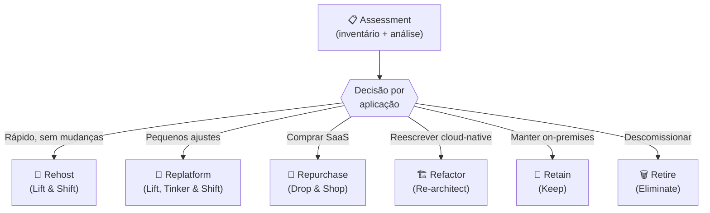
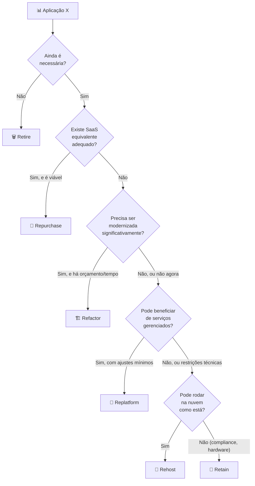
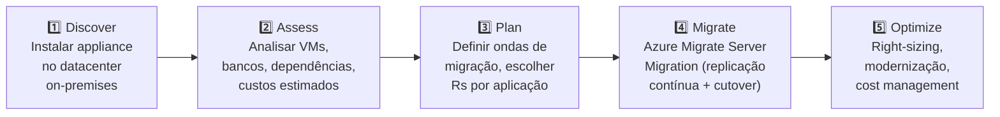
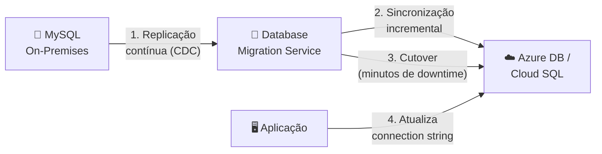

# Aula 16 — Migração para a Nuvem

> **Disciplina:** Computação em Nuvem II (ISW035)  
> **Professor:** Ronan Adriel Zenatti — FATEC Jahu / Centro Paula Souza  
> **Semestre:** 1º/2026  
> **Carga Horária:** 4h práticas

---

## 1. Visão Geral e Contextualização

Ao longo do semestre, construímos aplicações e infraestrutura diretamente na nuvem — o chamado cenário "cloud-native". Porém, a realidade da maioria das empresas é diferente: elas já possuem sistemas rodando em datacenters on-premises ou em provedores de hosting, e precisam **migrar** esses sistemas para a nuvem de forma planejada, minimizando riscos e downtime.

Esta aula aborda o framework de decisão para migração, as ferramentas de assessment disponíveis em cada plataforma e os padrões práticos para mover workloads reais — consolidando tudo que aprendemos nas aulas anteriores em um processo de migração estruturado.

### Por que Migrar?

| Motivação | Descrição | Exemplo |
|---|---|---|
| **Redução de custos** | Eliminar investimento em hardware (CAPEX → OPEX) | Empresa gasta R$ 500k/ano em datacenter próprio |
| **Escalabilidade** | Escalar recursos sob demanda, sem comprar hardware antecipadamente | Black Friday: precisa 10x de capacidade por 3 dias |
| **Agilidade** | Provisionar recursos em minutos, não semanas | Time quer testar nova feature em ambiente isolado |
| **Resiliência** | Aproveitar multi-zona e multi-região do provedor | Datacenter próprio tem apenas 1 fonte de energia |
| **Modernização** | Acessar serviços gerenciados (DBaaS, AI, Serverless) | Substituir DBA dedicado por Azure SQL / Cloud SQL |
| **Compliance** | Certificações do provedor (ISO, SOC, PCI, LGPD) | Empresa de saúde precisa de infraestrutura HIPAA-compliant |

---

## 2. Os 6 Rs da Migração

O framework dos **6 Rs** é o modelo padrão da indústria (popularizado pela AWS e adotado por Azure e GCP) para classificar como cada aplicação ou workload deve ser tratado durante uma migração.



### Tabela Detalhada dos 6 Rs

| Estratégia | O que Significa | Esforço | Custo Inicial | Benefício Cloud | Quando Usar |
|---|---|---|---|---|---|
| **Rehost** (Lift & Shift) | Mover a aplicação para a nuvem **como está**, sem alterar código ou arquitetura | Baixo | Baixo | Baixo (roda em VM/container, não usa serviços nativos) | Migração rápida, primeiro passo, aplicações legadas estáveis |
| **Replatform** (Lift, Tinker & Shift) | Mover para a nuvem com **ajustes pontuais** (ex: trocar BD local por DBaaS, usar Load Balancer nativo) | Médio-baixo | Médio | Médio (usa alguns serviços gerenciados) | Aplicações que se beneficiam de managed services sem reescrita |
| **Repurchase** (Drop & Shop) | Substituir a aplicação por um **SaaS equivalente** | Médio | Variável | Alto (zero infraestrutura para gerenciar) | CRM → Salesforce, Email → M365/Google Workspace, ERP → SAP Cloud |
| **Refactor** (Re-architect) | **Reescrever** a aplicação usando arquitetura cloud-native (microserviços, serverless, containers) | Alto | Alto | Muito alto (escala, resiliência, agilidade máximas) | Aplicações estratégicas, quando há orçamento e tempo |
| **Retain** (Keep) | **Manter** on-premises por limitações técnicas, regulatórias ou de custo | Nenhum | Nenhum | Nenhum | Sistemas legados críticos sem alternativa cloud, compliance restritiva |
| **Retire** (Eliminate) | **Descomissionar** aplicações obsoletas, redundantes ou sem uso | Baixo | Negativo (economia) | N/A | Apps sem usuários, duplicatas, sistemas abandonados |

### Fluxo de Decisão



### Exemplos Práticos dos 6 Rs

**Exemplo 1 — Rehost:** Uma aplicação Java legada rodando em VMware on-premises é movida para uma VM equivalente no Azure (Azure Migrate) ou GCP (Migrate for Compute Engine). O código não muda, o banco continua em uma VM separada. É o primeiro passo — depois pode-se replatformar o banco para DBaaS.

**Exemplo 2 — Replatform:** A mesma aplicação Java é movida, mas o banco MySQL local é substituído por Azure Database for MySQL ou Cloud SQL. A aplicação muda apenas a connection string. O servidor web é substituído por App Service ou App Engine. Esforço mínimo, benefício imediato (backups automáticos, HA, patching gerenciado).

**Exemplo 3 — Refactor:** Um sistema monolítico PHP de 15 anos é decomposto em microserviços (Node.js + Python), cada um em container, com banco NoSQL (Cosmos DB / Firestore) para dados flexíveis, fila de mensagens (Service Bus / Pub/Sub) para comunicação assíncrona, e deploy automatizado via CI/CD. Esforço de meses, mas resultado transformador.

---

## 3. Ferramentas de Assessment e Migração

### 3.1 Fase de Discovery e Assessment

Antes de migrar, é essencial inventariar **tudo**: servidores, aplicações, bancos de dados, dependências entre serviços, padrões de tráfego e custos atuais. As ferramentas de assessment fazem isso automaticamente.

| Fase | Azure | GCP |
|---|---|---|
| **Discovery (inventário)** | Azure Migrate: Discovery and Assessment | Migration Center + mcdc CLI |
| **Análise de dependências** | Azure Migrate: Dependency Analysis (agentless ou agent-based) | Migration Center: Dependency mapping |
| **Assessment de banco de dados** | Azure Database Migration Assessment | Database Migration Assessment Report |
| **Estimativa de custo** | Azure Migrate: Cost Assessment + TCO Calculator | Migration Center: Cost Assessment + Pricing Calculator |
| **Migração de VMs** | Azure Migrate: Server Migration | Migrate for Compute Engine |
| **Migração de bancos** | Azure Database Migration Service (DMS) | Database Migration Service (DMS) |
| **Migração de dados** | AzCopy, Data Box (offline, petabytes) | Storage Transfer Service, Transfer Appliance (offline) |
| **Migração de containers** | Azure Migrate for Containers | Migrate for Anthos (containers) |

### 3.2 Azure Migrate — Fluxo Completo



```bash
# Azure Migrate: Criar projeto
az migrate project create \
    --resource-group rg-migration \
    --name migrate-cnuvem2 \
    --location brazilsouth

# Após instalar o appliance no datacenter e executar discovery:
# O portal Azure mostra: servidores descobertos, dependências,
# assessment de tamanho/custo, e readiness para migração
```

### 3.3 GCP Migration Center — Fluxo Completo

```bash
# GCP: Instalar mcdc CLI para discovery
# (executa no datacenter on-premises, inventaria VMs)
./mcdc discover --output=inventory.json

# Upload do inventário para Migration Center
./mcdc upload --project=PROJECT_ID --source=inventory.json

# O Migration Center no Console GCP mostra:
# - Inventário de servidores e bancos
# - Mapa de dependências
# - Fit assessment (quais serviços GCP usar)
# - Estimativa de custo na nuvem vs on-premises
```

### 3.4 Migração de Banco de Dados — DMS

Ambas as plataformas oferecem **Database Migration Service (DMS)** que suporta migração com **downtime mínimo**: a ferramenta replica dados continuamente do banco on-premises para o banco cloud, e no momento do cutover, apenas as últimas transações precisam ser sincronizadas.



```bash
# Azure: Iniciar migração de MySQL on-prem para Azure Database for MySQL
az dms project create \
    --resource-group rg-migration \
    --service-name dms-cnuvem2 \
    --name migrate-mysql \
    --source-platform MySQL \
    --target-platform AzureDbForMySQL

# GCP: Criar perfil de conexão e job de migração
gcloud database-migration connection-profiles create mysql-onprem \
    --region=southamerica-east1 \
    --display-name="MySQL On-Premises" \
    --mysql-host=203.0.113.50 \
    --mysql-port=3306 \
    --mysql-username=replication_user \
    --mysql-password-set

gcloud database-migration migration-jobs create migrate-mysql \
    --region=southamerica-east1 \
    --source=mysql-onprem \
    --destination=cloud-sql-instance \
    --type=CONTINUOUS
```

### 3.5 Migração de Dados em Massa

| Volume | Azure | GCP |
|---|---|---|
| **< 10 TB (online)** | AzCopy, Storage Explorer | `gcloud storage cp`, Storage Transfer Service |
| **10-100 TB (online)** | AzCopy (paralelo) + Private Endpoint | Storage Transfer Service (agendado, paralelo) |
| **> 100 TB (offline)** | Azure Data Box (dispositivo físico, até 1 PB) | Transfer Appliance (dispositivo físico, até 1 PB) |
| **Migração cross-cloud** | AzCopy (GCS → Azure Blob) | Storage Transfer Service (Azure Blob → GCS) |

---

## 4. Migração na Prática — Ondas

Migrações enterprise são executadas em **ondas** — grupos de aplicações migradas juntas, ordenadas por complexidade e dependências.

| Onda | Aplicações | Estratégia | Objetivo |
|---|---|---|---|
| **Onda 0 (Piloto)** | 1-2 apps simples, sem dependências críticas | Rehost | Validar processo, aprender, ajustar |
| **Onda 1 (Quick Wins)** | 5-10 apps de baixa complexidade | Rehost + Replatform | Ganhar momentum, mostrar valor rápido |
| **Onda 2 (Core)** | Apps de negócio principais | Replatform + Refactor parcial | Migrar o core com otimizações |
| **Onda 3 (Complex)** | Apps legadas com muitas dependências | Refactor + Retain parcial | Modernizar o que for viável |
| **Onda 4 (Cleanup)** | Apps restantes, retire candidates | Retire + Retain | Simplificar portfólio, eliminar legado |

### Exemplo — Cenário Real de Migração

Uma empresa de varejo com 50 aplicações no datacenter:

- **Retire (8 apps):** 5 apps sem uso há 1 ano + 3 duplicatas → descomissionar, economia de R$ 180k/ano em licenças
- **Repurchase (4 apps):** Email → Microsoft 365, CRM interno → Salesforce, RH → Gupy, Helpdesk → Zendesk
- **Rehost (15 apps):** Apps Java/PHP estáveis → VMs no Azure/GCP, sem mudanças
- **Replatform (12 apps):** Apps rehosted + banco migrado para DBaaS + storage migrado para Blob/GCS
- **Refactor (6 apps):** E-commerce principal + App mobile + API de pagamentos → microserviços + containers + serverless
- **Retain (5 apps):** Sistema de impressão fiscal + ERP legado conectado a hardware específico → mantidos on-premises com VPN para nuvem

---

## 5. Pós-Migração — Otimização

A migração não termina quando os workloads estão na nuvem. A fase de **otimização** é contínua e garante que você está extraindo valor real.

| Atividade | Descrição | Frequência |
|---|---|---|
| **Right-sizing** | Ajustar tamanho de VMs/instâncias ao uso real | Mensal |
| **Reserved Instances** | Comprometer com 1-3 anos para desconto (até 72%) | Após estabilização (~3 meses) |
| **Spot/Preemptible** | Usar instâncias spot para workloads tolerantes a interrupção | Contínuo (batch, CI/CD, dev/test) |
| **Modernização incremental** | Mover de Rehost → Replatform → Refactor gradualmente | Trimestral |
| **Monitoramento de custos** | Azure Cost Management / Cloud Billing | Semanal |
| **Revisão de segurança** | Verificar compliance, IAM, endpoints públicos | Mensal |
| **DR testing** | Testar failover de DR | Semestral |

> **Integração futura:** Otimização de custos será aprofundada na **Aula 17**.

---

## 6. Cenários de Integração

### Cenário 1 — Migração + IaC (Aulas 07 + 16)

> Após migrar VMs via Azure Migrate / Migrate for Compute Engine, recriar a infraestrutura equivalente em Terraform. A partir desse ponto, toda mudança é feita via IaC, evitando drift e garantindo reprodutibilidade.

### Cenário 2 — Migração + CI/CD (Aulas 08 + 16)

> Após replatformar uma aplicação para Container Apps / Cloud Run, configurar pipeline CI/CD com GitHub Actions. Novas versões são deployadas automaticamente, eliminando o processo manual de deploy que existia on-premises.

### Cenário 3 — Migração + DR Multi-Cloud (Aulas 13 + 16)

> Migrar o workload principal para Azure (Replatform) e configurar réplica de DR no GCP via Storage Transfer Service + Cloud SQL read replica. Em caso de desastre no Azure, failover para GCP.

---

## 7. Resumo Comparativo Final

| Aspecto | Azure | GCP |
|---|---|---|
| **Assessment** | Azure Migrate (Discovery + Assessment) | Migration Center + mcdc CLI |
| **Migração de VMs** | Azure Migrate: Server Migration | Migrate for Compute Engine |
| **Migração de bancos** | Database Migration Service (DMS) | Database Migration Service (DMS) |
| **Migração de dados** | AzCopy + Data Box | Storage Transfer Service + Transfer Appliance |
| **Migração de containers** | Azure Migrate for Containers | Migrate for Anthos |
| **TCO Calculator** | Azure TCO Calculator | GCP Pricing Calculator + Migration Center |
| **Modernização** | Azure App Modernization | Application Modernization (Anthos) |
| **Migração cross-cloud** | AzCopy (bidirecional) | Storage Transfer Service (Azure→GCP nativo) |

---

## 8. Exercícios Propostos

1. **Exercício de Classificação (6 Rs):** Dado o cenário de uma escola com 10 sistemas (site WordPress, sistema acadêmico PHP, email local, servidor de arquivos, ERP financeiro, sistema de biblioteca, app mobile, câmeras IP, impressoras de rede, servidor DHCP/DNS), classifique cada sistema com o R mais adequado e justifique.

2. **Exercício TCO:** Use o Azure TCO Calculator ou GCP Pricing Calculator para comparar o custo anual de: 2 servidores on-premises (16 vCPUs, 64GB RAM, 1TB disco cada, incluindo energia, cooling, licenças SO, administrador 50% do tempo) vs os mesmos workloads na nuvem. Documente premissas e resultado.

3. **Exercício de Migração de Banco:** Crie um MySQL local (via Docker), insira dados de teste, e use o DMS (Azure ou GCP) para migrar para um banco gerenciado na nuvem. Documente o processo e meça o downtime real.

4. **Exercício de Plano de Migração:** Para o projeto interdisciplinar, escreva um documento de 1 página descrevendo: inventário de componentes, estratégia R para cada um, ordem das ondas de migração, e riscos identificados.

---

## 9. Referências

**Azure:**
- [Azure Migrate — Documentação](https://learn.microsoft.com/azure/migrate/)
- [Cloud Adoption Framework — Migration](https://learn.microsoft.com/azure/cloud-adoption-framework/migrate/)
- [Database Migration Service](https://learn.microsoft.com/azure/dms/)
- [Azure TCO Calculator](https://azure.microsoft.com/pricing/tco/calculator/)

**GCP:**
- [Migration Center — Documentação](https://cloud.google.com/migration-center/docs)
- [Migrate for Compute Engine](https://cloud.google.com/migrate/compute-engine/docs)
- [Database Migration Service](https://cloud.google.com/database-migration/docs)
- [Google Cloud Pricing Calculator](https://cloud.google.com/products/calculator)

**Frameworks:**
- [6 Rs of Cloud Migration — AWS](https://aws.amazon.com/blogs/enterprise-strategy/6-strategies-for-migrating-applications-to-the-cloud/)
- [Cloud Adoption Framework — Microsoft](https://learn.microsoft.com/azure/cloud-adoption-framework/)
- [Google Cloud Adoption Framework](https://cloud.google.com/adoption-framework)

---

> **Aula Anterior:** [Aula 15 — Filas de Mensagens e Event-Driven](./Aula_15-Filas_de_Mensagens_e_Event_Driven.md)  
> **Próxima Aula:** [Aula 17 — Otimização de Custos e Revisão](./Aula_17-Otimizacao_de_Custos_e_Revisao.md)
