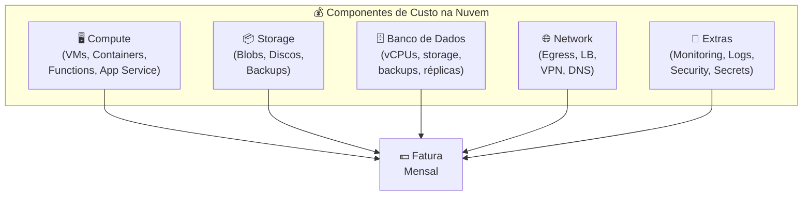
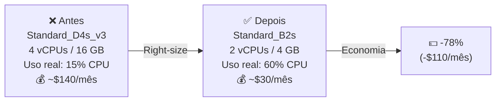
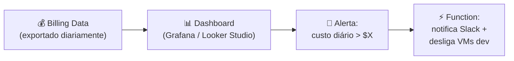

# Aula 17 — Otimização de Custos e Revisão

> **Disciplina:** Computação em Nuvem II (ISW035)  
> **Professor:** Ronan Adriel Zenatti — FATEC Jahu / Centro Paula Souza  
> **Semestre:** 1º/2026  
> **Carga Horária:** 4h práticas

---

## 1. Visão Geral e Contextualização

A nuvem promete economia, mas sem gestão ativa, os custos podem **ultrapassar** os de um datacenter próprio. Segundo dados do setor, empresas desperdiçam entre 20% e 35% dos seus gastos com nuvem em recursos ociosos, superdimensionados ou mal configurados. Nesta aula — a última de conteúdo técnico antes das avaliações finais — consolidamos as técnicas de otimização de custos e fazemos uma revisão integrativa de todo o semestre.

### O Modelo de Custos da Nuvem



> **Regra de ouro:** O custo na nuvem é **proporcional ao uso** — mas apenas se você gerenciar ativamente. Recursos provisionados e esquecidos (VMs paradas mas não desalocadas, discos órfãos, IPs públicos não utilizados) continuam sendo cobrados.

### Mapa de Equivalência — Gestão de Custos

| Conceito | Azure | GCP |
|---|---|---|
| Painel de custos | Cost Management + Billing | Cloud Billing + Cost Management |
| Alertas de orçamento | Budget Alerts | Budget Alerts |
| Recomendações de economia | Azure Advisor | Recommender |
| Relatórios de custo | Cost Analysis | Billing Reports + Looker Studio |
| Calculadora de preços | Pricing Calculator | Pricing Calculator |
| TCO (comparativo on-prem) | TCO Calculator | Migration Center Cost Assessment |
| Descontos por compromisso | Reserved Instances (1-3 anos) | Committed Use Discounts (CUDs, 1-3 anos) |
| Instâncias baratas (interruptíveis) | Spot VMs | Preemptible / Spot VMs |
| Desligamento automático | Auto-shutdown (VMs) | Instance Schedules |
| Exportação de billing | Export to Storage Account | Export to BigQuery |
| Tags para alocação de custos | Resource Tags | Labels |

---

## 2. Ferramentas de Gestão de Custos

### 2.1 Azure Cost Management

O **Azure Cost Management + Billing** é a ferramenta central para visualizar, analisar e otimizar gastos no Azure.

**Funcionalidades principais:**

| Feature | Descrição |
|---|---|
| **Cost Analysis** | Visualização detalhada de gastos por recurso, serviço, tag, região, período |
| **Budgets** | Alertas quando os gastos atingem X% do orçamento definido |
| **Azure Advisor** | Recomendações automáticas de right-sizing, resources não utilizados, reserved instances |
| **Exports** | Exportação diária/semanal de dados de custo para Storage Account (análise avançada) |
| **Anomaly Detection** | Detecção automática de picos de custo incomuns |

```bash
# Criar orçamento com alerta
az consumption budget create \
    --budget-name budget-cnuvem2 \
    --amount 100 \
    --time-grain Monthly \
    --start-date 2026-03-01 \
    --end-date 2026-12-31 \
    --resource-group rg-cnuvem2 \
    --notifications \
        '[{"contactEmails":["admin@fatecjahu.edu.br"],"threshold":50,"operator":"GreaterThan","enabled":true},
          {"contactEmails":["admin@fatecjahu.edu.br"],"threshold":80,"operator":"GreaterThan","enabled":true},
          {"contactEmails":["admin@fatecjahu.edu.br"],"threshold":100,"operator":"GreaterThan","enabled":true}]'

# Ver recomendações do Azure Advisor
az advisor recommendation list \
    --category Cost \
    --output table
```

### 2.2 GCP Cloud Billing

O **Cloud Billing** do GCP oferece funcionalidades similares, com a vantagem adicional de exportação nativa para **BigQuery** — permitindo análise SQL sobre dados de faturamento.

```bash
# Criar orçamento com alerta
gcloud billing budgets create \
    --billing-account=BILLING_ACCOUNT_ID \
    --display-name="Budget CNII" \
    --budget-amount=100USD \
    --threshold-rule=percent=0.5 \
    --threshold-rule=percent=0.8 \
    --threshold-rule=percent=1.0 \
    --all-updates-rule-monitoring-notification-channels=\
        projects/PROJECT_ID/notificationChannels/CHANNEL_ID

# Habilitar exportação de billing para BigQuery
gcloud billing export enable \
    --billing-account=BILLING_ACCOUNT_ID \
    --dataset=billing_export \
    --project=PROJECT_ID

# Consultar custos no BigQuery
# SELECT service.description, SUM(cost) as total_cost
# FROM `project.billing_export.gcp_billing_export_v1_BILLING_ID`
# WHERE invoice.month = '202603'
# GROUP BY service.description
# ORDER BY total_cost DESC

# Ver recomendações do Recommender
gcloud recommender recommendations list \
    --project=PROJECT_ID \
    --location=global \
    --recommender=google.compute.instance.MachineTypeRecommender \
    --format=table
```

---

## 3. Estratégias de Otimização de Custos

### 3.1 Right-Sizing (Dimensionamento Correto)

O right-sizing é a prática de ajustar o tamanho dos recursos (vCPUs, memória) ao uso real, eliminando superdimensionamento.



**Como identificar recursos superdimensionados:**

| Plataforma | Ferramenta | O que Analisa |
|---|---|---|
| Azure | Azure Advisor → Cost Recommendations | CPU < 5% por 14 dias, memória subutilizada |
| Azure | Azure Monitor → Metrics | Gráficos históricos de CPU/memória/disco |
| GCP | Recommender → VM Rightsizing | CPU < 15% por 14 dias, memória subutilizada |
| GCP | Cloud Monitoring → VM Metrics | Gráficos históricos de utilização |

```bash
# Azure: Listar VMs subutilizadas (via Advisor)
az advisor recommendation list --category Cost --output table

# GCP: Listar recomendações de rightsizing
gcloud recommender recommendations list \
    --project=PROJECT_ID \
    --location=southamerica-east1-a \
    --recommender=google.compute.instance.MachineTypeRecommender
```

### 3.2 Reserved Instances / Committed Use Discounts

Para workloads com uso **previsível e estável** (produção, bancos de dados, serviços always-on), comprometer-se com 1 ou 3 anos garante descontos significativos.

| Aspecto | Azure Reserved Instances | GCP Committed Use Discounts (CUDs) |
|---|---|---|
| **Desconto (1 ano)** | Até 40% | Até 37% |
| **Desconto (3 anos)** | Até 72% | Até 55% |
| **Aplica-se a** | VMs, SQL Database, Cosmos DB, App Service, Storage | VMs, Cloud SQL, GKE nodes, Cloud Run |
| **Flexibilidade** | Pode trocar VM size dentro da mesma família | Menos flexível (comprometido com tipo de máquina) |
| **Pagamento** | Upfront (total ou mensal) | Mensal |
| **Cancelamento** | Possível com penalidade | Não cancelável |
| **Recomendação** | Apenas para workloads estáveis (produção) | Apenas para workloads estáveis (produção) |

> **Nunca** compre reserved instances para ambientes de desenvolvimento ou workloads variáveis. Use pay-as-you-go ou spot instances nesses casos.

### 3.3 Spot / Preemptible Instances

Instâncias spot usam capacidade ociosa do provedor a preços drasticamente reduzidos (60-90% de desconto), mas podem ser **interrompidas a qualquer momento** (com aviso de 30 segundos a 2 minutos).

| Aspecto | Azure Spot VMs | GCP Spot VMs |
|---|---|---|
| **Desconto** | Até 90% | Até 91% |
| **Aviso antes de preempção** | 30 segundos | 30 segundos |
| **Duração máxima** | Ilimitada (até ser preemptada) | 24 horas (Preemptible) / ilimitada (Spot) |
| **Workloads adequados** | CI/CD runners, batch processing, dev/test, ML training | Mesmo |
| **Workloads inadequados** | Bancos de dados, APIs de produção, stateful services | Mesmo |

**Exemplo de economia com Spot:**

```bash
# Azure: Criar VM Spot
az vm create \
    --resource-group rg-cnuvem2 \
    --name vm-ci-runner \
    --image Ubuntu2204 \
    --size Standard_D4s_v3 \
    --priority Spot \
    --max-price 0.05 \
    --eviction-policy Deallocate

# GCP: Criar VM Spot
gcloud compute instances create vm-ci-runner \
    --zone=southamerica-east1-a \
    --machine-type=n2-standard-4 \
    --provisioning-model=SPOT \
    --instance-termination-action=STOP
```

### 3.4 Scale-to-Zero e Auto-Shutdown

| Técnica | Serviço | Economia |
|---|---|---|
| **Scale-to-zero** | Cloud Run, App Engine Standard, Azure Functions (Consumption) | 100% quando inativo |
| **Auto-shutdown de VMs** | Azure Auto-shutdown / GCP Instance Schedules | ~65% (desligar noites + fins de semana) |
| **Pause de bancos** | Azure SQL Serverless (auto-pause), Cloud SQL (stop instance) | Até 100% quando inativo |
| **Lifecycle de storage** | Azure Lifecycle Management, GCP Object Lifecycle | 60-90% movendo dados para classes frias |

```bash
# Azure: Configurar auto-shutdown de VM (22:00 BRT)
az vm auto-shutdown \
    --resource-group rg-cnuvem2 \
    --name vm-dev-01 \
    --time 0100 \
    --timezone-id "E. South America Standard Time"

# GCP: Parar instância Cloud SQL quando não em uso (dev/test)
gcloud sql instances patch pg-cnuvem2-dev --activation-policy=NEVER

# Para reativar quando precisar:
gcloud sql instances patch pg-cnuvem2-dev --activation-policy=ALWAYS
```

### 3.5 Tags / Labels para Alocação de Custos

Tags (Azure) e Labels (GCP) permitem categorizar recursos por projeto, ambiente, equipe, centro de custo — essencial para saber **quem** está gastando **quanto**.

```bash
# Azure: Aplicar tags a um resource group
az group update \
    --name rg-cnuvem2 \
    --tags environment=education project=cnuvem2 \
           owner=ronan.zenatti cost_center=fatec-jahu

# GCP: Aplicar labels a recursos
gcloud compute instances update vm-dev-01 \
    --update-labels=environment=education,project=cnuvem2,owner=ronan-zenatti

# Depois, filtrar custos por tag/label nos relatórios de billing
```

### 3.6 Eliminar Recursos Ociosos

Recursos que "ficam para trás" após testes ou deploys são os vilões silenciosos do custo cloud.

| Recurso Órfão | Como Encontrar (Azure) | Como Encontrar (GCP) |
|---|---|---|
| **Discos não anexados** | `az disk list --query "[?managedBy==null]"` | `gcloud compute disks list --filter="NOT users:*"` |
| **IPs públicos não usados** | `az network public-ip list --query "[?ipConfiguration==null]"` | `gcloud compute addresses list --filter="status=RESERVED"` |
| **Load Balancers sem backend** | Azure Advisor | Recommender |
| **Snapshots antigos** | `az snapshot list` + filtrar por data | `gcloud compute snapshots list` + filtrar |
| **VMs desligadas (cobrando disco)** | `az vm list --query "[?powerState!='running']"` | `gcloud compute instances list --filter="status=TERMINATED"` |
| **Registros antigos em ACR/Artifact Registry** | `az acr manifest list-referrers` | `gcloud artifacts docker images list` + limpar tags antigas |

```bash
# Azure: Script para listar discos órfãos (custo zero se excluir)
az disk list \
    --query "[?managedBy==null].{Name:name, Size:diskSizeGb, RG:resourceGroup}" \
    --output table

# GCP: Listar IPs reservados não utilizados
gcloud compute addresses list \
    --filter="status=RESERVED AND NOT users:*" \
    --format="table(name, address, region)"
```

---

## 4. Exemplos Práticos de Otimização

**Exemplo 1 — Ambiente de desenvolvimento otimizado:** Um time de 5 desenvolvedores usava VMs Standard_D4s_v3 (4 vCPUs, 16GB) 24/7, custando ~$700/mês cada ($3.500/mês total). Após análise: right-size para B2s (2 vCPUs, 4GB) + auto-shutdown às 22h + spot instances para CI/CD. Novo custo: ~$400/mês total. Economia: **88%** ($3.100/mês).

**Exemplo 2 — Storage com lifecycle policies:** Uma aplicação armazenava 10 TB de logs no tier Hot/Standard ($200/mês). Após configurar lifecycle: logs com mais de 30 dias → Cool/Nearline, mais de 90 dias → Cold/Coldline, mais de 365 dias → Archive, mais de 730 dias → Delete. Novo custo: ~$45/mês. Economia: **77%** ($155/mês).

**Exemplo 3 — Banco de dados com reserved instances:** Uma empresa paga $500/mês por um Azure SQL Database General Purpose (4 vCores). Após 3 meses de uso estável, compra Reserved Capacity de 3 anos: novo custo ~$145/mês. Economia: **71%** ($355/mês × 33 meses restantes = $11.715 de economia total).

---

## 5. Revisão Integrativa do Semestre

### 5.1 Mapa Completo de Serviços — Azure vs. GCP

| Aula | Tema | Azure | GCP |
|---|---|---|---|
| 02 | Object Storage | Blob Storage | Cloud Storage |
| 03 | File Storage | Azure Files | Filestore |
| 04 | Banco Relacional | Azure SQL / DB for MySQL-PG | Cloud SQL |
| 04 | Banco NoSQL | Cosmos DB | Firestore / Bigtable |
| 05 | PaaS | App Service | App Engine |
| 06 | Container Registry | ACR | Artifact Registry |
| 06 | Container Serverless | Container Apps | Cloud Run |
| 06 | Kubernetes | AKS | GKE |
| 07 | IaC | Terraform + Bicep | Terraform |
| 08 | CI/CD | Azure DevOps / GitHub Actions | Cloud Build / GitHub Actions |
| 10 | Monitoramento | Azure Monitor + App Insights | Cloud Monitoring + Logging |
| 11 | IAM | Entra ID + RBAC | Cloud IAM |
| 11 | Secrets | Key Vault | Secret Manager |
| 12 | Rede Virtual | VNet | VPC |
| 12 | Firewall | NSG | VPC Firewall Rules |
| 12 | Private Endpoint | Private Link | Private Service Connect |
| 13 | HA de Banco | Zone-redundant | Regional HA |
| 13 | DR Storage | GRS / GZRS | Dual-region / Multi-region |
| 14 | Serverless | Azure Functions | Cloud Functions |
| 15 | Mensageria | Service Bus | Pub/Sub |
| 16 | Migração | Azure Migrate | Migration Center |
| 17 | Custos | Cost Management | Cloud Billing |

### 5.2 Princípios Transversais do Semestre

| Princípio | Descrição | Aulas |
|---|---|---|
| **Conceitos são universais** | O que muda entre provedores são nomes e detalhes, não fundamentos | Todas |
| **Segurança desde o início** | Menor privilégio, sem senhas no código, private endpoints, scanning | 02, 04, 08, 11, 12 |
| **Automação sobre manual** | IaC, CI/CD, lifecycle policies, auto-scaling, alertas automáticos | 07, 08, 02, 06, 10 |
| **Custo como constraint** | Right-size, scale-to-zero, reserved/spot, lifecycle, tags | 02, 06, 14, 17 |
| **Observabilidade** | Se não pode medir, não pode gerenciar — métricas, logs, traces, alertas | 10, 13 |
| **Resiliência** | HA, DR, backups, multi-zona, multi-região, DLQ | 02, 03, 13, 15 |
| **Desacoplamento** | Filas, eventos, microserviços, API-first | 14, 15 |

### 5.3 Checklist de Preparação para a Avaliação Final (P2)

A Avaliação Prática Final (Aula 18) é a apresentação do projeto interdisciplinar. Use este checklist para verificar que seu projeto incorpora os conceitos do semestre:

| Categoria | Item | Status |
|---|---|---|
| **Infraestrutura** | Storage configurado com lifecycle | ☐ |
| **Infraestrutura** | Banco gerenciado com HA ou backup configurado | ☐ |
| **Infraestrutura** | Rede com firewall/NSG configurado | ☐ |
| **Aplicação** | Container com Dockerfile ou PaaS deploy | ☐ |
| **Aplicação** | URL pública acessível | ☐ |
| **Automação** | Pipeline CI/CD com testes e security scanning | ☐ |
| **Automação** | IaC (Terraform/Bicep) para ao menos 1 recurso | ☐ |
| **Segurança** | Managed Identity / Service Account (sem senhas no código) | ☐ |
| **Segurança** | Secrets em Key Vault / Secret Manager | ☐ |
| **Operações** | Monitoramento com alertas configurados | ☐ |
| **Operações** | Documentação (README + diagrama de arquitetura) | ☐ |
| **Custos** | Tags/Labels aplicados em todos os recursos | ☐ |
| **Custos** | Budget alert configurado | ☐ |
| **Custos** | Right-sizing verificado (não superdimensionado) | ☐ |

---

## 6. Cenários de Integração

### Cenário 1 — FinOps: Custo como Métrica de Monitoramento (Aulas 10 + 17)



### Cenário 2 — Otimização Contínua via IaC (Aulas 07 + 17)

> Definir tamanhos de VM, SKUs de banco e classes de storage no Terraform. Quando o Advisor/Recommender sugere right-sizing, atualiza-se o código Terraform, faz-se PR com code review, e aplica-se a mudança via CI/CD — economia documentada e rastreável.

---

## 7. Resumo Comparativo Final

| Aspecto | Azure | GCP |
|---|---|---|
| **Painel de custos** | Cost Management + Billing | Cloud Billing Reports |
| **Alertas de orçamento** | Budget Alerts (email, webhook) | Budget Alerts (email, Pub/Sub) |
| **Recomendações** | Azure Advisor | Recommender |
| **RI/CUDs (1 ano)** | Até 40% desconto | Até 37% desconto |
| **RI/CUDs (3 anos)** | Até 72% desconto | Até 55% desconto |
| **Spot VMs** | Até 90% desconto | Até 91% desconto |
| **Análise avançada** | Export → Power BI | Export → BigQuery + Looker Studio |
| **Tagging** | Resource Tags | Labels |
| **Auto-shutdown** | VM Auto-shutdown | Instance Schedules |
| **Scale-to-zero** | Functions (Consumption), SQL Serverless | Cloud Run, Cloud Functions, App Engine Standard |

---

## 8. Exercícios Propostos

1. **Exercício Budget Alert:** Configure um alerta de orçamento (Azure Budget ou GCP Budget) de $50/mês para o resource group / projeto da disciplina, com notificações em 50%, 80% e 100%. Capture screenshot da configuração.

2. **Exercício Right-Sizing:** Analise os recursos do seu projeto interdisciplinar e identifique ao menos 1 recurso superdimensionado. Use Azure Advisor ou GCP Recommender. Documente: recurso atual, recomendação e economia estimada.

3. **Exercício Limpeza:** Execute os comandos de detecção de recursos órfãos (discos não anexados, IPs não usados, snapshots antigos). Liste o que encontrou e calcule a economia mensal de excluir esses recursos.

4. **Exercício TCO:** Usando a calculadora de preços da sua plataforma, calcule o custo mensal atual do projeto interdisciplinar (compute + storage + banco + rede). Identifique ao menos 2 otimizações possíveis e calcule o custo otimizado.

---

## 9. Referências

**Azure:**
- [Azure Cost Management — Documentação](https://learn.microsoft.com/azure/cost-management-billing/)
- [Azure Advisor — Cost Recommendations](https://learn.microsoft.com/azure/advisor/advisor-cost-recommendations)
- [Azure Reserved Instances](https://learn.microsoft.com/azure/cost-management-billing/reservations/)
- [Azure Pricing Calculator](https://azure.microsoft.com/pricing/calculator/)

**GCP:**
- [Cloud Billing — Documentação](https://cloud.google.com/billing/docs)
- [Committed Use Discounts](https://cloud.google.com/compute/docs/instances/committed-use-discounts-overview)
- [GCP Recommender](https://cloud.google.com/recommender/docs)
- [GCP Pricing Calculator](https://cloud.google.com/products/calculator)

**FinOps:**
- [FinOps Foundation](https://www.finops.org/)
- [Cloud Cost Optimization — Well-Architected Framework](https://learn.microsoft.com/azure/well-architected/cost/)
- [GCP Cost Optimization — Architecture Framework](https://cloud.google.com/architecture/framework/cost-optimization)

---

> **Aula Anterior:** [Aula 16 — Migração para a Nuvem](./Aula_16-Migracao_para_a_Nuvem.md)  
> **Próxima Aula:** [Aula 18 — Avaliação Prática Final](./Aula_18-Avaliacao_Pratica_Final.md)
