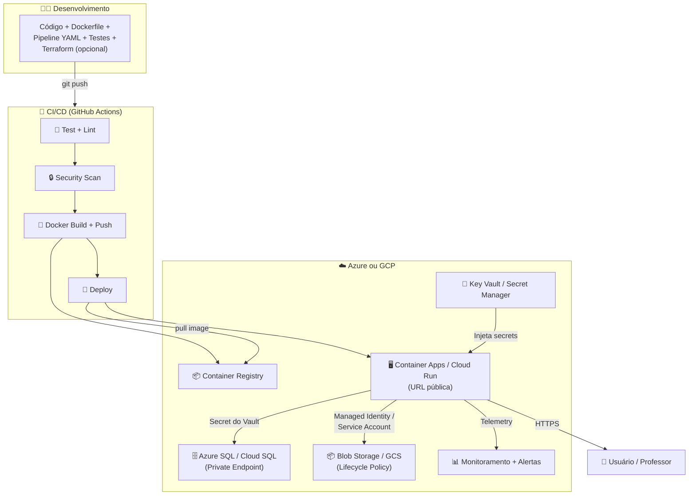

# Aula 18 — Avaliação Prática Final (P2)

> **Disciplina:** Computação em Nuvem II (ISW035)  
> **Professor:** Ronan Adriel Zenatti — FATEC Jahu / Centro Paula Souza  
> **Semestre:** 1º/2026  
> **Avaliação:** P2 — Avaliação Prática Final (3,0 pontos — Grupo)  
> **Duração:** Aula completa (4h)  
> **Formato:** Apresentação do projeto interdisciplinar (20 min + 10 min perguntas)

---

## 1. Objetivo

Apresentar e defender o **projeto interdisciplinar** desenvolvido ao longo do semestre, demonstrando domínio prático dos conceitos de computação em nuvem abordados nas Aulas 01 a 17. A avaliação contempla quatro dimensões: **repositório e documentação**, **infraestrutura em nuvem**, **demonstração funcional** e **defesa técnica** (respostas às perguntas do professor e colegas).

---

## 2. Formato da Apresentação

| Etapa | Duração | Descrição |
|---|---|---|
| **Apresentação** | 20 minutos | O grupo apresenta o projeto: arquitetura, infraestrutura, código, pipeline CI/CD, demonstração ao vivo |
| **Perguntas** | 10 minutos | O professor (e opcionalmente os colegas) fazem perguntas técnicas sobre as decisões do projeto |
| **Total** | 30 minutos | Por grupo |

### Estrutura Sugerida da Apresentação (20 min)

| Tempo | Conteúdo | Dica |
|---|---|---|
| 0-3 min | **Contexto e escopo:** O que a aplicação faz, para quem e por quê | Seja breve e direto — o professor conhece o projeto interdisciplinar |
| 3-8 min | **Arquitetura e infraestrutura:** Diagrama de arquitetura, serviços utilizados, justificativa das escolhas (por que Azure ou GCP, por que Container Apps ou Cloud Run, por que PostgreSQL ou MySQL) | Mostre o diagrama Mermaid ou imagem. Explique trade-offs, não apenas o que usou |
| 8-13 min | **Pipeline CI/CD e segurança:** Fluxo do código ao deploy, testes automatizados, scanning de segurança, estratégia de deploy, gestão de secrets | Mostre o GitHub Actions rodando. Destaque o que o scanning encontrou e como vocês resolveram |
| 13-18 min | **Demonstração ao vivo:** Abrir a URL da aplicação, executar as funcionalidades principais, mostrar integração com storage e banco, mostrar dashboards de monitoramento | Tenha um plano B: screenshots ou vídeo gravado caso a demo ao vivo falhe |
| 18-20 min | **Lições aprendidas e conclusão:** O que funcionou, o que foi difícil, o que fariam diferente, próximos passos (se continuassem o projeto) | Sejam honestos — o professor valoriza autocrítica mais do que perfeição artificial |

---

## 3. Critérios de Avaliação

### 3.1 Rubrica Detalhada (Total: 3,0 pontos)

| Critério | Pontuação | Subcritérios |
|---|---|---|
| **Repositório e Documentação** | **0,75 pt** | README completo com diagrama de arquitetura (0,20) · Instruções de execução local reproduzíveis (0,15) · `.env.example` + `sql/schema.sql` presentes (0,10) · Código organizado e comentado (0,15) · Sem credenciais no repositório (0,15) |
| **Infraestrutura** | **0,75 pt** | Storage funcional com política de ciclo de vida ou segurança configurada (0,15) · Banco de dados gerenciado com dados e conexão segura (0,15) · Container/PaaS deployado com URL pública acessível (0,15) · Pipeline CI/CD com testes e ao menos 1 tipo de security scan (0,15) · Ao menos 1 aspecto de operações: monitoramento OU alertas OU IaC OU managed identity (0,15) |
| **Demonstração** | **0,75 pt** | Aplicação acessível e funcional no momento da apresentação (0,25) · Demonstração de escrita e leitura no storage (0,10) · Demonstração de consulta ao banco de dados (0,10) · Pipeline CI/CD executado com sucesso (mostrar logs no GitHub Actions) (0,15) · Fluxo completo demonstrado (do push ao deploy) (0,15) |
| **Defesa Técnica** | **0,75 pt** | Respostas corretas e fundamentadas às perguntas do professor (0,35) · Compreensão das decisões arquiteturais (por que, não apenas o quê) (0,20) · Capacidade de explicar trade-offs (custo, complexidade, segurança) (0,20) |

### 3.2 Penalidades

| Infração | Penalidade |
|---|---|
| Credenciais (senhas, chaves, tokens) commitadas no repositório | **-0,5 pt** |
| Aplicação não acessível na URL durante a apresentação (sem plano B) | **-0,5 pt** |
| Grupo não apresenta no horário designado (sem justificativa prévia) | **Nota zero para a P2** |
| Membro do grupo claramente não participou e não sabe responder perguntas básicas | Nota individual reduzida proporcionalmente |
| Plágio (repositório copiado de outro grupo ou fonte sem atribuição) | **Nota zero para todos os envolvidos** |

### 3.3 Diferenciais (agregam à avaliação qualitativa)

Não são obrigatórios, mas demonstram maturidade técnica e podem ser decisivos em casos de notas limítrofes:

- Infraestrutura provisionada via Terraform/Bicep (IaC — Aula 07)
- Múltiplos tipos de security scanning no pipeline (SAST + SCA + Container + Secrets — Aula 08)
- Monitoramento com dashboards e alertas configurados (Aula 10)
- Managed Identity / Service Account em vez de senhas para acesso a serviços (Aula 11)
- Endpoints privados (banco sem IP público — Aula 12)
- HA configurada no banco (zone-redundant ou regional — Aula 13)
- Serverless functions integradas ao projeto (Aula 14)
- Filas de mensagens para processamento assíncrono (Aula 15)
- Otimização de custos documentada com evidências (Aula 17)
- Estratégia de deploy avançada (canary, blue/green, traffic splitting)
- Testes de integração além de unitários

---

## 4. Exemplos de Perguntas da Defesa Técnica

O professor pode perguntar sobre **qualquer conteúdo** das Aulas 01 a 17, aplicado ao contexto do projeto do grupo. Abaixo estão exemplos representativos por tema:

### Infraestrutura e Arquitetura
- "Por que vocês escolheram Azure/GCP e não o outro? Quais foram os critérios?"
- "Se quisessem trocar de provedor, o que precisaria mudar no código e na infraestrutura?"
- "Qual o SLA composto da sua arquitetura? Qual componente é o elo mais fraco?"
- "Como seria a arquitetura se vocês precisassem suportar 100x o tráfego atual?"

### Storage e Banco de Dados
- "Qual classe de armazenamento vocês escolheram e por quê? O que acontece com arquivos antigos?"
- "O que acontece se o banco de dados ficar indisponível? Há réplica ou backup?"
- "Como vocês protegem o acesso ao banco? A aplicação usa qual método de autenticação?"
- "Se um desenvolvedor acidentalmente deletar a tabela principal, como vocês recuperam?"

### Containers e Deploy
- "Expliquem o Dockerfile de vocês — por que essas escolhas de imagem base, multi-stage, usuário?"
- "O que acontece quando vocês fazem `git push` na branch main? Descreva todo o fluxo até a aplicação atualizar."
- "Como vocês fariam rollback se a nova versão tiver um bug crítico?"
- "Qual a estratégia de deploy? Rolling update, blue/green, canary? Por quê?"

### Segurança
- "Onde estão armazenadas as credenciais do banco? Como a aplicação as obtém?"
- "O pipeline de CI/CD faz scanning de segurança? O que já foi detectado e como resolveram?"
- "A aplicação roda como root dentro do container? Por que isso importa?"
- "Se uma dependência Python/Node tiver uma CVE crítica publicada amanhã, como vocês ficam sabendo?"

### Monitoramento e Custos
- "Como vocês sabem se a aplicação está saudável neste momento? Mostrem."
- "Se a latência aumentar 10x, como vocês detectam e diagnosticam?"
- "Quanto custa a infraestrutura de vocês por mês? Onde está o maior gasto?"
- "Qual otimização de custo vocês poderiam fazer e ainda não fizeram?"

### Conceituais
- "Qual a diferença entre PaaS e Container Serverless? Por que vocês escolheram um sobre o outro?"
- "Expliquem o que é IaC e por que seria útil neste projeto."
- "O que é uma Dead Letter Queue e em que cenário do projeto de vocês ela seria relevante?"
- "Se vocês tivessem que migrar esta aplicação para o outro provedor (Azure↔GCP), quais seriam os passos?"

---

## 5. Checklist de Preparação do Grupo

### Antes da Apresentação

- [ ] **Repositório GitHub** atualizado e acessível (público ou com acesso ao professor)
- [ ] **README.md** completo com: diagrama de arquitetura, serviços utilizados, URL pública, instruções de execução, explicação do pipeline
- [ ] **URL da aplicação** funcionando e acessível pela internet
- [ ] **Pipeline CI/CD** executado com sucesso no último commit (verde no GitHub Actions)
- [ ] **Nenhuma credencial** commitada no repositório (verificar com `git log --all -S "password"`)
- [ ] **Apresentação** preparada (slides opcionais — a maioria do conteúdo pode ser mostrado direto no repo/portal)
- [ ] **Plano B** para demo: screenshots e/ou vídeo gravado caso a URL caia durante a apresentação
- [ ] **Todos os membros** sabem responder perguntas sobre qualquer parte do projeto

### Durante a Apresentação

- [ ] Mostrar o **diagrama de arquitetura** e explicar cada componente
- [ ] Abrir o **portal Azure / Cloud Console** e mostrar os recursos provisionados
- [ ] Abrir o **GitHub** e mostrar a estrutura do repositório
- [ ] Abrir o **GitHub Actions** e mostrar o pipeline passando (último run verde)
- [ ] Abrir a **URL da aplicação** e demonstrar as funcionalidades
- [ ] Mostrar ao menos 1 operação de **storage** (upload ou listagem)
- [ ] Mostrar ao menos 1 operação de **banco de dados** (consulta ou inserção)
- [ ] Abrir o **monitoramento** (se configurado) e mostrar métricas/logs
- [ ] Respeitar o **tempo** (20 min de apresentação — ensaiem antes!)

### Após a Apresentação

- [ ] Responder às perguntas com honestidade — é melhor dizer "não implementamos isso" do que inventar
- [ ] Se não souber a resposta, tente raciocinar em voz alta — o professor avalia o processo de pensamento
- [ ] **Não destrua** os recursos imediatamente após a P2 — o professor pode querer verificar depois

---

## 6. Diagrama de Arquitetura — Exemplo de Referência

O diagrama abaixo ilustra uma arquitetura completa que atende todos os critérios. Seu projeto não precisa ter todos os componentes, mas deve cobrir os obrigatórios (storage, banco, container/PaaS, CI/CD).

---

## 7. Logística da Avaliação

| Item | Detalhes |
|---|---|
| **Data** | Conforme calendário institucional (Aula 18) |
| **Formato** | Presencial, em sala de aula |
| **Duração por grupo** | 30 minutos (20 apresentação + 10 perguntas) |
| **Ordem** | Definida por sorteio no início da aula |
| **Equipamento** | Usar o projetor da sala. Tragam notebook com acesso à internet |
| **Entrega do repositório** | Link enviado via plataforma institucional **antes** do início da aula |
| **Nota** | Individual dentro do grupo (pode variar se participação for desigual) |

### Cronograma Estimado (para turma de ~8 grupos)

| Horário | Atividade |
|---|---|
| 0:00-0:10 | Instruções + Sorteio da ordem |
| 0:10-0:40 | Grupo 1 |
| 0:40-1:10 | Grupo 2 |
| 1:10-1:40 | Grupo 3 |
| 1:40-2:10 | Grupo 4 |
| 2:10-2:20 | Intervalo |
| 2:20-2:50 | Grupo 5 |
| 2:50-3:20 | Grupo 6 |
| 3:20-3:50 | Grupo 7 |
| 3:50-4:00 | Grupo 8 (se necessário) + Encerramento |

---

## 8. Mapa de Referência — De que Aula Vem Cada Componente Avaliado

| Componente | Aula de Referência | Material de Estudo |
|---|---|---|
| Storage (Blob/GCS) | Aulas 02-03 | `Aula_02-Armazenamento_de_Dados_Objetos.md` |
| Banco de Dados | Aula 04 | `Aula_04-Bancos_de_Dados_Gerenciados.md` |
| PaaS | Aula 05 | `Aula_05-Plataformas_de_Aplicacao_PaaS.md` |
| Containers | Aula 06 | `Aula_06-Containerizacao_e_Orquestracao_na_Nuvem.md` |
| IaC | Aula 07 | `Aula_07-Infraestrutura_como_Codigo_IaC.md` |
| CI/CD + Security | Aula 08 | `Aula_08-CICD_na_Nuvem.md` |
| Monitoramento | Aula 10 | `Aula_10-Monitoramento_Nativo_vs_Open_Source.md` |
| IAM + Secrets | Aula 11 | `Aula_11-Seguranca_Identidade_e_DevSecOps.md` |
| Redes | Aula 12 | `Aula_12-Redes_Virtuais_e_Conectividade.md` |
| HA + DR | Aula 13 | `Aula_13-Alta_Disponibilidade_e_DR.md` |
| Serverless | Aula 14 | `Aula_14-Computacao_Serverless.md` |
| Mensageria | Aula 15 | `Aula_15-Filas_de_Mensagens_e_Event_Driven.md` |
| Migração | Aula 16 | `Aula_16-Migracao_para_a_Nuvem.md` |
| Custos | Aula 17 | `Aula_17-Otimizacao_de_Custos_e_Revisao.md` |

---

> **Aula Anterior:** [Aula 17 — Otimização de Custos e Revisão](./Aula_17-Otimizacao_de_Custos_e_Revisao.md)  
> **Próxima Aula:** [Aula 19 — Recuperação](./Aula_19-Recuperacao.md)
