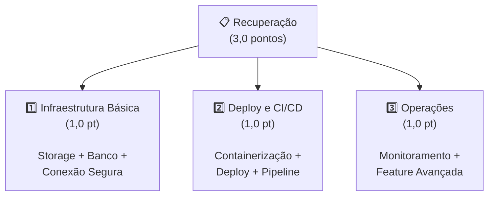

# Aula 19 — Recuperação

> **Disciplina:** Computação em Nuvem II (ISW035)  
> **Professor:** Ronan Adriel Zenatti — FATEC Jahu / Centro Paula Souza  
> **Semestre:** 1º/2026  
> **Avaliação:** R — Recuperação (3,0 pontos — Individual)  
> **Duração:** Aula completa (4h)

---

## 1. Objetivo

Oferecer uma oportunidade para alunos que **não atingiram a média mínima** ou que **desejam melhorar sua nota** ao longo do semestre. A avaliação de recuperação é **individual**, abrange os principais tópicos práticos do semestre e exige implementação funcional com entrega via repositório GitHub.

---

## 2. Quem Pode Fazer

| Situação | Pode fazer a recuperação? |
|---|---|
| Não atingiu média mínima | ✅ Sim (obrigatório para aprovação) |
| Atingiu média mas deseja melhorar nota | ✅ Sim (a nota da recuperação **substitui** a menor nota entre T1, P1, T2 e P2, se for maior) |
| Já atingiu nota máxima | ❌ Não é necessário |

> **Regra de substituição:** A nota da recuperação substitui a **menor** das notas anteriores (T1, P1, T2 ou P2), **somente se** for superior à nota substituída. A recuperação nunca reduz a nota final.

---

## 3. Estrutura da Avaliação

A recuperação é uma avaliação prática **individual** que cobre três eixos fundamentais do semestre, valendo **3,0 pontos** no total.

### 3.1 Visão Geral dos Critérios



### 3.2 Eixo 1 — Infraestrutura Básica (1,0 ponto)

Provisionar e integrar os serviços fundamentais de armazenamento em nuvem.

| Componente | Requisito | Pontuação |
|---|---|---|
| **Object Storage** | Container (Azure Blob) ou Bucket (GCS) criado e funcional, com ao menos 1 operação via código (upload, download ou listagem) | 0,30 pt |
| **Banco de Dados** | Instância MySQL ou PostgreSQL gerenciada, com tabela criada e dados inseridos (mínimo 5 registros), consultável via código | 0,30 pt |
| **Conexão Segura** | Credenciais em variáveis de ambiente (não hardcoded); firewall configurado (não 0.0.0.0/0); TLS habilitado; `.env.example` fornecido | 0,25 pt |
| **Script SQL** | `sql/schema.sql` com DDL + INSERT dos dados iniciais | 0,15 pt |

**O que entregar:**
- Storage funcional com operação demonstrada (screenshot ou log)
- Banco com dados acessíveis via código
- Nenhuma credencial no repositório

**Aulas de referência:** [02](./Aula_02-Armazenamento_de_Dados_Objetos.md), [03](./Aula_03-Armazenamento_de_Dados_Avancado.md), [04](./Aula_04-Bancos_de_Dados_Gerenciados.md)

---

### 3.3 Eixo 2 — Deploy e CI/CD (1,0 ponto)

Containerizar a aplicação, publicar em registro e automatizar o processo via pipeline.

| Componente | Requisito | Pontuação |
|---|---|---|
| **Containerização** | Dockerfile funcional que builda sem erros; imagem publicada em registry (ACR, Artifact Registry ou GHCR) | 0,30 pt |
| **Deploy** | Aplicação acessível via URL pública (Container Apps, Cloud Run, App Service ou App Engine); endpoint `/health` retornando HTTP 200 | 0,35 pt |
| **Pipeline CI/CD** | GitHub Actions (ou equivalente) que execute: instalação de dependências + ao menos 1 teste automatizado + build da imagem Docker | 0,35 pt |

**O que entregar:**
- Dockerfile no repositório
- URL pública da aplicação funcionando
- Pipeline verde no GitHub Actions (último commit em main)

**Aulas de referência:** [05](./Aula_05-Plataformas_de_Aplicacao_PaaS.md), [06](./Aula_06-Containerizacao_e_Orquestracao_na_Nuvem.md), [08](./Aula_08-CICD_na_Nuvem.md)

---

### 3.4 Eixo 3 — Operações (1,0 ponto)

Demonstrar capacidade operacional com monitoramento e ao menos uma feature avançada.

| Componente | Requisito | Pontuação |
|---|---|---|
| **Monitoramento** | Ao menos 1 métrica ou dashboard configurado (métricas de request, latência, erros, CPU ou similar) OU ao menos 1 alerta configurado (email quando erro ou latência alta) | 0,40 pt |
| **Feature Avançada** | Implementar **uma** das seguintes opções (à escolha do aluno): | 0,60 pt |

**Opções para a Feature Avançada (escolher 1):**

| Opção | Descrição | Aula Ref. |
|---|---|---|
| **A) Serverless Function** | Uma Azure Function ou Cloud Function integrada ao projeto (HTTP trigger, Storage trigger ou Timer trigger) | [14](./Aula_14-Computacao_Serverless.md) |
| **B) Fila de Mensagens** | Service Bus Queue/Topic ou Pub/Sub Topic/Subscription com produtor e consumidor funcionais | [15](./Aula_15-Filas_de_Mensagens_e_Event_Driven.md) |
| **C) IaC (Terraform/Bicep)** | Ao menos 2 recursos provisionados via IaC (storage + banco, ou storage + container app, etc.) com código versionado | [07](./Aula_07-Infraestrutura_como_Codigo_IaC.md) |
| **D) Segurança Avançada** | Managed Identity ou Service Account configurada para a aplicação (sem senhas) + secrets em Key Vault / Secret Manager | [11](./Aula_11-Seguranca_Identidade_e_DevSecOps.md) |
| **E) HA / DR** | Banco com HA habilitada (zone-redundant ou regional) + documentação de plano de DR simplificado (RTO/RPO definidos + procedimento de failover) | [13](./Aula_13-Alta_Disponibilidade_e_DR.md) |
| **F) Rede Segura** | VNet/VPC configurada com subnets + NSG/Firewall rules + Private Endpoint para banco ou storage (sem IP público) | [12](./Aula_12-Redes_Virtuais_e_Conectividade.md) |

**O que entregar:**
- Evidência de monitoramento (screenshot de dashboard ou configuração de alerta)
- Feature avançada implementada e documentada no README
- Evidências de funcionamento (screenshots, logs ou demonstração no código)

---

## 4. Requisitos Gerais

### 4.1 Plataforma e Linguagem

| Item | Detalhes |
|---|---|
| **Nuvem** | Azure **ou** Google Cloud (apenas uma) |
| **Linguagem** | Livre (recomendada a do projeto interdisciplinar, mas não obrigatória) |
| **Repositório** | GitHub (individual — **não** o repositório do grupo da P2) |
| **Aplicação** | Mínimo 3 rotas/endpoints: `/` (home), `/health` (health check), e ao menos 1 que interaja com storage ou banco |

### 4.2 Estrutura Esperada do Repositório

```
cnuvem2-recuperacao-seunome/
├── .github/
│   └── workflows/
│       └── ci.yml                  ← Pipeline CI/CD
├── src/                            ← Código-fonte
│   └── (seus arquivos)
├── tests/                          ← Ao menos 1 teste automatizado
│   └── test_app.py
├── infra/                          ← (Se escolheu IaC como feature avançada)
│   └── main.tf
├── sql/
│   └── schema.sql                  ← DDL + INSERT dos dados
├── Dockerfile                      ← Container da aplicação
├── .dockerignore
├── .gitignore                      ← .env, __pycache__, .tfstate, etc.
├── .env.example                    ← Modelo de variáveis (sem valores reais)
├── README.md                       ← Documentação completa
└── evidencias/                     ← Screenshots / logs
    ├── storage-operacao.png
    ├── banco-consulta.png
    ├── pipeline-verde.png
    ├── app-health.png
    ├── monitoramento.png
    └── feature-avancada.png
```

### 4.3 O que o README.md Deve Conter

1. **Identificação:** Nome do aluno, RA, disciplina, semestre
2. **Descrição:** O que a aplicação faz
3. **Plataforma:** Azure ou GCP + justificativa breve
4. **Serviços utilizados:** Lista com nomes, tiers e configurações
5. **Diagrama de arquitetura:** Mermaid ou imagem
6. **Pré-requisitos:** Linguagem, SDKs, ferramentas
7. **Como executar localmente:** Passo a passo completo
8. **URL pública:** da aplicação em funcionamento
9. **Pipeline CI/CD:** Explicação do que cada step/job faz
10. **Feature avançada:** Qual opção escolheu (A-F), como implementou, evidências
11. **Evidências:** Referência às screenshots na pasta `evidencias/`

---

## 5. Penalidades

| Infração | Penalidade |
|---|---|
| Credenciais commitadas no repositório | **-0,5 pt** |
| Aplicação inacessível na URL no momento da avaliação (sem evidências alternativas) | **-0,5 pt** |
| Repositório compartilhado com outro aluno ou copiado | **Nota zero** |
| Pipeline CI/CD inexistente ou nunca executado | Perda do Eixo 2 correspondente |
| README incompleto (faltando mais de 3 itens da seção 4.3) | **-0,25 pt** |

---

## 6. Cronograma da Aula de Recuperação

| Período | Atividade |
|---|---|
| **Antes da aula** | Repositório GitHub pronto e link enviado via plataforma institucional |
| **0:00-0:15** | Instruções e esclarecimento de dúvidas |
| **0:15-3:30** | Alunos trabalham na finalização e ajustes (recursos já devem estar provisionados; a aula é para refinamento, não para começar do zero) |
| **3:30-4:00** | Professor verifica URLs, repositórios e pode fazer perguntas individuais |

> **Atenção:** A recuperação pressupõe que você já tenha os recursos provisionados (storage, banco, container deployado) **antes** da aula. A aula em si é para ajustes finais, documentação e evidências — não para começar a criação dos recursos do zero.

---

## 7. Dicas de Preparação

### Comece pelos Pontos Mais Fáceis

Se o tempo for limitado, priorize nesta ordem:

1. **Banco de dados com dados** (Eixo 1) — provisione, crie tabela, insira dados (30 min)
2. **Storage com operação** (Eixo 1) — crie bucket/container, faça upload via CLI (15 min)
3. **Dockerfile funcional** (Eixo 2) — copie o padrão da Aula 06 e adapte (20 min)
4. **Deploy na nuvem** (Eixo 2) — `gcloud run deploy` ou `az containerapp create` (15 min)
5. **Pipeline CI mínimo** (Eixo 2) — workflow com `pip install` + `pytest` + `docker build` (30 min)
6. **README com diagrama** (transversal) — use Mermaid, documente tudo (30 min)
7. **Monitoramento** (Eixo 3) — acesse o painel de métricas do serviço, capture screenshot (15 min)
8. **Feature avançada** (Eixo 3) — escolha a que for mais familiar ou rápida de implementar (1-2h)

### Estimativa de Tempo Total

| Eixo | Tempo Estimado (se já tem familiaridade) |
|---|---|
| Eixo 1 — Infraestrutura | 1-2 horas |
| Eixo 2 — Deploy + CI/CD | 1-2 horas |
| Eixo 3 — Operações + Feature | 1-2 horas |
| README + Evidências | 30-60 minutos |
| **Total** | **4-7 horas** (faça antes da aula!) |

### Reutilize o que Já Existe

- Se você fez a P1, já tem storage + banco + container — reutilize e melhore
- Se você participou da P2 (grupo), pode reutilizar conceitos e padrões, mas o **código e a infraestrutura devem ser seus** (repositório individual, recursos em seu nome)
- Os exemplos de código das aulas (SDK Python, Dockerfile, GitHub Actions YAML) são base excelente para adaptar

---

## 8. Tabela-Resumo dos Critérios

| Eixo | Componente | Pontos | Aulas Ref. |
|---|---|---|---|
| **1. Infraestrutura** | Storage funcional | 0,30 | 02, 03 |
| | Banco de dados com dados | 0,30 | 04 |
| | Conexão segura (sem credenciais expostas) | 0,25 | 04, 11 |
| | Script SQL (schema.sql) | 0,15 | 04 |
| **2. Deploy + CI/CD** | Dockerfile + imagem no registry | 0,30 | 06 |
| | App acessível via URL + /health | 0,35 | 05, 06 |
| | Pipeline CI/CD funcional | 0,35 | 08 |
| **3. Operações** | Monitoramento (dashboard ou alerta) | 0,40 | 10 |
| | Feature avançada (1 opção de A-F) | 0,60 | 07/11/12/13/14/15 |
| **Total** | | **3,0** | |

---

## 9. Entrega

| Item | Detalhes |
|---|---|
| **Formato** | Link do repositório GitHub (individual) |
| **Prazo** | Até o início da aula de recuperação (Aula 19) |
| **Individual** | Cada aluno deve ter repositório e infraestrutura próprios |
| **Presencial** | A aula é presencial — esteja preparado para demonstrar e responder perguntas |
| **Após a entrega** | Não modifique o repositório após o prazo; o professor verificará o histórico de commits |

---

> **Aula Anterior:** [Aula 18 — Avaliação Prática Final](./Aula_18-Avaliacao_Pratica_Final.md)  
> **Próxima Aula:** [Aula 20 — Estudos Futuros e Aprofundamento](./Aula_20-Estudos_Futuros_e_Aprofundamento.md)
