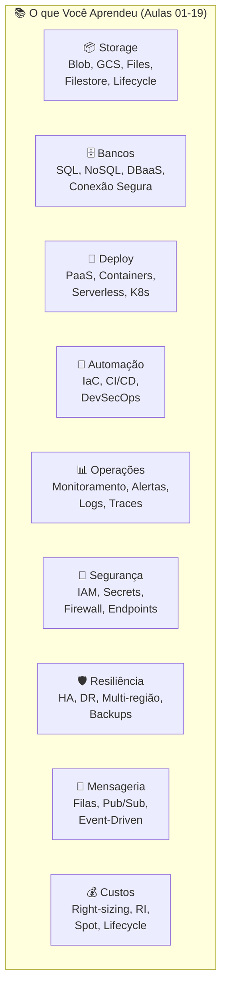
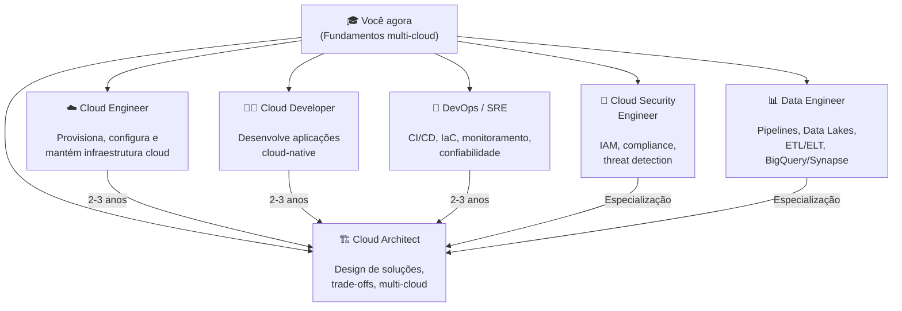
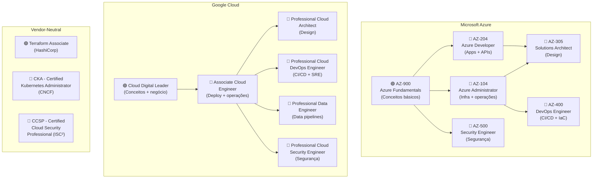

# Aula 20 — Estudos Futuros e Aprofundamento

> **Disciplina:** Computação em Nuvem II (ISW035)  
> **Professor:** Ronan Adriel Zenatti — FATEC Jahu / Centro Paula Souza  
> **Semestre:** 1º/2026  
> **Carga Horária:** 4h (última aula do semestre)

---

## 1. Visão Geral

Esta é a última aula do semestre. Com 19 aulas de conteúdo técnico, você agora possui um fundamento sólido em computação em nuvem multi-cloud. O objetivo desta aula é olhar para **frente**: quais caminhos de carreira estão disponíveis, quais certificações validam seu conhecimento, quais tendências tecnológicas vão dominar os próximos anos e como construir um plano de aprendizado contínuo que mantenha suas habilidades relevantes no mercado.

### O que Você Já Sabe

Ao final deste semestre, você trabalhou com **22+ serviços cloud** em duas plataformas, cobrindo todo o ciclo de vida de uma aplicação cloud-native:



Isso não é pouco. Muitos profissionais em posições júnior e pleno no mercado não dominam todos esses tópicos simultaneamente. Seu diferencial agora é saber como esses conceitos se **conectam** — e que eles se aplicam independente do provedor.

---

## 2. Caminhos de Carreira em Cloud

O mercado de computação em nuvem oferece múltiplas trilhas de carreira, cada uma com foco e progressão distintos. A base que você construiu neste semestre serve como ponto de partida para qualquer uma delas.

### 2.1 Mapa de Carreiras



### 2.2 Descrição de Cada Trilha

| Trilha | O que Faz | Skills Chave (além desta disciplina) | Faixa Salarial BR (2026, CLT) |
|---|---|---|---|
| **Cloud Engineer** | Provisiona e opera infraestrutura cloud (VMs, redes, storage, bancos) | Linux, networking avançado, scripting (Bash/Python), Terraform | R$ 6.000 — R$ 15.000 |
| **Cloud Developer** | Desenvolve aplicações otimizadas para cloud (containers, serverless, microserviços) | Linguagem de programação forte, APIs REST, Docker, arquitetura de software | R$ 7.000 — R$ 18.000 |
| **DevOps / SRE** | Automatiza pipelines, garante confiabilidade (CI/CD, IaC, monitoring, incident response) | Git avançado, CI/CD, Kubernetes, Prometheus/Grafana, SLIs/SLOs | R$ 8.000 — R$ 20.000 |
| **Cloud Security Engineer** | Protege infraestrutura e aplicações cloud (IAM, compliance, threat detection, SIEM) | OWASP, frameworks de compliance (ISO 27001, LGPD), pentest, SIEM | R$ 8.000 — R$ 22.000 |
| **Data Engineer** | Constrói pipelines de dados, Data Lakes, ETL/ELT em escala cloud | SQL avançado, Python/Spark, BigQuery/Synapse, Airflow, dbt | R$ 8.000 — R$ 20.000 |
| **Cloud Architect** | Desenha soluções end-to-end, define padrões, lidera decisões técnicas | Tudo acima + visão de negócio, cost modeling, comunicação técnica | R$ 15.000 — R$ 35.000 |

> **Nota:** Faixas salariais são estimativas para o mercado brasileiro (CLT), variam significativamente por região, empresa e senioridade. Posições remotas para empresas internacionais podem pagar 2-5x mais.

---

## 3. Certificações Profissionais

Certificações não substituem experiência prática, mas são um excelente complemento: validam conhecimento de forma padronizada, ajudam no processo seletivo e fornecem um roteiro estruturado de estudo.

### 3.1 Roadmap de Certificações por Provedor



### 3.2 Recomendação de Sequência

| Momento | Certificação Recomendada | Por quê |
|---|---|---|
| **Agora (saindo da FATEC)** | AZ-900 ou Cloud Digital Leader | Valida fundamentos, gratuita (vouchers de estudante disponíveis), fortalece currículo |
| **6 meses de experiência** | AZ-104 ou Associate Cloud Engineer | Valida habilidades práticas de administração, mais pedida em vagas Jr/Pleno |
| **1 ano + IaC na rotina** | Terraform Associate | Valida IaC multi-cloud, diferencial forte em vagas DevOps |
| **1-2 anos de experiência** | AZ-305 ou Professional Cloud Architect | Posições de arquitetura, salários mais altos, visão end-to-end |
| **2+ anos + foco DevOps** | AZ-400 ou Professional Cloud DevOps Engineer + CKA | Combina CI/CD + Kubernetes, padrão ouro para SRE/DevOps sênior |

### 3.3 Recursos Gratuitos de Estudo

| Recurso | URL | O que Oferece |
|---|---|---|
| Microsoft Learn | [learn.microsoft.com](https://learn.microsoft.com) | Módulos interativos gratuitos para todas as certificações Azure, com sandboxes |
| Google Cloud Skills Boost | [cloudskillsboost.google](https://cloudskillsboost.google) | Labs práticos e learning paths para certificações GCP |
| KodeKloud | [kodekloud.com](https://kodekloud.com) | Labs hands-on para Kubernetes, Terraform, Docker, CI/CD |
| A Cloud Guru / Pluralsight | [pluralsight.com](https://pluralsight.com) | Cursos em vídeo + labs (plano gratuito limitado) |
| HashiCorp Learn | [developer.hashicorp.com/terraform/tutorials](https://developer.hashicorp.com/terraform/tutorials) | Tutoriais oficiais de Terraform |
| Kubernetes Docs | [kubernetes.io/docs](https://kubernetes.io/docs) | Documentação oficial + tutoriais interativos |
| GitHub Learning Lab | [skills.github.com](https://skills.github.com) | Tutoriais de GitHub Actions, Git, CI/CD |

### 3.4 Vouchers e Programas Gratuitos para Estudantes

| Programa | Benefício | Como Acessar |
|---|---|---|
| **Microsoft Imagine Academy / ESI** | Vouchers gratuitos para AZ-900, AI-900, DP-900, SC-900 | Via parceria institucional (FATEC/CPS) |
| **GitHub Student Developer Pack** | GitHub Pro grátis, domínio .me, créditos cloud, ferramentas | [education.github.com/pack](https://education.github.com/pack) |
| **Azure for Students** | $100 em créditos Azure (sem cartão de crédito) | [azure.microsoft.com/free/students](https://azure.microsoft.com/free/students) |
| **Google Cloud for Education** | Créditos via programa institucional | Via professor ou Google Cloud partner |
| **Cisco Networking Academy** | Cursos de networking, cybersecurity e IoT gratuitos | [netacad.com](https://www.netacad.com) |

---

## 4. Tendências de Mercado (2026-2028)

### 4.1 Tendências Tecnológicas

| Tendência | O que É | Impacto na Carreira Cloud |
|---|---|---|
| **IA Generativa + Cloud** | LLMs (GPT, Gemini, Claude) integrados a serviços cloud (Azure AI, Vertex AI) | Novos serviços para provisionar, otimizar e monitorar — demanda por "AI Infrastructure Engineers" |
| **Platform Engineering** | Times internos constroem plataformas self-service para desenvolvedores (Internal Developer Platforms) | Evolução natural de DevOps; usa Kubernetes, Backstage, Crossplane, GitOps |
| **FinOps como disciplina** | Gestão financeira de cloud como prática formal com métricas, processos e roles dedicados | Profissionais de cloud precisam entender custo tão bem quanto entende arquitetura |
| **Multi-Cloud e Portabilidade** | Empresas adotam 2+ provedores por estratégia, compliance ou DR | Ferramentas multi-cloud (Terraform, Kubernetes, OpenTelemetry) valem mais que expertise de 1 provedor |
| **Edge Computing** | Processamento próximo ao usuário/dispositivo (IoT, 5G, latência ultra-baixa) | Azure IoT Edge, Google Distributed Cloud, CDN com compute |
| **Serverless-First** | Serverless como padrão para novos workloads (containers serverless, bancos serverless, analytics serverless) | Menos infraestrutura para gerenciar, mais foco em arquitetura e código |
| **GitOps** | Git como única fonte de verdade para infraestrutura e aplicações (ArgoCD, Flux) | Extensão natural de IaC + CI/CD; popular em ambientes Kubernetes |
| **Zero Trust Security** | Nunca confiar, sempre verificar — autenticação e autorização em cada chamada, não apenas no perímetro | IAM avançado, service mesh, mutual TLS, micro-segmentação |
| **Sustentabilidade (Green Cloud)** | Escolha de regiões, instâncias e arquiteturas com menor pegada de carbono | Azure Carbon Optimization, GCP Carbon Footprint Dashboard |

### 4.2 Serviços que Não Abordamos (Próximos Estudos)

| Serviço/Conceito | Azure | GCP | Por que Estudar |
|---|---|---|---|
| **Data Lake / Data Warehouse** | Azure Synapse Analytics | BigQuery | Analytics em escala, BI, ML |
| **Machine Learning / AI** | Azure AI Services, Azure ML | Vertex AI, Gemini API | IA generativa, ML pipelines |
| **Service Mesh** | Open Service Mesh, Istio on AKS | Anthos Service Mesh, Istio on GKE | Comunicação segura entre microserviços |
| **API Management** | Azure API Management | Apigee | Gateway para APIs internas e externas |
| **CDN** | Azure CDN / Front Door | Cloud CDN | Performance global para conteúdo estático |
| **IoT** | Azure IoT Hub | Cloud IoT Core | Dispositivos conectados em escala |
| **Blockchain / Web3** | Azure Confidential Ledger | N/A | Contratos inteligentes, ledger imutável |
| **Quantum Computing** | Azure Quantum | Cirq (open source) | Computação quântica na nuvem (experimental) |

---

## 5. Construindo seu Portfólio

### 5.1 O que Recrutadores Procuram

| Artefato | O que Demonstra | Dica |
|---|---|---|
| **GitHub com projetos reais** | Que você sabe construir, não apenas estudar | O projeto interdisciplinar deste semestre já é um ótimo começo |
| **README.md bem escrito** | Comunicação técnica, organização | Trate o README como a "landing page" do projeto |
| **Diagramas de arquitetura** | Pensamento sistêmico, visão holística | Use Mermaid, draw.io ou Excalidraw |
| **Pipeline CI/CD funcionando** | Automação, boas práticas DevOps | Green badge no GitHub Actions vale mais que descrições no currículo |
| **Blog técnico / artigos** | Capacidade de ensinar e comunicar | Dev.to, Medium, LinkedIn — escreva sobre o que aprendeu |
| **Certificações** | Validação padronizada de conhecimento | Comece pela AZ-900 ou Cloud Digital Leader |
| **Contribuições open source** | Colaboração, qualidade de código | Comece com documentação, tradução ou bugs simples |

### 5.2 Projeto Portfólio Sugerido

Se quiser ir além do projeto interdisciplinar, considere construir um projeto pessoal que demonstre amplitude:

```
📁 meu-projeto-cloud/
├── app/                    ← Aplicação (Python/Node/etc.)
├── infra/                  ← Terraform (multi-cloud: Azure + GCP)
├── .github/workflows/      ← CI/CD com testes + scanning + deploy
├── monitoring/             ← Dashboards Grafana (JSON exportado)
├── docs/
│   ├── architecture.md     ← Diagrama + justificativas
│   ├── runbook.md          ← Procedimentos operacionais
│   ├── dr-plan.md          ← Plano de DR
│   └── cost-analysis.md    ← Análise de custos com otimizações
└── README.md               ← Visão geral com screenshots
```

> Um repositório assim, público no GitHub, vale mais do que qualquer descrição genérica no currículo. Recrutadores técnicos **abrem o GitHub** antes de ligar para a entrevista.

---

## 6. Plano de Aprendizado Contínuo

### 6.1 Roadmap Pós-FATEC (12 meses)

| Mês | Foco | Ação Concreta |
|---|---|---|
| **1-2** | Consolidar fundamentos | Revisar materiais das aulas, refatorar projeto interdisciplinar, obter AZ-900 ou Cloud Digital Leader |
| **3-4** | Aprofundar IaC + CI/CD | Estudar Terraform Associate, configurar projetos pessoais com IaC completo |
| **5-6** | Kubernetes | Estudar para CKA, deploy de aplicação multi-serviço em AKS ou GKE |
| **7-8** | Certificação intermediária | AZ-104 (Azure Admin) ou Associate Cloud Engineer (GCP) |
| **9-10** | Especialização (escolher 1) | DevOps (AZ-400), Segurança (AZ-500), Data (DP-203) ou Arquitetura (AZ-305) |
| **11-12** | Portfólio + contribuição open source | Publicar projeto completo no GitHub, escrever 2-3 artigos técnicos, contribuir para 1 projeto open source |

### 6.2 Hábitos de Aprendizado Contínuo

| Hábito | Frequência | Recurso |
|---|---|---|
| Ler release notes dos provedores | Semanal | Azure Updates, GCP Release Notes |
| Fazer labs práticos | 2-3x por semana | Microsoft Learn, Cloud Skills Boost |
| Acompanhar comunidade | Diário | Reddit r/azure, r/googlecloud, Dev.to, Twitter/X #CloudComputing |
| Participar de eventos | Mensal | Meetups locais, Microsoft Build, Google Cloud Next, KubeCon (online gratuito) |
| Praticar para certificação | Quando for hora | Whizlabs, Tutorials Dojo, MeasureUp (practice exams) |

---

## 7. Mensagem Final

Neste semestre, você não apenas aprendeu a usar Azure e GCP — você aprendeu a **pensar em nuvem**. Os conceitos de storage, bancos gerenciados, containers, IaC, CI/CD, monitoramento, segurança, HA/DR, serverless, mensageria, migração e custos são universais. Eles se aplicam a Azure, GCP, AWS, Oracle Cloud ou qualquer provedor que surgir amanhã. Provedores mudam nomes de serviços a cada trimestre; os fundamentos permanecem por décadas.

O mercado de cloud computing cresce mais rápido do que a formação de profissionais qualificados. Isso significa oportunidade real para quem começa agora com fundamentos sólidos. A distância entre onde você está e onde quer chegar é medida em **projetos construídos, problemas resolvidos e conhecimento compartilhado** — não em diplomas ou certificações isoladas.

Construa. Quebre. Conserte. Documente. Compartilhe. Repita.

---

## 8. Referências e Recursos para Continuar

### Documentação Oficial
| Recurso | URL |
|---|---|
| Azure Documentation | [docs.microsoft.com/azure](https://docs.microsoft.com/azure) |
| GCP Documentation | [cloud.google.com/docs](https://cloud.google.com/docs) |
| Kubernetes Documentation | [kubernetes.io/docs](https://kubernetes.io/docs) |
| Terraform Documentation | [developer.hashicorp.com/terraform](https://developer.hashicorp.com/terraform) |

### Livros Recomendados
| Livro | Autor | Foco |
|---|---|---|
| Cloud Native Patterns | Cornelia Davis | Padrões de design cloud-native |
| Designing Data-Intensive Applications | Martin Kleppmann | Sistemas distribuídos e dados em escala |
| The Phoenix Project | Gene Kim et al. | DevOps como narrativa (romance técnico) |
| Site Reliability Engineering | Google SRE Team | Operações em escala (gratuito online) |
| Kubernetes Up & Running | Brendan Burns et al. | Kubernetes prático |
| Terraform: Up & Running | Yevgeniy Brikman | IaC com Terraform (atualizado regularmente) |
| DevOps Nativo de Nuvem com Kubernetes | Arundel & Domingus | DevOps + K8s (bibliografia do curso) |
| Computação em Nuvem (2ª ed.) | Erl & Monroy | Referência teórica abrangente (bibliografia do curso) |

### Comunidades
| Comunidade | Plataforma |
|---|---|
| Azure Brasil | Telegram, Discord, LinkedIn |
| Google Cloud Brasil | Telegram, Meetups |
| Kubernetes Brasil | Telegram |
| DevOps Brasil | LinkedIn, Telegram |
| CNCF (Cloud Native Computing Foundation) | [cncf.io](https://www.cncf.io) |
| FinOps Foundation | [finops.org](https://www.finops.org) |

### Eventos
| Evento | Quando | Formato |
|---|---|---|
| Microsoft Build | Maio/Junho | Online gratuito + presencial |
| Google Cloud Next | Abril | Online gratuito + presencial |
| KubeCon + CloudNativeCon | Março e Outubro | Online gratuito (talks gravadas) |
| HashiConf | Outubro | Online + presencial |
| AWS re:Invent | Novembro/Dezembro | Online (talks gravadas) |

---

## 9. Agradecimentos e Encerramento

Obrigado por cada aula, cada exercício, cada deploy quebrado que virou aprendizado. Computação em nuvem é um campo que recompensa curiosidade, persistência e disposição para construir coisas reais. Vocês têm todas essas qualidades.

O semestre acaba aqui. A jornada na nuvem está apenas começando.

Bons deploys. ☁️🚀

---

**Professor Ronan Adriel Zenatti**  
FATEC Jahu — Centro Paula Souza  
Computação em Nuvem II — ISW035 — 1º/2026

---

> **Aula Anterior:** [Aula 19 — Recuperação](./Aula_19-Recuperacao.md)  
> **Voltar ao início:** [README.md — Página Principal do Curso](../README.md)
